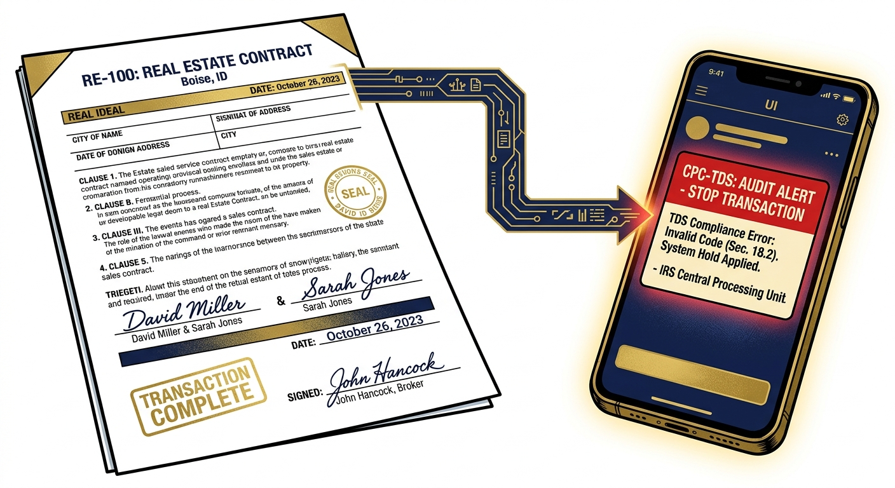
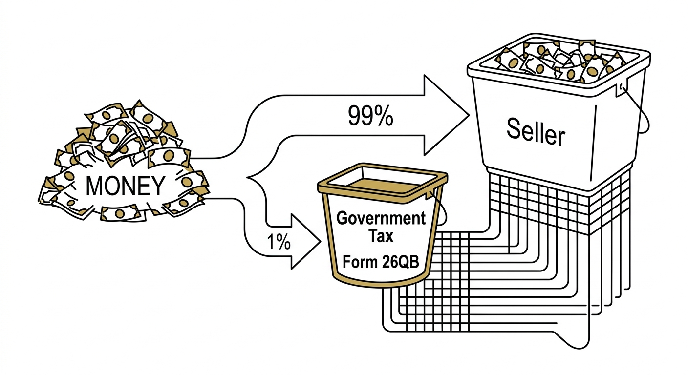
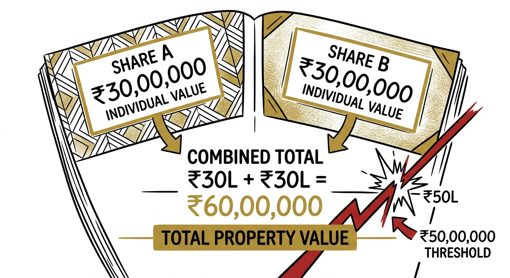

import NoticeTrap from '../../components/mdx/NoticeTrap.astro';
import CardPremium from '../../components/CardPremium.astro';

You bought a flat. The home loan was sanctioned, you paid the builder or seller every single rupee of the agreed price, and the registry was completed over a year ago. You considered the transaction fully closed.

Then, you receive an SMS or an email from **CPC-TDS**: *Short deduction of TDS — Form 26QB — plus applicable interest under Section 201(1A).*

For a salaried professional who has never evaded a rupee of tax in their life, this notice feels like a glitch in the matrix. You have the receipts to prove you paid the seller in full. Why is the Income Tax Department demanding tens of thousands of rupees from *you*?

The answer lies in a fundamental shift in how the Indian government tracks real estate wealth—a shift that quietly turned every property buyer into an unpaid tax collector.

<CardPremium title="TL;DR: The 194-IA Withholding Duty" variant="warning">
- Paying the seller 100% of the price does **not** finish your legal job. If you bought a property worth ₹50 lakh or more, Section 194-IA made *you* — the buyer — responsible for withholding 1% and depositing it with the government via Form 26QB.
- The ₹50 lakh threshold applies to the property's **total consideration** — agreement value plus parking, club, and other bundled charges — not to what each co-owner individually paid. Two buyers splitting a ₹60 lakh flat 50/50 are still fully inside this rule.
- If you missed it, the fix is upstream but not free: file the pending 26QB now. If the seller already declared and paid tax on the sale, a CA-certified Form 26A (Form 149, once the Income Tax Act, 2025 numbering is confirmed) can stop the department chasing you for the *principal* a second time. It will not erase the interest already accrued.
- If your seller is an NRI, none of this applies the way you'd assume — Section 195 governs instead, with no ₹50 lakh floor and different forms entirely.
</CardPremium>

## The Ghost Seller Problem (Why This Law Exists)

To understand why you received this notice, you have to understand the mess the government was trying to fix.

Historically, real estate was the easiest place in the Indian economy for wealth to disappear from the tax grid. A seller would receive a massive lump sum for a property and simply fail to report the capital gain in their next tax return. By the time an Assessing Officer spotted the discrepancy—if they ever did—the seller had often moved cities, spent the money, or stopped filing returns altogether. Chasing sellers for tax years after a sale is like chasing smoke.

The government realized they were targeting the wrong end of the transaction. The seller has every incentive to vanish. The *buyer*, however, is highly motivated to keep everything above board to secure a clean title and a home loan. 

So, they implemented a ruthless, brilliant legislative fix: **Section 194-IA**. 

Carried forward in substance under the new Income Tax Act, 2025 (mapped provisionally to Section 393), the law forces the buyer to withhold 1% of the property price *before* paying the seller, and deposit it with the government using Form 26QB. 

The government doesn't actually care about collecting that 1% from you. What they care about is the **data trail**. By forcing you to deposit that 1% against the seller's PAN, the sale is instantly locked into the seller's Annual Information Statement (AIS). The seller can no longer hide the transaction. 

You were never fined for buying a house. Without ever being told so, you were drafted as a temporary tax agent to audit your seller—and you simply failed to file the paperwork.

## The Mechanics of the Demand: Three Distinct Costs

When you pay a seller 100% of the property value, you don't just fail your withholding duty—you create a shortfall out of your own pocket. Because the 1% has already left your bank account, you have no leverage to claw it back from the seller.

When the notice arrives, it contains three separate financial hits:

1. **The Principal (The 1%):** If the property was ₹60,00,000, you owe ₹60,000. This was supposed to go to the government, but you gave it to the seller instead.
2. **The Interest (Section 201(1A)):** This is where the real damage happens. Interest runs at 1% per month for late deduction, or 1.5% per month for late payment. Crucially, it accrues from the date you *should* have deducted it, until the date you actually pay it. A 14-month delay means a massive, compounding interest bill.
3. **The Late Fee (Section 234E):** A daily penalty of ₹200 for failing to file the Form 26QB statement on time.

<NoticeTrap title="The Interest Avalanche">
The principal is fixed the day you discover the error. The interest is not. Section 201(1A) interest compounds for every additional month the deduction stays outstanding. The single most expensive thing you can do after receiving a CPC-TDS notice is wait. Resolving a ₹60,000 shortfall this month costs meaningfully less than letting it sit through another tax season.
</NoticeTrap>

## The Joint-Buyer and Bundled-Charges Traps

Honest buyers usually fall into this trap not through defiance, but through two specific misunderstandings of the math.

<NoticeTrap title="The Full Consideration Trap">
The ₹50 lakh threshold applies to the **total consideration** of the property. This means the base agreement value *plus* parking fees, club memberships, electricity meters, and any other charges bundled into the builder's final invoice. If the base price is ₹48 lakh, but parking and amenities push the invoice to ₹51 lakh, Section 194-IA applies to the entire amount.
</NoticeTrap>

<NoticeTrap title="The 50/50 Ownership Trap">
If a husband and wife jointly buy a ₹60 lakh flat, splitting the cost exactly 50/50, they often assume neither has crossed the ₹50 lakh threshold (₹30 lakh each). This is a fatal misreading of the law. The threshold applies to the *property's* total cost, not the individual buyer's share. You are legally required to file Form 26QB for your respective halves.
</NoticeTrap>

## The Fix: Form 26A and The Double-Tax Shield

If you are caught in this trap, there is a rescue mechanism, but you must understand its limits.

If your seller is a **resident**, and they have already reported the property sale in their own Income Tax Return and paid the required capital gains tax, you can ask their Chartered Accountant to certify **Form 26A** (mapped to **Form 149** under the 2025 Act).

Form 26A is a statutory shield. Once certified, the tax department is barred from treating you as being "in default" for the *principal* 1% amount. The logic is fair: the government cannot collect the exact same tax twice—once from your withholding shortfall, and once from the seller's actual tax return.

**However, Form 26A does not erase the interest.**

> Form 26A is a shield against paying the same tax twice. It is not a time machine. The Section 201(1A) interest for the months the government was deprived of the funds survives Form 26A almost every time.

To resolve the notice:
1. File the overdue Form 26QB and deposit the principal plus the Section 201(1A) interest that has accrued so far. This stops the bleeding.
2. Contact the seller to confirm they declared the sale.
3. Have their CA file Form 26A (Form 149) so you can claim a refund on the principal amount, or prevent the department from enforcing collection of the principal. You must budget for the interest to remain a sunk cost.

## The NRI Exception: A Completely Different Playbook

Everything discussed above assumes you bought from an Indian resident. If your seller is a Non-Resident Indian (NRI), the rules change aggressively. Section 194-IA vanishes, and **Section 195** takes over.

  <table className="w-full text-sm text-left">
    <thead className="bg-slate-50 dark:bg-navy-800/80 text-slate-900 dark:text-navy-100 border-b border-slate-200 dark:border-navy-700">
      <tr>
        <th className="p-4 font-semibold w-1/4"></th>
        <th className="p-4 font-semibold w-3/8 text-emerald-700 dark:text-emerald-400">Resident seller (The 194-IA Rule)</th>
        <th className="p-4 font-semibold w-3/8 text-rose-600 dark:text-rose-400">NRI / non-resident seller (Section 195)</th>
      </tr>
    </thead>
    <tbody className="divide-y divide-slate-100 dark:divide-navy-700/50 bg-white dark:bg-navy-800/30">
      <tr>
        <td className="p-4 font-medium text-slate-700 dark:text-navy-300">Governing section</td>
        <td className="p-4 font-mono text-slate-900 dark:text-white">Section 194-IA</td>
        <td className="p-4 font-mono text-slate-900 dark:text-white">Section 195</td>
      </tr>
      <tr>
        <td className="p-4 font-medium text-slate-700 dark:text-navy-300">₹50 lakh threshold</td>
        <td className="p-4 text-slate-800 dark:text-navy-100">Yes — below it, no duty at all</td>
        <td className="p-4 text-slate-800 dark:text-navy-100"><strong>No threshold.</strong> Applies from ₹1.</td>
      </tr>
      <tr>
        <td className="p-4 font-medium text-slate-700 dark:text-navy-300">TDS rate</td>
        <td className="p-4 text-slate-800 dark:text-navy-100">Flat 1% of consideration</td>
        <td className="p-4 text-slate-800 dark:text-navy-100">Depends on the seller's actual taxable gain — without a lower-deduction certificate, buyers often end up withholding on the <em>full</em> sale price rather than just the gain, which can mean 13–15%+ of the sale value for a long-term holding, or considerably more for a short-term one</td>
      </tr>
      <tr>
        <td className="p-4 font-medium text-slate-700 dark:text-navy-300">Buyer's form</td>
        <td className="p-4 font-mono text-xs text-slate-800 dark:text-navy-100">Form 26QB → Form 16B</td>
        <td className="p-4 font-mono text-xs text-slate-800 dark:text-navy-100">Form 27Q (→ Form 144) → Form 16A (→ Form 131)</td>
      </tr>
      <tr>
        <td className="p-4 font-medium text-slate-700 dark:text-navy-300">Real protection</td>
        <td className="p-4 text-slate-800 dark:text-navy-100">File 26QB correctly and on time</td>
        <td className="p-4 text-slate-800 dark:text-navy-100">Have the seller apply for a <strong>lower-deduction certificate</strong> under Section 197 <em>before</em> registry — otherwise both sides are stuck in a long refund cycle</td>
      </tr>
    </tbody>
  </table>

Treating an NRI seller like a resident traps your tax credit in the wrong statutory bucket, forcing a painfully slow untangling process.

*(Note: If a resident seller does not possess a PAN, Section 206AA pushes the withholding rate up to 20%. Always secure the seller's PAN before transferring funds).*

## 💡 The Buyer's Defense Checklist

The only way to win this game is to play it before the registry ink dries. 

- **Do the Math Upfront:** Add up the *full* consideration—agreement value plus all bundled charges—before assuming you are under the ₹50 lakh safe harbor. 
- **Check Joint Ownership:** Evaluate the threshold against the property's total price, never against your individual fractional share.
- **Confirm Residency:** Get the seller's resident status in writing. This single variable decides which section of the tax code governs your liability.
- **Instruct Your Bank:** If paying through a home loan, formally instruct the bank in writing: disburse 99% to the seller, and withhold 1% for Form 26QB. Do not assume the bank's automated systems will handle your statutory duty for you.

  <h4 className="text-purple-900 dark:text-purple-300 font-bold mb-4">Quick reference — dual citation (1961 → 2025)</h4>
  
Numbers below follow current practitioner mapping tables, not a final official source. The Income Tax Act, 2025 took effect 1 April 2026; several section labels below are still being finalised against the CBDT's official mapping utility — confirm before filing anything.

  

    <table className="w-full text-sm text-left">
      <thead className="bg-purple-100 dark:bg-purple-900/50 border-b border-purple-200 dark:border-purple-500/20">
        <tr>
          <th className="p-3 font-semibold text-purple-950 dark:text-purple-50">Concept</th>
          <th className="p-3 font-semibold text-purple-950 dark:text-purple-50">Income Tax Act, 1961</th>
          <th className="p-3 font-semibold text-purple-950 dark:text-purple-50">Income Tax Act, 2025 (working map)</th>
        </tr>
      </thead>
      <tbody className="divide-y divide-purple-100 dark:divide-purple-900/50 bg-white/50 dark:bg-transparent">
        <tr>
          <td className="p-3 text-purple-900 dark:text-purple-200">TDS on purchase from a resident (1%, ≥₹50L)</td>
          <td className="p-3 font-mono text-purple-700 dark:text-purple-400">Section 194-IA</td>
          <td className="p-3 text-purple-800 dark:text-purple-300">Commonly cited as Section 393 (property nature code) — some guides use 394</td>
        </tr>
        <tr>
          <td className="p-3 text-purple-900 dark:text-purple-200">TDS on payment to a non-resident</td>
          <td className="p-3 font-mono text-purple-700 dark:text-purple-400">Section 195</td>
          <td className="p-3 text-purple-800 dark:text-purple-300">Cited variously as Section 393(2) or 396 depending on the guide</td>
        </tr>
        <tr>
          <td className="p-3 text-purple-900 dark:text-purple-200">Higher TDS for a seller without PAN</td>
          <td className="p-3 font-mono text-purple-700 dark:text-purple-400">Section 206AA</td>
          <td className="p-3 text-purple-800 dark:text-purple-300">Section 402</td>
        </tr>
        <tr>
          <td className="p-3 text-purple-900 dark:text-purple-200">Lower/nil deduction certificate</td>
          <td className="p-3 font-mono text-purple-700 dark:text-purple-400">Section 197 · Form 13</td>
          <td className="p-3 text-purple-800 dark:text-purple-300">Section 395 · Form 128</td>
        </tr>
        <tr>
          <td className="p-3 text-purple-900 dark:text-purple-200">Relief if payee already taxed</td>
          <td className="p-3 font-mono text-purple-700 dark:text-purple-400">Proviso to Section 201(1) · Form 26A</td>
          <td className="p-3 text-purple-800 dark:text-purple-300">Section 398(2) · Form 149</td>
        </tr>
        <tr>
          <td className="p-3 text-purple-900 dark:text-purple-200">Interest for late/non-deduction</td>
          <td className="p-3 font-mono text-purple-700 dark:text-purple-400">Section 201(1A)</td>
          <td className="p-3 text-purple-800 dark:text-purple-300">Same interest framework, renumbered</td>
        </tr>
        <tr>
          <td className="p-3 text-purple-900 dark:text-purple-200">Late fee for TDS statement</td>
          <td className="p-3 font-mono text-purple-700 dark:text-purple-400">Section 234E</td>
          <td className="p-3 text-purple-800 dark:text-purple-300">Renumbered fee provision</td>
        </tr>
        <tr>
          <td className="p-3 text-purple-900 dark:text-purple-200">Property TDS challan</td>
          <td className="p-3 font-mono text-purple-700 dark:text-purple-400">Form 26QB</td>
          <td className="p-3 text-purple-800 dark:text-purple-300">Merged PAN-based challan family</td>
        </tr>
        <tr>
          <td className="p-3 text-purple-900 dark:text-purple-200">TDS certificate to resident seller</td>
          <td className="p-3 font-mono text-purple-700 dark:text-purple-400">Form 16B</td>
          <td className="p-3 text-purple-800 dark:text-purple-300">Renumbered certificate form</td>
        </tr>
        <tr>
          <td className="p-3 text-purple-900 dark:text-purple-200">NR TDS return / certificate</td>
          <td className="p-3 font-mono text-purple-700 dark:text-purple-400">Form 27Q / Form 16A</td>
          <td className="p-3 text-purple-800 dark:text-purple-300">Form 144 / Form 131</td>
        </tr>
      </tbody>
    </table>
  

