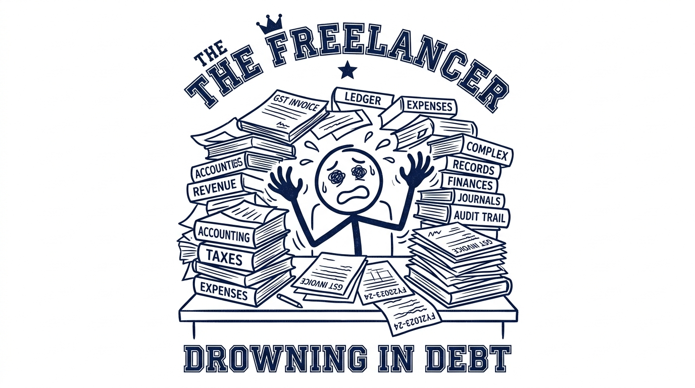
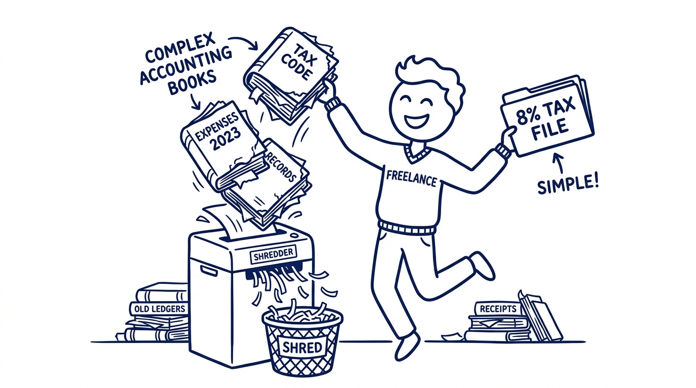

import NoticeTrap from '../../components/mdx/NoticeTrap.astro';
import CardPremium from '../../components/CardPremium.astro';

There is a dangerous myth floating around freelance circles, fueled by overconfident Reddit threads, late-night WhatsApp groups, and self-proclaimed tax gurus on Twitter. It is a myth born of greed, and it sounds almost too good to be true. 

The myth goes like this: *"Bro, just file your taxes under Section 44AD. You don't have to maintain any accounting books, you don't need to show any expense receipts, and you only have to declare 8% of your revenue as profit. The rest is completely tax-free!"*

<CardPremium title="TL;DR: The Presumptive Trap" variant="warning">
- **The Core Issue:** Freelancers wrongly use Section 44AD to declare an 8% profit margin and pay near-zero tax.
- **The Mechanics:** If your client deducted TDS under Section 194J (Profession), you cannot file under Section 44AD (Business). The algorithm catches this instantly.
- **The Defense:** Freelancers must use Section 44ADA (declaring a 50% profit minimum). To legally use 44AD's 8% margin, you must restructure into a B2B Digital Agency.
</CardPremium>

### Prologue: The Death of the Inspector Raj

To understand why the 8% loophole is a trap, you cannot just read the bare text of the Income Tax Act today. You have to ask a deeper question: *Why does Section 44AD even exist? What was the world like before it?*

Before the era of Presumptive Taxation, every single business in India—from the massive Tata Steel plant to the tiny Kirana store on your street corner—was governed by the dreaded **Section 44AA**. 

Section 44AA demanded that you maintain meticulous books of accounts. Every invoice, every cash receipt, every electricity bill had to be logged, bound, and presented to a Chartered Accountant. For a small shopkeeper earning ₹10 Lakhs a year, paying a CA ₹30,000 to maintain ledgers was financial suicide. 

Worse, it birthed the "Inspector Raj." Tax officers would show up at small businesses, demand to see the ledgers, find a missing ₹500 receipt, and extort bribes to prevent a scrutiny notice. Because of this terror, millions of small businesses simply operated in cash and never filed taxes at all. The government was bleeding revenue.

They had to make a deal. 

The government said to the small businessmen: *"We know you operate on razor-thin margins. We know you hate accountants. Let’s strike a bargain. If your turnover is less than ₹2 Crores, you don't have to maintain a single ledger. We will 'presume' your profit is exactly 8%. Just pay tax on that 8%, and our inspectors will never knock on your door again."*

Thus, **Section 44AD** was born. It was an amnesty scheme to bring the unorganized cash economy into the formal tax net. 

But then, a completely different breed of worker emerged: The Knowledge Worker. 

Doctors, lawyers, software developers, and consultants. They didn't have factories. They didn't have inventory. They had laptops and brains. 

The government looked at a Kirana store and said, *"Yes, if you sell ₹10 Lakhs of rice, your profit is probably only ₹80,000 (8%) because you had to buy the rice first."*

But they looked at a Software Developer and said, *"Wait. If you sell ₹10 Lakhs of code, you didn't have to 'buy' the code first. Your margin isn't 8%. Your margin is massive. We cannot give you the 44AD deal."*

So, the government created a separate, parallel universe just for knowledge workers: **Section 44ADA**. The bargain was similar (no books, no CAs, no Inspector Raj), but the cost was different. For professionals, the government presumed a minimum profit of **50%**.

### Act I: The Allure of the Loophole

Fast forward to today. Imagine you are a 26-year-old freelance UI/UX designer. You had a phenomenal year. You billed your international and domestic clients a total of ₹40 Lakhs. You work from your bedroom. Your actual profit margin is probably 90%.

Then, late one night, you stumble across a forum post detailing the "8% Loophole."

The poster, likely an anonymous voice on Reddit or a misinformed influencer, explains the math of Section 44AD. They tell you that you can use the Kirana store's tax code for your freelance income. 

You sit at your desk and do the math for your ₹40 Lakhs revenue:

| Metric | The 44AD Loophole Math |
| :--- | :--- |
| **Gross Freelance Revenue** | ₹40,00,000 |
| **Declared Profit (8% Presumptive)** | ₹3,20,000 |
| **Tax Slab** | Under ₹3 Lakhs (Nil), ₹3L-₹7L (5%) |
| **Rebate under 87A** | Tax is wiped out because income is below ₹7L |
| **Total Tax Payable** | **₹0** |

You stare at the screen. You just legally wiped out your entire tax liability on ₹40 Lakhs of income. You don't have to fake any rent receipts. You don't have to buy bogus insurance policies. You just punch in the 44AD code on the Income Tax portal, declare an 8% margin, and you beat the system.

It feels like you've discovered a secret cheat code to the Indian economy.

### Act II: The Algorithmic Trap

You file your ITR-4 using the Section 44AD business code. You hit submit, feeling like a genius. 

Months pass. Then, one Tuesday morning, you receive an email from the Central Processing Centre (CPC). Subject: *Notice under Section 139(9) for Defective Return*. 

You open it, your heart pounding. The tax department has rejected your 8% profit claim. They are demanding you revise your return, and they are threatening to hit you with a massive penalty for misreporting income under Section 270A (which can be up to 200% of the tax evaded).

What went wrong? You didn't do anything illegal, right? You just used a section of the Income Tax Act!

This is where you must make a crucial discovery. Log into your Income Tax portal right now. Go to the **e-File** menu and download your **Form 26AS** (your annual tax credit statement). 

Look at the entries where your domestic clients paid you. Look at the specific column titled *Section under which TDS is deducted*. 

What does it say? 

It doesn't say 194C (Contracts). It doesn't say 194Q (Purchase of Goods). 
It says **194J**.

#### The Puzzle Pieces That Don't Fit

What is Section 194J? It is the TDS code for **Fees for Professional or Technical Services**. 

When your client hired you to write code, design a logo, or provide digital marketing consultation, their accountant correctly identified you as a professional. They deducted 10% TDS under 194J and deposited it with the government against your PAN card.

And this is where the trap snaps shut.

Remember the history? The Indian tax code draws a massive, impenetrable wall between a **Business (44AD)** and a **Profession (44ADA)**. 

You cannot hold a puzzle piece that says "194J (Profession)" and try to jam it into a slot that says "44AD (Business)." 

<NoticeTrap title="The Silent Cross-Verification">
The Income Tax portal is not operated by a human reading your file; it is a sophisticated algorithm. When you file ITR-4 and claim 44AD (Business) to get the 8% margin, the algorithm instantly cross-references your PAN against your Form 26AS. It sees that 100% of your revenue came via 194J (Professional Services). The system immediately flags the mismatch. You cannot be a professional in the eyes of your client, but a hardware trader in the eyes of your ITR.
</NoticeTrap>

### Act III: The Pivot (Discovering the 44ADA Shield)

Once you realize the 8% loophole is a mirage that leads to a penalty, you are forced to look at the correct section for knowledge workers: **Section 44ADA**.

Under Section 44ADA, the government allows professionals to use presumptive taxation (up to ₹75 Lakhs in revenue), but they demand that you declare a minimum of **50% of your gross receipts as profit**.

At first glance, this feels like a punishment. Going from an 8% dream to a 50% reality hurts. Let's look at the math for our ₹40 Lakhs freelancer under the correct code:

| Metric | The 44ADA Reality |
| :--- | :--- |
| **Gross Freelance Revenue** | ₹40,00,000 |
| **Declared Profit (50% Minimum)** | ₹20,00,000 |
| **Standard Deduction (New Regime)** | -₹75,000 |
| **Taxable Income** | ₹19,25,000 |
| **Total Tax Payable (Approx)** | **₹2.9 Lakhs** |

You went from paying zero tax in your fantasy to paying almost ₹3 Lakhs in reality. 

But look closer. Don't look at the 50% you are paying tax on. Look at the 50% you are *not* paying tax on.

You made ₹40 Lakhs from your bedroom. The government is legally allowing you to tell them that you spent **₹20 Lakhs** on business expenses, *and they are not asking for a single receipt to prove it.* 

You don't need to hoard restaurant bills. You don't need to fake internet invoices. You don't need to argue with a tax officer about whether your Netflix subscription is a "business research expense." The government hands you a ₹20 Lakh blindfold, no questions asked. 

Section 44ADA is not a punishment. It is one of the most generous tax shields on the planet for high-margin knowledge workers. It buys you absolute peace of mind and permanently immunizes you from the Inspector Raj.

### The Ultimate Discovery: The Agency Arbitrage

But what if you aren't satisfied? What if you look at that 50% margin and think, *"I actually do have massive expenses! I hire sub-contractors, I pay for expensive SaaS tools, I run Facebook ads for clients. My actual profit margin is closer to 15%!"*

If you are a solo consultant using 44ADA, the government doesn't care if your actual expenses are higher than 50%. You are bound by the professional code. 

But there is a legal way to cross the bridge into the promised land of Section 44AD (and lower margins). You have to stop being a professional, and you have to start being a business. 

Welcome to **The Agency Arbitrage**.

The tax department categorizes you based on the *nature of your work*. If a client hires *you* for your specific brain (e.g., "I need Gaurang to design this app"), you are a professional (194J). 

But if you structure yourself as a **Digital Agency** or an **IT Services Firm**, the dynamic changes. 
An agency is an entity that relies on capital, infrastructure, and a team of employees to deliver a service. If a client hires your agency to deliver a turnkey software product, they are not hiring *you*; they are paying a business for a contract. 

When you make this pivot:
1. You invoice clients as an IT Services Agency (e.g., "Nova Digital Solutions").
2. Your clients deduct TDS under **Section 194C (Payments to Contractors)**, which is typically 1% or 2%, instead of the 10% under 194J. 
3. Because your revenue is now tracked under 194C (Contractor/Business), the algorithm recognizes you as a commercial enterprise.
4. You can now legally file your ITR under **Section 44AD**, declaring a profit margin closer to your actual reality (even if it's 8% or 10%), provided you can substantiate that you are operating as an agency with sub-contractors, payroll, and heavy operational costs if ever scrutinized.

<NoticeTrap title="The GST Registration Snare">
If you attempt the Agency Arbitrage, your GST registration must match. When you register for GST, you select a Service Accounting Code (SAC). If your SAC says "Individual Legal Services" but you file ITR under 44AD (Business), the cross-verification will flag you. Your GST SAC must reflect a B2B commercial service or IT contracting nature to survive an audit.
</NoticeTrap>

### The Final Verdict

Taxation is not about what you think is fair; it is about history, intent, and how algorithms classify your data today.

If you are a solo freelancer, designer, or coder, do not try to outsmart the system by claiming the 8% loophole. The 194J mismatch will catch you, and the penalty will wipe out years of savings. Embrace the 50% legal shield of Section 44ADA. It is a gift of simplicity born from the death of the Inspector Raj.

But if your ambition outgrows your solo operation, and you begin hiring teams and incurring real costs, don't let 44ADA suffocate your cash flow. Evolve. Re-structure into an agency, change your invoicing, shift your clients to 194C, and legally step into the commercial reality of Section 44AD.

The choice is yours, but now, you actually know the rules of the game.
