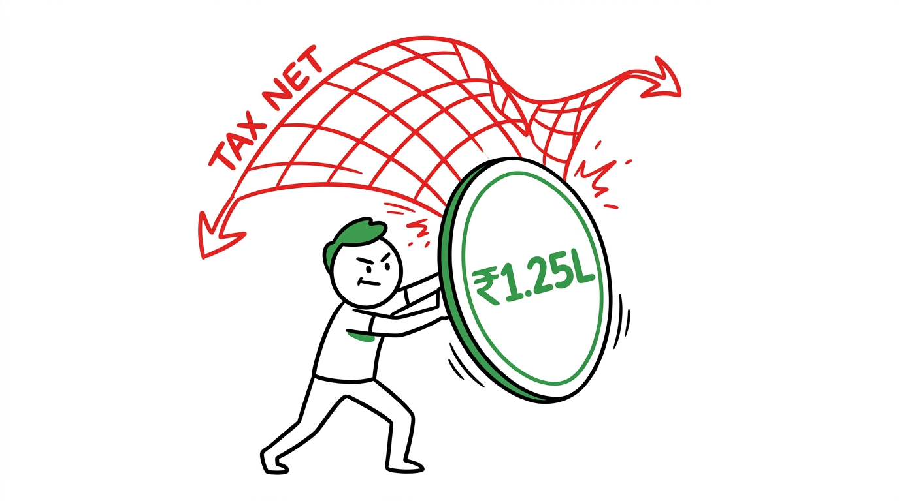

import NoticeTrap from '../../components/mdx/NoticeTrap.astro';

## 1. Executive Summary & The Core Problem

The Finance Act of 2024 ripped the band-aid off. 
If you invest in stocks or equity mutual funds, the math has changed permanently. The government increased the Long-Term Capital Gains (LTCG) tax from 10% to 12.5%. They increased the Short-Term Capital Gains (STCG) tax from 15% to 20%.

**The TL;DR Final Answer:** You are paying more tax on your profits. That is an unavoidable mathematical reality. But the government also increased the annual tax-free LTCG limit from ₹1 Lakh to **₹1.25 Lakhs**. If you are not actively "harvesting" this ₹1.25 Lakh limit every single year, you are voluntarily surrendering your wealth to the system.

## 2. What is the exact regulation? (The Brutal Math)

Let's strip away the noise. The Income Tax Department only cares about two things when you sell an equity asset: How long did you hold it, and what is your profit?

### The 12-Month Line
- **Sold before 12 months:** It is a Short-Term Capital Gain (STCG). You owe exactly **20%** of your profit as tax. There are no exemptions. There is no mercy. If you make ₹1,00,000 in 6 months, you write a cheque for ₹20,000.
- **Sold after 12 months:** It is a Long-Term Capital Gain (LTCG). You owe **12.5%** of your profit. 

### The ₹1.25 Lakh Shield (Section 112A)
Here is the only grace period the law gives you. Under Section 112A, the first ₹1,25,000 of your Long-Term profit in a financial year is **100% tax-free**. The 12.5% tax *only* applies to the profit that exceeds this limit.
- **Profit = ₹1,00,000:** Tax is ₹0.
- **Profit = ₹2,00,000:** You pay 12.5% on ₹75,000 (which is ₹9,375).

## 3. How can I minimize my risk? (Notice Traps)

Do not assume the tax department doesn't know about your trades. Your PAN is hard-linked to your demat account. Every single sell transaction is already populated in your Annual Information Statement (AIS).

<NoticeTrap title="Trap 1: Ignoring the AIS Pre-fill Mismatch">

**Scrutiny Trigger:** You calculate your own capital gains using an Excel sheet and declare ₹3 Lakhs in LTCG. The AIS system has recorded ₹3.5 Lakhs based on broker data. The CPC AI spots the mismatch.

**Resolution Strategy:** Never file your ITR without downloading the 'Tax P&L' statement directly from your broker (Zerodha, Groww, Upstox). The broker's Tax P&L is the exact data fed into the AIS. If you deviate from the broker's data without explicit documentary proof, you will trigger an automated Section 143(1) intimation notice demanding the difference.

</NoticeTrap>

<NoticeTrap title="Trap 2: The STT (Securities Transaction Tax) Blindspot">

**Scrutiny Trigger:** You claim the STT you paid while buying and selling shares as an "expense" to reduce your taxable capital gains.

**Resolution Strategy:** Section 112A and 111A explicitly ban claiming STT as a deductible expense. You cannot deduct it from your sale consideration. If you do, the system will disallow it and recalculate your tax liability with penal interest.

</NoticeTrap>

## 4. How can I save money? (Tax Harvesting)

This is where you fight back. 
The ₹1.25 Lakh tax-free limit is a **"Use It or Lose It"** benefit. It does not carry forward. If you hold a mutual fund for 10 years without selling, and then sell it for a ₹12.5 Lakh profit, you will get the ₹1.25 Lakh exemption *once* in year 10, and pay 12.5% tax on the remaining ₹11.25 Lakhs (Tax = ₹1,40,625).

### The "Tax Harvesting" Loophole
You must proactively book ₹1.25 Lakhs in long-term profit every single year before March 31st, and immediately reinvest the money.

1. **Step 1 (March 28th):** You look at your portfolio and find stocks/funds you have held for >1 year that have at least ₹1.25 Lakhs in unrealized profit.
2. **Step 2:** You sell those assets, realizing exactly ₹1,25,000 in profit.
3. **Step 3 (March 29th):** You immediately buy the exact same assets back. 
4. **The Result:** Your tax liability is zero (because of the exemption). But your "buy price" has now artificially increased to the current market value. You have permanently shielded ₹1.25 Lakhs of wealth from future taxation. Do this every year for 10 years, and you shield ₹12.5 Lakhs entirely.

### The "Wash-Sale" Loss Loophole (India's Ultimate Hack)
While you harvest gains to use the ₹1.25L exemption, you must also aggressively harvest your *losses* to wipe out the 12.5% tax on any remaining profit.
In the US, if you sell a losing stock to claim a tax loss and buy it right back, the IRS blocks it using the **Wash-Sale Rule**. 
**India has no Wash-Sale Rule.**
If you have a ₹5 Lakh profit, but hold a dying tech stock with a ₹4 Lakh "unrealized" loss, the government ignores your loss until you sell. So, before 3:30 PM on March 31st, you sell the losing stock to convert it into a "Realized Loss." You immediately buy the exact same stock back. Your portfolio is unchanged, but you legally wiped out ₹4 Lakhs of taxable profit, saving yourself ₹50,000 in pure cash.

## 5. The Brutal Fine Print (Edge Cases)

### Edge Case 1: Grandfathering (The January 31, 2018 Line)
Did you buy shares before January 31, 2018? The government cannot tax the profits you made before that date. Your "Purchase Price" is artificially bumped up to the highest traded price on January 31, 2018. If you bought Reliance at ₹500 in 2015, and it was ₹900 on Jan 31, 2018, your tax is calculated assuming you bought it at ₹900.

### Edge Case 2: Setting Off Short-Term Losses
If you took a beating in the market and booked a Short-Term Capital Loss of ₹50,000, do not ignore it. The law allows you to set off STCG losses against both STCG *and* LTCG profits. If you have an LTCG profit of ₹2 Lakhs, you can deduct the ₹50,000 loss, dropping your taxable profit to ₹1.5 Lakhs.

## 6. 💡 Key Takeaway Summary & Actionable Checklist

*   **Download the Tax P&L:** Do this directly from your broker dashboard before filing ITR-2. Never calculate it manually.
*   **Execute Harvesting before March 31st:** Sell >1 year holdings to book exactly ₹1.25L in profit, then immediately buy them back.
*   **Carry Forward Losses:** If you have net losses, you MUST file your ITR before July 31st to carry them forward for 8 years. A missed deadline means the losses evaporate.
*   **Check the Grandfathering:** If you hold legacy shares from before 2018, ensure your CA is applying the FMV (Fair Market Value) step-up.

