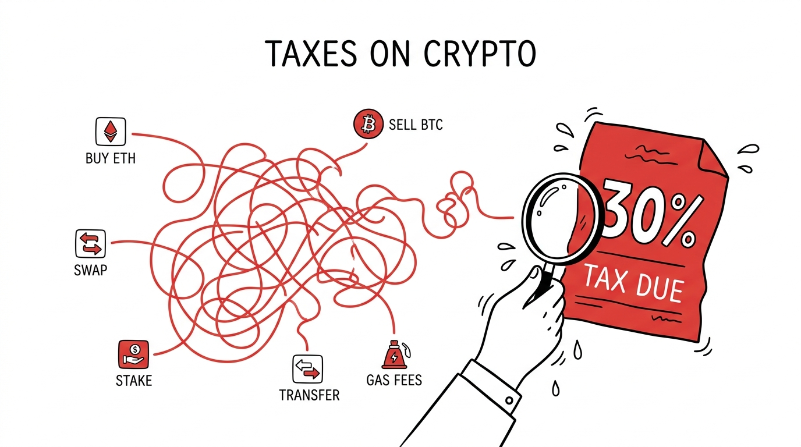
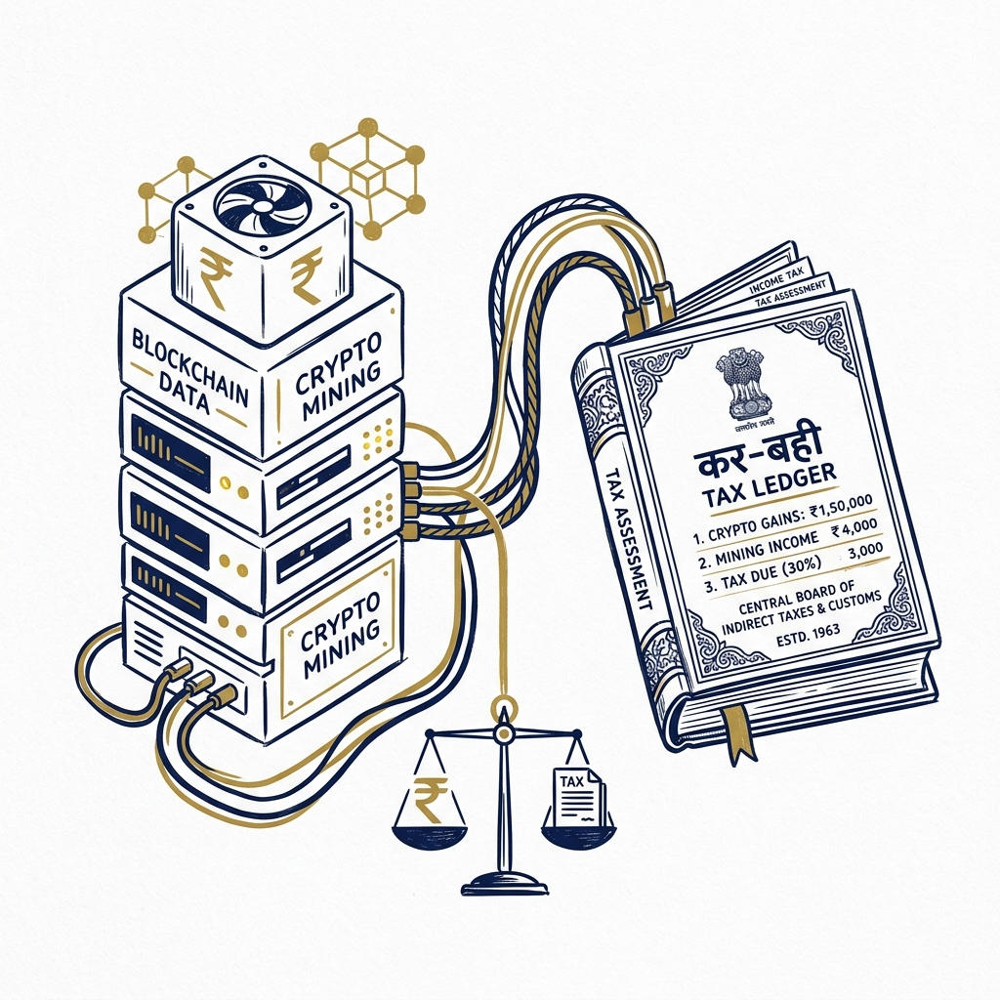

import NoticeTrap from '../../components/mdx/NoticeTrap.astro';
import CardPremium from '../../components/CardPremium.astro';

When you trade stocks on the NSE, you are participating in a system the government actively encourages. When you buy real estate, you are building the physical infrastructure of the nation. But when you buy Bitcoin, you are stepping into a shadow financial system that the Reserve Bank of India has repeatedly tried to destroy. 

This is the psychological baseline you must understand before you file your crypto taxes. 

The Indian government (via the Income Tax Act, 1961) did not introduce the flat 30% tax under Section 115BBH to raise revenue. They introduced it to deter you from participating in the ecosystem entirely. The tax is not designed to be fair; it is designed to be punitive.

<CardPremium title="TL;DR: The Crypto Tax Nightmare" variant="warning">
- **The Core Issue:** Crypto is heavily penalized. All Virtual Digital Assets (VDAs) face a flat 30% tax with a brutal "No Set-Off" rule (losses cannot offset profits).
- **The Mechanics:** Section 194S forces exchanges to deduct 1% TDS on sales, creating a tracking beacon for the Income Tax Department. Crypto-to-crypto swaps are also taxable events.
- **The Defense:** Abandon high-frequency day trading. Use FIU-compliant exchanges instead of P2P to avoid Cyber Cell bank freezes, and use automated crypto tax software to accurately calculate swap liabilities.
</CardPremium>

### The Genesis of the 30% Hammer

To understand why the tax is so brutal, you have to look at the history of the RBI and cryptocurrency. For years, the RBI issued circulars essentially banning banks from dealing with crypto exchanges. The Supreme Court of India eventually struck down that ban, declaring that the RBI could not choke off an entire industry without legislative backing.

Defeated in the Supreme Court, the government shifted tactics. If they couldn't ban crypto outright, they would tax it into oblivion. 

Enter Section 115BBH of the Income Tax Act, 1961. 
This section established that any income from the transfer of any Virtual Digital Asset (VDA) shall be taxed at a flat rate of 30%. There is no basic exemption limit. Even if your total income for the year is only ₹2 Lakhs (well below the tax-free slab), if you made ₹50,000 trading Ethereum, you owe 30% on that ₹50,000. 

### The Silent Tracker: Section 194S (The 1% TDS)

Many crypto traders operated under a delusion of anonymity. Because crypto wallets do not require a PAN card to operate on decentralized exchanges, they assumed the taxman was blind.

The government didn't try to track the blockchain; they choked the fiat off-ramps. 

Under Section 194S, the government mandated a 1% Tax Deducted at Source (TDS) on the transfer of all VDAs. When you sell Bitcoin on WazirX or CoinDCX, the exchange automatically deducts 1% of the total transaction value and deposits it against your PAN card. 

The purpose of this 1% is not revenue collection. It is a tracking beacon. The moment that 1% hits your Form 26AS, the Income Tax Department’s algorithms are alerted. They now know exactly how much volume you are trading. If your Form 26AS shows ₹50,000 in crypto TDS, the algorithm knows you sold ₹50 Lakhs worth of crypto. If you fail to report those trades in your ITR, a scrutiny notice is automatically triggered.

#### The Offshore Exchange Hunt (The FIU Crackdown)
Traders thought they could bypass the 1% TDS by moving to offshore exchanges like Binance, KuCoin, or OKX, which did not comply with Indian tax laws. 

In late 2023, the Financial Intelligence Unit (FIU) of India executed a coordinated strike. They issued show-cause notices to 9 major offshore exchanges for non-compliance with anti-money laundering laws and ordered the Ministry of Electronics and Information Technology to block their URLs in India. 

Binance was forced to pay a massive penalty and register with the FIU. Now, they too must comply with Indian reporting standards. There is no hiding.

### The Cyber Cell Nightmare: The P2P Trap

With Indian exchanges deducting 1% TDS and reporting to the government, traders flocked to Peer-to-Peer (P2P) platforms. On Binance P2P, you sell your USDT directly to another Indian user. They send INR directly to your SBI or HDFC bank account via UPI or IMPS. 

Because the exchange itself never touches the fiat, they don't deduct the 1% TDS. It feels like the perfect loophole.

Until your bank account gets frozen.

Here is the dark reality of the Indian P2P market: It is heavily infiltrated by scammers. 
A scammer steals ₹10 Lakhs from an innocent victim via a phishing link. The scammer needs to launder that money fast. They go onto Binance P2P and buy USDT from you. The stolen INR lands in your bank account, and the untraceable USDT goes into their wallet.

A week later, the victim files an FIR with the local Cyber Cell (police). The Cyber Cell traces the stolen money... straight to your bank account. The police instruct your bank to freeze your account instantly under Section 91 of the CrPC (Code of Criminal Procedure). 

You are now a suspect in a cyber fraud investigation. You cannot pay your rent, your EMI bounces, and you have to travel to another state (where the FIR was filed) to prove to the police that you merely sold crypto on Binance and are not part of the scam syndicate. 

<NoticeTrap title="The ED Escalation">
If the amount involved is massive, or if the P2P buyer is linked to a larger money laundering syndicate (like the Chinese loan app scams), the Enforcement Directorate (ED) can step in. Under the Prevention of Money Laundering Act (PMLA), the burden of proof is on you to prove your innocence. Never trade P2P with unverified accounts.
</NoticeTrap>

### The Brutal Math: The "No Set-Off" Rule

The most devastating part of Section 115BBH is the destruction of basic financial logic. In the stock market, if you make a ₹10 Lakh profit on Reliance and a ₹8 Lakh loss on Tata Motors, you pay tax on your net profit of ₹2 Lakhs. 

In the crypto market, **losses are dead.**

Section 115BBH explicitly states:
1. No deduction in respect of any expenditure (other than the cost of acquisition) is allowed.
2. No set-off of loss from the transfer of a VDA is allowed against any other income.
3. You cannot even set off a loss in one crypto against a profit in another crypto.

Let's look at the math of a trader over a single financial year:

| Asset Traded | Buy Price | Sell Price | Net Result | Taxable Amount |
| :--- | :--- | :--- | :--- | :--- |
| **Bitcoin (BTC)** | ₹30,00,000 | ₹45,00,000 | +₹15,00,000 (Profit) | ₹15,00,000 |
| **Ethereum (ETH)** | ₹10,00,000 | ₹4,00,000 | -₹6,00,000 (Loss) | ₹0 (Ignored) |
| **Solana (SOL)** | ₹2,00,000 | ₹50,000 | -₹1,50,000 (Loss) | ₹0 (Ignored) |

**Your Actual Net Profit:** ₹7,50,000
**The Government's Calculated Profit:** ₹15,00,000

You must pay 30% tax on ₹15 Lakhs (which is ₹4.5 Lakhs in tax). 
You only made ₹7.5 Lakhs in reality, but you are paying ₹4.5 Lakhs to the government. Your effective tax rate on your net profit is a staggering **60%**. This is why day trading crypto in India is mathematically suicidal.

### The Anatomy of a "Transfer" (Crypto-to-Crypto Swaps)

Many traders believe that a taxable event only occurs when crypto is converted back into fiat currency (INR). This is a fatal misunderstanding of the law.

Section 115BBH taxes the "transfer" of a VDA. 
If you swap 1 Bitcoin for 15 Ethereum on a decentralized exchange (DEX) like Uniswap, you have executed a transfer. You have sold Bitcoin and bought Ethereum. 

Even though no INR touched your bank account, you must calculate the INR value of that Bitcoin on the exact minute you swapped it. If the INR value of the Bitcoin was higher than your original purchase price, you owe 30% tax on that difference. 

If you execute 50 crypto-to-crypto swaps a month, you have triggered 50 taxable events. Calculating this by hand is impossible; you must use algorithmic tax software (like KoinX or ClearTax Crypto) to parse your exchange APIs and calculate the underlying INR gains on every swap. 

### Infrastructure Denial: Mining and Staking

The government's hostility extends to the infrastructure of the blockchain itself.

If you set up a Bitcoin mining rig in your garage, you incur massive costs: the GPUs, the ASIC miners, and the crushing electricity bill. 
Can you deduct the cost of the hardware or the electricity from the Bitcoin you mine?

**Absolutely not.**
Section 115BBH explicitly states that *no deduction of any expenditure* (other than the cost of acquisition) shall be allowed. Since you "mined" the Bitcoin, your cost of acquisition is essentially zero (the hardware and electricity do not count as acquisition costs under the strict reading of the law). When you sell that mined Bitcoin, the entire revenue is taxed at 30%. 

### Airdrops and Gifts: Money Falling from the Sky

In the crypto world, protocols often distribute free tokens (Airdrops) to early adopters. If you used the Arbitrum network early on, you might have woken up to $10,000 worth of ARB tokens in your wallet.

Is free money taxable? In India, yes.

Airdrops are generally classified under **"Income from Other Sources" (Section 56(2)(x))**. 
Because you received an asset for zero consideration, the Fair Market Value (FMV) of those tokens on the day they land in your wallet is treated as your income. If the airdrop is worth ₹8 Lakhs on that day, ₹8 Lakhs is added to your total income and taxed at your normal slab rate (not the flat 30%). 

However, if you hold those airdropped tokens for six months and then sell them for ₹10 Lakhs, you trigger the VDA rules. 
- The FMV at the time of airdrop (₹8 Lakhs) becomes your Cost of Acquisition. 
- You sold it for ₹10 Lakhs. 
- The profit of ₹2 Lakhs is now taxed at the flat 30% under Section 115BBH.

<NoticeTrap title="The 30% Flat Tax on Airdrops (The IRS Debate)">
There is a fierce debate among Chartered Accountants on whether the initial receipt of the airdrop should be taxed under the VDA 30% slab or the normal slab rate. Given the aggressive stance of the Assessing Officers, the safest route is to declare the initial receipt as VDA income at 30%, but you must consult your CA to align on a defense strategy before filing.
</NoticeTrap>

### The Final Reckoning: Safe Harbors

The era of the crypto wild west in India is over. The tax department has established complete surveillance over the on-ramps and off-ramps, and the algorithms are ruthless. 

If you want to survive as a crypto investor in India, you must adapt to the new reality:
1. **Abandon Day Trading:** The "No Set-Off" rule makes high-frequency trading mathematically impossible. You must become a long-term holder.
2. **Use Compliant Exchanges:** Avoid P2P trading completely. Use FIU-registered exchanges (like CoinDCX, WazirX, or FIU-compliant Binance) where the fiat off-ramp goes directly into your bank account, avoiding the Cyber Cell freeze risk.
3. **Automate Your Accounting:** Connect your exchange APIs to a crypto tax engine to calculate the exact INR value of your crypto-to-crypto swaps. Do not attempt to calculate this in Excel.
4. **Pay the Toll:** When you make a massive profit, accept the 30% hit as the cost of doing business in a hostile regulatory environment, or explore advanced structuring options (like holding the crypto in a Dubai-based entity, provided you understand the FEMA and Black Money Act implications). 

The government has given you the rules. They are brutal, they are unfair, and they are mathematically punishing. But they are the law.
