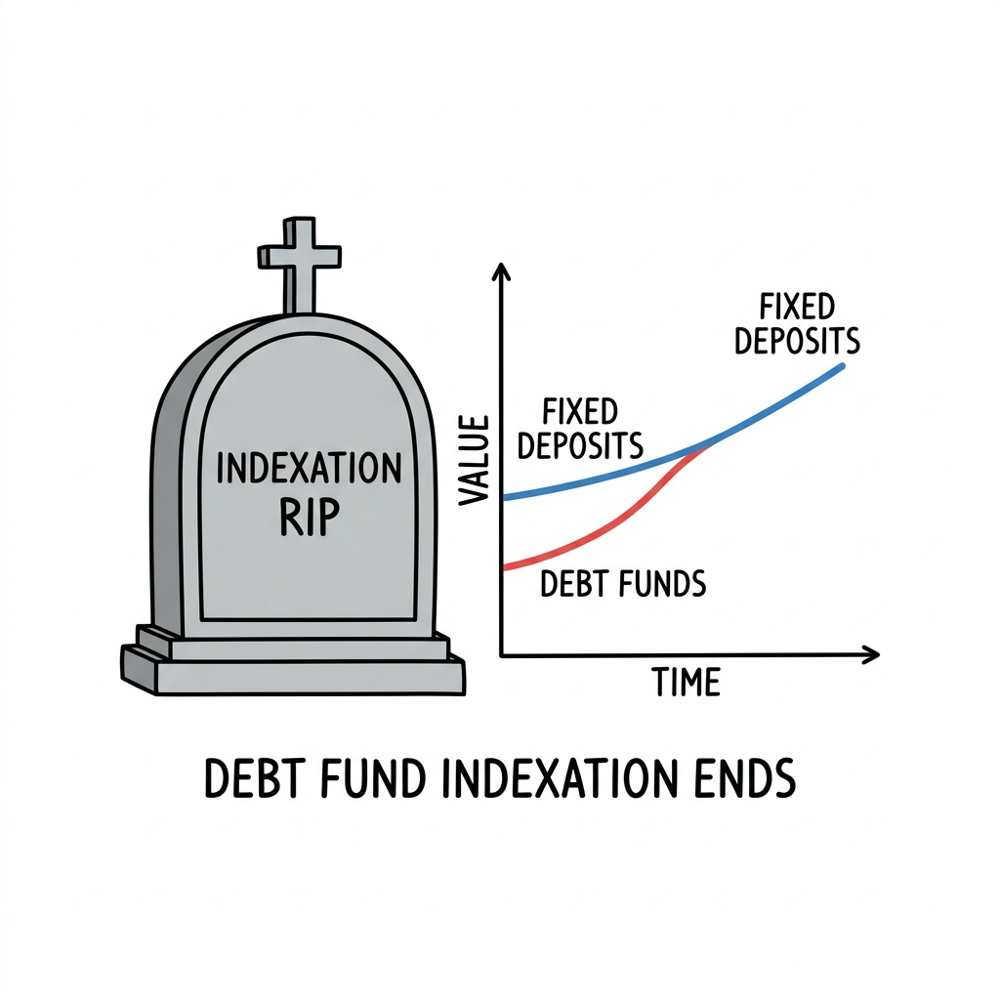

import NoticeTrap from '../../components/mdx/NoticeTrap.astro';
import CardPremium from '../../components/CardPremium.astro';
import NoticePenaltyWorkbench from '../../components/mdx/NoticePenaltyWorkbench.astro';

<CardPremium title="TL;DR: The Debt Fund Massacre" variant="warning">
- **The Core Issue:** The 2023 Budget eliminated indexation benefits for Debt Mutual Funds. They are now taxed at your marginal slab rate (up to 30%) like FDs.
- **The Mechanics:** Section 50AA classifies funds with less than 35% domestic equity as "Specified Mutual Funds", taxing all gains as Short-Term Capital Gains (STCG) regardless of holding period.
- **The Defense:** Never use Debt Funds to claim Section 54F real estate exemptions (since they are now STCG). Shift capital to Arbitrage Funds or Equity Savings Funds to retain the 12.5% LTCG tax shield.
</CardPremium>

## 1. The 5 Whys (The Historical Intent)

*Why did the government suddenly destroy one of the most popular investment vehicles in India?*

To understand the sheer brutality of Section 50AA, you have to look at the history of the **Great Debt Fund Arbitrage Loophole**.

For a decade, the Indian middle class was heavily invested in Fixed Deposits (FDs). The government taxed FDs at marginal slab rates (up to 30%). It was a highly profitable revenue stream for the state.
But High Net Worth Individuals (HNIs) and family offices knew a secret. They abandoned FDs entirely and parked thousands of crores in Debt Mutual Funds. 

Why? Because of **Indexation**. 
If you held a Debt Fund for more than 3 years, the government allowed you to adjust your purchase price for inflation before calculating the tax. In a high-inflation economy like India, this often wiped out the majority of the taxable gain. HNIs were effectively paying a sub-10% effective tax rate on their debt portfolios, while a salaried employee making ₹15 Lakhs was paying 30% on their FD interest.

The government realized they were losing thousands of crores in revenue. The arbitrage was too large. So, in the 2023 Budget, they didn't just close the loophole—they carpet-bombed the entire asset class.

## 2. What is the Exact Regulation? (Section 50AA)

The weapon the government used is **Section 50AA of the Income Tax Act**.

This section is short, cold, and devastatingly precise. It states that any gains arising from the transfer, redemption, or maturity of a "Specified Mutual Fund" will be deemed to be **Short-Term Capital Gains (STCG)**.

What is a "Specified Mutual Fund"? The statute defines it mechanically: **Any mutual fund that invests not more than 35% of its total proceeds in the equity shares of domestic companies.**

If your fund hits that mathematical trigger (under 35% domestic equity), the following punishments apply:
1. **Zero Indexation:** The inflation adjustment is gone forever.
2. **Slab Rate Taxation:** Your gains are added to your normal income and taxed at your marginal slab rate (which could be 30% + surcharge).
3. **No Long-Term Reclassification:** It does not matter if you hold the fund for 3 years, 10 years, or 50 years. It will *always* be classified as Short-Term Capital Gains.

You are now mathematically in the exact same tax position as an FD holder. 

## 3. How Can I Minimize My Risk? (Notice Traps)

When a tax law fundamentally alters the classification of an asset, taxpayers make desperate mistakes trying to outsmart the system. The CPC (Central Processing Centre) has algorithms actively hunting for these exact errors.

<NoticeTrap title="The Section 54F Exemption Trap">

**Scrutiny Trigger:** You redeem ₹50 Lakhs from a Debt Mutual Fund that you held for 5 years. You use that money to buy a residential house, and you claim a Section 54F exemption on your ITR, assuming that a 5-year holding period makes it a Long-Term Capital Asset.

**Resolution Strategy:** You will immediately receive a Section 143(1) intimation demanding 30% tax plus 234B/C interest. Section 54F exemptions are *only* available for Long-Term Capital Gains. Because Section 50AA legally deems all Debt Fund gains as Short-Term Capital Gains—regardless of holding period—the 54F exemption is permanently blocked. Never attempt to claim 54F using Debt Fund proceeds.

</NoticeTrap>

## 4. How Can I Save Money? (The Alternatives)

If Debt Funds are dead, where does the smart money go for debt-like returns with better tax efficiency? The chess grandmasters of finance have already moved their capital to new vehicles.

### The Arbitrage Fund Shield
Arbitrage Funds exploit price differences between the cash and derivatives market. Crucially, they maintain more than 65% domestic equity exposure. 
Because of this >65% mathematical threshold, they escape Section 50AA completely. They are taxed as **Equity Mutual Funds**.
- Holding under 1 Year: Taxed at 20% (STCG).
- Holding > 1 Year: Taxed at 12.5% (LTCG), with the first ₹1.25 Lakhs entirely tax-free.

### The Equity Savings Fund Strategy
These funds invest ~35% in unhedged equity, ~30% in arbitrage (hedged equity), and ~35% in debt. Because the combined equity exposure (unhedged + hedged) exceeds 65%, they are also taxed as Equity Mutual Funds. You get the stability of debt (65% of the portfolio is effectively debt/hedged) but the golden tax treatment of equity.

## 5. Am I Leaving Anything Out? (The Edge Cases)

**"I invested in a Debt Fund in 2019. Am I completely screwed now?"**
No. Section 50AA has a **Grandfathering Clause**. The devastating tax treatment only applies to units acquired *on or after April 1, 2023*. If you bought your units on March 31, 2023, or earlier, you are completely shielded. You still get the old 20% with indexation benefit whenever you decide to sell. Do not sell your grandfathered units unless absolutely necessary; they are a rare, extinct asset class now.

**"What about Gold ETFs and International Equity Funds?"**
They were caught in the crossfire. A fund that invests in International Equity (like a Nasdaq 100 fund) or Gold has 0% exposure to *domestic* equity. Therefore, they fall under the under 35% domestic equity definition of Section 50AA. They too are now taxed at slab rates without indexation.

## 6. 💡 Key Takeaway Summary & Actionable Checklist

*   **Check Your Portfolio's "Born On" Date:** Log into your CAMS/KFintech statement. Any Debt Fund unit purchased on or after April 1, 2023, is dead weight from a tax perspective.
*   **Do Not Sell Grandfathered Units:** Protect your pre-April 2023 Debt Fund units. They still retain the golden indexation benefit.
*   **Pivot to Arbitrage:** If you are in the 30% slab and need a parking space for 1-2 years, shift your new capital into Arbitrage Funds to secure the 12.5% LTCG rate.
*   **Never Claim 54F:** Do not attempt to use Debt Fund redemptions to claim Section 54/54F exemptions for real estate purchases.

