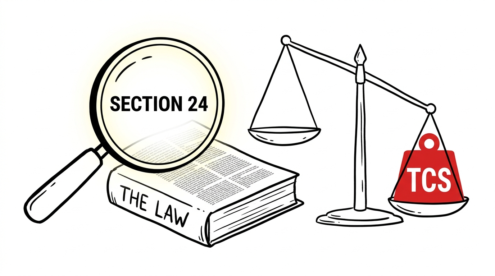
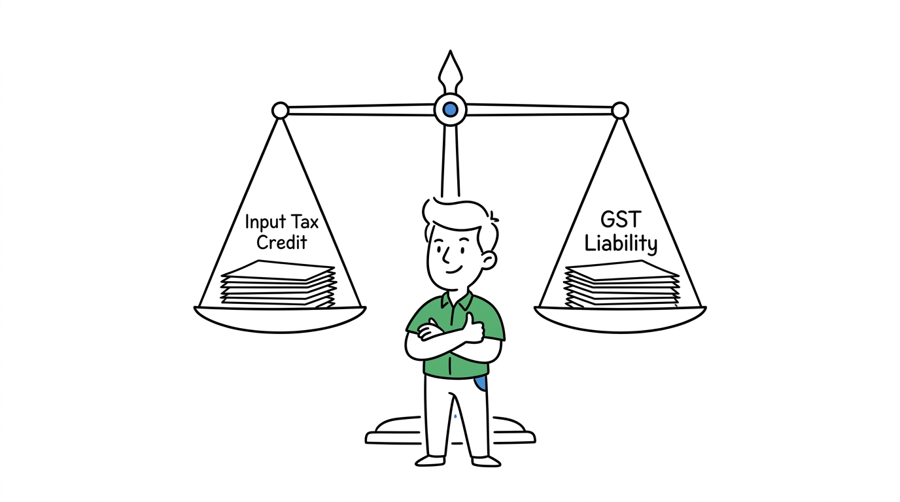

import NoticeTrap from '../../components/mdx/NoticeTrap.astro';
import CardPremium from '../../components/CardPremium.astro';
import NoticePenaltyWorkbench from '../../components/mdx/NoticePenaltyWorkbench.astro';

The internet is flooded with dangerous, half-baked tax advice for small business owners. The most pervasive and financially lethal myth is the "₹40 Lakh Threshold." Thousands of new sellers open accounts on Amazon, Flipkart, Meesho, or Shopify, assuming they are invisible to the tax department because their side-hustle revenue is only ₹50,000 a month.

They are completely wrong. The law contains a specific, brutal override for e-commerce. If you believe the ₹40 Lakh myth, you are actively accumulating a massive penalty on taxes you didn't even know you owed. Let's systematically dismantle this using the exact letter of the law.

<CardPremium>
### TL;DR
- **The Myth:** Section 22 says you don't need GST until you hit ₹40 Lakhs in turnover. 
- **The Override:** Section 24 completely nullifies this for e-commerce. If you sell on a third-party marketplace, your threshold is exactly ₹0. You need GST on Day 1.
- **The Surveillance:** E-commerce platforms are legally forced to act as tax informants. They deduct 1% TCS on your sales and report your PAN to the government, instantly blowing your cover.
- **The Composition Trap:** The simplified Composition Scheme is useless for Amazon sellers because it legally bans you from making inter-state sales.
</CardPremium>

## 1. The Genesis of the Digital Tollbooth

To understand why the government is so ruthless with small e-commerce sellers, you have to look at the chaos that existed before 2017. 

*Why does Section 24 exist?*

In the early 2010s, during the explosive rise of Flipkart and Snapdeal, India operated under the old VAT (Value Added Tax) regime. It was a nightmare. A seller sitting in a small room in Surat could ship a phone case to a buyer in Kerala. Because the seller's turnover was tiny, they weren't registered for VAT in Gujarat, and they certainly weren't registered in Kerala. 
Millions of these micro-transactions were happening daily. State governments realized they were bleeding billions in lost tax revenue. The digital economy was completely untaxed.

When the government drafted the GST Act in 2017, they made a radical decision. They realized they couldn't chase down a million individual sellers. So, they turned the platforms themselves into tax collectors. 
They built a "Digital Tollbooth." They mandated that if you want to use the massive logistical infrastructure of an Amazon or Flipkart, you must enter the formal economy immediately, regardless of how small you are. 

## 2. The Legal Override (Dismantling the Myth)

How do YouTube gurus get it so wrong? They read the first chapter of the rulebook and stop.

### The Myth: Section 22 of the CGST Act
The confusion stems from a very real law. **Section 22 of the CGST Act (2017)** states that a supplier of goods is only liable to register for GST if their aggregate turnover in a financial year exceeds ₹40 Lakhs (or ₹20 Lakhs in special category states). 

People read this headline, close the book, and start selling. They fail to read two pages further.

### The Reality: Section 24 of the CGST Act
**Section 24** is the "Compulsory Registration" statute. It explicitly lists scenarios where Section 22 is completely nullified. If you fall under Section 24, the ₹40 Lakh threshold evaporates. Your threshold becomes ₹0.

Clause (ix) of Section 24 mandates compulsory GST registration for:
> *"persons who supply goods or services or both, other than supplies specified under sub-section (5) of section 9, through such electronic commerce operator who is required to collect tax at source under section 52."*

**The Translation:** If you sell physical goods on Amazon, Flipkart, Meesho, or any third-party marketplace, you must have an active GST Number *before you make your first ₹1 of sales*. There is no grace period.

## 3. How Can I Minimize My Risk? (The TCS Trap)

Do not assume you can "fly under the radar" until you make it big. The Digital Tollbooth is designed specifically to prevent this.

<NoticeTrap title="Trap 1: The TCS (Tax Collected at Source) Trail">

**Scrutiny Trigger:** You manage to sell goods online without a proper GST profile (perhaps using a proxy or an older account). You don't file GSTR-3B, assuming the government doesn't know you exist.

**Resolution Strategy:** Under Section 52, Amazon and Flipkart are legally mandated to deduct 1% TCS on your net sales and deposit it with the government against your PAN/GSTIN. This 1% is not about revenue; it is a **tracking beacon**. The moment Amazon deposits that 1%, the GST portal automatically flags your PAN. The government now has cryptographic proof that you are making e-commerce sales. If there is no corresponding GSTR-3B filed by you, an automated demand notice is triggered.

</NoticeTrap>

<NoticePenaltyWorkbench 
  defaultShortfall={50000} 
  defaultMonthsDelayed={12} 
  instruction="Enter the estimated GST you should have paid on your un-registered sales. See how the 18% p.a. interest penalty under Section 50 compounds the longer you hide from the registry."
/>

<NoticeTrap title="Trap 2: Input Tax Credit (ITC) Evaporation">

**Scrutiny Trigger:** You finally register for GST after 6 months of selling, and try to claim Input Tax Credit on the inventory you bought 5 months ago.

**Resolution Strategy:** You cannot retroactively claim ITC for purchases made before your registration became effective (unless within a specific 30-day window of becoming liable). Every rupee of GST you paid to your wholesaler is permanently lost. Since e-commerce margins are already razor-thin, losing your 18% ITC essentially bankrupts your business model.

</NoticeTrap>

## 4. How Can I Save Money? (The Composition Scheme Illusion)

Many sellers realize they need GST, but want to avoid the headache of filing monthly GSTR-1 and GSTR-3B returns. So, they look for a loophole and find the **Composition Scheme (Section 10)**, which allows a flat 1% tax and quarterly returns.

### Another Myth Shattered
Until recently, Section 10(2)(d) explicitly banned e-commerce sellers from opting into the Composition Scheme. 

**The Recent Relief:** The government finally amended this. You *can* now opt for the Composition Scheme as an e-commerce seller, **BUT** it comes with massive, fatal flaws for most modern businesses:
1. **You cannot make inter-state sales.** If your business is in Maharashtra, you can only sell to customers in Maharashtra. On Amazon, you cannot control where your buyer lives; the platform dictates the logistics. If an order ships to Gujarat, you violate the scheme.
2. **You cannot claim Input Tax Credit.** You cannot offset the GST you pay to your suppliers.

**The Verdict:** The Composition scheme is useless for Amazon/Flipkart sellers. You must register as a regular taxpayer. Your only legitimate path to saving money is militant record-keeping. You must claim 100% of your Input Tax Credit (ITC) on inventory, packaging, Amazon seller fees, and shipping charges. The GST you owe on your sales is entirely offset by the GST you paid on these expenses. 

## 5. The "Wait, What If...?" Scenarios

### Edge Case 1: What if I sell Services, not Goods?
The law differentiates between goods and services. If you sell *services* through an e-commerce platform (e.g., you are a freelance consultant on Upwork or Fiverr, or you sell digital courses), the ₹20 Lakh threshold **does** apply to you. The mandatory ₹0 registration under Section 24 primarily targets the supply of physical goods through platforms that collect payments on your behalf.

### Edge Case 2: Selling on your own Shopify Website
Section 24 targets sellers using an *Electronic Commerce Operator* (a third party that collects payment, like Amazon). If you build your own Shopify or WooCommerce website and plug in a payment gateway (like Razorpay or Stripe) directly into your own bank account, **you are the principal**. In this specific scenario, you do NOT fall under Section 24. The standard ₹40 Lakh threshold of Section 22 protects you, because there is no third-party operator deducting Section 52 TCS.

## 6. 💡 Key Takeaway Summary & Actionable Checklist

*   **Ignore the Gurus:** If you sell physical goods on Amazon/Flipkart, you need GST from Day 1. The ₹40L limit does not apply to you.
*   **Avoid the Composition Scheme:** It bans inter-state sales, making it fundamentally incompatible with national e-commerce platforms. Register as a "Regular Taxpayer."
*   **Harvest your ITC:** E-commerce margins survive on ITC. Reconcile your GSTR-2B monthly to ensure you are claiming the GST paid on Amazon commissions, advertising, and shipping fees to neutralize your final tax payout.
*   **Track your TCS:** Log into the GST portal and actively accept your TCS credits filed by Amazon/Flipkart so they offset your cash ledger liability.
