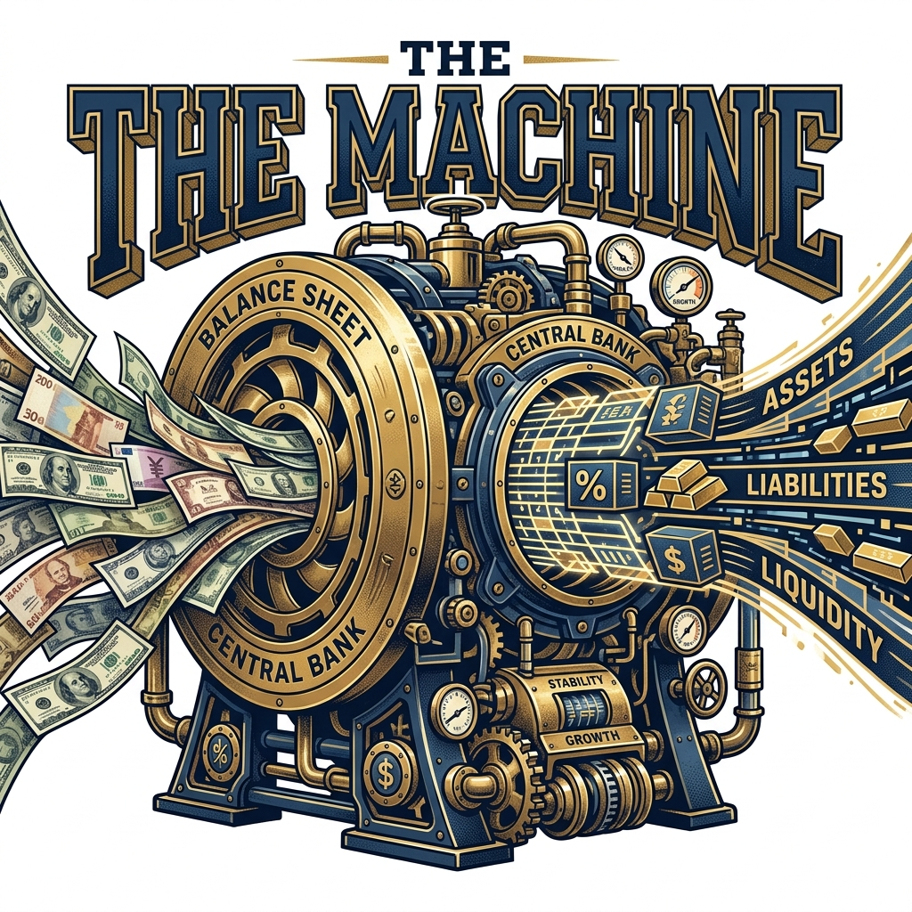

import IllTwoDials from '../../components/illustrations/fcnr/IllTwoDials.astro';
import IllRBIThrottle from '../../components/illustrations/fcnr/IllRBIThrottle.astro';
import IllOptimalDollar from '../../components/illustrations/fcnr/IllOptimalDollar.astro';
import IllThreeBalanceSheets from '../../components/illustrations/fcnr/IllThreeBalanceSheets.astro';
import IllDollarMachineFlow from '../../components/illustrations/fcnr/IllDollarMachineFlow.astro';
import CardPremium from '../../components/CardPremium.astro';

"The machine did not manufacture dollars. It moved foreign-currency liquidity from one balance sheet to another."

---

<CardPremium title="TL;DR: The RBI's Dollar Machine">
- **The Swap:** RBI offered banks a concessional USD-INR swap, drastically reducing the cost to hedge FCNR dollars into usable domestic rupees.
- **The Cascade:** This allowed banks to bid higher rates to NRIs, which triggered massive inflows ($52.3 billion by August 2026).
- **The Reporting:** RBI tracked the inflows precisely. Once the target was reached, the window was closed early (August 31 instead of September 30).
- **The Reality:** FCNR inflows do not perfectly equal "free" reserves. They bring foreign currency onto the RBI's balance sheet, but attach a ticking clock to it.
</CardPremium>

---

There is something slightly misleading about the way the FCNR story first appears. An NRI sees an advertisement offering an unusually attractive return on a dollar deposit. A bank wants deposits. The Reserve Bank of India wants foreign-exchange inflows. The money arrives. The headlines report a large number. It sounds like banking. But it is not merely banking.

By August 13, 2026, Indian banks had mobilised $52.3 billion through the special FCNR(B) route introduced in June. The response was so strong that the Reserve Bank decided to close the special FCNR swap window on August 31 rather than wait until the originally announced September 30 deadline. Across the FCNR(B), ECB and overseas foreign-currency borrowing channels covered by the broader facility, mobilisation had reached about $56.85 billion. ([Department of Economic Affairs](https://dea.gov.in/files/external_debt_documents/India%27s_External_Debt_A_Status_Report_2019_20.pdf?utm_source=chatgpt.com))

At roughly the same time, India's foreign-exchange reserves had climbed to about $707 billion as of August 7, including foreign-currency assets of around $574.6 billion. Reuters reported that reserves had risen by roughly $40 billion over the preceding six weeks amid strong policy-driven foreign-currency inflows, although RBI intervention and other balance-sheet movements meant the relationship was not one-for-one. ([Reuters](https://www.reuters.com/world/india/indias-forex-reserves-climb-past-700-billion-robust-inflows-2026-08-14/?utm_source=chatgpt.com))

Those numbers are impressive. But they conceal the more interesting story. Because RBI did not simply persuade NRIs to put money into Indian banks. It redesigned the economics of the transaction. It altered what banks could pay. It altered the cost of hedging the foreign currency. It altered the regulatory economics of the incremental deposits. It created a reporting mechanism that allowed the central bank to see the response almost in real time. And then, once enough dollars had arrived, it began withdrawing the extraordinary incentive.

The result was a machine. The machine did not manufacture dollars. It did something much more sophisticated. It moved foreign-currency liquidity from one balance sheet to another, converted its form, and bought India time.

### The problem begins with a currency India cannot print

The most useful way to understand the FCNR mechanism is to forget FCNR for a moment. Start with the fundamental constraint: The Reserve Bank of India can create rupees. It cannot create US dollars.

That distinction is so obvious that it is easy to underestimate its importance. If the Government of India needs to pay an Indian contractor, rupees are sufficient. If an Indian household buys an apartment, the transaction can happen in rupees. If an Indian company borrows from an Indian bank for working capital, the bank can create a rupee loan against the appropriate credit assessment. 

But suppose an Indian refinery has to pay an overseas supplier for crude. The supplier wants dollars. Suppose an Indian company has a $500 million external debt repayment. The lender wants dollars. Suppose an Indian investor wants to purchase an asset overseas. The seller wants foreign currency. India can create another trillion rupees and still not have created a single genuine dollar.

That is the first principle behind the entire FCNR episode: A country that issues its own currency can always create domestic liquidity. It cannot create the foreign currency in which its external obligations are denominated. This is why foreign exchange is not simply another form of liquidity. It is a scarce external resource.

### Where do India's dollars come from?

Once we ask that question, the architecture of the balance of payments becomes visible. India can obtain foreign currency by selling goods abroad. It can sell services abroad. It can receive remittances. It can attract foreign direct investment. It can attract portfolio investment. It can borrow abroad. And it can use foreign-exchange reserves accumulated earlier.

There are many channels, but economically they all perform the same basic function: they bring foreign purchasing power into the country. When those flows are insufficient relative to India's external requirements, pressure appears in the foreign-exchange market. The rupee can weaken. RBI can intervene. Reserves can fall. Foreign borrowing can become more expensive. Domestic liquidity conditions can tighten. Or policymakers can try to attract additional foreign currency.

That last option is where FCNR enters.

### India already had a pool of dollars waiting outside India

The Indian diaspora is economically unusual. Millions of Indians and people of Indian origin earn money abroad. They accumulate dollars, dirhams, pounds, euros, Singapore dollars and other foreign currencies. A portion is remitted to India. But a large amount naturally remains abroad.

From India's perspective, this represents something extremely valuable: foreign currency owned by people who already have an economic connection with India. The challenge is not convincing them that India exists. The challenge is giving them a sufficiently attractive reason to move their foreign currency into India's financial system.

FCNR(B) is one of the mechanisms through which India does that. The NRI can place foreign currency into an eligible term deposit with an Indian bank without converting the principal into rupees. The NRI therefore retains a foreign-currency claim. The Indian banking system, meanwhile, gains access to foreign-currency funding. This is the first transformation. But it is only the beginning.

### The bank now has a problem

Imagine an Indian bank receives $1 billion in FCNR deposits. The bank now has a liability of $1 billion to its depositors. But look at the bank's natural lending business. Most Indian households want rupee mortgages. Indian businesses want rupee working-capital loans. Indian infrastructure projects generally require rupee funding. Indian government securities are rupee-denominated.

The bank therefore has a foreign-currency liability sitting against an asset base that is overwhelmingly domestic-currency oriented. The bank needs to manage that mismatch. It cannot simply take the dollars, convert them into rupees and forget about the problem. If it did so without hedging, a movement in the exchange rate could produce a significant mismatch between what the bank owes and what its assets are worth.

So the bank needs the foreign-exchange market. This is where the apparently simple FCNR deposit becomes a treasury transaction.

### The invisible second half of the deposit

When an NRI deposits dollars, the customer sees:

  USD deposit &rarr; USD interest &rarr; USD repayment

The bank sees something much more complicated. It sees:

  USD liability &rarr; FX management &rarr; rupee liquidity &rarr; asset deployment &rarr; future USD settlement

The dollar therefore enters a machine. The machine's job is to separate two things that naturally sit together in the NRI's mind: the currency of the liability and the currency in which the bank wants to deploy the funding. The mechanism used to perform that separation is the foreign-exchange swap.

### What an FX swap actually does

An FX swap sounds intimidating because it belongs to the language of treasury desks. The underlying idea is surprisingly intuitive. Suppose a bank has dollars today but wants rupees. It can exchange USD for INR today while agreeing to reverse the transaction later.

The bank therefore gets the rupees it can use in its domestic business while arranging a contractual mechanism through which the foreign-currency position will eventually be reversed. The crucial point is that the bank does not have to gamble on where the rupee will be several years from now. It can hedge the currency exposure. But hedging has a price. And that price is where the economics of the entire 2026 FCNR programme become interesting.

### The cost of the dollar matters as much as the interest rate

Imagine a bank can attract an NRI dollar deposit by paying 7%. That sounds attractive to the depositor. But the bank does not care only about the 7%. It cares about its all-in cost of foreign-currency funding.

If it pays 7% to the depositor and then faces a large cost to hedge the dollar exposure, the deposit may not be particularly attractive. If the hedging cost falls, the same 7% deposit suddenly becomes much more attractive. This is exactly why RBI's intervention was so important. The central bank did not merely encourage banks to pay higher rates. It changed the economics of the FX hedge itself.

### RBI entered the transaction

In June 2026, RBI introduced a special USD-INR swap facility covering fresh FCNR(B) deposits with three-to-five-year maturity, alongside special facilities for qualifying external commercial borrowings and overseas foreign-currency borrowings. The policy was designed to make it cheaper for banks to hedge the foreign currency raised through these channels.

Contemporary reporting described the FCNR mechanism as allowing banks to obtain a concessional swap from RBI, effectively reducing the hedging cost associated with the foreign-currency deposits. ([Indian Express](https://indianexpress.com/article/business/rbi-closes-fcnr-b-forex-swap-facility-august-31-inflows-52-billion-10833685/?utm_source=chatgpt.com))

At the same time, RBI temporarily relaxed the interest-rate restrictions applicable to qualifying new FCNR(B) deposits. That combination is the heart of the machine.

The bank's economics were being improved from both directions. On one side, the bank could offer a more attractive rate to the NRI. On the other, the cost of transforming the foreign-currency funding became more favourable. This is why the 2026 programme was not simply a deposit-rate intervention. It was a balance-sheet intervention.

<IllTwoDials />

### The central bank was changing a price signal

This is an important distinction. RBI could not command NRIs to send dollars to India. It could not simply decree: "Bring $50 billion."

The private owners of the dollars had choices. They could keep the money abroad. They could buy US Treasury securities. They could keep it in a foreign bank. They could invest elsewhere. They could bring it to India. So RBI had to influence behaviour indirectly. It changed the economics faced by the banks. The banks then changed the prices offered to NRIs. The NRIs responded.

This is one of the most elegant features of market-based policy. The central bank did not allocate the dollars administratively. It changed the price at which the financial system competed for them.

### The bank became the transmission belt

This makes the commercial bank the critical middle layer. RBI does not have a retail relationship with every NRI. Banks do. Banks have NRI customer networks, overseas branches, remittance channels, digital banking platforms, treasury operations, and foreign-exchange desks.

So the policy architecture looks like this in economic terms:

  RBI changes economics &rarr; banks change bids &rarr; NRIs change behaviour &rarr; dollars enter banks

That is the transmission mechanism. The bank is not merely an intermediary. It is the transmission belt through which monetary policy reaches the foreign-currency owner.

### Why three-to-five years?

The maturity restriction is another clue. If India simply wanted dollars for a few weeks, it could rely on short-term money markets. But short-term foreign funding can disappear just as quickly as it arrives. That is precisely what a central bank does not want during an external-financing episode. It wants stability.

A three-to-five-year deposit provides a much longer funding horizon. The bank knows that the dollar liability is not ordinarily going to disappear tomorrow. RBI knows that the foreign-currency position has a predictable maturity horizon. India gets something even more valuable than the dollar itself: time.

That is the hidden product.

### The machine is therefore a time machine

This is the conceptual breakthrough. Suppose India has a foreign-currency requirement today. There are several ways to deal with it. RBI can sell reserves. The rupee can adjust. The country can attract portfolio inflows. It can borrow externally. Or it can attract foreign-currency deposits.

FCNR does something different. It brings foreign currency into the system today while creating a contractual claim that matures years later. The system therefore transforms immediate foreign-currency scarcity into future foreign-currency repayment.

That is not inherently good or bad. It is maturity transformation. The policy question is whether the intervening years are valuable enough to justify the future obligation.

### This is why the reserve number can be misleading

By August 7, India's foreign-exchange reserves had risen to about $707 billion, with foreign-currency assets of $574.6 billion and gold reserves of $108.7 billion. Reuters reported that reserves had increased by roughly $40 billion over six weeks, with strong policy-driven inflows contributing significantly. ([Reuters](https://www.reuters.com/world/india/indias-forex-reserves-climb-past-700-billion-robust-inflows-2026-08-14/?utm_source=chatgpt.com))

It is tempting to look at that and conclude: FCNR brought $52.3 billion, so reserves increased by $52.3 billion. That is not the right accounting.

The FCNR deposit is first a banking-system liability. The RBI swap changes the central bank's foreign-currency position. Other transactions happen simultaneously. RBI can intervene in the spot market. Forward positions can change. Valuation changes can affect reserves. Other capital flows can arrive. Imports can consume foreign exchange.

The reserve stock is therefore the result of many interacting flows. This is why:

  FCNR mobilisation ≠ equivalent increase in reserves

The two are connected. They are not identical.

### The $52.3 billion number is a flow, not a pile

This distinction is even more important when looking at the reported FCNR mobilisation. By August 13, banks had mobilised $52.3 billion through the FCNR(B) route. ([Reuters](https://www.reuters.com/world/india/indias-central-bank-close-fx-deposit-swap-facility-prematurely-2026-08-14/?utm_source=chatgpt.com))

But "mobilised" does not necessarily mean $52.3 billion of entirely new dollars that had never before been connected with India. Existing FCNR deposits can mature and be rebooked. A depositor can move an existing deposit into a new policy-supported structure. The bank can therefore report new mobilisation without the country's external position increasing by an equivalent amount.

That is why stock and flow have to be kept separate. This distinction will become critical when we reach Article III and ask how large the eventual maturity burden really is.

### RBI knew the numbers were moving quickly

The policy did not operate in an information vacuum. RBI created a specific reporting framework for FCNR(B) deposits, ECBs and overseas foreign-currency borrowings mobilised under the swap facility. The central bank's regulatory material explicitly provides for reporting of these flows under the special arrangement. ([RBI](https://m.rbi.org.in/scripts/BS_ViewForms.aspx?FCId=13&utm_source=chatgpt.com))

That matters because a central bank operating a temporary balance-sheet intervention needs to know whether the market is responding as intended. There is a huge difference between: *"We offered an incentive and nothing happened."* and: *"We offered an incentive and $50 billion arrived."*

The second situation creates a new policy question: Do we still need the incentive?

### RBI's answer was eventually: no

That is why the early closure of the FCNR swap window is so revealing.

The original arrangement was to remain available until September 30. On August 14, RBI announced that the FCNR(B) swap window would close on August 31 instead, citing the encouraging response and resultant foreign-exchange inflows. ([Reuters](https://www.reuters.com/world/india/indias-central-bank-close-fx-deposit-swap-facility-prematurely-2026-08-14/?utm_source=chatgpt.com))

This is not merely an administrative change. It is evidence of a functioning feedback loop. RBI offered an incentive. The market responded strongly. RBI observed the response. The central bank concluded that the marginal benefit of keeping the special window open had fallen sufficiently.

The policy was therefore withdrawn early. In simplified form:

  Incentive &rarr; inflow &rarr; target achieved &rarr; incentive withdrawn

That is precisely how a temporary policy instrument is supposed to work.

### The machine has a throttle

This is an important way to visualise the programme. RBI did not simply turn the FCNR machine on. It had a throttle.

When the inflow was insufficient, the incentive was available. As the inflow accelerated, the central bank monitored the response. Once enough dollars had been attracted, the incentive was scheduled to disappear earlier. That means the policy was not designed to maximise FCNR deposits indefinitely. Its objective was closer to: attract enough foreign-currency liquidity to strengthen the external position without permanently distorting the funding structure of the banking system.

That is a much more sophisticated objective.

<IllRBIThrottle />

### What exactly did RBI receive?

This is where we need to be precise. In the special swap arrangement, banks bring foreign currency to RBI and receive rupee liquidity against it, with the transaction designed to be reversed later. So the central bank gets access to foreign currency today. But it also creates a future obligation.

This is not the same thing as permanently purchasing dollars. It is closer to temporarily transforming the central bank's balance sheet through a swap. That distinction is fundamental. If RBI permanently bought the dollars, the transaction would look like reserve accumulation through an outright purchase. A swap is different. The central bank receives one currency and agrees to reverse the transaction later.

Therefore the foreign currency comes with a clock attached.

### The RBI balance sheet now has a future

This is the point at which the FCNR story becomes more sophisticated than an ordinary reserve story. Imagine RBI receives $10 billion through the swap.

Today, the central bank has access to those dollars. But the transaction also creates a future settlement obligation. So economically, RBI has transformed foreign-currency availability today into foreign-currency settlement tomorrow. That is why it is misleading to describe the entire $52.3 billion as if it were simply a permanent addition to India's free-and-clear reserve stock.

Some of the foreign-currency position is connected to future obligations. The balance sheet has gained liquidity. It has not gained a free asset. Why would RBI do that?

Because timing has value. Suppose India is facing external pressure today. Selling reserves today may be perfectly possible. But if RBI can obtain foreign-currency liquidity through a swap instead, it may preserve more of its outright reserves for other contingencies. This is the logic of reserve optionality. A central bank does not want to spend insurance unnecessarily if it can use another mechanism to smooth a temporary liquidity problem.

The question is not: "Can RBI afford to sell $10 billion?" It probably can. The better question is: "Is selling $10 billion today the best use of the reserve buffer when another mechanism can provide the required liquidity?" That is a portfolio decision.

### Reserves are an insurance policy

Imagine a household has ₹20 lakh in savings. The household does not say: "I have ₹20 lakh, so I can spend ₹20 lakh." It knows that the savings exist partly for events it cannot predict.

A central bank's reserves play a similar role. They protect against sudden capital outflows, commodity-price shocks, external debt stress, currency attacks, import disruptions, and global liquidity shortages. The value of the reserve is partly the fact that it remains uncommitted.

A swap can therefore be attractive because it allows RBI to provide immediate FX liquidity without necessarily using an equivalent amount of outright reserves. That is the strategic value of the machine.

### But there is no free lunch

The future obligation remains. This is the central tension.

If RBI had simply sold $10 billion of reserves, its reserve stock would fall by $10 billion. If it uses a swap, the immediate reserve arithmetic may look better, but the central bank has a future settlement obligation. The swap therefore changes when the foreign currency is available and when the corresponding obligation must be settled. It does not eliminate the obligation.

This is why Article III exists. The machine can buy time. It cannot abolish time.

### The 2013 precedent reveals why this matters

India has operated almost this exact mechanism before. In 2013, during the taper-tantrum crisis, RBI introduced a special FCNR(B) swap window to attract foreign-currency deposits into Indian banks. The programme mobilised roughly $26 billion.

The dollars arrived. The immediate external pressure eased. But the deposits had three-to-five-year maturities. That meant the policy had a second chapter.

In 2016, those liabilities began approaching maturity. The amount of FCNR(B) deposits with residual maturity of less than one year rose sharply. India's external-debt data explicitly attributed the increase to the maturing deposits raised through the 2013 special swap scheme.

The policy had worked. But now the clock had started running in the opposite direction. The dollars that had entered India as a source of relief were becoming dollars that had to be returned. That historical episode is the most important precedent for understanding the 2026 programme.

### A successful bridge still has an exit

This is perhaps the deepest lesson from the 2013 experience.

A bridge is valuable because it gets you somewhere. But once you reach the other side, the bridge has done its job. The danger comes when you keep building bridges without changing the terrain.

The FCNR mechanism is valuable if the years it buys allow India's external position to improve. During those years, ideally: exports increase, services receipts remain strong, remittances grow, FDI arrives, the current-account deficit remains manageable, reserves strengthen, and external vulnerabilities decline. Then the future maturity is easier to absorb.

But if the underlying external financing problem remains unchanged, the country eventually needs another bridge. That is how temporary liquidity support can become structural dependence.

### This is the difference between liquidity and solvency

FCNR is fundamentally a liquidity instrument. It helps answer: *How do we obtain foreign currency now?* It does not automatically answer: *How does India permanently generate more foreign currency?*

That second question is about the structure of the economy. Exports. Productivity. Services. Energy dependence. Manufacturing competitiveness. Capital formation. Foreign investment. Remittances. These determine India's long-term external earning capacity. FCNR can smooth the path. It cannot replace the path.

### Why this distinction matters so much

Imagine a company has a temporary cash-flow mismatch. It borrows for three years and uses the money to expand production. Three years later, the company has more revenue and can repay the debt. That is productive maturity transformation.

Now imagine the company borrows for three years to pay its existing bills, then borrows again when the debt matures because nothing about the underlying business has changed. That is refinancing dependence.

The same logic applies to FCNR. The instrument itself is not the problem. What matters is what happens during the period it creates.

### The machine therefore has two possible outcomes

In the first:

  FCNR &rarr; time &rarr; stronger external position

The machine has acted as a bridge.

In the second:

  FCNR &rarr; time &rarr; another external funding need

The machine has become part of a refinancing cycle. This is why the ultimate test of FCNR 2026 cannot happen in August 2026. The entry test is already over. The exit test lies years ahead.

### The hidden third participant: the future

The NRI and the bank are obvious participants. RBI is the third. But there is a fourth: the future Indian balance sheet.

That balance sheet will inherit the consequences of today's decision. If the rupee is stronger, exports stronger, reserves larger and global dollar liquidity abundant, the future liability may be easy to manage. If the rupee is weak, oil expensive, capital flows negative and global dollar liquidity tight, the same liability becomes much more significant.

The instrument does not determine the future outcome. The future environment determines how heavy the instrument becomes.

### This is why FCNR is really a bet on time

RBI is implicitly making a bet: The value of foreign-currency liquidity today is greater than the economic cost of the future obligation created to obtain it.

That can be an excellent bet. Central banking is full of such decisions. During a crisis, policymakers frequently exchange future obligations for present stability. The skill lies in ensuring that the present stability creates enough breathing room to improve the future.

### The machine also changes who bears the risk

This is another way to understand the intervention.

Without the special RBI mechanism, the bank bears more of the cost of obtaining and hedging foreign currency. With the concessional swap, some of that economics is shifted toward the central bank. The NRI receives a higher rate. The bank gets cheaper FX funding. India receives the inflow. RBI takes on the corresponding balance-sheet and policy exposure.

The risk has not disappeared. It has been redistributed. That is what sophisticated financial systems do. They do not eliminate risk. They decide: who carries it, in what form, and at what time.

### The machine also changes the geography of the dollar

Before the transaction, the dollar might sit in a US bank, a foreign money-market fund, a Treasury, or another financial institution. After the transaction, it becomes connected to an Indian bank's balance sheet.

This matters because financial capital is not economically neutral about geography. Where the dollar sits determines who can use it, who owes against it, who can hedge it, which central bank can access the corresponding liquidity, and which country's financial system benefits from its presence.

FCNR therefore changes not just the ownership claim. It changes the location of foreign-currency liquidity within the global financial system.

### This is why the RBI intervention was so powerful

The central bank was effectively telling the global Indian financial network: "For a limited period, we will make it unusually attractive to place your dollars inside India's banking system." And the response was enormous.

That response is itself information. It tells policymakers that the elasticity of NRI dollar supply with respect to the offered return can be substantial. In simpler language: Pay enough, and a lot of dollars move. That is not surprising in theory. But the 2026 programme gave policymakers a real-world demonstration of the scale.

### The other lesson is that policy incentives can overshoot

This is perhaps why the early closure matters. A policy designed to attract $X can attract $2X. Once that happens, the original policy calibration may become inappropriate. Too much foreign-currency inflow can itself create problems.

The rupee may strengthen more rapidly than policymakers want. Domestic liquidity can be affected. Banks can accumulate large foreign-currency liabilities. The future maturity profile can become larger. The central bank's swap book can grow. So even a successful intervention has a natural stopping point. The objective is not maximum inflow. It is optimal inflow.

### The policy therefore contains its own contradiction

RBI wants dollars. But it does not necessarily want unlimited dollars. It wants enough to improve the external position without creating unnecessary future liabilities or excessive distortions.

That is why the early closure is so revealing. It tells us that RBI's objective function was never simply maximising FCNR deposits. It was closer to maximising external stability, subject to reserve management, banking-system stability, currency conditions, future liabilities, and market distortions. That is a much more sophisticated problem.

<IllOptimalDollar />

### The number that matters is therefore not $52.3 billion

The number that matters is what that $52.3 billion does.

Does it reduce pressure on reserves? Does it improve the balance of payments? Does it stabilise the rupee? Does it reduce the need for more expensive external borrowing? Does it give India time for exports and services receipts to catch up? Does it strengthen confidence? And eventually: Does the Indian economy become stronger before the FCNR deposits mature? Those are the real questions.

### The machine's output is not dollars

This may be the most important conclusion of Article II.

At first glance, FCNR appears to produce foreign currency. But RBI does not manufacture foreign currency through the programme. The private sector already owns the dollars. The programme changes the incentives that determine where those dollars are placed and how they are intermediated.

The true output of the machine is therefore:

  time + liquidity + reserve-management flexibility

...not newly created wealth. That distinction is fundamental.

### And now the three balance sheets become visible

Consider the same $1 billion transaction from three perspectives.

**The NRI:** The NRI gives an Indian bank access to $1 billion for a defined period and receives a dollar-denominated claim plus interest.
**The bank:** The bank acquires $1 billion of foreign-currency funding and uses the FX market and RBI swap mechanism to manage the currency transformation.
**RBI:** The central bank receives foreign currency through the swap structure while creating a corresponding future settlement obligation.

The transaction is therefore not one movement of money. It is a chain of transformations.

<IllThreeBalanceSheets />

### The clock is the real machine

The most important thing that happened in June 2026 was therefore not that RBI found a new source of money. It found a new way of rearranging time.

An NRI's dollar becomes an Indian bank liability. The bank's foreign-currency exposure becomes an RBI swap. RBI's present liquidity becomes a future settlement. And India's present external pressure becomes a problem that can be managed over several years.

That is what central banking often looks like beneath the language of policy announcements. Not printing money. Not moving piles of cash. But rearranging risk, liquidity, incentives and time.

### And now the machine has stopped accepting new fuel

The early closure makes the chronology especially neat. In June, RBI opened the facility. In the following weeks, banks attracted tens of billions of dollars. By August 13, FCNR mobilisation had reached $52.3 billion. On August 14, RBI announced that the FCNR window would close on August 31 rather than September 30. ([Department of Economic Affairs](https://dea.gov.in/files/external_debt_documents/India%27s_External_Debt_A_Status_Report_2019_20.pdf?utm_source=chatgpt.com))

The machine had reached its target.

But the existing deposits remain. The dollars that have already entered do not disappear when the window closes. The future obligations remain on the banking system's balance sheets. And that is where the story changes character.

### The direction of the arrows will eventually reverse

For now, the arrows point inward.

  NRI &rarr; Indian bank &rarr; RBI &rarr; India

But a three-to-five-year FCNR deposit contains another arrow. At maturity:

  India &rarr; RBI / bank &rarr; NRI

The machine that brought dollars in today contains the contractual mechanism through which those dollars can leave tomorrow. This is not an accident. It is the entire nature of the product.

### That is why Article II must end with a question, not a conclusion

The policy has worked at the level at which it was initially designed.

India wanted foreign-currency inflows. The market supplied them. RBI wanted to improve external liquidity. The policy helped do that. Banks wanted a more attractive way to acquire dollar funding. The swap made the economics better. NRIs wanted higher dollar returns. The policy created them.

Every participant got what it wanted. But the system has created something else. A future. A maturity profile. A set of dollar claims. A future rollover decision. A future demand for foreign currency. And potentially a future moment when the incentives that attracted the dollar in 2026 are no longer available. That is where the economics become much more interesting.

### The final first principle

Every financial system eventually confronts the same question: Who will provide the resources when the promise comes due?

A bank answers it through its assets and liquidity. A corporation answers it through future cash flow. A government answers it through future revenues and refinancing. A central bank answers it through reserves, markets and monetary credibility.

FCNR answers it by borrowing the use of foreign currency today against a future claim. The transaction is therefore fundamentally a bet on time. India is saying: *The dollar is more valuable to us today than the future obligation will be costly, provided we use the intervening period well.*

That is the entire logic. And it explains why the FCNR programme can simultaneously be described as a successful capital-inflow measure, a foreign-exchange intervention, a banking-sector funding operation, a reserve-management tool, and a maturity-transformation exercise. All five descriptions are true. They are simply describing different parts of the same machine.

### The Dollar Machine — In One Picture

<IllDollarMachineFlow />

### What the machine bought India

It bought foreign-currency liquidity. It bought reserve-management flexibility. It bought banking-system funding. It bought external-financing time. It bought policymakers room to respond to a difficult external environment without relying exclusively on outright reserve sales.

But it did not buy something much more important: permanent foreign-currency earning capacity.

That must still come from the real economy. Exports must earn dollars. Services must earn dollars. Remittances must arrive. Foreign investment must come. Productivity must improve. The current account must remain financeable. That is the part no swap can manufacture.

### And that brings us to the final article

The machine has done its job. The dollars have arrived. RBI has obtained the liquidity it wanted. The banks have obtained the funding they wanted. The NRIs have obtained the return they wanted. The special window is now being switched off.

But the liabilities remain. And the most important question in the entire FCNR story has moved from: *"How do we bring the dollars in?"* to: *"What happens when the people who own those dollars ask for them back?"*

That is no longer a story about the RBI's swap facility. It is a story about rollover, maturity, reserves, the balance of payments, the rupee, and global dollar liquidity. And, ultimately, India's ability to generate enough dollars from the real economy to make the future claim comfortable.

---

## Key Takeaways

<CardPremium title="Summary of Core Principles">
1. **The Bank as Transmission Belt:** RBI cannot command private dollars to return. It changes the economics for banks, who change the yield for NRIs, who then move the dollars.
2. **Hedging Costs are Critical:** A dollar deposit is only attractive to an Indian bank if the cost of hedging it into rupees leaves a profitable margin. 
3. **The Throttle:** A successful incentive structure has a defined stopping point. RBI proved this by shutting the swap window early once external liquidity objectives were met.
4. **Reserves vs. Obligations:** A swap-driven increase in reserves brings liquidity today but creates a matching settlement obligation tomorrow. It is an exchange across time.
</CardPremium>

---

### THE FCNR 2026 TRILOGY

**[I — THE DOLLAR TRADE](./fcnr-dollar-trade)**  
Why India Is Suddenly Paying NRIs 6–7% on Dollars  
*Follow the NRI.*

**[II — THE DOLLAR MACHINE](./fcnr-dollar-machine)**  
How FCNR Became India's Foreign-Exchange Lifeline  
*Follow the dollar.*

**[III — THE DOLLAR EXIT](./fcnr-dollar-exit)**  
Did India Fix Its Dollar Problem—or Borrow From the Future?  
*Follow the liability.*

And the trilogy closes where it began:

  Dollars today &rarr; time &rarr; dollar claims tomorrow

That is FCNR.
