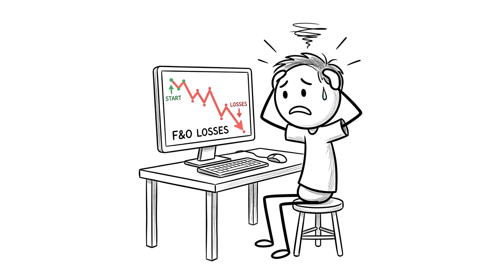
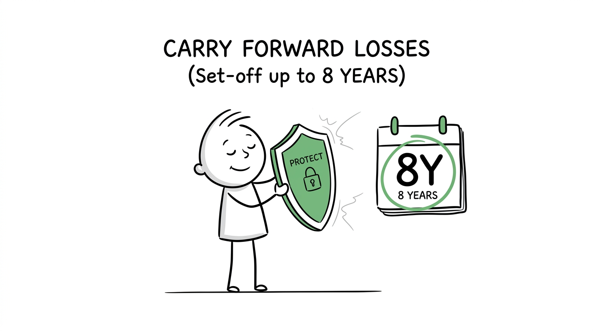

import NoticeTrap from '../../components/mdx/NoticeTrap.astro';
import CardPremium from '../../components/CardPremium.astro';

<CardPremium title="TL;DR: The F&O Salary Offset Trap" variant="warning">
- **The Core Issue:** Salaried professionals who lose money in F&O often try to illegally offset those losses against their salary income to reduce taxes.
- **The Mechanics:** Section 71 explicitly prohibits business losses (including F&O) from being set off against salary income. Your salary tax is calculated completely independently.
- **The Defense:** File ITR-3 on time to declare the F&O business loss. Offset it against rental or capital gains income in the current year, or carry it forward for up to 8 years to shield future business profits.
</CardPremium>

## 2. What is the regulation regarding this specific transaction?

The confusion stems from how the Income Tax Department categorizes trading. They do not view it as "investing." 

### Rule 1: The "Non-Speculative Business" Classification
Under Section 43(5), derivatives (Futures & Options) trading on recognized stock exchanges is legally defined as a **Non-Speculative Business**. 
Because it is a business, any loss you incur is a "Business Loss."

### Rule 2: The Firewall between Business and Salary (Section 71)
Section 71 details the rules for "Set-off of losses across different heads of income."
The law explicitly states that losses under the head "Profits and Gains of Business or Profession" **cannot** be set off against income under the head "Salaries." 
There is a hard firewall between the two. Your salary tax is calculated completely independently of your trading disaster.

### Rule 3: The 8-Year Carry Forward Lifeline
If you cannot offset the loss this year, you are allowed to carry it forward to the next financial year. You can carry forward F&O losses for up to **8 subsequent assessment years**. However, in future years, this carried-forward loss can *only* be offset against Business Income (not Capital Gains or House Property).

## 3. How can I minimize my risk of non-compliance? (Notice Traps)

When desperate traders try to hide or manipulate their losses, the Central Processing Centre (CPC) strikes.

<NoticeTrap title="Trap 1: Hiding the Loss to Avoid Tax Audit">

**Scrutiny Trigger:** You lost ₹10 Lakhs, but you decide not to report it in your ITR because you fear a complex tax audit.

**Resolution Strategy:** Every single F&O trade you execute is reported to the IT department via your broker's SFT (Statement of Financial Transactions). The CPC's AI knows exactly how much you lost. If your AIS shows massive turnover but your ITR-2 shows zero business income/loss, you will receive a Section 143(1) mismatch notice. You must file **ITR-3** and declare the loss.

</NoticeTrap>

<NoticeTrap title="Trap 2: Failing to File Before July 31st">

**Scrutiny Trigger:** You file a belated return in September and try to carry forward your ₹5 Lakh F&O loss to next year.

**Resolution Strategy:** Section 80 dictates that you **lose the right to carry forward any business loss** if you file your return after the Section 139(1) due date (usually July 31st). Even if you have zero tax liability because of the loss, you must file on time, otherwise, that loss evaporates legally.

</NoticeTrap>

## 4. How can I save money? (The Offset Loopholes)

You can't touch your salary, but you can still use that ₹5 Lakh loss to shield other income sources *in the same financial year*.

### Loophole A: Offsetting against Rental Income
While you can't touch salary, Section 71 allows you to offset current year F&O business losses against **Income from House Property**. If you earn ₹6 Lakhs a year in rent, you can wipe out that rental income entirely using your F&O loss, paying zero tax on the rent.

### Loophole B: Offsetting against Capital Gains (Intraday vs F&O)

Current year F&O losses (Non-Speculative) can be set off against both Short Term Capital Gains (STCG) and Long Term Capital Gains (LTCG) from the sale of shares or mutual funds. 
*Note:* This only applies to the *current* year's loss. Once carried forward to next year, it can only offset business income for up to 8 years.

### Loophole C: Offsetting against Freelance Income
Because freelance income is also classified as "Business/Profession" income, you can directly deduct your F&O losses from your freelance consulting profits.

## 5. The Margin Call (Trading Edge Cases)

Make sure you aren't confusing different types of trading, as the tax rules change violently.

### Edge Case 1: Intraday Equity Trading is "Speculative"
If you incurred the ₹5 Lakh loss by buying and selling Reliance shares on the same day (Intraday Equity), the IT department classifies this as a **Speculative Business**. 
- Speculative losses **cannot** be offset against F&O profits, capital gains, or rental income. They can *only* be offset against other Speculative profits. 
- They can only be carried forward for **4 years**, not 8.

### Edge Case 2: Expense Deductions (Internet & Brokerage)
Since F&O is a business, you are legally running a proprietary trading firm. You can deduct your broadband internet bill, your Zerodha/Groww brokerage charges, STT (Securities Transaction Tax), GST, and even a portion of your laptop depreciation from your profits. This legally increases your declared loss, giving you a larger shield for future years.

## 6. 💡 Key Takeaway Summary & Actionable Checklist

*   **Accept Reality:** You cannot reduce your salary TDS using F&O losses. Do not attempt to falsify your ITR-1.
*   **Switch to ITR-3:** You must file ITR-3 to declare F&O income/loss. ITR-1 or ITR-2 will be considered defective.
*   **File on Time:** If you miss the July 31st deadline, you permanently lose the right to carry forward the loss to next year.
*   **Offset Smartly:** In the current year, offset the loss against your Rental Income, STCG, or Freelance income before carrying the remainder forward.
*   **Claim Expenses:** Download your broker's Tax P&L statement and explicitly claim STT and brokerage charges as business expenses.
