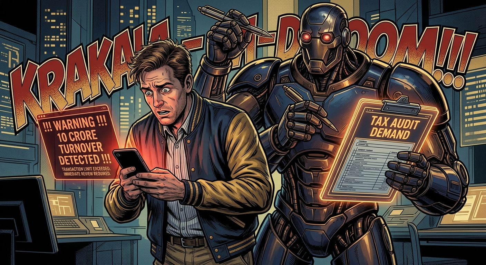
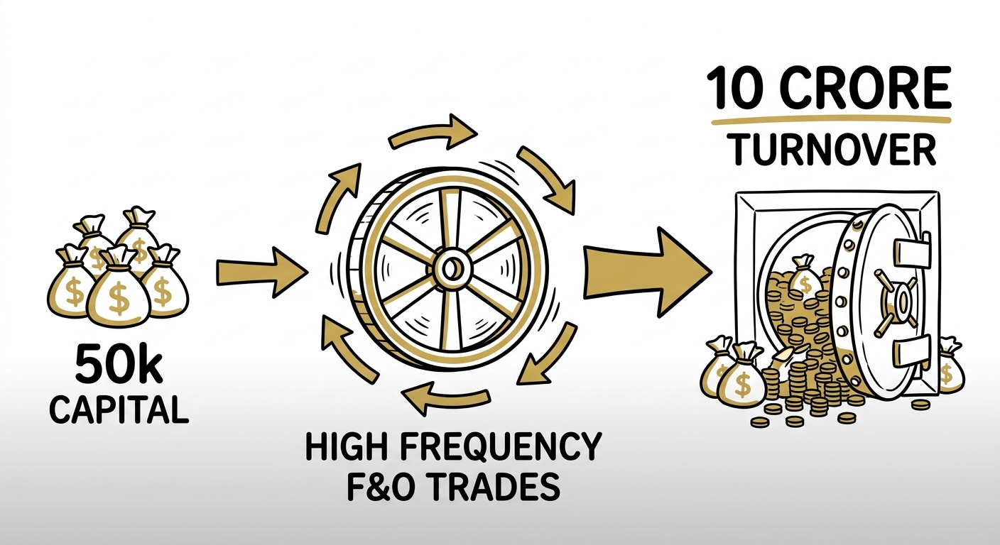

import FOAuditTrigger from '../../components/Calculators/FOAuditTrigger.astro';
import NoticeTrap from '../../components/mdx/NoticeTrap.astro';
import CardPremium from '../../components/CardPremium.astro';

## The Psychology of the Trap: The ITR-2 Panic

It begins with a quiet sense of panic. You are a 28-year-old software engineer earning a ₹25 Lakh salary. Throughout the year, you dabbled in Nifty options on your phone. You didn't make much—maybe you lost ₹40,000 overall. 

When July arrives, you log into the Income Tax portal and file your standard ITR-2, reporting your salary and your mutual fund gains. You deliberately ignore the F&O losses because, well, it was just a hobby. You didn't make any money, so there's nothing to tax, right?

Two weeks later, the email arrives. **Subject: Notice under Section 139(9) for Defective Return.**

Your heart drops. The portal's algorithm has cross-referenced your PAN with the Annual Information Statement (AIS) fed by your broker. It sees massive trading volume. It rejects your ITR-2, informing you that you are operating a "Business" and must file ITR-3. Worse, it warns that your turnover has breached the statutory limit, making a formal Chartered Accountant Tax Audit mandatory.

You stare at the screen. *"I only had 50,000 rupees in my Zerodha account. How am I a 10 Crore corporation?"*

<CardPremium title="TL;DR: The F&O Turnover Trap" variant="warning">
- **The Core Issue:** Retail traders are often blind to the massive "Absolute Turnover" algorithmic trap in F&O, forcing them into corporate tax audits.
- **The Mechanics:** The tax portal calculates F&O turnover by summing all positive and negative trade differences. A small ₹50k account can easily breach the ₹10 Crore statutory audit limit. 
- **The Defense:** Monitor your absolute turnover strictly. When filing ITR-3, never claim indirect personal expenses (like rent or laptops) as the Assessing Officer will reject them. Only claim direct broker charges.
</CardPremium>

---

## The Mechanics: How 50k Becomes 10 Crores

To understand the algorithmic trap, we have to look at the 7 sequential steps that drag a retail trader into a corporate audit.

### 1. The Ignorant Initiation
Most salaried professionals view trading as an extension of investing. If you buy Reliance shares and sell them a month later, it's Short Term Capital Gains. Logically, you assume buying a Reliance Call Option is the same thing. It is not. Under **Section 43(5)**, derivatives are explicitly classified as a Business.

### 2. The Volume Explosion
Modern trading apps offer massive leverage (margins) and zero brokerage. Because it costs nothing to enter and exit a trade, you start trading 10, 20, or 50 times a day. You are "scalping" for tiny 10-point moves. Your capital is only ₹50,000, but your volume is exploding.

### 3. The AIS/TIS Pipeline
Every single time you hit the "Buy" or "Sell" button, your broker logs a transaction. At the end of the year, they bundle these millions of micro-transactions and beam them directly into the government's Annual Information Statement (AIS) server. The tax department sees every move you made in real-time.

### 4. The Algorithmic Trigger: Absolute Sum
Here is the fatal flaw in the system. When a Kirana store calculates turnover, they look at total sales. But for F&O, the **ICAI Guidance Note on Tax Audit** dictates that turnover is the **Absolute Sum** of all positive and negative differences.

If you buy a Nifty Call option and make a ₹1,000 profit, your turnover is ₹1,000.
If you buy another and make a ₹1,500 *loss*, your turnover increases by another ₹1,500.
**Total Turnover = ₹2,500 (even though your net PnL is -₹500).**

When you apply this math to 20 trades a day for 200 trading days, your ₹50,000 account easily breaches the massive ₹10 Crore threshold.

### 5. The Audit Mandate (Section 44AB)
The moment your absolute turnover crosses ₹10 Crores, the algorithm flags you. You are no longer an individual in the eyes of the machine; you are a large-scale enterprise. Under Section 44AB, you are legally required to hire a CA, maintain statutory books of account, and submit a Form 3CB-3CD Audit Report.

<FOAuditTrigger />

### 6. The Desperate Offset
Now you are panicking. You are forced to pay a CA ₹15,000 to audit your ₹40,000 loss. To soften the blow, you decide to play the business game. You tell your CA: *"Fine, if I'm a business, I want to claim my ₹40,000 monthly apartment rent, my ₹1.5 Lakh MacBook, and my internet bills as business expenses to lower my salary tax!"*

### 7. The Disallowance (The Final Blow)
Months later, your file is pulled for human scrutiny. The Assessing Officer (AO) looks at your ₹25 Lakh IT salary and your massive F&O volume. You argue that your apartment is your "trading office." 

The AO invokes **Section 37(1)**, which states expenses must be incurred *'wholly and exclusively'* for the business. They look at you and say: *"You are a full-time employee. You trade on your phone during your lunch break. This is a hobby, not a commercial enterprise. Your rent and laptop are personal expenses."*

The AO disallows your expenses, slaps you with a penalty for misreporting, and demands back taxes. 

**The Trap is complete.** The algorithm punished you for being a corporation, and the human punished you for being a hobbyist.

<NoticeTrap title="The Speculative Intraday Edge-Case">
This article focuses on F&O (Derivatives, Currency, Commodity), which is classified as *Non-Speculative*. However, if you trade **Intraday Equity** (buying and selling shares on the cash market on the same day), the law treats it as *Speculative Business Income*. Speculative losses are toxic—they can ONLY be offset against speculative profits, and they expire in just 4 years instead of 8. We will cover this devastating trap in a separate dedicated guide.
</NoticeTrap>

---

## The Holy Grail: Carrying Forward F&O Losses

Since F&O is Non-Speculative Business Income, you hold a massive, golden tax advantage: **You can carry forward F&O losses for up to 8 subsequent assessment years.**

If you lost ₹5 Lakhs this year, you can hold that loss like a shield. If you start a successful consulting business three years from now and make ₹5 Lakhs in profit, you can use your old F&O loss to completely wipe out the tax on that profit!

But to successfully execute this carry-forward without inviting AO scrutiny, you must follow strict mechanics:

1. **The Salary Firewall (Section 71):** You can offset F&O losses against freelance income, rental income, or capital gains in the current year. But you **ABSOLUTELY CANNOT** offset them against your Salary income. The law explicitly forbids this.
2. **The July 31st Deadline:** You must file ITR-3 before the July 31st deadline (or Oct 31st if audited). A single day late permanently destroys the carry-forward. Your loss is vaporized.
3. **Future Offsets:** In subsequent years (Years 2 through 8), the carried-forward loss can *only* be offset against other business income, nothing else.

## The Delta: Safe vs Trapped

What separates the trader who successfully carries forward their losses from the one who ends up paying severe penalties?

**The Trapped Trader** is aggressive and ignorant. They trade relentlessly, crossing the ₹10 Crore absolute threshold without realizing it. When forced to file ITR-3, they try to "game" the system by claiming 50% of their home rent and their new iPhone as business expenses to offset their high salary. The Assessing Officer entirely disallows these indirect expenses, demands back taxes, and slaps a penalty for failing to maintain statutory cash books.

**The Safe Trader** understands the algorithmic game. They monitor their "Absolute Turnover" monthly and purposefully slow down or stop trading as they approach ₹9 Crores to avoid the statutory audit entirely. When filing ITR-3, they exhibit extreme discipline—claiming **only direct, verifiable expenses** like Brokerage, STT, and Exchange Transaction Charges. Because their claims exactly match the broker's ledger, the return processes smoothly with zero human scrutiny, securing their 8-year loss carry-forward shield.

---

## 360° Coverage: The Forgotten Off-Grid Traps

The main narrative covers the primary algorithmic trap, but the Income Tax Act holds secondary snares that catch traders off-guard. 

### The Section 71B House Property Collision
A common desperation move: A trader realizes they cannot offset F&O losses against salary. However, they own a second home that is vacant, paying heavy EMIs. They attempt to show a massive loss under "Income from House Property" (due to interest payments) and offset *that* against their salary, while parking their F&O loss for the future. **The Trap:** If your F&O returns are scrutinized, the AO may examine your entire ITR-3, demanding proof of municipal taxes and strict valuation for the vacant property. The F&O audit acts as a Trojan Horse that opens up your real estate portfolio to brutal scrutiny.

### The Delayed Return Vaporization (Section 80)
If you file your ITR-3 on August 1st instead of July 31st, you only face a ₹5,000 late fee under Section 234F. Many traders willingly pay this. **The Trap:** Under Section 80 of the IT Act, a loss cannot be carried forward if the return is filed after the due date. Paying the ₹5,000 late fee does not save you. A single day's delay legally vaporizes your entire F&O loss. The shield is permanently destroyed.

### The "Spouse's Demat" Anti-Avoidance Boomerang
To avoid crossing the ₹10 Crore turnover limit, a trader opens a Zerodha account in their non-working spouse's name and splits their trades. **The Trap:** Under the Clubbing of Income provisions (Section 64), if you transfer capital to your spouse to trade, the resulting income (or loss) is clubbed back into *your* hands. If the algorithm catches the PAN linkage, both accounts are merged for the turnover calculation, instantly breaching the ₹10 Crore limit and resulting in a Section 271AAC penalty for tax evasion.

---

## Key Takeaways: The Zero-Defect Execution Protocol

To survive the F&O tax regime, you must abandon the mindset of a hobbyist and operate with the strict compliance of a corporate treasurer.

1. **Acknowledge Your Corporate Status:** The moment you trade a single derivative contract, you are legally a Business. Stop filing ITR-2. You must file ITR-3.
2. **Track Absolute Turnover, Not PnL:** Your actual profit/loss is irrelevant to the algorithm. The sum of all your trade differences dictates your audit threshold. If you are nearing ₹10 Crores, stop trading. 
3. **Never Claim Indirect Expenses:** Do not claim rent, internet, or depreciation on laptops to reduce your tax burden. The Assessing Officer will reject them because you are a full-time employee. Only claim direct charges (Brokerage, STT, GST) that perfectly match your broker's tax PnL statement.
4. **File Before July 31st:** Your right to carry forward losses for 8 years is contingent on filing on time. A late return instantly vaporizes your losses.
5. **The Salary Firewall:** Never attempt to offset F&O losses against your salary income. The portal will reject the return immediately.
