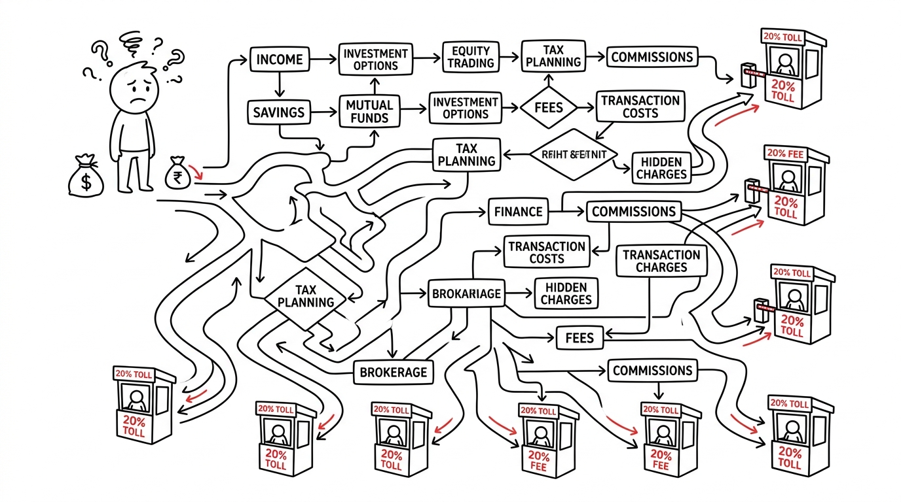
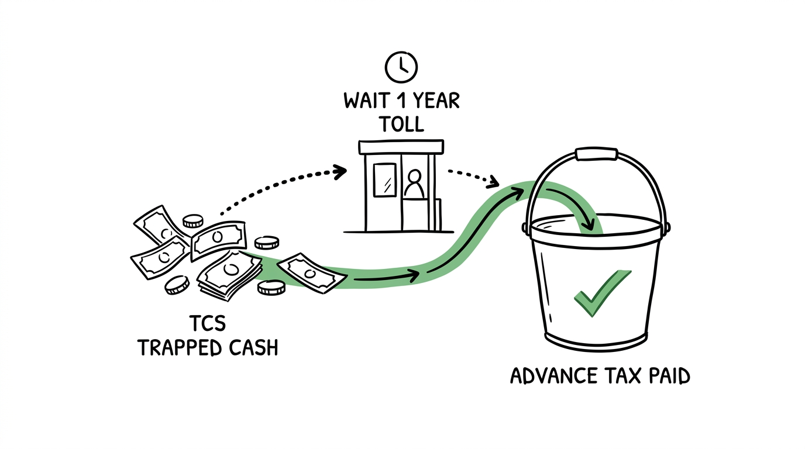

import NoticeTrap from '../../components/mdx/NoticeTrap.astro';

## 1. Executive Summary: The Scenario Matrix

Under the Liberalised Remittance Scheme (LRS), you can send up to $250,000 abroad per year. However, the government realized this was being used to quietly park untaxed wealth offshore. Their solution? Section 206C(1G)—a mandatory Tax Collected at Source (TCS) on foreign remittances.

The law is highly fragmented. The amount of tax intercepted depends entirely on **Why** you are sending the money and **How** you sourced it. We will wargame the 4 primary scenarios below.

## 2. The Decision Tree (What is the Regulation?)

Every time you swipe a forex card, book an international tour, or wire money to a US brokerage account, you trigger one of these four operational parameters.

### Scenario A: The Vacation & Investments (The 20% Trap)
- **Purpose:** Buying US Stocks (Vested/INDmoney), booking a European tour package, or sending money to relatives.
- **The Rule:** You get an annual exemption of ₹7 Lakhs. The moment your total remittances for the financial year cross ₹7,00,000, your bank will automatically deduct a massive **20% TCS** on any amount above the threshold.
- **Example:** You wire ₹10 Lakhs to buy Apple stock. The first ₹7L is exempt. On the remaining ₹3L, the bank intercepts ₹60,000 (20%) and deposits it with the government. Only ₹9.4 Lakhs actually reaches your brokerage.

### Scenario B: Medical Treatment & Regular Education
- **Purpose:** Paying for a hospital bill abroad or paying tuition fees directly to a foreign university (using your own savings).
- **The Rule:** The ₹7 Lakh threshold applies. However, the penalty rate is significantly lower. Any amount above ₹7 Lakhs attracts only a **5% TCS**.

### Scenario C: Education Financed by an Education Loan
- **Purpose:** Paying foreign university tuition fees using money disbursed from an official Indian financial institution (Education Loan).
- **The Rule:** The ₹7 Lakh threshold applies. The rate drops to a negligible **0.5% TCS** on the amount above ₹7 Lakhs. The government does not want to heavily tax borrowed money meant for education.

## 3. How can I minimize my risk? (Notice Traps)

Do not try to bypass the banking system. The government has weaponized the banking infrastructure to act as their primary tax collectors.

<NoticeTrap title="Trap 1: The Credit Card Illusion">

**Scrutiny Trigger:** You think you can avoid the 20% TCS by swiping your international credit card while on vacation in Dubai, instead of loading a forex card before you leave.

**Resolution Strategy:** As of recent amendments, International Credit Card transactions while abroad have been brought under the LRS umbrella. The RBI has mandated credit card issuers to monitor the ₹7 Lakh limit across ALL your cards (linked by PAN). If you cross ₹7L on a swanky hotel bill in Dubai, your credit card statement the next month will carry a 20% TCS surcharge. Do not treat credit cards as invisible money.

</NoticeTrap>

<NoticeTrap title="Trap 2: Ignoring the 26AS Reconciliation">

**Scrutiny Trigger:** You assume the 20% TCS is a "fee" you lost forever and you fail to claim it in your ITR.

**Resolution Strategy:** TCS is NOT a fee. It is your own money, pre-paid as tax. The bank deposits it against your PAN. When you file your ITR, this TCS will sit in your Form 26AS as a massive tax credit. If your final tax liability is lower than the TCS deducted, the government will refund the excess directly into your bank account. If you don't file your ITR, the government keeps that 20% forever.

</NoticeTrap>

## 4. How can I save money? (Optimizing the Matrix)

The key to surviving LRS is liquidity management. Because the 20% is locked up with the government until you file your ITR and get a refund (which can take 6-12 months), you lose the opportunity cost of that capital. 

### The Advance Tax Offset Loophole
You do not have to wait a year to get your money back.
If you are a salaried employee or a freelancer who pays Advance Tax, you can legally use the trapped TCS to fund your current tax liabilities.

**The Strategy:**
1. In August, you incur a ₹1,00,000 TCS hit while booking a foreign tour.
2. In September, you calculate your Advance Tax liability for your business/salary, and find you owe the government ₹1,20,000.
3. Instead of paying ₹1.2L out of pocket, you instruct your CA to offset it. You only pay ₹20,000 in Advance Tax. 
4. **Result:** You just instantly reclaimed the ₹1,00,000 TCS without waiting for an ITR refund. You restored your cash flow immediately.

## 5. Customs & Border Checks (The 360° Edge Cases)

### Edge Case 1: The PAN Card Penalty
If you attempt a foreign remittance and you have not linked your Aadhaar to your PAN, or your PAN is somehow inoperative, Section 206CC kicks in. The bank is legally mandated to deduct TCS at **double the normal rate** (e.g., 40% instead of 20%). Never initiate an international wire transfer without verifying your PAN status on the Income Tax portal first.

### Edge Case 2: NRI Status (Non-Resident Indian)
The Liberalised Remittance Scheme (LRS) is exclusively for Resident Indians. If you are an NRI operating an NRO account, LRS does not apply to you. You can repatriate up to $1 Million USD per financial year from your NRO to your foreign account, subject to submitting Forms 15CA and 15CB (certified by a CA that taxes on the Indian money have been paid).

## 6. 💡 Key Takeaway Summary & Actionable Checklist

*   **Map your Purpose:** Determine if you fall into the 20% (Invest/Travel), 5% (Medical/Self-Edu), or 0.5% (Loan-Edu) bucket.
*   **Track the ₹7L Limit:** Keep a strict spreadsheet of all foreign card swipes, forex loads, and wire transfers. The ₹7L limit is aggregate across ALL banks under your PAN.
*   **Offset against Advance Tax:** Don't let your 20% TCS rot in the government's bank account. Adjust it against your quarterly advance tax payouts or your TDS declarations with your HR.
*   **Verify PAN Status:** Ensure your PAN is active to avoid the lethal 40% penalty rate.
