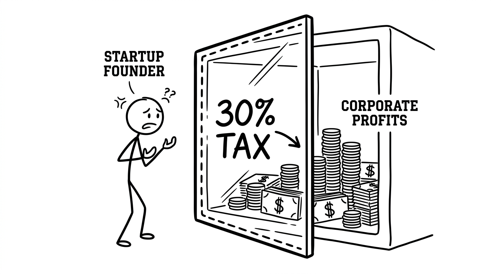
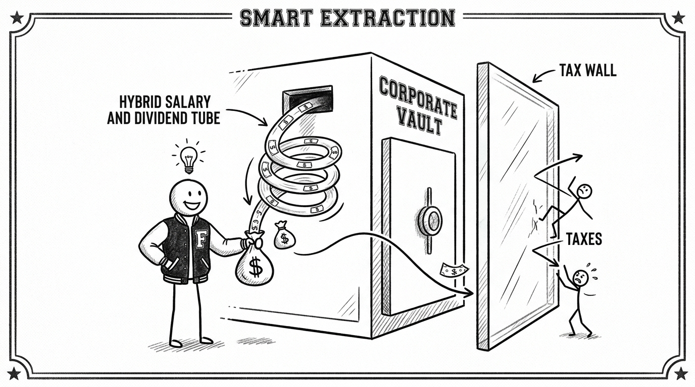

import NoticeTrap from '../../components/mdx/NoticeTrap.astro';
import CardPremium from '../../components/CardPremium.astro';

The money sitting in your corporate current account belongs to the company, not to you. If you simply transfer that capital across the firewall into your personal savings account without precision, you will bleed 30% to the government. This is the ultimate founder's war: wealth extraction. 

<CardPremium>
### The Varsity TL;DR
- **The Core Problem:** Moving profits from a Private Limited Company to your personal account triggers either high personal income tax (Salary) or brutal double taxation (Dividends).
- **The Zero-Tax Move:** Draw a salary strictly up to the New Regime threshold (₹12.75 Lakhs). The company claims the expense (saving 25% corporate tax), and you pay ₹0 personal tax.
- **The 44ADA Hack:** For higher extractions, bill your own company as a consultant under Section 194J, allowing you to use presumptive taxation (50% tax-free margin) while the company writes off 100% of the cost.
</CardPremium>

### Move 1: The Salary Strategy

Drawing a salary (remuneration) is the most direct way to pull cash out of your startup. 

**The Corporate Advantage:**
Salary is a deductible business expense. Every rupee you pay yourself reduces the company's taxable profit. If your company falls in the 25% corporate tax bracket, paying yourself ₹10 Lakhs saves the company ₹2.5 Lakhs in corporate tax.

**The Personal Disadvantage:**
That salary lands squarely in your personal income tax bracket. If you are a highly successful founder already sitting in the 30% bracket, extracting more cash via salary is violently inefficient. You are saving the company 25% only to pay 30% (plus surcharge and cess) on the personal front.

### Move 2: The Dividend Strategy

Dividends are a distribution of profits. You extract money not for the labor you provide, but as a reward for the equity you hold.

**The Corporate Disadvantage:**
Dividends are paid out of *post-tax* profits. The company cannot claim dividends as a business expense. If the company makes ₹100, it must first pay 25% corporate tax. Only the remaining ₹75 can be distributed as a dividend.

**The Personal Disadvantage:**
In 2020, the government abolished the Dividend Distribution Tax (DDT) and shifted the liability to the shareholder. Now, dividends are added to your personal income and taxed at your applicable slab rate. 

<NoticeTrap title="The Double Taxation Checkmate">
If you choose dividends, the money is taxed twice. First, the company pays a 25% corporate tax on the profit. Second, you pay up to 30% personal tax on the dividend received. This devastating combination can push the effective tax rate on extracted wealth past 45%.
</NoticeTrap>

### The Grandmaster's Synthesis (The Golden Ratio)

Rookie founders pick one or the other. Grandmasters use the slab system to run a hybrid attack.

If you have zero other income, you should draw a **Salary up to the New Regime threshold (₹12.75 Lakhs)**. 
Why? Because personal tax up to ₹12.75 Lakhs is effectively zero (thanks to Section 87A and the standard deduction). You extract ₹12.75 Lakhs from the company, you pay ₹0 personal tax, and the company claims a full ₹12.75 Lakh expense, saving ₹3.18 Lakhs in corporate tax. It is a flawless mathematical victory.

### The Scenario Matrix: Extracting ₹30 Lakhs

Let's look at the math if you want to pull ₹30 Lakhs from your corporate account.

| Strategy | Corporate Tax Saved | Personal Tax Paid (Approx) | Net Effectiveness |
| :--- | :--- | :--- | :--- |
| **All Dividend** | ₹0 | ₹3.5 Lakhs | Worst (Double Taxed) |
| **All Salary** | ₹7.5 Lakhs | ₹3.5 Lakhs | Average |
| **The 44ADA Hack** | ₹7.5 Lakhs | ₹0 (Up to ₹15L profit) | Grandmaster |

### The War Room (Strategic Edge Cases)

**"Can I extract cash as a Consultant (Professional Fees) instead of a Salary?"**
Yes. You can bill your own company for professional services under Section 194J. The massive advantage here is that you can file this income under the Presumptive Taxation Scheme (Section 44ADA). If you bill the company ₹30 Lakhs, you can declare a 50% presumptive profit, meaning you only pay personal tax on ₹15 Lakhs. Since ₹15 Lakhs is extremely tax-efficient under the New Regime, your personal tax is negligible. Meanwhile, the company still claims the full ₹30 Lakhs as an expense. It is one of the most powerful founder hacks in the code.

<NoticeTrap title="Deemed Dividend (The Section 2(22)(e) Ambush)">
Thinking of just taking a 'loan' from your own company to avoid tax entirely? Under Section 2(22)(e), if a closely held company gives a loan to a founder holding more than 10% equity, the tax department classifies it as a 'Deemed Dividend' and taxes you on it immediately. Do not attempt this without elite-level structuring.
</NoticeTrap>

***

## The 100-Second Reel

**The Hook:** Your startup is finally profitable, but how do you get the money out of the corporate account without the government taking 30%?
**The Anxiety:** Taking cash out of a company triggers massive taxes. If you pay yourself a high salary, you hit the 30% personal tax slab. If you declare a dividend, the money gets taxed twice—once as corporate profit, and again on your personal returns. It's a lose-lose trap.
**The Pivot:** The grandmaster strategy is the Hybrid 44ADA approach. Instead of a salary, bill your company as a consultant. The company writes off the full amount as an expense, saving corporate tax. But you file under Presumptive Taxation (Section 44ADA), allowing you to claim a 50% profit margin and literally cut your personal taxable income in half!
**The Relief:** Stop bleeding capital to inefficiency. Master the mathematics of wealth extraction and keep the profits you fought so hard to build. Read our Founder’s Tax Strategy Guide today.
