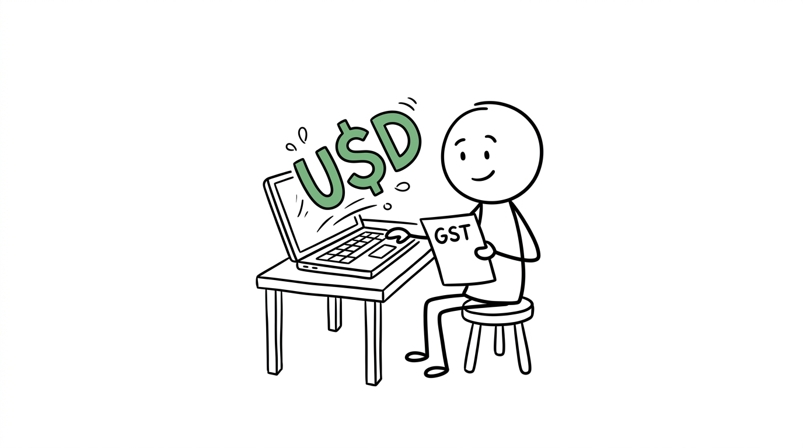
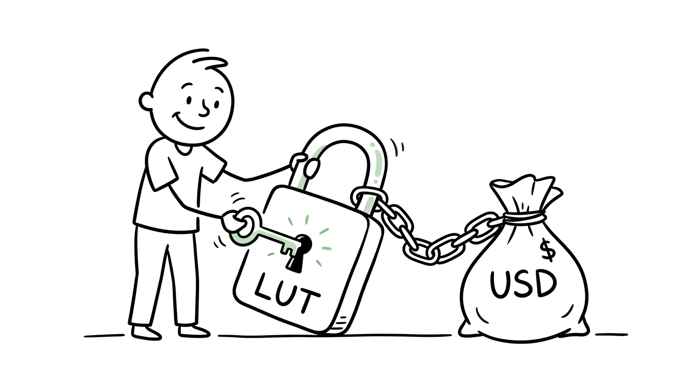

import NoticeTrap from '../../components/mdx/NoticeTrap.astro';
import CardPremium from '../../components/CardPremium.astro';

<CardPremium title="TL;DR: The Export GST Trap" variant="warning">
- **The Core Issue:** Freelancers wrongly assume earning in USD exempts them from Indian GST. If your global income exceeds ₹20 Lakhs, GST registration is mandatory.
- **The Mechanics:** Export of services is a "Zero-Rated Supply" (0% GST), but ONLY if you fulfill specific conditions like receiving funds in convertible foreign exchange and filing an LUT.
- **The Defense:** File a Letter of Undertaking (LUT) immediately to legally export at 0% GST. Obtain FIRCs from your payment gateway to prove the USD origin, and claim cash refunds for GST paid on business expenses.
</CardPremium>

## 2. What is the regulation regarding this specific transaction?

The GST law treats exporting a service identically to exporting physical goods. 

### Rule 1: Mandatory Registration Threshold (Section 22)
Under the CGST Act, the moment your "Aggregate Turnover" crosses ₹20 Lakhs in a financial year, you must obtain a GST Registration.
- **Critical Nuance:** Aggregate Turnover includes all your income streams combined. If you earn ₹15 Lakhs from a US client and ₹6 Lakhs from an Indian client, your turnover is ₹21 Lakhs. You are now liable for GST on the Indian portion, and mandatory reporting on the US portion.

### Rule 2: The "Zero-Rated Supply" Doctrine (Section 16 of IGST Act)
The Indian government *wants* you to bring foreign currency into the country. Therefore, they do not tax exports. Export of Services is a "Zero-Rated Supply." This means the GST rate applied to your invoice to a US client is literally 0%. You do not charge the US client 18% GST.

### Rule 3: The 4 Conditions for "Export of Service" (Section 2(6) IGST Act)
To qualify for this 0% rate, your work must satisfy all four legal conditions:
1. The supplier (You) is located in India.
2. The recipient (Client) is located outside India.
3. The place of supply is outside India.
4. **Crucial:** The payment must be received in **convertible foreign exchange** (USD, EUR, GBP) or in INR specifically permitted by the RBI (e.g., through an authorized Vostro account).

## 3. How can I minimize my risk of non-compliance? (Notice Traps)

Because foreign currency is involved, you aren't just dealing with the GST department; you are dealing with FEMA (Foreign Exchange Management Act) and the RBI.

<NoticeTrap title="Trap 1: Receiving USD via PayPal/Stripe as 'INR'">

**Scrutiny Trigger:** You bill a US client $2,000. PayPal automatically converts this to INR and deposits it into your local HDFC account. The GST officer audits you and demands 18% GST because the money hit your bank as INR.

**Resolution Strategy:** To prove to the GST officer that it was originally convertible foreign exchange, you MUST obtain a **FIRC (Foreign Inward Remittance Certificate)** or **FIRA (Foreign Inward Remittance Advice)** from your bank or payment gateway. Without a FIRC, the GST department will treat it as a domestic transaction and demand 18% tax + penalties.

</NoticeTrap>

<NoticeTrap title="Trap 2: Ignoring the LUT (Letter of Undertaking)">

**Scrutiny Trigger:** You cross the ₹20L threshold, register for GST, and start issuing 0% GST invoices to the US without filing an LUT.

**Resolution Strategy:** The law states you can only export without paying IGST if you file a Letter of Undertaking (LUT) *before* the financial year begins (in Form GST RFD-11). If you export without an active LUT, you are legally required to pay 18% IGST out of your own pocket first, and then apply for a lengthy refund process later. Always renew your LUT in March.

</NoticeTrap>

## 4. How can I save money? (The Loopholes)

The entire structure of "Zero-Rated Supply" is designed to save you money, but you have to execute the paperwork flawlessly.

### Loophole A: Input Tax Credit (ITC) Refunds
Because your output tax is 0%, but you are still a registered GST business, you are legally entitled to claim back the GST you pay on your business expenses.
- Bought a ₹1 Lakh MacBook for coding? You paid ₹18,000 in GST.
- Paid for AWS servers or SaaS subscriptions? You paid 18% GST.
Since you cannot offset this ITC against your 0% output liability, you can file a refund claim, and the government will literally deposit that ₹18,000 back into your bank account in cash.

### Loophole B: The Section 44ADA (Presumptive Taxation) Synergy
GST registration does not ruin your Income Tax benefits. You can be GST registered, legally export services at 0%, AND still file your income tax under Section 44ADA. This means you only declare 50% of your gross USD receipts as taxable profit, effectively shielding half your income from income tax while paying zero GST.

## 5. The Freelancer's Paranoia Checklist

Make sure you aren't falling into these obscure technicalities:

### Edge Case 1: The "Intermediary" Trap
Are you a software developer, or are you acting as an agent? If you connect a US client with Indian developers and take a commission, you are classified as an "Intermediary" under Section 2(13) of the IGST Act. 
- **The Catch:** Intermediary services **do not qualify** as Export of Services. Even if you are paid in USD, the place of supply is considered India, and you MUST charge 18% GST. 

### Edge Case 2: Invoicing in INR
Sometimes a foreign client prefers to pay in INR through a specialized RBI-approved mechanism. Can this still be an export?
- **The Catch:** Yes, but only if the payment is routed through a specific "Rupee Vostro Account" maintained by an authorized dealer bank, as per RBI guidelines. If your foreign client just does a standard NEFT from an Indian bank account they happen to hold, it instantly fails the Export condition and attracts 18% GST.

## 6. 💡 Key Takeaway Summary & Actionable Checklist

*   **Track your Turnover:** Monitor your total global receipts. The moment they approach ₹20 Lakhs in a financial year, apply for GST registration.
*   **File the LUT:** Immediately upon getting your GSTIN, file Form RFD-11 (Letter of Undertaking) on the GST portal to ensure you can export at 0%.
*   **Secure the FIRC:** Demand a Foreign Inward Remittance Certificate (FIRC) or Advice from PayPal, Stripe, Wise, or your bank for *every single transaction*. Store these safely.
*   **Update your Invoices:** Your invoices to foreign clients must explicitly state: *"Export of Services without payment of IGST under Letter of Undertaking (LUT) No. [Your LUT Number]"*.
*   **Claim your Refunds:** File your GSTR-1 and GSTR-3B on time, and periodically file for ITC refunds for the GST paid on your laptops, software, and internet bills.
