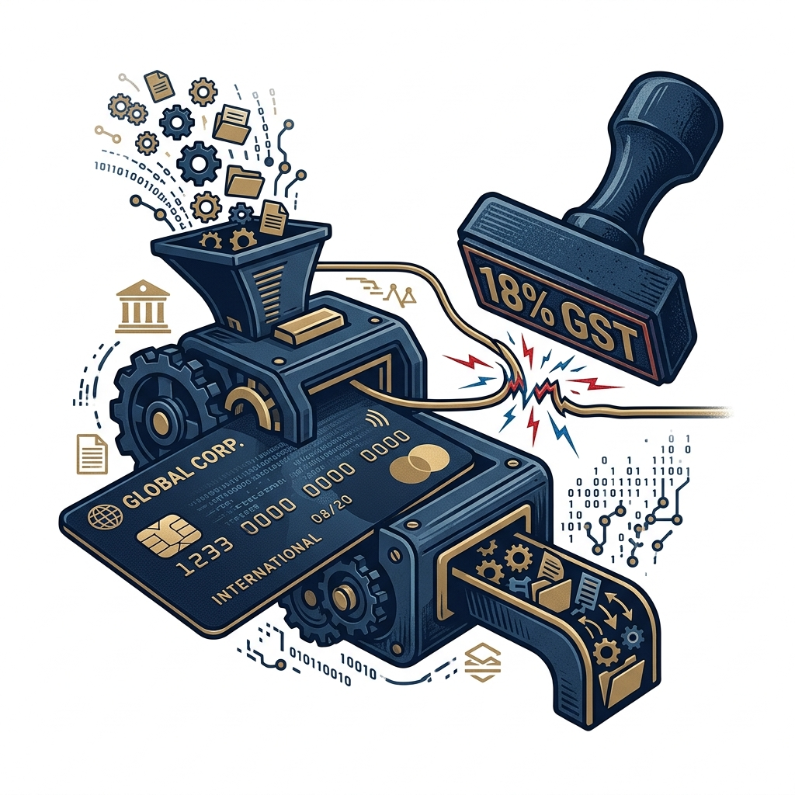

import CardPremium from '../../components/CardPremium.astro';
import HeroRCMForeignSaaS from '../../components/illustrations/HeroRCMForeignSaaS.astro';
import InsetRCMThisMonth from '../../components/illustrations/InsetRCMThisMonth.astro';
import InsetRCMLateDiscovery from '../../components/illustrations/InsetRCMLateDiscovery.astro';
import InsetRCMMonthlyCheck from '../../components/illustrations/InsetRCMMonthlyCheck.astro';
import DecisionTreeRCM from '../../components/illustrations/DecisionTreeRCM.astro';

## 1. You paid the tool. You may not have paid Indian GST.

You check the monthly corporate card statement. There's a ₹4,000 charge for Notion, a ₹16,000 bill for AWS servers, and a ₹40,000 payout to a developer you hired on Upwork. Your accountant books it all neatly under "IT expenses" and closes the books. 

Years later, a notice arrives from the GST department demanding unpaid tax on those exact transactions. 

You look at the notice in disbelief. You already paid the vendor. You have the invoices. Why is the government calling this "unpaid tax"?

The reality is that while you cleared your commercial debt with the vendor, you completely missed the Indian GST obligation attached to that service. 

<HeroRCMForeignSaaS />

<CardPremium>
### TL;DR: The RCM Trap on Foreign Spends

1. **Two different payments:** Money to Zoom/AWS/a freelancer ≠ money to the **GST department** for that service.
2. **When it’s on you:** Foreign supplier + business use in India + no Indian GST on the invoice → you often **self-calculate 18% IGST** (reverse charge).
3. **If you do it this month:** Pay that IGST in cash, claim the same amount as credit if allowed → **net cash often ≈ ₹0**.
4. **If you discover it years later:** Tax + interest; credit may no longer be available → **net cash can hurt**.
</CardPremium>

## 2. Why India asks you to self-pay on some foreign services

To understand why this trap exists, we have to look at the original bargain of taxation. 

In a normal transaction (a **Non-RCM** or **Forward Charge**), the government delegates tax collection to the seller. When you buy software from an Indian company like Zoho, they add 18% GST to your invoice. You pay Zoho, and Zoho passes that 18% to the government. It is seamless because the Indian government has legal jurisdiction over Zoho to enforce it.

But what happens when you buy software from an American company like Zoom? The Indian government has no legal jurisdiction to force a US-based company to act as an unpaid tax collector for India. 

If foreign companies didn't have to charge 18% GST, Indian businesses would simply buy all their software and services from abroad to save 18% on their budgets. Local Indian software companies would be decimated by this unfair price advantage. 

To fix this loophole and level the playing field, the government created the **Reverse Charge Mechanism (RCM)**. They "reversed" the collection duty. The law essentially says: *"Since we cannot catch the foreign seller, we are passing the responsibility to you, the Indian buyer. You must pretend you are the seller, charge yourself the 18% tax, and pay it directly to us."*

| Path | Who collects GST? | Your job |
|------|-------------------|----------|
| **Indian vendor** (e.g., Zoho with GSTIN) | Vendor charges GST on invoice | Pay invoice (incl. GST) → claim ITC |
| **Foreign vendor**, **no** Indian GST on invoice | Nobody overseas collects **IGST** for you | **You** self-assess IGST under **RCM**, pay in cash ledger, then claim ITC if allowed |

## 3. A simple way to know if this applies to you

Not every foreign transaction triggers this mechanism. Rather than diving into complex legal statutes, you can run your purchases through a very simple decision flow. 

If the supplier is outside India, and the service is being used for your GST-registered business, you must check the invoice. If the invoice lacks Indian GST, the baton has been passed to you.

<DecisionTreeRCM />

## 4. “I gave them my GST number—so I’m done” (you’re not)

A massive point of confusion stems from how global tech platforms—think AWS, Meta, or Google Workspace—handle Indian taxes. 

If you just sign up with an email address, these platforms treat you as a regular consumer. Under special digital service rules, they will often charge you 18% GST directly. 

However, the moment you log into your billing dashboard and input your company's GSTIN, the platform will immediately drop the GST from your next invoice. Many founders see this and celebrate, assuming their software is now tax-free. 

It isn't. By providing your GSTIN, you are signaling to the vendor that you are a registered B2B business and will handle the GST compliance on your end. Giving them your GSTIN successfully stops the vendor from charging GST, but it simultaneously activates your legal duty to pay the reverse charge. Leaving the job half-done is exactly how notices are born.

## 5. The money: on-time vs years late

The most painful part of this trap is how timing violently alters the math. Reverse charge is designed as an administrative compliance step with a neutral cash impact—not as an extra 18% penalty. That holds true, but only if you do it on time.

Imagine you spend ₹10,00,000 on foreign business services over a year. If you catch this immediately, you calculate the 18% (₹1,80,000) and report it in your monthly GST return. You pay the ₹1,80,000 from your cash ledger, and then instantly claim a matching input credit in that exact same return. Your net cash impact is effectively zero.

<InsetRCMThisMonth />

The nightmare scenario unfolds when you miss it. Three years later, the GST department runs an automated data-match between your bank's foreign exchange outflows and your filed GST returns. They spot the ₹10 Lakhs in undeclared foreign services and issue a demand notice. 

You are forced to pay the ₹1,80,000 tax, plus three years of heavy compounding interest. But the fatal blow is the input credit. Because the legal time window to claim credit for that old financial year has permanently closed, you cannot claim the ₹1,80,000 back. What the law intended to be a neutral accounting entry has now mutated into a pure, unrecoverable cash loss.

<InsetRCMLateDiscovery />

*(Important note: Reverse charge liabilities must always be paid from your electronic cash ledger. You cannot barter your existing, unused credit balances to pay off an RCM debt).*

## 6. Where teams actually miss it

If the logic is straightforward, why do so many sophisticated companies fail audits? The breakdown almost always happens in operations, not tax strategy.

The most common failure point is the "corporate card dump." Accountants often receive a credit card statement at the end of the month and simply book the entire aggregated amount as a single line-item expense. Nobody takes the time to open the individual Notion, Figma, or Zoom invoices to verify whether an Indian GSTIN was applied by the merchant.

Another massive blindspot is the freelance economy. Hiring a developer in Ukraine on Upwork, or a designer in the UK on Fiverr, is legally classified as an import of a service. Many founders mistakenly believe that reverse charge only applies to massive tech subscriptions, completely ignoring the individuals they hire for gig work. 

Finally, it is crucial to recognize that even an on-time reverse charge is not a free pass for everyone. If your business is fundamentally ineligible for full input credits—such as banks, certain healthcare providers, or businesses dealing in exempt goods—that 18% reverse charge becomes a real, sunk cost to your bottom line, making the initial SaaS subscription much more expensive than advertised.

## 7. A monthly habit that fixes most of this

The ultimate defense against an RCM notice isn't hiring an expensive tax consultant to argue revenue neutrality years down the line. The solution is a strict, unyielding accounts payable habit executed every single month.

<InsetRCMMonthlyCheck />

Before your team files the monthly GST return, they must isolate every foreign currency payment made via credit cards or bank transfers. Each corresponding invoice must be opened and checked. If the vendor charged Indian GST, it flows through normally. If they didn't, the team must manually calculate the 18% and add it to the reverse-charge liability line, claiming the credit simultaneously. 

By building this simple filter into your monthly close process, you ensure that personal subscriptions never mix with company cards, unregistered buyers are handled correctly, and your annual returns perfectly match your monthly reality—keeping the taxman far away from your foreign SaaS stack.
