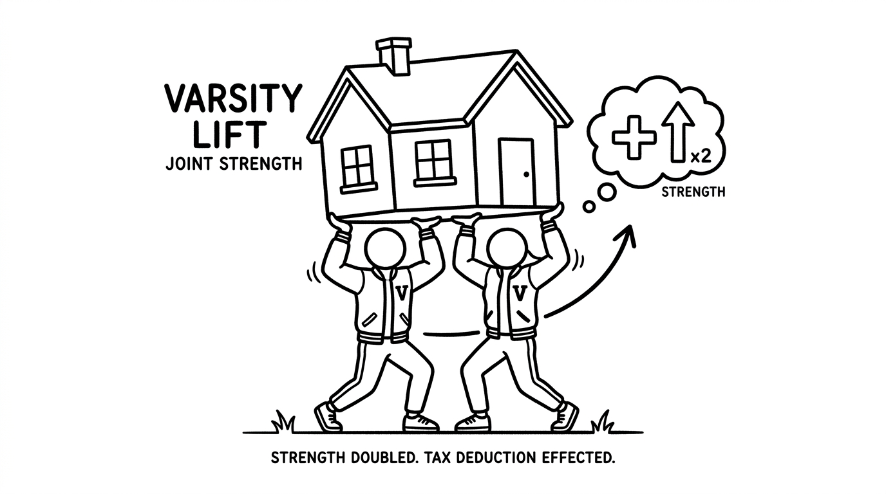

import NoticeTrap from '../../components/mdx/NoticeTrap.astro';
import CardPremium from '../../components/CardPremium.astro';
import TaxWorkbench from '../../components/mdx/TaxWorkbench.astro';

The bank manager hands you the EMI schedule for your ₹1 Crore loan and proudly points to the massive tax savings. The brochure promises that under Section 24(b), the government is subsidizing your debt. What they don't tell you is that the math died a decade ago, and you are stepping into a massive financial illusion.

<CardPremium>
### TL;DR
- **The Stagnant Cap:** The maximum home loan interest deduction under Section 24(b) for a self-occupied property is permanently capped at ₹2 Lakhs per year.
- **The Mathematical Reality:** On a ₹90 Lakh loan at 8.5%, you pay ₹7.6 Lakhs in interest in Year 1. The government lets you deduct ₹2 Lakhs. The remaining ₹5.6 Lakhs vanishes with zero tax benefit.
- **The Survival Move:** Never take a massive loan alone. Always co-borrow with an earning spouse to double your shield to ₹4 Lakhs.
- **The Final Blow:** The New Tax Regime abolishes this deduction entirely for self-occupied properties. 
</CardPremium>

## 1. The 2014 Betrayal

To understand why the home loan tax shield feels so inadequate today, you have to ask a simple question: *Why is the limit exactly ₹2,00,000?*

Rewind to the Union Budget of 2014. The then Finance Minister, Arun Jaitley, stood in parliament and generously increased the Section 24(b) limit from ₹1.5 Lakhs to ₹2 Lakhs. The entire middle class rejoiced. 

But look at the macroeconomic context of 2014. In most metro suburbs, a decent 2BHK apartment cost around ₹40 Lakhs. If you put down a 20% downpayment, you took a home loan of ₹32 Lakhs. At the prevailing interest rates of the time (around 9%), your total interest payout in the first year was roughly ₹2.8 Lakhs. 
By offering a ₹2 Lakh deduction, the government was effectively shielding **70% to 80%** of your entire interest burden. 

The law was designed to heavily subsidize middle-class homeownership. It was a fair deal.

### The Great Stagnation

Fast forward to today. The real estate market has exploded. That same 2BHK now costs ₹1.2 Crores. 
You are forced to take a ₹90 Lakh loan. At an 8.5% interest rate, the interest component of your EMI in the first year is a staggering **₹7.6 Lakhs**.

But the Section 24(b) limit hasn't moved a single rupee since 2014. It is still ₹2 Lakhs.
Today, the government is only shielding **26%** of your interest burden. The remaining ₹5.6 Lakhs that you pay to the bank vanishes into the void. You get absolutely zero tax benefit for it. 

The math crumbled because asset prices hyper-inflated while the tax code stagnated.

## 2. The Scenario Matrix: Single vs Joint Borrowing

When the frontal assault fails, you have to split the line. The law views taxpayers as distinct legal entities. A husband and wife are two separate PAN cards, two separate files in the government's server. 

If you are married and your spouse is also earning a taxable salary, you must **never** take a home loan as a single applicant.

| Scenario (₹7.6L Interest) | Applicant 1 Claim | Applicant 2 Claim | Wasted Interest | Effective Tax Shield |
| :--- | :--- | :--- | :--- | :--- |
| **Single Borrower** | ₹2,00,000 | ₹0 | ₹5,60,000 | ₹60,000 (at 30% slab) |
| **Co-Borrower Strategy** | ₹2,00,000 | ₹2,00,000 | ₹3,60,000 | ₹1,20,000 (at 30% slab)|

**The Strategy:**
Buy the property jointly (co-owners in the registry) and take the home loan as co-borrowers. 
The ₹2 Lakh limit under Section 24(b) applies *per taxpayer*, not per property. You just doubled your tax shield to ₹4 Lakhs simply by adding a name to the registry and structuring the EMIs correctly.

<TaxWorkbench 
  defaultSalary={1800000} 
  defaultDeductions={200000} 
  instruction="Simulate the difference. Notice how under the Old Regime, entering ₹2,00,000 in Deductions only moves the needle slightly against the massive interest you actually pay to the bank."
/>

## 3. How Can I Minimize My Risk? (Notice Traps)

The tax department is well aware that people try to manipulate this limit. They have laid specific traps for the unwary.

<NoticeTrap title="Trap 1: The Pre-Construction Paradox">

**Scrutiny Trigger:** You buy an under-construction flat in 2023. You start paying pre-EMI interest to the bank immediately. You claim a ₹2 Lakh deduction in your 2023 ITR.

**Resolution Strategy:** The tax algorithm will instantly reject your claim. Under Section 24(b), you cannot claim a single rupee of deduction until you receive the actual **Completion Certificate / Possession**. The government refuses to subsidize speculative under-construction investments; they only subsidize homes you can actually live in. The interest you pay during those 3-4 years of construction is pooled together, and you can only claim it in 5 equal installments *after* you get the keys—and yes, those installments are still subject to the overall ₹2 Lakh annual limit!

</NoticeTrap>

<NoticeTrap title="Trap 2: Co-Borrower EMI Mismatch">

**Scrutiny Trigger:** You and your spouse take a joint loan. You both claim ₹2 Lakhs. However, 100% of the EMI is deducted from your personal bank account. Your spouse doesn't contribute.

**Resolution Strategy:** During an audit, the officer will demand your bank statements. To claim the deduction, a co-borrower must actually pay their share of the EMI. If your spouse doesn't pay, they cannot claim the tax benefit, even if they are a 50% owner of the house. You must set up a joint bank account, fund it proportionally, and let the bank auto-debit from there.

</NoticeTrap>

## 4. The Final Betrayal: The New Tax Regime Shift

If the stagnant ₹2 Lakh limit wasn't bad enough, the ultimate gut punch to the home loan dream is the New Tax Regime.

To understand why, you have to look at the government's shifting economic philosophy. For 30 years, the government used "Deductions" (like 80C and 24b) to force the middle class to save money and buy assets. Today, the government wants to boost the economy through *consumption*, not savings. 

They are aggressively pushing taxpayers into the New Regime by offering lower slab rates and a massive ₹12.75 Lakh tax-free threshold. But the cost of entering the New Regime is surrendering all your deductions.

**Under the New Tax Regime, the Section 24(b) deduction for self-occupied properties is completely abolished.**

If you take a ₹1 Crore home loan today, you are caught in a brutal crossfire. 
- You either stay in the Old Regime to claim the ₹2 Lakhs (but pay higher slab rates on the rest of your salary).
- Or you move to the New Regime, get lower slab rates, but get absolutely zero tax benefit for paying ₹8 Lakhs in bank interest.

The math doesn't lie. A home loan is no longer a magical tax-saving instrument; it is purely a leveraged real estate play. Adjust your survival strategy accordingly.

## 5. 💡 Key Takeaway Summary & Actionable Checklist

*   **Run the Regime Math:** Before applying for a loan, calculate if the ₹2 Lakh deduction in the Old Regime actually beats the lower tax slabs of the New Regime for your specific salary.
*   **Always Co-Borrow:** If married and both are earning, mandate a 50-50 joint ownership and co-borrower structure with the bank.
*   **Open a Joint Account:** Fund the EMI proportionally from a joint account to leave a bulletproof paper trail for the auditor.
*   **Track Pre-EMI Interest:** If buying under-construction, maintain an Excel sheet of every rupee of interest paid. You will need this exact figure to claim your 1/5th deduction in the year of possession.
