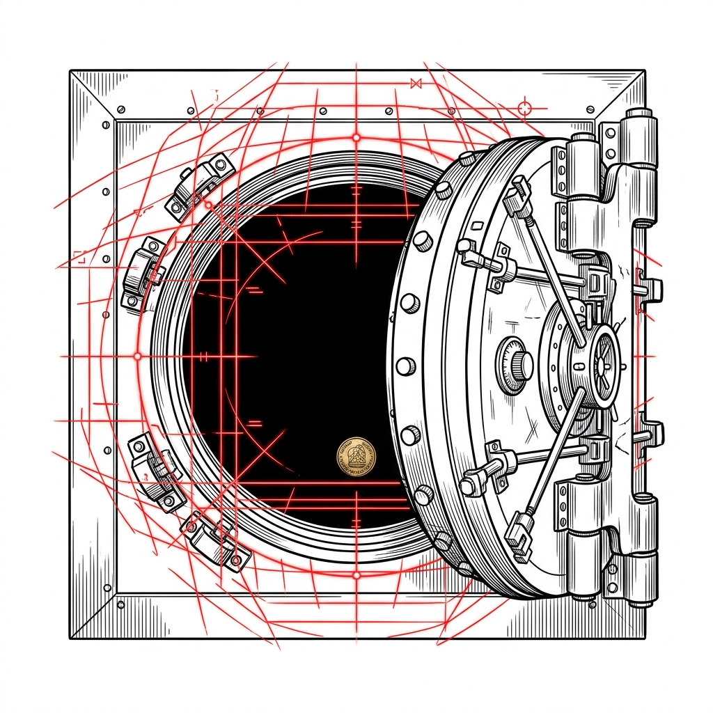

import CardPremium from '../../components/CardPremium.astro';

For decades, families have treated the Hindu Undivided Family (HUF) as a convenient, flexible financial vehicle. But when the time comes to split assets and go separate ways, a simple handshake or a notarized piece of stamp paper is often assumed to be the end of the story. It is not. The moment you stop filing your HUF tax returns without securing a formal legal dissolution from the Income Tax Department, you step on a hidden tax landmine that can detonate years later.

{/* ILLUSTRATION PLACEHOLDER: A pure, solid white background. A minimalist editorial illustration, technical blueprint aesthetic. A large, complex bank vault (confident black ink) representing the rigid legal structure, encircled by red scanning grids and targeting marks representing the tax system's scrutiny. Inside or next to it, a small embossed coin (warm metallic brass/gold). No gradients or soft shading. Elegant, restrained, magazine-spread aspect ratio. */}

<CardPremium title="TL;DR: The Phantom Entity Trap">
- **Mutual agreements mean nothing to the tax department:** A verbal split or an unregistered family agreement does not legally dissolve an HUF for tax purposes.
- **The fiction of continuity:** Under Section 171 of the Income Tax Act, an HUF is permanently deemed undivided until an Assessing Officer (AO) passes a formal dissolution order.
- **The penalty of informality:** Dispersing assets without this order triggers joint liability, where the entire distributed income is taxed again, often leading to massive penalties and compounding interest.
- **The self-acquired property trap:** Even with a perfect partition, if the Karta originally funded the HUF with self-acquired money, income generated by the spouse's share will still be clubbed to the Karta indefinitely.
</CardPremium>

## What is a Hindu Undivided Family (HUF)?

Think of an HUF not as a family, but as a rigid, institutional trust box created by law. Historically, this box served as a perfectly legal way to splinter a family's tax brackets. An individual, known as the Karta, could take their self-acquired money or assets and "throw" them into the family hotchpotch. Suddenly, the income generated by those assets wasn't just the Karta's; it belonged to the distinct, separate taxable entity called the HUF. 

Because the HUF has its own Permanent Account Number (PAN) and its own basic exemption limit, this allowed families to optimize their tax outflow legally. However, to prevent rampant abuse of this system, lawmakers enacted strict controls on how this box can be dismantled. Section 171 of the Income Tax Act dictates exactly how an HUF partition must occur. The core problem arises when a family decides they no longer want the box, and they simply open it up, distribute the contents among themselves, and walk away. 

## The Core Conflict: Hindu Law vs. Tax Law

The trap originates from a fundamental misunderstanding of what "separation" means under two different legal frameworks. 

Under traditional Hindu law, a family can achieve a severance of joint status simply through a clear, unequivocal declaration of their intention to separate. If the family members agree they are no longer an undivided family, the law respects that mutual trust and informality. 

Tax law, however, does not care about your intentions or your declarations. Under Section 171, a partition is defined strictly as the actual physical division of property by metes and bounds. Severance of status without a physical division of assets is legally non-existent for the Income Tax Department. 

Furthermore, the tax law operates on a fiction of continuity. Once an HUF has been assessed as an undivided family, it is treated as existing in perpetuity. The only way to stop this legal fiction is to have an Assessing Officer explicitly review your physical division of assets and pass a formal dissolution order.

## Who Does This Apply To?

**Universal Coverage:** This applies to all Hindu Undivided Families (including Jain and Sikh families recognized as such under the law) that intend to dissolve, partition, or distribute their assets. 

*N/A: Individuals, Companies, LLPs, Firms, or AOP/BOIs.*

## How the Trap Shuts: The Mechanics and the Math

The mechanism of this trap is devastating precisely because it is silent. Here is how the sequence usually unfolds:

1. **Informal Distribution:** The Karta and the coparceners mutually agree to close the HUF. They transfer the assets—demat accounts, fixed deposits, real estate—out of the HUF's name and into their individual PANs.
2. **The Continuity Trigger:** Because they did not seek an order from the AO, Section 171(1) activates. The tax department continues to view the HUF as a fully intact, operational entity.
3. **Joint Liability:** Under Section 171(4)(b), once the tax department discovers the dispersed assets, every member of the family becomes jointly and severally liable for the tax dues of the "still existing" HUF.
4. **The Clubbing Rule:** If the original funds were self-acquired property converted by the Karta, Section 64(2)(c) forces the income generated by the spouse's partitioned share to be continuously clubbed back to the Karta's individual tax return.

### The Financial Impact (The Rupee Spine)

Consider an HUF that holds a corpus of ₹5 Crores, which generates an annual income of ₹40 Lakhs. 

The family decides to split this corpus equally among four members. The intended result is that each member now claims ₹10 Lakhs of income on their individual returns. By utilizing basic exemptions and lower tax slabs, the overall tax burden is minimized. 

The reality is far more severe. Because the family failed to secure a Section 171 order, the AO assesses the full ₹40 Lakhs either entirely in the hands of the "undivided" HUF, or directly in the hands of the Karta. Taxed at the highest 30% slab, the annual liability sits at approximately ₹12 Lakhs. When the tax department opens a reassessment window spanning six years, applying 100% penalties and compounding interest under Sections 234A, B, and C, what was meant to be a simple, tax-free family split morphs into a crushing tax demand exceeding ₹1 Crore. 

## The Common Pitfalls

Families frequently attempt to bypass the formal process, falling into one of three common traps:

### The Stamp Paper Delusion
The family sits down, executes a ₹500 notarized agreement declaring the HUF dissolved, distributes the cash, and stops filing the HUF tax return. They never file a claim with the AO. The result is null and void. In the eyes of the system, the HUF remains entirely active. 

### The Partial Partition
A family might decide to split their liquid assets—like cash and mutual funds—while keeping a piece of ancestral real estate jointly held. Under Section 171(9), partial partitions executed after 1978 are entirely derecognized by the tax authorities. The entire HUF is deemed intact, and all income from the "split" liquid assets remains taxable in the hands of the HUF.

### The Tracing of Capital 
Even if a family executes a flawless, AO-approved total partition, the origin of the capital dictates the taxation destination. If the Karta funded the HUF years ago with self-acquired money, the exact proportion of those funds allotted to the Karta's spouse upon partition will still attract clubbing indefinitely. A clean break is impossible if the corpus was self-acquired. 

**[INSIGHT]** To achieve true separation, the Karta must forensically trace the origin of funds and ensure the spouse’s partitioned share is derived *exclusively* from ancestral accretions or third-party gifts, isolating the Karta's original capital to be re-absorbed by the Karta alone.

## What This Situation Is Not

To fully grasp the rigidity of this process, we must clarify what an HUF partition is not:
- This is NOT an inheritance event. The death of a Karta does not dissolve an HUF; it merely triggers the succession of management to the next senior coparcener.
- This is NOT a standard dissolution of a private trust.
- This is NOT a process that can be resolved by simply logging into the tax portal and surrendering the PAN online.

## How to Fix an Informal Partition

If you have already distributed HUF assets without a formal order and stopped filing returns, you are exposed. You must take immediate corrective action before a scrutiny notice arrives. 

1. **Retrospective Ratification:** Immediately file an application to your jurisdictional AO under Section 171 to claim a total partition. You must present a formal, written Partition Deed alongside irrefutable proof of physical division by metes and bounds. 
2. **Execute an Indemnity Bond:** Have all coparceners sign an indemnity bond accepting joint and several liability for any pre-partition tax obligations. This protects individual members from facing disproportionate tax recovery actions from the department.
3. **The Appellate Route:** If the AO rejects your delayed claim—which is common—you must be prepared to appeal to the Commissioner of Income Tax (Appeals) or the Income Tax Appellate Tribunal (ITAT). Courts have occasionally accepted delayed claims, provided the physical division of assets can be mathematically proven.

## What to Do When Partitioning an HUF

Standard practice often involves drafting a deed, splitting bank balances, and walking away. True structural compliance demands a far more rigorous approach. 

- **DO** physically divide every single asset down to the last rupee. If you hold indivisible intangibles like private equity or unlisted shares, these must be formally transferred or liquidated, as AOs highly scrutinize assets that cannot be easily measured by metes and bounds.
- **DO** draft and register a formal Partition Deed. Registration is legally mandatory if any immovable property (real estate) is involved.
- **DO** apply for and secure the specific dissolution order under Section 171 from your Assessing Officer.
- **DON'T** ever execute a "partial partition." It offers absolutely zero tax relief and leaves the entire entity exposed.
- **DON'T** assume that filing a "nil" income tax return equals closure of the HUF.

## Key Takeaways
- The tax law mandates a physical division of property and a formal order from an Assessing Officer to dissolve an HUF. Intentions and mutual agreements are not enough.
- Failing to secure this order means the HUF is deemed perpetually intact, leading to severe double-taxation and penalties on distributed income.
- Income derived from self-acquired property converted into the HUF will continue to be clubbed to the Karta if distributed to the spouse, regardless of a formal partition. 
- Partial partitions are not recognized under the law and provide zero tax benefits.

**Next Action:** If you have previously distributed HUF assets without an Assessing Officer's order, immediately compile your distribution records, draft a formal Partition Deed, and file an application under Section 171 to ratify the division. 

***

*Educational Disclaimer: This article is for informational purposes only and does not constitute formal legal or tax advice. The intersection of Hindu law and the Income Tax Act is highly complex. Always consult a registered tax professional for your specific circumstances.*
