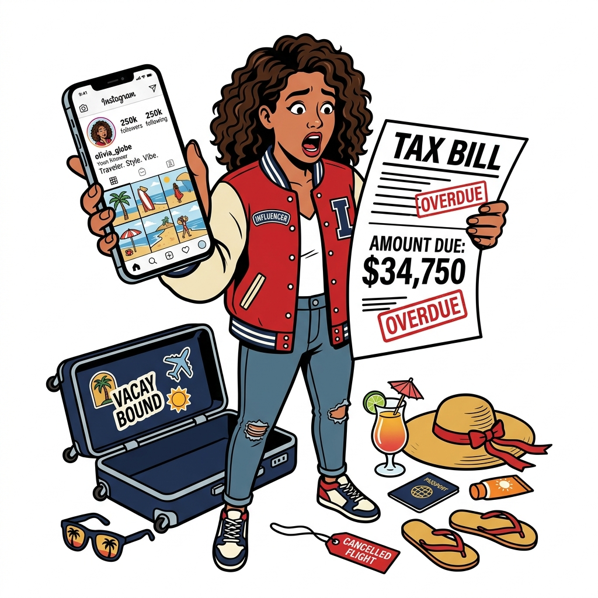

import NoticeTrap from "../../components/mdx/NoticeTrap.astro";
import CardPremium from "../../components/CardPremium.astro";

> *"I am an Instagram influencer. A brand sent me a free iPhone and a sponsored trip to Maldives. I received zero cash, but my CA says I owe ₹80,000 in income tax!"*

{/* Image: Varsity style illustration, an Instagram influencer looking shocked at a tax bill while holding a brand new smartphone, surrounded by tropical travel items like a suitcase and sunglasses, pure white background, minimal colors, clear crisp lines. */}

If you're a creator or influencer, getting free gear, sponsored travel, or makeup PR packages feels like the ultimate perk of the job. You’re trading your reach for their products—a classic barter. No cash changes hands, so no tax, right?

**Wrong.** Welcome to the Influencer Barter Trap.

## 1. What is Section 194R? Perquisites & 10% TDS on Influencer Gifts

The Income Tax Department doesn't see that free iPhone as a gift. Under **Section 28(iv)** of the Income Tax Act, any benefit or perquisite arising from business or a profession is fully taxable business income. This is the **charging section** that makes the item taxable.

To enforce this, the government introduced **Section 194R**—a withholding tax mechanism. If the total value of perks exceeds ₹20,000 in a financial year from a single brand, the brand providing the perk is required to deduct **10% TDS (Tax Deducted at Source)** on the value of that benefit. 

Since they aren't paying you cash to deduct the tax from, they might ask you to pay the TDS amount to them before handing over the item, or they might bear the tax themselves. If the brand pays the 10% TDS on your behalf, Section 194R(1) Proviso mandates **grossing up** the benefit value.

## 2. Form 26AS & AIS Mismatch: How CBDT Flags Unreported Barter Income

You might think, "It's just a free phone, how will the government know?" 

<NoticeTrap>
**The Code 194R Scrutiny Trap:**
When the brand files Form 26Q under Section 194R, the 10% TDS reflects under your PAN in **Form 26AS / AIS** under Code 194R. When the automated CPC system cross-references your AIS against your ITR-3 or ITR-4, it looks for corresponding gross receipt reporting. 

If it sees 194R TDS but you haven't declared the 100% perquisite income, it triggers an automated **Section 143(1)(a) discrepancy notice** or a **Section 139(9) defective return notice**. Ignoring this can result in Section 270A penalties (up to 200% of the tax avoided).
</NoticeTrap>

## 3. CBDT Circular No. 12/2022 Guidelines: Exemptions, Returnable Products & Valuation

Not everything sent to you is a taxable perk. The **CBDT Circular No. 12 of 2022** and **Circular No. 18 of 2022** provide the official guidelines for Section 194R:

* **Returnable Items:** If a brand sends you a phone to review and you return it afterward, it's not a benefit and doesn't attract Section 194R.
* **Valuation of perquisite under Section 194R:** How much is the item worth? If the brand manufactured the item (e.g., Apple giving an iPhone), the value is the Manufacturer’s Retail Price (MRP). If they purchased it from a third party to give to you, the value is the actual purchase price.
* **Companion / Family Travel:** If a luxury hotel sponsors a trip for you *plus* a spouse or friend, the entire cost, including the companion's portion, is taxable to you as a perquisite. Business launch events might have specific exemptions, but personal leisure travel is fully taxable.

## 4. Section 44ADA Presumptive Tax & GST on Barter Transactions

Many creators file taxes using the 50% presumptive taxation scheme. So, can you claim Section 44ADA on barter items? 

Yes. The Section 194R perquisite value must be added to your gross professional receipts. Thus, creators on **Section 44ADA presumptive tax on Section 194R perquisites** effectively pay tax on only 50% of the perquisite value.

### The Tax Impact: A Maldives Trip & iPhone

Let's break down a ₹1,00,000 iPhone and a ₹3,00,000 Maldives Trip (Total Benefit: ₹4,00,000):

| Scenario | Taxable Income | Estimated Tax (30% Slab) |
| :--- | :--- | :--- |
| **No 44ADA (Regular Tax Slab)** | Entire ₹4,00,000 is added to Net Profit | ~₹1,20,000 |
| **With Section 44ADA (50% Presumptive)** | ₹2,00,000 (50% of ₹4,00,000) added to Net Profit | ~₹60,000 |
| **Grossed-Up TDS by Brand** | Brand bears TDS (Total Value: ₹4,44,444) | Calculated on ₹4.44L or ₹2.22L under 44ADA |

### 360-Degree Edge Cases

* **GST Barter Trap:** Barter is a taxable "supply" under Section 7 of the CGST Act! If the creator is GST-registered, receiving a ₹1,00,000 phone for a video reel is a barter transaction that triggers 18% GST on Open Market Value (OMV). You must issue a tax invoice for the service.
* **Agency / Middleman Barter:** When a brand pays an influencer marketing agency, and the agency distributes PR products to micro-influencers, the entity that effectively provides the benefit (usually the agency in a principal-to-principal contract) has the legal obligation to deduct 194R TDS.
* **Foreign Brand Sponsorships:** If a foreign brand has no Indian entity to deduct Section 194R TDS, the perquisite remains fully mandatory to declare and pay tax on under Section 28(iv).

## Frequently Asked Questions (FAQ)

### Does Section 194R apply if I return the product after reviewing it?
No. Under CBDT Circular No. 12/2022, if a product (e.g., a smartphone or car) is retained by the manufacturer/brand after review, it is not a perquisite and Section 194R does not apply.

### Who pays the 10% TDS under Section 194R if no cash is transferred?
The brand must ensure tax has been paid before releasing the benefit. The brand can either collect 10% TDS from the influencer via advance payment, or bear the TDS itself (which is also treated as additional perquisite income).

### What is the Section 194R TDS threshold?
The Section 194R TDS threshold is ₹20,000 in a financial year from a single brand. TDS on social media influencer barter collabs kicks in only once this limit is crossed.

## 💡 Key Takeaway Summary & Actionable Checklist

* **Audit Form 26AS / AIS quarterly** for Code 194R entries to ensure you don't miss matching them in your ITR.
* **Maintain a Review Unit Dispatch Log** with courier receipts and serial numbers for items returned within the stipulated period to prove they weren't perquisites.
* **Execute a written Review & Return Agreement** prior to unboxing high-value loaner gadgets.
* **Include perquisite market values in Gross Receipts** under ITR-4 (Section 44ADA) to claim the 50% presumptive expense deduction legally.

{/* 
[100-Second Reel Script]
**1. The Hook (The Paradox)**
(Holding an iPhone and a suitcase) "Got a 'free' iPhone from a brand and an all-expenses paid trip to the Maldives? If you think it's tax-free because you got zero cash, your CA is about to ruin your day."

**2. The Anxiety (The Trap)**
"Here is the brutal truth for influencers. Under Section 194R, the government taxes these 'perks' if they cross ₹20,000 a year from one brand. The brand deducts 10% TDS on the market value of the item, and it shows up directly on your Form 26AS. If you don't report that phone or trip in your income tax return, the Income Tax CPC's automated system will flag the mismatch and send you a Section 143(1) scrutiny notice. You'll owe tax on money you never even received."

**3. The Pivot (The Strategy)**
"But here is how you fix it legally. First, if you return the item after reviewing it, it's not taxable. Second, if you keep it, make sure you add its value to your gross receipts under Section 44ADA—that way, you only pay tax on 50% of the item's value as a presumptive profit."

**4. The Relief (The Call to Action)**
"Stop letting 'free' gifts turn into expensive tax notices. Track the market value of every PR package you keep, and send this video to a creator friend who needs to hear it. Follow for more unfiltered tax truths!"
*/}
