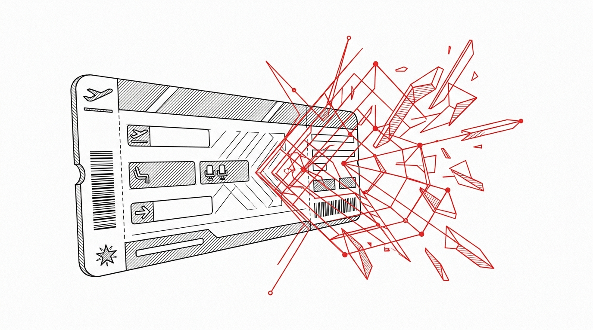

import CardPremium from '../../components/CardPremium.astro';

## The Algorithmic Scrutiny Targeting Your LTA Claim

If you submitted forged travel tickets or claimed Leave Travel Allowance (LTA) for a weekend getaway without officially applying for leave, your tax return is sitting on an algorithmic fault line. The Income Tax Department (ITD) no longer relies on random manual audits. Through Project Insight and the Income Tax Transaction Analysis Centre (INTRAC), the government cross-references your PAN against airline manifests, GST databases, and your employer's HR attendance logs. A mismatch does not just result in a disallowed exemption—it triggers Section 270A misreporting provisions, escalating the penalty to 200% of the tax evaded. 

<CardPremium title="TL;DR: The LTA Scrutiny Framework">
- **The Legal Prerequisite:** Section 10(5) strictly demands the journey be performed while *on approved leave*. Weekend travel without a formal HR leave record nullifies the claim.
- **The INTRAC Pattern Recognition:** INTRAC algorithms flag claims where no corresponding high-value payments to airlines/travel portals exist in your Form 26AS/AIS, or when cluster anomalies appear in employer submissions.
- **The Penalty Matrix:** A disallowed ₹1,00,000 claim for an employee in the 30% slab leads to ₹30,000 in base tax, plus a ₹60,000 (200%) misreporting penalty under Section 270A, plus Section 234A/B/C interest.
- **The Rescue:** If you filed a fake claim, preempt scrutiny by filing an Updated Return (ITR-U) under Section 139(8A) to pay the tax and an additional fee, entirely avoiding the 200% penalty and prosecution.
</CardPremium>

## The Teleology of the Leave Mandate

Under Section 10(5) of the Income Tax Act 1961, Leave Travel Allowance was structured to cover actual travel costs when an employee was strictly on leave from work to travel within India. Historically, this exemption was designed to incentivize domestic tourism and prioritize employee well-being.

Under the 2025/2026 fiscal framework, the New Tax Regime is the default and completely strips away this exemption. LTA is exclusively available if the taxpayer actively opts into the Old Tax Regime. The teleology of the statute is embedded in its name: *Leave* Travel Allowance. The non-negotiable legal prerequisite is that the travel must be executed while on a sanctioned leave from employment. 

## The INTRAC Dragnet: How Discrepancies Surface

The ITD has transitioned from manual sampling to algorithmic certainty. Under the 2025/2026 scrutiny matrix, the department relies on standardized reporting through the Statement of Financial Transactions (SFT) and extensive third-party data integration.

While the ITD does not actively monitor every flight manifest in real-time, its algorithms continuously cross-reference PAN data against airline bookings, GST databases, and your Form 26AS/AIS. If an LTA claim is submitted via Form 12BB (employer reporting), but your digital footprint shows no corresponding high-value payments to airlines or travel portals, the system immediately flags the mismatch.

Furthermore, Project Insight's data-mining infrastructure runs pattern recognition algorithms on employer audits to detect "cluster anomalies." This includes scenarios where multiple employees from the same organization submit tickets with identical formatting, sequential invoice numbers, or pricing that deviates significantly from historical route data. When flagged, the ITD issues a notice demanding the employer produce the original boarding passes as proof of travel, alongside official HR leave logs.

### The Trap Matrix

| Trap | Detection Method and Consequence |
|---|---|
| **The "No Leave" Trap** | Submitting travel tickets for a weekend or public holiday without applying for formal leave on HR portals. The ITD cross-references LTA travel dates with HR attendance logs. Without official leave, Section 10(5) conditions are violated, and the exemption is voided. |
| **The "Fake PDF" Trap** | Submitting doctored, forged, or cancelled flight/train tickets for journeys never undertaken. The ITD uses PNR validation against Airline/IRCTC APIs and checks for the absence of genuine GST/credit card data in your AIS. |
| **The "Incidental Cost" Trap** | Claiming hotel stays, food, and local sightseeing. LTA rules restrict claims strictly to the shortest route travel fare. Automated discrepancy flags identify disproportionately high claims compared to average flight costs. |
| **New Regime Blindspot** | Claiming LTA while filing under the default New Tax Regime results in immediate automated disallowance by the ITR portal processing system. |

## The Rupee Spine: Mathematical Example of the Penalty

Consider an employee in the 30% tax bracket who submits a fake LTA claim of ₹1,00,000 to save ₹30,000 in taxes. Once the tax evasion is detected by the INTRAC data-mining infrastructure, the ₹1,00,000 exemption is disallowed and added back to taxable income.

- **Base Tax Owed:** ₹30,000
- **Misreporting Penalty:** The ITD leverages a severe penalty of 200% of the tax sought to be evaded under Section 270A for deliberate misreporting. This totals ₹60,000.
- **Interest:** Section 234A/B/C interest accrues at approximately 1% per month on the ₹30,000 base tax until paid. For 12 months, this is ₹3,600.
- **Total Financial Hit:** ₹30,000 (Tax) + ₹60,000 (Penalty) + ₹3,600 (Interest) = **₹93,600**.

Instead of saving ₹30,000, the employee loses nearly ₹94,000 and receives a permanent black mark on their PAN, drastically increasing the probability of future audits.

## The Preemptive Strike: ITR-U and Statutory Shields

To survive algorithmic scrutiny, execution and documentation must be precise.

1. **The Boarding Pass Shield:** Always preserve boarding passes, not just ticket itineraries. A boarding pass is the ultimate statutory proof that the journey was actually undertaken.
2. **HR Synchronization:** Ensure every LTA claim is backed by at least one day of formal, approved leave in your company's HR system, even if the travel occurs adjacent to a weekend.
3. **The ITR-U Rescue Tactic:** If you realize you claimed LTA with fake bills or without taking leave in a previous cycle, preempt the ITD by filing an Updated Return (ITR-U) under Section 139(8A). By proactively paying the additional tax plus a 25% or 50% additional fee, you bypass the scrutiny matrix and entirely avoid the 200% Section 270A penalty and potential prosecution.
