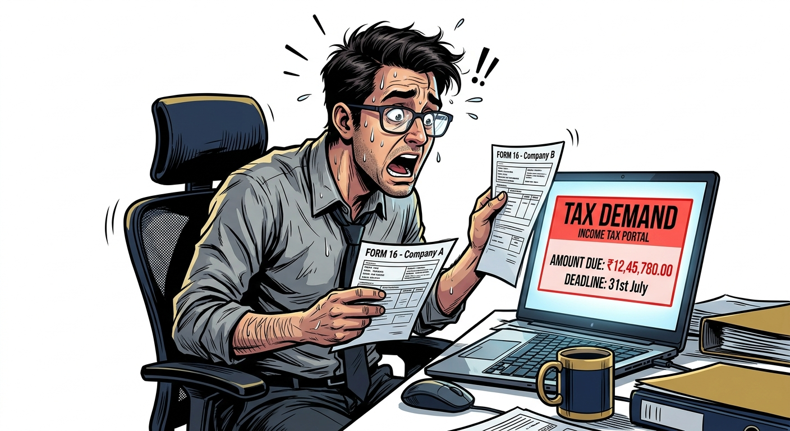
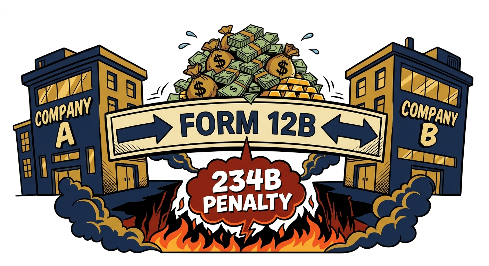

import NoticeTrap from '../../components/mdx/NoticeTrap.astro';
import CardPremium from '../../components/CardPremium.astro';

## The Prelude: The Illusion of the Higher Paycheck

You resigned from your old job in August and started a new, higher-paying role in September. It felt like a massive win. When your first salary slip from the new company arrived in October, you noticed that your in-hand pay was actually slightly higher than you calculated. 

Your TDS deduction was surprisingly low. You assumed your new HR department was incredibly efficient at calculating taxes under the New Tax Regime. For seven months, you enjoyed the extra liquidity, spending it on weekend trips, EMIs, and a new phone.

Then comes July. You log into the Income Tax portal to file your return. The system automatically pulls your Annual Information Statement (AIS), instantly aggregating the Form 16 from Company A and the Form 16 from Company B. 

You click "Calculate Tax" and stare in horror. The portal isn't showing a refund. Instead, it is demanding a **₹85,000 tax payment**, plus an additional **₹5,000 in penal interest**. You didn't hide any income. You didn't trade crypto or F&O. You just switched jobs. So why is the system punishing you?

<CardPremium title="TL;DR: The Mid-Year Job Switch Trap" variant="warning">
- **The Core Issue:** Switching jobs mid-year and failing to disclose previous salary allows both employers to grant you a tax-free basic exemption limit, artificially lowering your TDS.
- **The Mechanics:** The IT portal detects the duplicate exemptions in July. Your total income is aggregated, pushing you into a higher slab, resulting in a massive tax demand.
- **The Defense:** Because your TDS was low, you incur 1% per month penal interest under Sections 234B/C. Prevent this by proactively submitting Form 12B to your new HR in your first week, forcing them to deduct higher TDS.
</CardPremium>

## The Core Mechanics: The Double Exemption Mathematics

To understand why a simple job switch can trigger a financial crisis, you must look at how corporate payroll software operates in isolation.

Let's assume you earn ₹10 Lakhs a year. You work at Company A from April to August (5 months) and earn ₹4.16 Lakhs. Company A calculates your tax liability for the year, deducts your ₹3 Lakh basic exemption and ₹75,000 standard deduction, and deducts the appropriate TDS.

In September, you join Company B at a salary of ₹12 Lakhs a year. For the remaining 7 months (September to March), Company B will pay you ₹7 Lakhs.

Because you did not submit Form 12B, Company B's automated payroll software assumes your *total* income for the year is just that ₹7 Lakhs. It happily grants you a fresh ₹3 Lakh basic exemption and a fresh ₹75,000 standard deduction against this ₹7 Lakh income. 

<NoticeTrap title="The Silent HR Danger">
Your new HR department will **not** chase you for your previous salary slips. Under the law, it is entirely the employee's responsibility to declare previous income. If you stay silent, the company assumes you had zero income before joining them.
</NoticeTrap>

By the end of the year, your actual income is ₹11.16 Lakhs (₹4.16L + ₹7L). But because both companies applied the basic exemptions independently, your total deducted TDS is only enough to cover an artificially lowered tax base. The portal catches this duplicate exemption instantly.

## 360° Coverage: The 234B/C Penetration

The tragedy of the Mid-Year Job Switch is that the punishment is twofold. You don't just owe the missing tax; you owe penal interest.

### The Advance Tax Mandate
Under the Income Tax Act, if your total tax liability for the year exceeds ₹10,000, you are legally required to pay it in installments (Advance Tax) before March 15th. Salaried employees usually never worry about this because their employer deducts TDS every month, covering the liability automatically.

### The Penalty Trigger
However, because your new employer deducted too little TDS, your overall tax payment fell short. By the time July arrives, you have missed the March 15th Advance Tax deadline. The system automatically invokes:
- **Section 234B:** A penalty of 1% per month on the shortfall from April 1st until you pay the tax.
- **Section 234C:** Additional penal interest for deferment of the quarterly advance tax installments.

This means you are paying interest on money you didn't even know you owed, all because of a missing form during your onboarding week.

---

## The Ultimate Defensive Posture: The Single Form Shield

Neutralizing this trap requires exactly five minutes of proactive work during your first week at a new job. Do not wait for the HR portal to prompt you; take control of your compliance.

1. **Submit Form 12B Immediately:** Download Form 12B (under Rule 26A of Income Tax Rules) or use your new employer's internal tax portal. You will need to provide your previous employer’s TAN, your total earnings from them, and the TDS they already deducted.
2. **Embrace the Higher TDS:** Submitting Form 12B means your new employer will deduct a higher monthly TDS to cover the aggregated tax liability. **Do not fight this.** Absorbing a slightly lower in-hand salary every month is vastly superior to facing an unfunded ₹80,000 tax demand in July when you need liquidity the most.
3. **The March 15th Safety Check:** If your new employer’s portal is clunky or you suspect they didn't process your Form 12B correctly, log into the Income Tax portal in early March. Check your **Advance Tax Liability** using the tax calculator. If there is a shortfall, pay it manually via a challan before March 15th. This completely neutralizes the Section 234B and 234C penal interest, saving you thousands of rupees.

A mid-year job switch is a career victory. Don't let a missing piece of paper turn it into a July nightmare.
