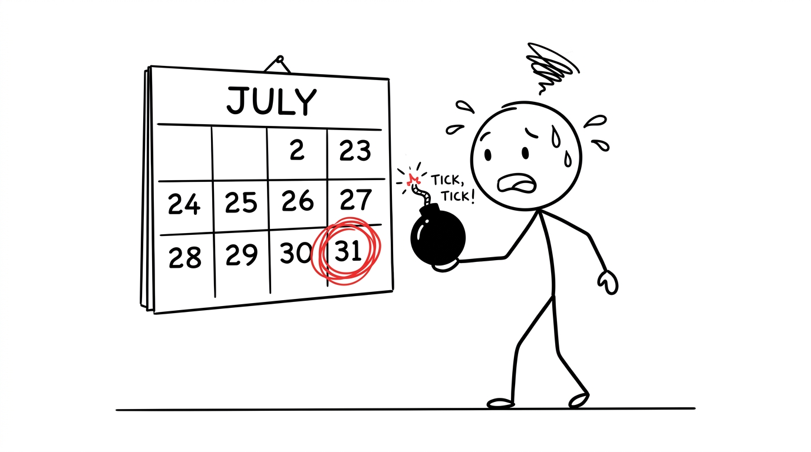
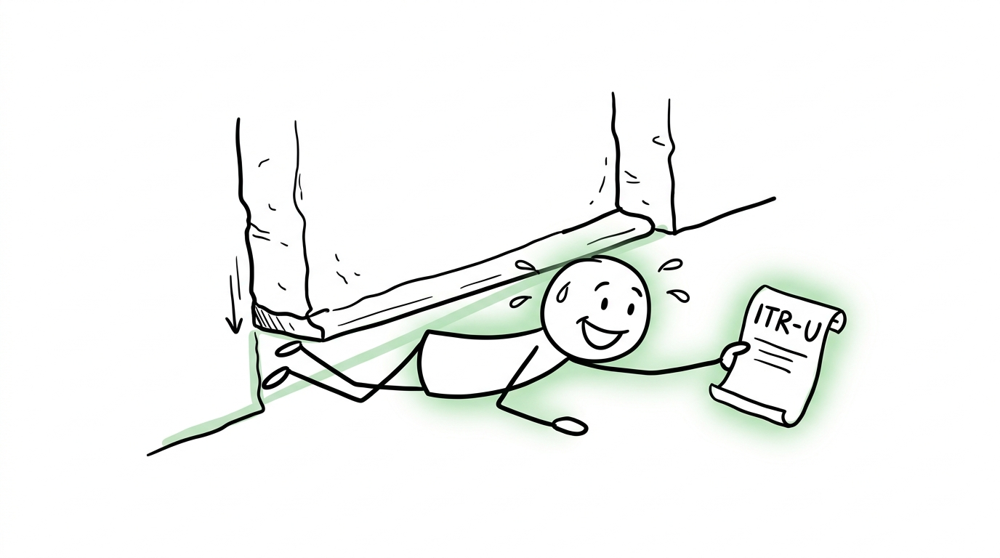

import NoticeTrap from '../../components/mdx/NoticeTrap.astro';
import CardPremium from '../../components/CardPremium.astro';
import NoticePenaltyWorkbench from '../../components/mdx/NoticePenaltyWorkbench.astro';

For salaried employees and retail investors, July 31st is the most critical date on the financial calendar. When August 1st hits and you haven't filed, absolute panic sets in: *"How much is the fine? Will I get a tax notice? Can I still get my refund?"*

**The TL;DR Final Answer:** Yes, you can still file your return until December 31st. This is called a "Belated Return." However, you have triggered a completely automated chain reaction of penalties. The machine will extract a late fee, charge you monthly interest, and permanently destroy your right to carry forward capital market losses. 

<CardPremium>
### TL;DR
- **The Machine Toll:** The Section 234F late fee (up to ₹5,000) is hardcoded into the portal. You cannot file a Belated Return without the system forcing you to pay it first.
- **The Interest Bleed:** Section 234A charges you 1% penal interest *per month* on any unpaid tax, starting August 1st.
- **The Loss Wipeout:** By missing July 31st, you permanently forfeit the legal right to carry forward stock market or F&O losses to offset future taxes.
- **The Hard Cutoff:** If you miss December 31st, you fall into the ITR-U trap, facing a massive 25% to 50% additional penal tax.
</CardPremium>

## 1. Why is the Penalty Unforgiving?

To understand why you cannot negotiate your way out of this penalty, you have to look at how the government eliminated human corruption in the tax code.

Before 2017, the penalty for filing a late return fell under **Section 271F**. Under this old law, an Income Tax Officer had the *discretion* to levy a ₹5,000 penalty. 
This created chaos. Taxpayers would receive a notice, march into the tax office, and argue. They would claim they were sick, or that their CA was out of town. Some would bribe the officer to waive the penalty entirely. It was a massive waste of administrative time and a breeding ground for corruption.

In the 2017 Union Budget, the Finance Ministry dropped a nuclear bomb on the old system. They scrapped Section 271F and introduced **Section 234F**. 

Notice the change in the language: Section 271F was a "Penalty." Section 234F is classified as a statutory "Fee."
By classifying it as a fee, the government removed all human discretion. It was hardcoded directly into the e-filing portal's algorithm. Today, if you try to file a Belated Return, the "Submit" button literally remains locked until the payment gateway confirms you have transferred the ₹5,000 fee. 
There are no Income Tax Officers to argue with. The machine simply demands its toll.

## 2. The Compounding Doom Cascade

Missing the deadline is not a single event; it triggers a phased escalation of financial damage.

### Phase 1: August 1st (The Loss Wipeout)
The most brutal punishment for missing the deadline has nothing to do with the ₹5,000 fine. 
If you trade stocks, mutual funds, or F&O, you rely on carrying forward your losses to offset future taxes. Section 80 of the Income Tax Act explicitly states that if you do not file your ITR by July 31st, you **permanently lose the right to carry forward** any business losses or capital losses. 
Even if you file a Belated Return on August 1st and pay the ₹5,000 fee, your losses are wiped out from the server forever.

### Phase 2: The Monthly Bleed (Section 234A)
If you have a tax shortfall (e.g., your employer didn't deduct enough TDS), missing the deadline triggers penal interest. Section 234A levies a **1% per month** (or part of a month) interest on the outstanding tax amount, calculated from August 1st until the date you actually file and pay. Even a 1-day delay into September costs you a full month's interest.

### Phase 3: The Belated Return (Section 139(4))
You have a grace period until **December 31st** to file a "Belated Return." You must pay the automatic Section 234F fee:
- Total income below ₹5 Lakhs: **₹1,000 fee**.
- Total income above ₹5 Lakhs: **₹5,000 fee**.

<NoticePenaltyWorkbench 
  defaultShortfall={30000} 
  defaultMonthsDelayed={3} 
  instruction="Simulate the Cascade. Enter your unpaid tax and the months you delayed filing. See how the 234A interest combines with the flat 234F machine fee to destroy your capital."
/>

## 3. How Can I Minimize My Risk? (Notice Traps)

Missing the deadline puts your PAN immediately into the CPC's "Defaulter" tracking database. Do not make it worse by falling into these traps.

<NoticeTrap title="Trap 1: Ignoring the December 31st Hard Cutoff">

**Scrutiny Trigger:** You think you can just file your ITR whenever you want, and you try to file a Belated Return in January of the following year.

**Resolution Strategy:** The December 31st deadline is a hard, absolute legal cutoff. If you miss it, the standard filing window slams shut forever. You can only file an "Updated Return" (ITR-U) under Section 139(8A). ITR-U is a punitive form designed for tax evasion recovery: it forces you to pay an additional **25% to 50% penalty** on your entire tax liability. Furthermore, you cannot use an ITR-U to claim a refund. File before Dec 31st to avoid the ITR-U trap.

</NoticeTrap>

<NoticeTrap title="Trap 2: The Best Judgement Assessment (Section 144)">

**Scrutiny Trigger:** You decide to completely ignore the tax department. You don't file Belated, and you don't file ITR-U.

**Resolution Strategy:** If the AI grid detects high-value transactions on your PAN (via the SFT grid) but sees no ITR filed, the Assessing Officer will trigger Section 144. This gives the officer the terrifying power to estimate your tax liability based on whatever data they have, without your input. They will issue a massive demand notice, and they will freeze your bank accounts to recover it.

</NoticeTrap>

## 4. How Can I Save Money? (The Loopholes)

Unfortunately, late fees are statutory and cannot be waived. However, you can mitigate the damage.

### Loophole A: The "Below Exemption Limit" Clause
If your Gross Total Income (before Chapter VI-A deductions like 80C) is below the basic exemption limit (₹3 Lakhs under the New Regime), the Section 234F penalty **does not apply**. You can file a Belated Return with a ₹0 late fee.

### Loophole B: Updating a Belated Return
Did you rush your Belated Return in panic and make a mistake? Section 139(5) allows you to "Revise" a Belated Return. If you file on August 15th and realize in September you missed a major deduction, you can legally file a Revised Return to fix it—provided you do it before the December 31st deadline.

## 5. The "My Dog Ate My ITR" Edge Cases

### Edge Case: The New Regime Default Lock-in
As of FY 2023-24, the New Tax Regime is the default. If you have business income (e.g., you are a freelancer or founder filing ITR-3 or ITR-4) and you want to opt into the Old Regime to claim deductions, you MUST file Form 10-IEA *before* the July 31st deadline. 

**The Catch:** If you file a Belated Return, the portal will legally lock you into the New Tax Regime. You cannot opt into the Old Regime in a Belated Return if you have business income. The algorithm will automatically calculate your tax based on the New Regime slabs, ignoring your 80C investments entirely.

## 6. 💡 Key Takeaway Summary & Actionable Checklist

*   **Pay the Machine Toll:** Login to the e-Filing portal, generate a challan, and pay the ₹1,000 or ₹5,000 late fee under Section 234F immediately to unlock the submit button.
*   **File ITR-1/2/3 immediately:** Go to the portal, select "Belated Return u/s 139(4)", and file the return as you normally would. 
*   **Accept the Loss Wipeout:** Do not attempt to carry forward stock market or F&O losses; the system will reject the return if you try.
*   **Do Not Miss Dec 31st:** Set a calendar alarm. Missing December 31st forces you into the ITR-U 25-50% punitive tax trap.
