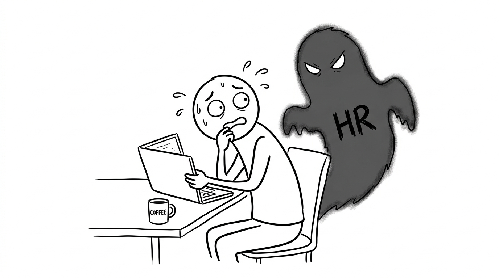
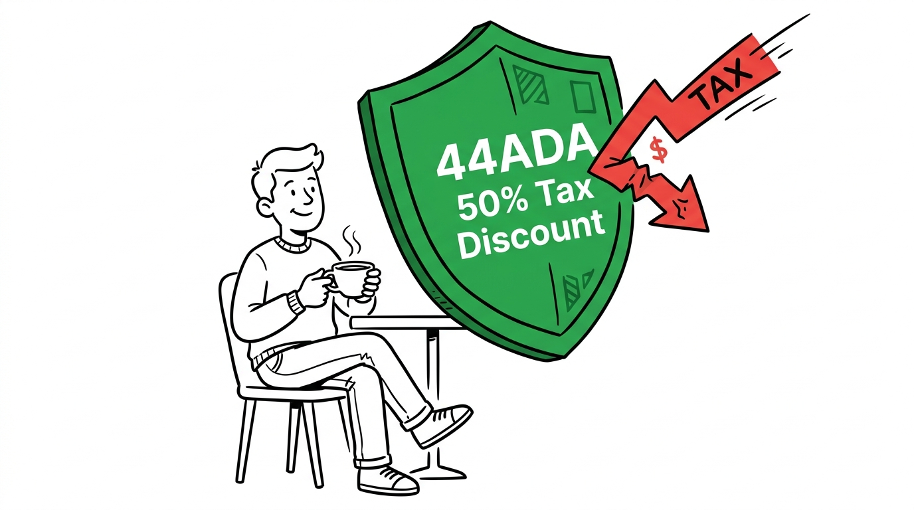

import NoticeTrap from '../../components/mdx/NoticeTrap.astro';
import CardPremium from '../../components/CardPremium.astro';
import NoticePenaltyWorkbench from '../../components/mdx/NoticePenaltyWorkbench.astro';

<CardPremium>
### TL;DR
- **The Data Collision:** If you hold two formal jobs simultaneously, both employers will mistakenly apply the ₹75,000 standard deduction to your TDS. When you file your ITR, the system will catch this, leading to a massive unexpected tax bill and penal interest.
- **The Snitch:** Your employer's HR department will discover your moonlighting if your second job deposits money into your Employee Provident Fund (EPF) account using your UAN.
- **The Shield:** Always insist your second gig hires you as an independent contractor (Section 194J) rather than an employee (Section 192). This keeps your EPF clean and unlocks massive tax loopholes.
</CardPremium>

## 1. The Genesis of the Moonlighting Crisis

To survive a dual-income audit, you first have to understand why "moonlighting" suddenly became a national crisis. Why did the Income Tax Department suddenly care about your weekend coding gig?

Rewind to the COVID-19 pandemic. Millions of Indian tech workers transitioned to remote work. Realizing they could finish their 9-to-5 tasks in 4 hours, a massive chunk of the workforce secretly took on a second, full-time job. 
Major IT service giants like Infosys, Wipro, and TCS panicked. They worried about intellectual property theft, client confidentiality, and plummeting productivity. They declared war on moonlighting.

But did the Income Tax Department care about corporate IP theft? Absolutely not. 

The tax department cared because their servers were crashing. Millions of taxpayers were suddenly generating **two simultaneous Form 16s**. The tax algorithms, designed to process a clean, single-employer salary structure, started detecting massive mathematical anomalies across the grid. Taxpayers were drastically underpaying their taxes because of a structural flaw in how Indian payroll works.

Thus, the government updated their AI grid (the AIS) to hunt down these "Data Collisions."

## 2. The Anatomy of a Data Collision

The Income Tax Act does not care about your company's HR policy. It only cares that it gets its cut. To the government, income is just income. 

The catastrophe happens because of how TDS (Tax Deducted at Source) is calculated. 
When Employer A runs your payroll, their software assumes they are your *only* source of income. 
- They automatically grant you the ₹3 Lakh Basic Exemption Limit.
- They automatically grant you the ₹75,000 Standard Deduction.
- They calculate your tax on the remaining amount and deduct it from your monthly salary.

If you are secretly working for Employer B, Employer B's software does the **exact same thing**.

### The Judgment Day (July 31st)
When you log into the Income Tax Portal to file your ITR, the CPC server merges both salaries. The algorithm instantly realizes that you claimed the ₹75k standard deduction *twice*, and you claimed the ₹3 Lakh basic exemption *twice*. 
The portal aggressively strips away the duplicate exemptions. Suddenly, ₹3.75 Lakhs of your income is shoved into the 30% tax bracket. 

You hit "Calculate Tax" and stare at the screen in horror. You owe ₹1.1 Lakhs in tax, payable immediately.

<NoticeTrap title="Trap 1: The Section 234B/C Penal Interest">

**Scrutiny Trigger:** You discover this massive ₹1.1 Lakh tax shortfall on July 30th, the day before the deadline, and decide to just pay it then.

**Resolution Strategy:** The tax department will punish you for waiting. By law, if your total tax liability for the year (after TDS) exceeds ₹10,000, you must pay **Advance Tax** in four installments (June, Sept, Dec, March). Because your employers under-deducted your TDS, you were supposed to calculate this shortfall and pay it yourself throughout the year. If you pay it all in July, the system will automatically slap you with Section 234B and 234C penal interest (1% per month) on the shortfall amount.

</NoticeTrap>

<NoticePenaltyWorkbench 
  defaultShortfall={110000} 
  defaultMonthsDelayed={6} 
  instruction="Enter your estimated tax shortfall from your second job. See exactly how much extra penalty the system will extract from you if you wait until July to pay it."
/>

## 3. The UAN Trap (How HR Actually Catches You)

While the tax department catches you through the Form 16 collision, your HR department catches you through a much simpler mechanism: The **Employee Provident Fund (EPF)**.

Every formal employee in India has a Universal Account Number (UAN). 
If Employer B decides to put you on their formal payroll (Section 192), they are legally required to deposit 12% of your basic salary into your EPF account using your UAN.

This is a massive red flag. The EPFO system will immediately register two simultaneous, overlapping PF contributions from two different companies for the exact same month. This dual-contribution data is visible on the EPFO portal, which your primary HR department routinely monitors during background checks or annual audits. 

The moment HR sees the overlapping PF deposit, you are fired.

## 4. The Shield: Section 194J & Presumptive Taxation

How do you survive? You must never let Employer B put you on a formal payroll. 
You must insist that your second gig hires you as an **Independent Contractor / Consultant**. 

When you are a consultant:
1. They do not deposit PF. Your UAN remains perfectly clean and invisible to your primary HR.
2. They deduct a flat 10% TDS under **Section 194J** instead of complex salary TDS under Section 192.

### The Section 44ADA Loophole
If your side-hustle pays you as a freelancer (Section 194J), you unlock one of the most powerful tax loopholes in the country: **Presumptive Taxation (Section 44ADA)**.

Instead of adding your entire side-hustle income to your primary salary and paying 30% tax on it, the government gives software developers, designers, and consultants a massive break. 
The law states: *"We presume that 50% of your freelance income was spent on business expenses (internet, laptops, electricity). You only have to pay tax on the remaining 50%."*

**The Math:**
You earn ₹10 Lakhs from your weekend freelance gig.
- **Normal Salary Route:** You add ₹10 Lakhs to your primary salary and pay ₹3 Lakhs in tax.
- **44ADA Consultant Route:** You declare ₹5 Lakhs as "expenses." You only add ₹5 Lakhs to your taxable income. You instantly cut your side-hustle tax bill in half, completely legally, and you don't even need to show a single receipt to prove those expenses!

## 5. The Nightmare Scenarios (Edge Cases)

### Edge Case 1: The Wrong ITR Form
This is where most moonlighters panic. If you only have a primary salary, you file ITR-1. But the moment you claim Section 44ADA for your consulting side-hustle, **you must upgrade to ITR-3 or ITR-4**. 
Do not let your primary employer file your taxes for you. Tell them you will file it yourself. When you log into the portal, select ITR-4, punch in your salary from your Form 16, and punch in your freelance income under the "Business/Profession" tab. 

### Edge Case 2: Foreign Clients and GST
If your side-hustle involves clients in the US or UK, and they pay you in USD, this is classified as an "Export of Service."
While exports are "Zero-Rated" for GST (meaning you charge 0% tax), if your total global turnover crosses ₹20 Lakhs, you MUST register for GST and file a Letter of Undertaking (LUT). Do not ignore this. The FEMA and GST departments share data, and they will freeze your bank account if they detect unregistered foreign remittances.

## 6. 💡 Key Takeaway Summary & Actionable Checklist

*   **Switch to Consultant Status:** Ask your side-hustle to pay you as an independent contractor (Section 194J TDS) to prevent PF overlaps and HR detection.
*   **Calculate Advance Tax:** In December and March, calculate your combined tax liability for both jobs. Pay Advance Tax to neutralize the shortfall and avoid 234B/C interest.
*   **Use Section 44ADA:** Cut your freelance taxable income in half legally.
*   **Upgrade your Return:** Stop filing ITR-1. Switch to ITR-3 or ITR-4 to properly declare both your salary and your business income. You can sleep peacefully knowing you are 100% compliant with the law.
