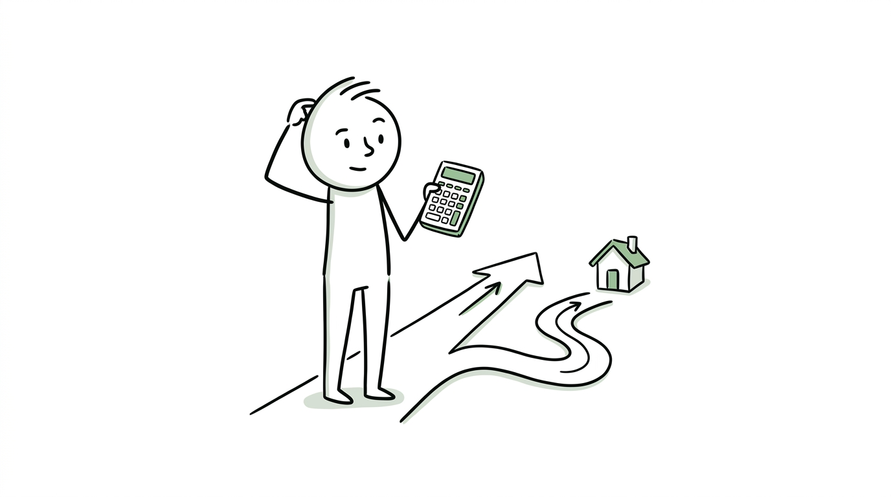
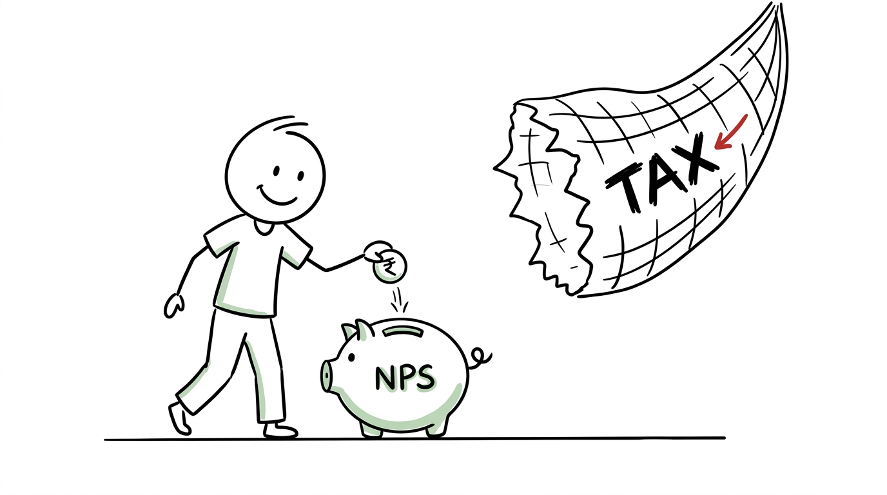

import NoticeTrap from '../../components/mdx/NoticeTrap.astro';

import TaxWorkbench from '../../components/mdx/TaxWorkbench.astro';

## 1. Executive Summary & The Core Problem

Every July, millions of salaried professionals undergo the exact same frustrating ritual: downloading messy Excel templates to figure out if their LIC premiums, PPF deposits, and House Rent Allowance (HRA) are enough to beat the government's New Tax Regime.

Let's cut through the noise. **The New Tax Regime is now the mandatory default.** 

The government wants you to stop locking your money into 15-year PPF schemes and rigid insurance policies just to save tax. They are offering you lower upfront tax rates in exchange for giving up almost all your itemized deductions. But is it a trap?

**The TL;DR Final Answer:** Unless your total allowable deductions under the Old Regime exceed exactly **₹3,75,000 per year**, the New Tax Regime will leave you with more cash in your bank account.

## 2. What is the regulation regarding this specific transaction?

To understand why the New Regime usually wins, you have to look at the harsh mathematics of the tax slabs.

### Rule 1: The Slab Disparity
Under the Old Regime, the tax rate brutally jumps to 30% the moment your income crosses ₹10 Lakhs. Under the New Regime, that 30% punishment doesn't hit until your income crosses ₹24 Lakhs. 
Because the New Regime gives you such a massive head start on lower tax brackets, it creates a "Tax Saving Deficit" for the Old Regime.

### Rule 2: The ₹3.75 Lakh Breakeven Math
To make up for this deficit, you have to force your taxable income down artificially by claiming deductions. The exact amount of deductions required to perfectly equalize the two regimes is ₹3,75,000.
If you **do not** have an active home loan, hitting this number is almost impossible:
*   **Standard Deduction:** ₹50,000 (Old) vs ₹75,000 (New) -> *(New Regime is already winning by ₹25,000).*
*   **Section 80C (Maxed out):** ₹1,50,000 (PPF, ELSS, EPF).
*   **Section 80D (Health Insurance):** ₹25,000 to ₹50,000.
Even if you max out everything, you are barely crossing ₹2 Lakhs. Without a massive HRA claim or a Home Loan Interest claim (Section 24b up to ₹2 Lakhs), the Old Regime is mathematically inferior.

## 3. How can I minimize my risk of non-compliance? (Notice Traps)

Switching between regimes is legally perilous depending on how you earn your money.

<NoticeTrap title="Trap 1: The Freelancer / Business Income Lock-in">

**Scrutiny Trigger:** You are a salaried employee who also earns ₹2 Lakhs doing freelance coding (Business Income). You switched to the Old Regime this year to claim a home loan deduction, but next year you try to switch back to the New Regime.

**Resolution Strategy:** Under Section 115BAC, if you have *any* business or professional income (even ₹1 of freelance income), you are only allowed to switch back to the New Regime **once in your lifetime**. If you switch back, you can never return to the Old Regime again. Salaried employees without business income can switch every single year, but freelancers are locked in.

</NoticeTrap>

<NoticeTrap title="Trap 2: Forgetting Form 10-IEA">

**Scrutiny Trigger:** You calculate that the Old Regime is better for you. You file your ITR using the Old Regime rates but you forget to file Form 10-IEA.

**Resolution Strategy:** The New Regime is the legal default. If you want the Old Regime (and you have business income), you are legally mandated to submit Form 10-IEA *before* filing your ITR, on or before July 31st. If you forget the form, the CPC will process your return under the New Regime, deny your 80C/HRA deductions, and send you a massive tax demand.

</NoticeTrap>

## 4. How can I save money? (The Loopholes)

Even under the strict New Regime, you still have a few hidden ways to lower your taxable income.

### Loophole A: Section 80CCD(2) - Corporate NPS

This is the holy grail of the New Regime. If your employer contributes up to 10% of your Basic Salary (14% for government employees) into your National Pension System (NPS) Tier-1 account, that entire amount is deducted from your taxable income. This is the **only major investment deduction** still alive in the New Regime.

### Loophole B: Renting out your Home (Section 24b)
While the New Regime kills the ₹2 Lakh interest deduction for "Self-Occupied" house properties, there is a loophole. If you rent out your house property, the interest you pay on that specific home loan can be set off against the rental income you receive, even under the New Regime.

<TaxWorkbench 
  defaultSalary={1500000} 
  defaultDeductions={250000} 
  instruction="Enter your exact Salary and your estimated Old Regime Deductions. If the deductions are under ₹3.75 Lakhs, watch how the New Regime saves you money."
/>

## 5. The Number Cruncher's Dilemmas

Do not trust basic calculators if you fall into these complex situations.

### Edge Case 1: The Joint Home Loan Mirage
You and your spouse took a joint home loan. The EMI is ₹50,000 per month. You assume you can both claim the ₹2 Lakh Section 24b deduction under the Old Regime, easily crossing the ₹3.75L breakeven.
- **The Catch:** You can only claim the deduction in the exact proportion of ownership AND EMI payment. If your spouse is a 50% co-owner but you pay 100% of the EMI from your bank account, your spouse cannot claim a single rupee in deduction, effectively halving the tax benefit for the household.

### Edge Case 2: The Marginal Relief at ₹12 Lakhs (Effectively ₹12.75 Lakhs)
The New Regime advertises "Zero tax up to ₹12 Lakhs." What happens if your income is ₹12,10,000? Do you suddenly pay tax on the whole amount?
- **The Catch:** No. The government introduced Section 87A Marginal Relief. You will only pay the difference. If your tax liability pushes your post-tax income below ₹12 Lakhs, the government discounts the tax so you are left with exactly ₹12 Lakhs. When you factor in the ₹75,000 Standard Deduction, this means any salary up to ₹12.75 Lakhs is effectively tax-free. You will never take home less money by getting a small raise.

## 6. 💡 Key Takeaway Summary & Actionable Checklist

*   **Do the ₹3.75L Test:** Add up your 80C, HRA, and Home Loan interest. If it is less than ₹3,75,000, do absolutely nothing and let your employer default you into the New Regime.
*   **Negotiate NPS:** Speak to your HR department today to restructure your CTC to include Corporate NPS under Section 80CCD(2).
*   **File Form 10-IEA:** If you have any freelance/business income and you want the Old Regime, file this form *before* July 31st.
*   **Check EMI Payments:** If claiming a joint home loan under the Old Regime, ensure the EMI is being deducted from a joint bank account, not just one spouse's account.
