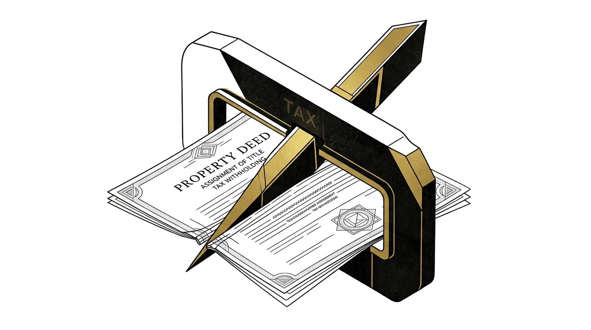

import CardPremium from '../../components/CardPremium.astro';
import InsetResidentVsNRITDS from '../../components/illustrations/InsetResidentVsNRITDS.astro';
import InsetForm13Timeline from '../../components/illustrations/InsetForm13Timeline.astro';

## "I am selling at a loss, why is the buyer holding back ₹25 Lakhs?"

You are an NRI selling a property in India. You finally find a buyer, negotiate a sale price of ₹2 Crore, and are ready to execute the deed. You are expecting the buyer to transfer almost the full amount, minus maybe the standard 1% TDS that everyone talks about. 

Instead, the buyer’s Chartered Accountant drops a bomb: they are legally required to withhold over 13% of the **entire sale price**, not just your profit. 

Even if you are selling the property at a loss, the buyer intends to deduct ₹26 Lakhs and send it directly to the Income Tax Department. You are shocked. You assume the buyer is being overly aggressive, hostile, or trying to trap your money. 

They aren't. The buyer is terrified of becoming an "assessee-in-default," and they are caught in the exact same systemic trap that you are: **Section 195**.

<CardPremium title="TL;DR: The Section 195 Liquidity Trap">
- **The Rule:** The standard 1% TDS (Section 194-IA) is strictly for resident sellers. If you are an NRI, Section 195 applies, which mandates withholding on the sums chargeable to tax.
- **The Trap:** Because the buyer cannot verify your acquisition costs or exemptions, they are forced to apply capital gains rates (plus surcharge and cess) to your **gross sale price**. This locks massive amounts of your capital in the Indian tax system.
- **The Rescue:** You must apply for a Lower/Nil Deduction Certificate (under Section 197) weeks *before* the sale deed. This is the only legally binding document that allows the buyer to safely deduct less.
</CardPremium>

## The Border-Collection Reality

Why does the law do this? The answer lies in the harsh reality of cross-border tax enforcement.

India, like most sovereign nations, has extremely weak practical tax recovery mechanisms once sale proceeds are repatriated and the seller is a non-resident. If an NRI sells an asset, legally transfers the cash to a bank in Dubai, London, or California, and simply ignores their Indian capital gains tax liability, the Indian Income Tax Department is essentially paralyzed. They cannot easily cross international borders, navigate foreign banking jurisdictions, or initiate international litigation just to recover a capital gains tax bill.

To solve this sovereign risk, the government designed a ruthless border-collection architecture. **Section 195** shifts the entire burden of tax collection onto the *payer*—the resident buyer. The government holds the resident buyer hostage because the buyer is within their jurisdiction. 

To ensure absolutely no tax escapes the country, the system forces the buyer to withhold the maximum possible tax at the source before the money is legally allowed to leave the country. If the buyer fails to do this, the government can simply seize the buyer's assets in India to recover the NRI's unpaid tax. This is why buyers are terrified, and this is why they will withhold your cash without hesitation.

## The "Gross Value" Math Problem

In theory, TDS should only be applied to your actual capital gains. In practice, without an official certificate, buyers and their CAs will almost always withhold on the **entire consideration**. Why? Because they have no legal authority to verify your indexation, holding period, or reinvestment plans.

<InsetResidentVsNRITDS />

Let’s look at the Rupee Spine for a property sold after the July 23, 2024 budget (which introduced the flat 12.5% Long-Term Capital Gains rate without indexation).

- **Sale Price:** ₹2,00,00,000 (₹2 Crore)
- **Actual Purchase Cost:** ₹1,50,00,000
- **Actual Capital Gain:** ₹50,00,000

**Without a Certificate (Default Gross Withholding)**  
The buyer calculates TDS on the full ₹2 Crore. They apply the 12.5% LTCG rate, plus applicable surcharge, plus 4% health and education cess. Assuming an effective rate in the ~13% band:
- **TDS Deducted:** ~₹26,00,000

**Actual Tax Liability**  
Your actual tax is only on the ₹50 Lakh gain.
- **Actual Tax Owed:** ~₹6,50,000

**The Liquidity Lock-up**  
Because the buyer withheld ₹26 Lakhs, you have **₹19.5 Lakhs** in excess capital stuck with the government. You can claim this back as a refund, but it requires waiting to file your Income Tax Return (ITR) the following year and waiting months for processing. It costs you time, cash-flow, and opportunity cost.

*(Note: If you held the property for 24 months or less, it triggers Short-Term Capital Gains. STCG slab-linked withholding logic can push the effective rate past 30%, making the gross withholding trap even more violent.)*

## Why You Can't Use the "1% Rule"

Real estate brokers often tell sellers, "Don't worry, the buyer will just deduct 1% and file a 26QB form." 

This is the **Section 194-IA Delusion**. Section 194-IA (which mandates 1% TDS on properties over ₹50 Lakhs) is strictly reserved for **Resident Sellers**. It offers a clean, low-friction ₹50 Lakh escape hatch. 

For NRI sellers, there is no ₹50 Lakh threshold. Section 195 applies from the very first rupee. Furthermore, the buyer cannot use the simple 26QB form; historically, they must obtain a TAN (Tax Deduction and Collection Account Number) and file Form 27Q to issue you your TDS certificate. *(Note: Watch for upcoming procedural simplifications allowing PAN-based filings for buyers in later rules, but the core 195 withholding logic remains).*

## Form 13: The Only Legally Binding Shield

If the buyer's CA is going to maximize the withholding rate to protect the buyer from penal risk, how do you stop them? You don't argue with them. You give them statutory cover.

The **Lower/Nil Deduction Certificate** (issued under Section 197 of the 1961 Act) is your liquidity rescue tool. By applying to your Assessing Officer (AO) using **Form 13** (or its successor form under the new Act) before the sale, you proactively prove your actual capital gains and intended exemptions.

If the AO approves, they issue a binding certificate authorizing the buyer to deduct a specific lower percentage, or even a flat nil amount. 

### The Section 54/54EC Path to Nil
If you plan to reinvest your ₹50 Lakh profit into a new residential house in India (Section 54) or into specified government highway bonds (Section 54EC), your actual capital gains tax liability drops to zero. 

But if you wait until you file your ITR to claim these exemptions, the buyer will still gross-withhold ₹26 Lakhs at the time of sale. You must build your reinvestment plan *before* the deed and submit the proof during your Form 13 application to secure a **Nil Deduction Certificate**.

## The 45-Day Clause in Your MoU

Securing a Section 197 certificate is not an overnight automated process. An actual Assessing Officer must review your property documents, purchase deed, bank statements, and tax history. 

<InsetForm13Timeline />

This process usually takes 30 to 45 days. If you wait until the final sale deed is being drafted to apply, you will derail the transaction. You must build a specific clause into your Memorandum of Understanding (MoU) acknowledging the TDS section, establishing a timeline for the certificate, and defining who bears the delay if the AO is slow.

Furthermore, ensure your PAN is strictly operative. An inoperative PAN (not linked to Aadhaar or specifically exempted) can force the buyer into Section 206AA punitive withholding, dragging the rate to a minimum of 20%, even if the actual LTCG rate is lower.

## Key Takeaways for the NRI Seller

- **Gross Withholding is the Default:** Section 195 forces the buyer to withhold tax on the *total sale value*, not your actual profit. This can lock up massive amounts of liquidity.
- **Form 13 is Your Only Shield:** The Lower/Nil Deduction Certificate (Section 197) is a mandatory liquidity rescue tool. It is the only legal way to force the buyer to withhold tax based on your actual capital gains.
- **Timing is Everything:** Form 13 takes 30 to 45 days to process. You must build this exact buffer into your Memorandum of Understanding (MoU) before drafting the final sale deed.
- **The Buyer is Not the Enemy:** The buyer's CA is protecting them from severe domestic penal risk. Do not argue with them; give them the statutory cover of a Form 13 certificate.
