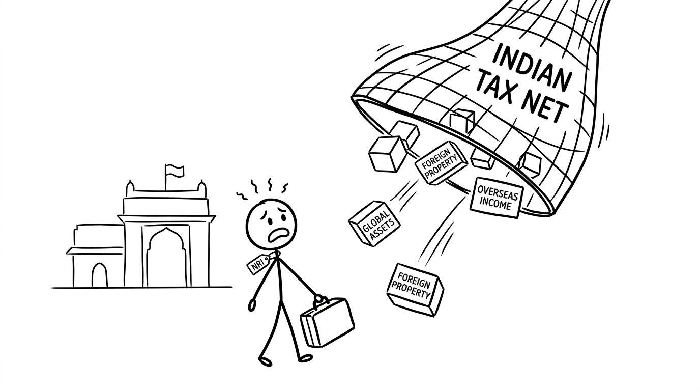
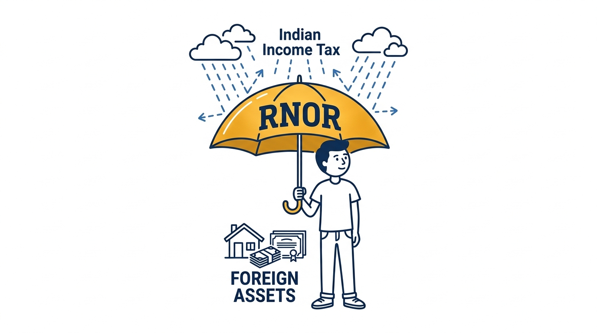

import NoticeTrap from '../../components/mdx/NoticeTrap.astro';
import CardPremium from '../../components/CardPremium.astro';

If you move back to India after a decade in Dubai, London, or Silicon Valley, the government demands the right to tax your global wealth. Your US tech stocks, your UK rental properties, and your overseas bank interest suddenly fall into the ruthless Indian tax net. However, the law provides a narrow, diplomatic bridge to shield your assets: the **RNOR (Resident but Not Ordinarily Resident)** Status.

<CardPremium>
### TL;DR
- **The Global Threat:** Once you become a permanent Indian Resident (ROR), India taxes your worldwide income at peak slab rates.
- **The RNOR Shield:** If you were an NRI for 9 of the last 10 years, you get a 2-to-3 year grace period (RNOR) where your foreign income remains 100% tax-free in India.
- **The Action Plan:** Use this 3-year window to liquidate overseas assets, repatriate funds without penalty, and restructure your banking before the shield expires.
- **The Reporting Trap:** Even during the tax-free RNOR period, you MUST declare all foreign assets in Schedule FA. Missing this triggers a ₹10 Lakh penalty under the Black Money Act.
</CardPremium>

## 1. Why Does the RNOR Shield Exist?

To understand how to use this law, you must ask: *Why would the Indian government willingly let millionaires live in India without paying tax on their global wealth?*

It all traces back to India's desperate need for foreign capital and brain gain. 

Imagine an Indian software engineer who moved to California in 2010. Over 15 years, they built a massive portfolio of US tech stocks and real estate. In 2025, they want to move back to Bangalore to start a company. 
If the law stated that the very moment they landed in Bangalore, their entire US portfolio would be subjected to Indian capital gains tax, *they would never return.*

The government realized that a harsh, immediate tax net was causing a permanent brain drain. To incentivize the wealthy diaspora to bring their skills and capital back to India, the government created a "Golden Bridge"—a temporary diplomatic immunity called RNOR. 

It is an economic bribe: *Come back home, and we won't touch your foreign wealth for 3 years. Take your time to settle down.*

## 2. The 3 Tax Identities of India

To unlock the RNOR shield, you must understand how India classifies its taxpayers. Your passport matters less than your physical presence (the day-count).

1. **Non-Resident Indian (NRI):** You spend less than 182 days in India in a financial year. Only the money you earn *in India* (like rent from a Mumbai flat) is taxed in India. Your global wealth is completely invisible to the Indian taxman.
2. **Resident and Ordinarily Resident (ROR):** You live in India permanently. The Indian government taxes everything you earn, everywhere in the world. There is no escape.
3. **Resident but Not Ordinarily Resident (RNOR):** The transitional identity. You live in India physically, but the government treats your foreign income as if you were still an NRI. Your global wealth remains protected.

## 3. Unlocking the RNOR Safe Harbor

The RNOR status is not permanent. It is a temporary visa for your wealth, lasting up to 3 financial years after your return. To qualify for this diplomatic immunity under Section 6(6), you must meet at least **one** of two conditions:

- **The 9-Year Rule:** You were a Non-Resident (NRI) in India in 9 out of the 10 preceding financial years.
- **The 729-Day Rule:** You were physically present in India for 729 days or less in the 7 preceding financial years.

If you meet either condition upon your return, the shield activates.

## 4. The Repatriation Matrix (The Survival Math)

How does the Indian tax department treat your specific global assets during this transitional phase? 

| Asset Class | NRI (Non-Resident) | RNOR (The 3-Year Shield) | ROR (The Permanent Cliff) |
| :--- | :--- | :--- | :--- |
| **Salary earned in Dubai** | Tax-Free in India | Tax-Free in India | Taxable at Slab Rate (30%) |
| **Rent from London House** | Tax-Free in India | Tax-Free in India | Taxable at Slab Rate |
| **Sale of US Stocks (Capital Gains)** | Tax-Free in India | Tax-Free in India | Taxable (20% or 12.5%) |
| **Interest from NRE Account** | Tax-Free in India | Tax-Free in India | Tax-Free (Until converted) |
| **Interest from Indian FD** | Taxable in India | Taxable in India | Taxable in India |
| **US 401(k) / Pension Payouts** | Tax-Free in India | Tax-Free in India | Taxable in India (Subject to DTAA) |

<NoticeTrap title="Trap 1: The Controlled Business Exception">

**Scrutiny Trigger:** You return to India as an RNOR, but you continue to run a Dubai-based LLC from your laptop in Bangalore. You assume the profits are tax-free because the company is foreign.

**Resolution Strategy:** The RNOR shield has one brutal crack: If a foreign business is controlled or managed *from* India, the profits derived from it become fully taxable in India immediately, completely bypassing the RNOR shield. If you are making executive decisions from Indian soil, the tax department considers it Indian income.

</NoticeTrap>

## 5. The Ultimate Threat: The Black Money Act

The most dangerous mistake returning NRIs make is confusing *Tax Exemption* with *Reporting Exemption*.

Even while enjoying RNOR status (where your foreign income is 100% tax-free), you **must** declare all your foreign bank accounts, overseas properties, and foreign brokerage accounts in your Indian Income Tax Return.

<NoticeTrap title="Trap 2: The Schedule FA Disaster">

**Scrutiny Trigger:** You file your ITR in India during your RNOR period. Since your US stocks generated no taxable Indian income, you leave Schedule FA (Foreign Assets) blank.

**Resolution Strategy:** The Black Money (Undisclosed Foreign Income and Assets) Act of 2015 is utterly ruthless. If you fail to report even a dormant foreign bank account with $10 in it, the tax department will levy a flat **₹10 Lakh penalty** for non-disclosure. The penalty isn't for evading tax (because there was no tax to evade under RNOR); the penalty is for hiding the asset from the surveillance grid.

</NoticeTrap>

## 6. The Transition Strategy (Actionable Checklist)

The RNOR period is not a time to relax; it is a time to restructure. Once your 2-to-3 year window expires (The ROR Cliff), the Indian tax net falls over your global assets entirely. 

Before the clock runs out, you must execute the following maneuvers:

*   **Liquidate Overseas Assets:** Sell foreign properties or stocks while the capital gains are still immune to Indian tax. Repatriate the funds to India without penalty.
*   **Restructure Bank Accounts:** The moment you return, you are legally required by FEMA to convert your NRE/NRO accounts into standard resident accounts or RFC (Resident Foreign Currency) accounts.
*   **Leverage RFC Accounts:** An RFC account allows you to hold your foreign earnings in USD, GBP, or EUR even after returning to India. The interest earned on an RFC account remains fully tax-exempt until you transition from RNOR to full ROR status.
*   **Study the DTAA:** If you choose to keep foreign assets permanently (like a 401(k) or overseas rental property), hire a CA immediately to study the Double Taxation Avoidance Agreement (DTAA) between India and your previous host country. You must structure it so you aren't taxed twice when your RNOR status inevitably ends.
