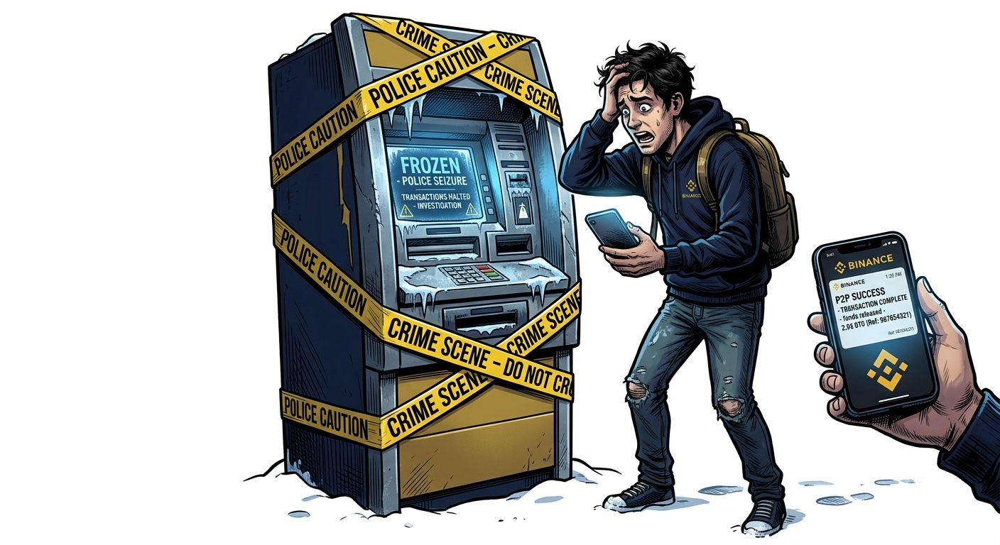
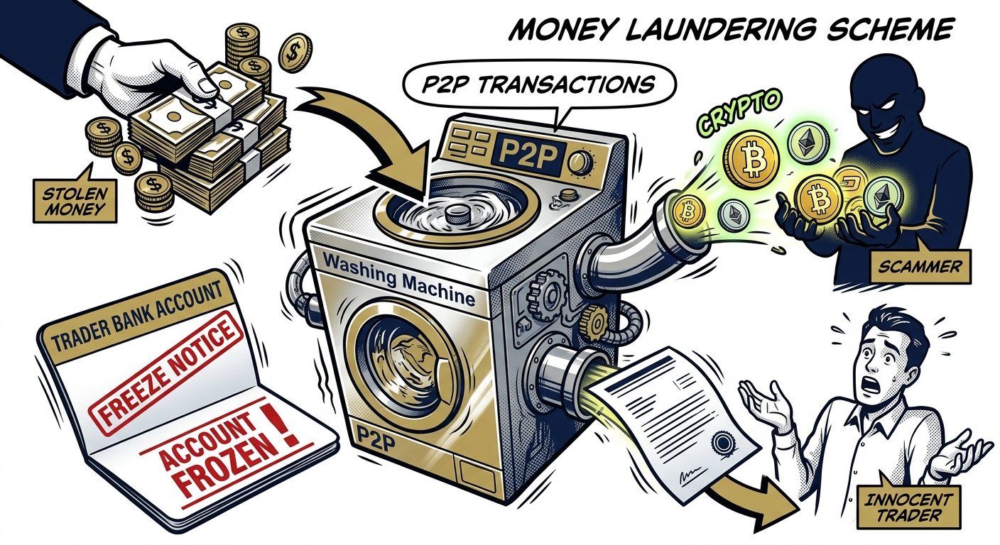

import NoticeTrap from '../../components/mdx/NoticeTrap.astro';
import CardPremium from '../../components/CardPremium.astro';

## The Prelude: A Tuesday Morning Lockout

It begins on a perfectly ordinary Tuesday. You are a 30-year-old marketing manager who occasionally dabbles in crypto. A week ago, you sold 500 USDT on Binance P2P because you saw a buyer offering a juicy 2% premium over the market rate. The ₹44,000 hit your primary HDFC salary account instantly via IMPS. You released the crypto, feeling like a genius for pocketing an extra ₹800.

Today, you are at a cafe trying to pay for a coffee. Your UPI declines. You swipe your debit card; it says "Contact Branch." Annoyed, you open your net banking app and see two terrifying words stamped across your dashboard: **Debit Freeze**.

You call customer care, but they refuse to explain, telling you to visit your home branch. When you finally get to the bank manager's desk, he hands you a printout with a generic email address: `cybercell.tvm@keralapolice.gov.in`. 

You live in Delhi. You have never been to Kerala. But a cybercrime investigator 2,500 kilometers away has just legally paralyzed your entire financial life—locking away your salary, your rent money, and your savings—over a crypto trade you thought was perfectly legal. 

Welcome to the Layering Trap.

<CardPremium title="TL;DR: The P2P Cyber Freeze Trap" variant="warning">
- **The Core Issue:** A scammer used stolen money to buy your USDT on Binance P2P. Because the stolen funds hit your bank account, you are flagged as a recipient in a cyber fraud investigation.
- **The Mechanics:** Under Section 102 CrPC (BNSS 106), police can freeze disputed funds. However, automated bank compliance systems illegally freeze your entire account instead of just the disputed amount.
- **The Defense:** Keep a strictly segregated "burner" bank account for P2P transactions. If frozen, demand a "Proportionate Lien" via the Investigating Officer or High Court, restricting only the disputed amount.
</CardPremium>

## The Mechanics: Why You Pay for Someone Else's Fraud

To understand why your account was frozen, you must stop thinking like an investor and start thinking like a cyber-criminal. 

When a scammer defrauds a victim (e.g., via a fake investment scheme or a phishing link), the victim transfers money to the scammer's bank account (Layer 1). The scammer knows the police will trace that account. To "wash" the stolen money and move it offshore, the scammer immediately goes to a P2P platform like Binance.

The scammer initiates a buy order with you. They transfer the stolen money directly from the victim's account (or a mule account) into *your* legitimate bank account. You see the money, assume the trade is complete, and release the untraceable crypto to them.

### The Chain Reaction
Three days later, the original fraud victim dials the National Cyber Crime Reporting Portal (1930) and files an FIR. 

The police cyber cell pulls the victim's bank statement and follows the money trail. They see the funds were transferred via IMPS to your account. To the police, you are not an innocent crypto trader; you are the primary recipient of stolen funds. 

They immediately issue a directive under **Section 102 of the Code of Criminal Procedure (CrPC)** (or Section 106 of the new BNSS), directing your bank to seize the funds pending investigation.

---

## The Institutional Failure: Lien vs. Total Freeze

The true nightmare of the P2P trap is the institutional laziness of the banking system. 

If you sold ₹44,000 worth of crypto, the disputed amount in the police FIR is exactly ₹44,000. Under the law, the bank is only obligated to secure the proceeds of the crime. The correct legal procedure is to place a **Proportionate Lien**—a hold of exactly ₹44,000—on your account, allowing you to freely spend the rest of your ₹10 Lakh salary balance.

Instead, automated bank compliance systems issue a blanket "Debit Freeze" on the entire account to avoid liability. 

<NoticeTrap title="The Section 91 Bluff">
**Trigger:** The police send an email to the bank under Section 91 CrPC, and the bank freezes your entire account based on this email.

**Resolution:** Section 91 CrPC only allows the police to request "documents or things" (like bank statements). It does NOT grant them the power to seize or freeze property. Only Section 102 CrPC (now Section 106 BNSS) authorizes a freeze. If your bank froze your account under Section 91, the freeze is procedurally illegal and can be challenged immediately.
</NoticeTrap>

## 360° Coverage: Your Legal Arsenal

If you find yourself caught in the Layering Trap, you are not powerless. High Courts across India have repeatedly slammed banks and police departments for these disproportionate, arbitrary freezes.

### 1. The High Court Proportionality Shield
Multiple High Courts (including the Madras, Delhi, and Gauhati High Courts) have ruled that freezing an entire bank account when only a small fraction is disputed is a violation of your fundamental right to livelihood (Article 21). 
If the bank refuses to lift the blanket freeze, you can file a Writ Petition under Article 226 in the High Court, which routinely orders banks to release the undisputed funds immediately.

### 2. The Supreme Court SOP (August 2026)
In a landmark move, the Supreme Court of India directed the RBI to issue a formal Standard Operating Procedure (SOP) regarding cyber-fraud debit holds. If your bank blindly freezes your entire account, escalate the issue to the Banking Ombudsman, citing the Supreme Court directive on proportionate freezing.

### 3. The Magistrate Notification Requirement
Under Section 106 of the BNSS, if a police officer seizes or freezes an account, they are legally mandated to report the seizure to the jurisdictional Magistrate "forthwith." In 90% of cyber-freeze cases, the police skip this step. If they haven't informed the Magistrate, the continued freeze lacks judicial oversight and is vulnerable to being struck down.

## The Ultimate Defensive Posture

You cannot control whether a scammer tries to use your P2P ad to wash money. But you can entirely neutralize the damage by changing your operational architecture.

1. **The Burner Account:** Never connect your primary salary or savings account to a crypto exchange. Open a zero-balance current account or a secondary savings account strictly for P2P trading. If that account gets frozen, your life continues uninterrupted.
2. **Zero Third-Party Tolerance:** If the name on the incoming IMPS transfer does not perfectly match the verified KYC name on the buyer's Binance profile, refund the money immediately and cancel the trade. Do not accept the excuse that they are "paying from their wife's account."
3. **The Audit Trail:** Treat every P2P trade like a corporate transaction. Save the Binance order receipt, screenshot the chat logs, and download the counterparty's profile. When the Cyber Cell comes knocking, overwhelm them with proof that you are a legitimate merchant, not a co-conspirator. 
