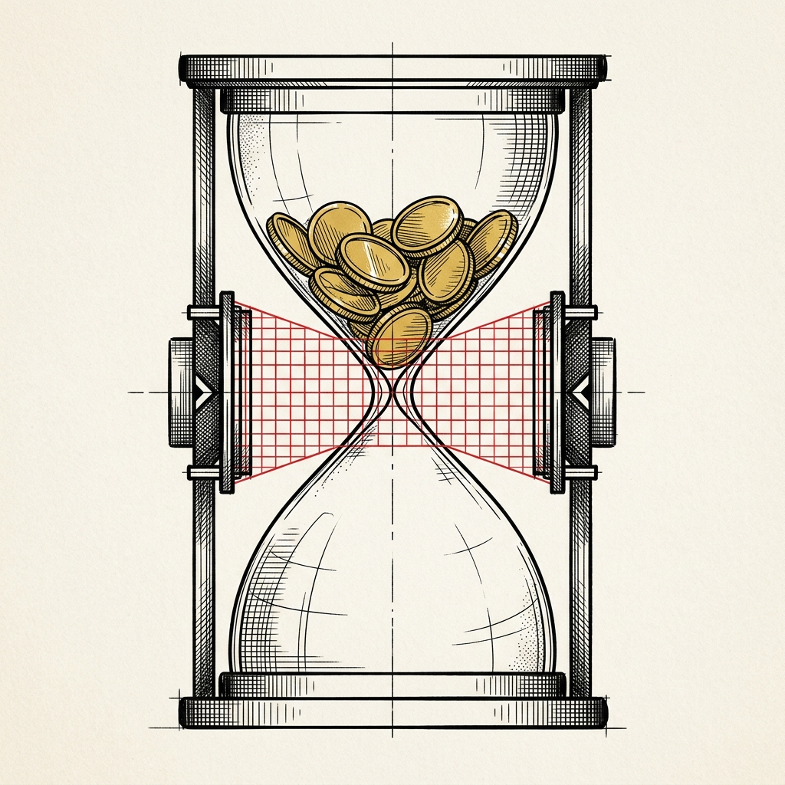
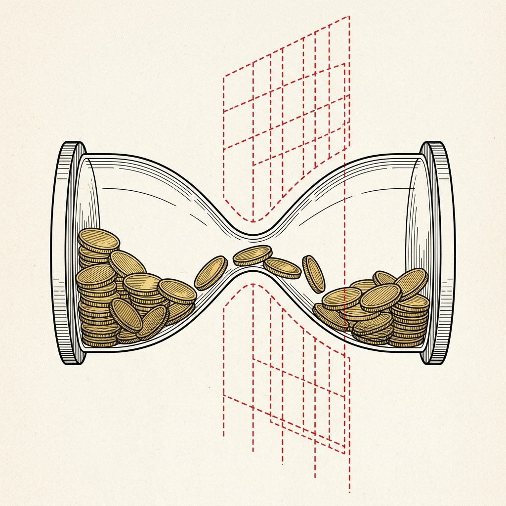

import CardPremium from '../../components/CardPremium.astro';
import NoticeTrap from '../../components/mdx/NoticeTrap.astro';

## "I withdrew my own money. Why am I paying a 30% penalty on it?"

You spent three years at a high-growth startup before securing a lucrative offer at an enterprise tech firm. During the transition, you realize you have a tidy sum sitting in your Employees' Provident Fund (EPF) from the startup. Instead of dealing with the administrative friction of transferring it to your new employer, you click "Withdraw" on the EPFO portal. 

The government deducts a flat 10% TDS, the balance hits your bank account, and you assume the matter is settled. 

Two years later, your Annual Information Statement (AIS) flags a massive discrepancy. You receive an under-reporting notice under Section 148A. The Income Tax Department is demanding tax at your actual 30% slab rate, plus compounding interest under Sections 234B and 234C. 

You didn't just pay a penalty. You accidentally detonated a retroactive tax bomb. 

"The tax shield fractures the moment you break the five-year lock."

<CardPremium title="TL;DR: The Tax-Free Shield & The Transfer Defense">
- **The Core Mechanic:** EPF enjoys the coveted Exempt-Exempt-Exempt (EEE) status only if you complete 5 years of *continuous* service. Withdrawing early breaks this unwritten contract, causing the tax department to retroactively tax the entire corpus.
- **The UAN Illusion:** Your Universal Account Number (UAN) does not automatically merge your job tenures. If you switch jobs and do not manually transfer your EPF, the 5-year clock on the old account remains permanently frozen. 
- **The 2026 Reality:** The TDS mechanics are shifting from the old Section 192A to **Section 392(7)** under the new Income Tax Act, 2025.
- **The Ultimate Defense:** Never withdraw when switching jobs. Always initiate a transfer. A transferred balance merges the tenures of both employers, preserving your tax-free shield.
</CardPremium>

## The Unwritten Contract of Tax-Free Growth

To understand why the tax department pursues early withdrawals with such aggression, you have to look at the foundational logic of the Provident Fund. 

The EPF is designed to be untouchable wealth. Your contributions are exempt, the interest accumulates exempt, and the final withdrawal is exempt. The government allows your wealth to compound in a tax-free vacuum for one specific reason: **they are subsidizing your retirement, not your next vacation.**

The 5-year continuous service rule (Rule 8 of Part A of the Fourth Schedule) is the price of that privilege. When you withdraw early for liquidity, you break the contract. 

In response, the Income Tax Department builds a localized time machine. They travel back to the exact years you contributed, strip away your tax exemptions, recalculate your historical tax liability as if the EPF never existed, and drop the accumulated bill in your present-day lap.

## How the Tax Bomb Fractures Your Money

When the bomb detonates, your withdrawal is fractured into four distinct components, each taxed differently.

### The Employer Match
Your employer's contribution was completely tax-free when deposited. Upon early withdrawal, the entire principal is un-exempted and added to your current year's *Income from Salary*.

### The Employer Interest
The interest earned on the employer's portion is also ripped from its tax-free vacuum and taxed fully as *Income from Salary*.

### The 80C Reversal
Because your own contribution was made using post-tax income, the principal itself isn't taxed again. However, if you claimed Section 80C tax deductions on these contributions in previous years, those deductions are violently reversed. The exact amount you claimed is added back to your taxable income.

**The New Tax Regime Advantage:** 
Here is a massive, modern nuance for young earners. Since Budget 2023, the New Tax Regime has been the default, and it *does not allow Section 80C deductions*. If you started working recently and opted for the New Tax Regime, you never claimed an 80C deduction for your EPF. Therefore, **this specific reversal is a complete dud for you.** There is nothing to reverse. Only the employer's share and the interest will detonate.

### The Employee Interest
The interest earned on your own money becomes fully taxable, but under the head *Income from Other Sources*, not Salary.

## The UAN Illusion

The state relies on algorithmic compliance, but taxpayers routinely fall into the dragnet due to a distinct psychological blindspot: the UAN Illusion. 

Because you possess a single Universal Account Number, you naturally assume your EPF tenures automatically merge when you switch jobs. They don't. 

The UAN is just an umbrella. The actual Provident Fund accounts underneath it are isolated silos. If you work at Company A for 3 years, and Company B for 2 years, your total industry tenure is 5 years. But if you try to withdraw the Company A silo without formally transferring it to Company B first, the EPFO algorithm only sees a 3-year tenure. The withdrawal is fully taxed. 

<NoticeTrap title="The TDS Illusion: 10% is not the Final Tax">
If your withdrawal exceeds ₹50,000 before 5 years, the EPFO deducts a 10% TDS. 

The psychological trap is assuming that because the government took its 10% cut at the source, your tax obligation is settled. In reality, if your actual income places you in the 30% slab, you owe the government the remaining 20% differential. 

Failing to report the remaining 20% in your ITR triggers the AIS mismatch algorithms. By the time the notice arrives two years later, Sections 234B and 234C have compounded the deficit with brutal interest penalties. 
</NoticeTrap>

## The State's Escape Hatches

The state does not punish genuine misfortune. Under Rule 8, the 5-year requirement is waived, and the withdrawal remains 100% tax-free, if you were forced to quit due to circumstances beyond your control. This includes:

- **Medical Emergencies:** Termination due to severe ill health.
- **Structural Collapse:** The business contracted or shut down operations entirely.
- **Mass Layoffs:** If heavily documented, a systemic termination beyond your control can qualify, though this is heavily scrutinized.

## The Transfer Defense (Key Takeaways)

"A single exit remains for those who transfer, rather than withdraw."

For the vast majority of professionals, there is only one viable defense against the tax bomb. 

- **Always Transfer, Never Withdraw:** When you switch jobs, log into the UAN Member portal and initiate a transfer from your old employer to your new one. 
- **Tenure Merging:** A successful transfer merges the tenures. If you transfer a 3-year account into a 2-year account, you have crossed the 5-year threshold. The entire consolidated corpus is now permanently tax-free.
- **The Form 121 Update:** If you *must* withdraw early, and your total taxable income is below the basic exemption limit, you can prevent the 10% TDS deduction. From April 1, 2026, submit the new **Form 121** (replacing the old Form 15G/15H) directly to the EPFO.
