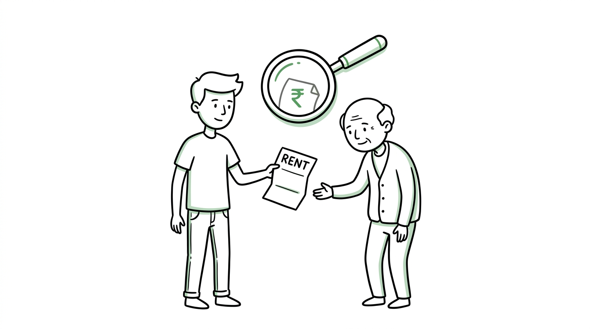
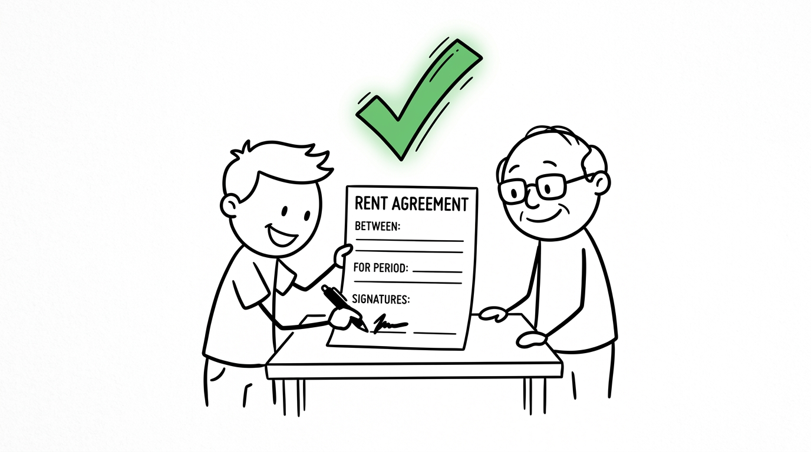

import NoticeTrap from '../../components/mdx/NoticeTrap.astro';

import HRAExemptionWorkbench from '../../components/mdx/HRAExemptionWorkbench.astro';

## 1. The True Origin of HRA

To survive an Income Tax audit, you must first understand *why* the law exists. Why does the government willingly let you shield lakhs of rupees from taxation just because you pay rent?

We have to rewind to post-independence India. The government desperately needed to industrialize. They needed talent to migrate from villages and tier-3 towns to massive urban centers like Bombay, Delhi, and Bangalore. But there was a massive problem: **a severe housing shortage.**

There were no sprawling apartment complexes. The government couldn't build housing fast enough. So, they made a deal with the private sector: *If you pay your employees an allowance specifically to rent a house in these expensive cities, we won't tax that specific portion of their salary.* 

Thus, Section 10(13A) was born. It was an economic bribe to drive urbanization.

## 2. The Cat and Mouse Game (How the Loophole was Weaponized)

For decades, HRA was the most easily manipulated section in the entire Income Tax Act. It triggered a literal arms race between the Indian salaried class and the Central Board of Direct Taxes (CBDT).

### The 1990s: The Era of Fake Receipts
In the early days, "rent" was just a piece of paper. Employees would buy a booklet of generic rent receipts from a local stationery shop for ₹20, fill them out with fake names, sign them, and hand them to HR. The IT department, drowning in paper files, had absolutely no way to verify if a landlord actually existed. The system bled billions in tax revenue.

### The Retaliation: The PAN Mandate
The government struck back. They changed the rules: *If your rent exceeds ₹1,00,000 a year, you must submit your landlord's PAN card to your employer.* The era of fake names died overnight. 

### The Counter-Move: Rent to Parents
Taxpayers are remarkably adaptive. They couldn't use fake PANs, so they looked inside their own homes. *What if I just pay rent to my mother? She has a PAN card, but she is a homemaker with zero taxable income!* 
Suddenly, millions of employees were legally shifting their taxable salary to their parents in the lowest tax brackets, claiming massive HRA exemptions while the money never actually left the family.

### The Present Day: The AI Grid (AIS)
The government realized they were losing the war. They couldn't ban paying rent to parents (because family members are legally allowed to enter into commercial contracts). Instead, they built a surveillance grid. 

Today, when you submit your parent's PAN card for HRA, an Artificial Intelligence system called the **Annual Information Statement (AIS)** instantly links your ITR to your parent's ITR. If your parent does not declare that exact rental income on their tax return, the algorithm flags your PAN, rejects your HRA, and automatically dispatches a demand notice with a 200% penalty. 

The era of the "casual loophole" is dead. Today, you must treat your parents exactly like a ruthless corporate landlord.

## 3. What is the regulation regarding this specific transaction?

To claim HRA by paying rent to your parents today, you must construct an unbreakable paper trail that perfectly mirrors a standard, arms-length commercial relationship. The tax department looks for three non-negotiable legal pillars:

### Pillar 1: Absolute Ownership Title
You cannot pay rent to yourself. The property MUST be legally registered in the name of your parent(s). 
- If you are a co-owner of the property (e.g., you and your father jointly bought it), you cannot claim HRA for living in your own house.
- If the house is in your father's name, you must transfer the rent specifically to your father's bank account, not your mother's.

### Pillar 2: The Digital Money Trail 
The rent must be transferred digitally (NEFT/RTGS/UPI) from your bank account to your parent's bank account every single month. The narrative in your bank statement must explicitly read "Rent for Month X". Cash is no longer a defensible medium in a tax tribunal.

### Pillar 3: Symmetrical Tax Declaration (The AIS Match)
As mentioned, if you declare ₹3 Lakhs as rent paid in your ITR to claim HRA, your parent **must** declare exactly ₹3 Lakhs as "Income from House Property" in their ITR. Symmetrical compliance is the only way to survive the AI grid.

## 4. How can I minimize my risk of non-compliance? (Notice Traps)

If the Income Tax Officer determines your arrangement is a "sham transaction" designed solely for tax evasion, they will invoke **Section 270A**, levying a brutal penalty of 200% of the tax evaded. Avoid these traps at all costs:

<NoticeTrap title="Trap 1: Missing the Registered Rent Agreement">

**Scrutiny Trigger:** Claiming ₹4 Lakhs in HRA based solely on bank transfers without a formal legal contract.

**Resolution Strategy:** A verbal agreement with your parents has no standing in a tax tribunal. You must execute a formal, notarized Rent Agreement on a stamp paper (typically ₹100 or ₹500 depending on state laws) clearly stating the rent amount, premises details, and tenant-landlord relationship. Renew this every 11 months.

</NoticeTrap>

<NoticeTrap title="Trap 2: Failing to Deduct TDS under Section 194-IB">

**Scrutiny Trigger:** You pay your parents ₹55,000 per month in rent, but you do not deduct TDS.

**Resolution Strategy:** Section 194-IB mandates that if your monthly rent exceeds ₹50,000, you are legally required to deduct 5% TDS and deposit it with the government using Form 26QC. If you fail to do this, you will face severe penalties, and your entire HRA claim will be disallowed.

</NoticeTrap>

## 5. How can I save money? (The Mathematical Sweet Spot)

Before setting up the rent agreement with your parents, you must calculate exactly how much rent you mathematically need to pay to maximize your Section 10(13A) exemption. 

**Do not blindly pay your entire salary as rent.** Paying more rent than necessary simply inflates your parent's taxable income without giving you any extra HRA exemption. 

Your exemption is the **least of the following three**:
1. Actual HRA received from your employer.
2. 50% of Basic Salary (Metro) or 40% (Non-Metro).
3. Actual Rent Paid minus 10% of Basic Salary.

Use the interactive workbench below to find your mathematical sweet spot.

<HRAExemptionWorkbench 
  defaultBasicSalary={800000}
  defaultHraReceived={300000}
  defaultRentPaid={240000}
  instruction="Enter your exact Basic Salary and HRA Received from your payslip. Adjust the 'Total Rent Paid' slider to find the exact point where your Exemption is maximized, without paying a rupee more than necessary."
/>

## 6. The Family Dinner Awkward Questions

Make sure you aren't falling into these obscure technicalities:

### Edge Case 1: Paying Rent to a Spouse
- **The Catch:** While paying rent to parents is accepted by tribunals, paying rent to a husband or wife is universally rejected by the Income Tax Department under the "Clubbing of Income" provisions (Section 64). The department views spouses living together as a single economic unit, making the rent a sham transaction.

### Edge Case 2: Your Parents' Standard Deduction
- **The Loophole:** When your parents declare the rent as income, they do not pay tax on the full amount. Section 24(a) grants a flat **30% Standard Deduction** for maintenance. So, if you pay them ₹3 Lakhs, they only pay tax on ₹2.1 Lakhs. Furthermore, if they are senior citizens, they have a higher basic exemption limit (₹3 Lakhs), meaning this strategy can effectively make the entire rental income tax-free for the household.

### Edge Case 3: Maintenance and Utility Bills
- **The Catch:** Do not include electricity, water, or society maintenance bills in the "Rent" amount on the rent receipt unless the agreement explicitly states it is a composite rent. If the society bill is in your father's name but you pay it directly to the society, you cannot claim it as HRA rent.

## 7. 💡 Key Takeaway Summary & Actionable Checklist

*   **Draft the Agreement Today:** Execute a formal, notarized 11-month Rent Agreement on stamp paper with your parent.
*   **Set up the Auto-Pay:** Cancel any cash arrangements. Set up a recurring NEFT transfer on the 1st of every month with the remark "Rent".
*   **Collect the PAN:** Submit your parent's PAN to your employer's payroll portal (Mandatory if annual rent exceeds ₹1 Lakh).
*   **File their ITR:** Ensure you physically file your parent's ITR at the end of the year, declaring the rent under "Income from House Property".
*   **Check the ₹50k Limit:** If the rent exceeds ₹50,000 per month, immediately register on the TRACES portal to deduct 5% TDS.
