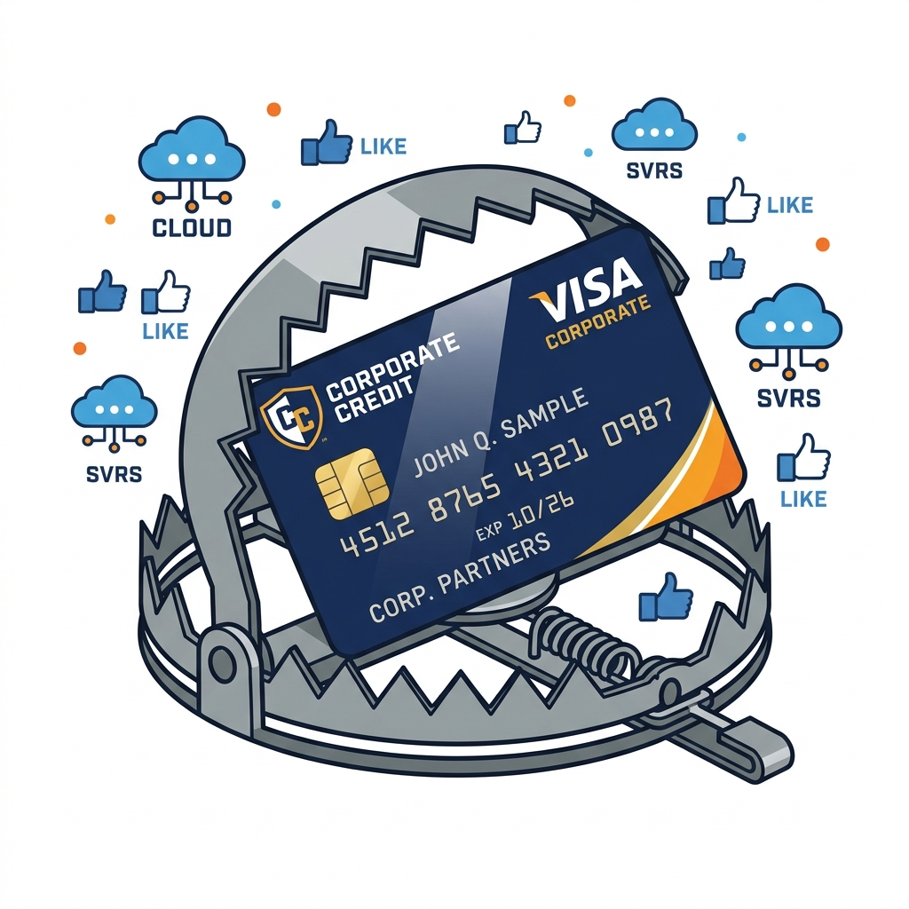

import NoticeTrap from "../../components/mdx/NoticeTrap.astro";
import CardPremium from "../../components/CardPremium.astro";
import TaxWorkbench from "../../components/mdx/TaxWorkbench.astro";

# A Simple Swipe That Could Cost You Lakhs

{/* Image: Varsity style illustration of a shocked small business owner looking at a corporate credit card while a massive tax bill falls on them. Pure white background. */}

<CardPremium title="TL;DR: The SaaS Credit Card Trap" variant="warning">
- **The Core Issue:** Paying for foreign SaaS (AWS, Facebook Ads) via credit card without deducting TDS is a severe tax violation.
- **The Mechanics:** Under Section 195, you must deduct tax on foreign technical payments. If you fail, Section 40(a)(i) completely disallows the expense, artificially inflating your taxable profit.
- **The Defense:** Stop using credit cards for large foreign SaaS bills. Switch to invoice billing and "Gross Up" the tax from your own pocket if the vendor refuses a TDS deduction. Always demand to be billed by the Indian subsidiary if they have one.
</CardPremium>

> *"My startup spent ₹15 Lakhs on Facebook Ads, Google Workspace, and AWS servers last year. I paid for all of it using my founder corporate credit card. During my tax audit, the assessing officer disallowed the entire ₹15 Lakh expense because I didn't deduct TDS. My taxable profit artificially jumped by ₹15 Lakhs, and now I owe a massive tax bill on money I already spent!"*

If you are a modern small business owner, freelancer, or startup founder, the corporate credit card is your best friend. It auto-renews your domains, pays for your CRM, and keeps your server infrastructure humming without you ever having to look at an invoice.

But beneath this seamless convenience lies a catastrophic tax trap. 

When you swipe your card to pay a foreign tech giant, Visa and Mastercard do not pause the transaction to withhold income tax on behalf of the Indian government. The money leaves your account in full. And according to the Income Tax Department, that makes you a tax evader.

## 1. The Death of the Equalisation Levy & Rise of Section 195

To understand why this is happening *now*, we need to look at the historical intent of the government. 

For years, the Indian government struggled to tax tech giants like Google and Meta because they didn't have a "Permanent Establishment" (PE) in India. To counter this, India introduced the **Equalisation Levy (EL)** (often dubbed the "Google Tax")—a flat 2% or 6% tax on digital advertising and e-commerce. It was controversial, but it was a separate levy outside the standard Income Tax Act.

However, yielding to international pressure and the OECD's global minimum tax framework, India officially phased out the Equalisation Levy. 

This did not mean foreign tech giants got off scot-free. It meant they were pulled directly into the brutal, unforgiving machinery of the standard Income Tax Act—specifically **Section 195**.

### What is Section 195?
Section 195 mandates that anyone making a payment to a non-resident for technical services, royalty, or professional fees **must deduct Tax at Source (TDS)** before remitting the money. 

When you pay for Facebook Ads, you are paying for digital advertisement services. When you pay for AWS, you are paying for cloud infrastructure (often categorized as Royalty or Fees for Technical Services). Therefore, the legal burden falls entirely on *you* to deduct the tax before the foreign company gets paid.

## 2. The Brutal Consequence: Section 40(a)(i) Disallowance

So, what happens if you just auto-swipe your card and fail to deduct this tax? The Income Tax Department doesn't just ask you politely for the missing TDS. They deploy the nuclear option.

<NoticeTrap title="100% Expense Disallowance">
Under **Section 40(a)(i)** of the Income Tax Act, if tax is deductible on a foreign payment under Section 195 but is not deducted, **100% of the expense is disallowed** while calculating your business income. 
</NoticeTrap> 

Let's break down the mathematical devastation of this rule:
1. Your business earns ₹50 Lakhs in revenue.
2. You spend ₹20 Lakhs on legitimate operations (salaries, rent, etc.).
3. You spend ₹15 Lakhs on Meta Ads and AWS via credit card (No TDS deducted).
4. **Your actual profit:** ₹15 Lakhs. 
5. **Your taxable profit according to the AO:** ₹30 Lakhs (because the ₹15 Lakh SaaS expense is disallowed and added back).

You will be forced to pay 30% income tax on ₹30 Lakhs (₹9,000,000) instead of ₹15 Lakhs (₹4,50,000). A simple credit card swipe just cost you ₹4.5 Lakhs in pure phantom tax, not including the brutal Section 234 interest for delayed payment.

Furthermore, you can be declared an **"Assessee in Default" under Section 201(1)**, meaning you are also personally liable to pay the TDS you failed to deduct, plus a penalty equal to the TDS amount under Section 271C.

## 3. The Escape Hatch: "Grossing Up" (Section 195A)

The obvious solution is to just deduct the TDS. But here is the reality of doing business with trillion-dollar tech monopolies: **Meta and Amazon do not care about your local tax laws.**

If your AWS bill is $1,000, and you try to remit them $900 (keeping 10% for Indian TDS), AWS will simply suspend your servers for underpayment. They demand the full $1,000, no exceptions.

How do you legally comply with Indian law while keeping your servers online? You must use a mechanism called **Grossing Up (Section 195A)**.

### How Grossing Up Works
Grossing up means you bear the burden of the TDS from your own pocket. You pay the foreign vendor their full amount, and then you calculate the tax on top of that amount and deposit it with the Indian government yourself.

<CardPremium>
### The Gross-Up Math (Assuming 10% TDS)
If the invoice is for ₹1,00,000, and you must pay them ₹1,00,000 in full:
- You cannot just pay ₹10,000 in tax. 
- You must treat the ₹1,00,000 as the *net* amount after a 10% deduction.
- **Gross Amount Formula:** Net Amount / (1 - TDS Rate)
- **Gross Amount:** ₹1,00,000 / (1 - 0.10) = ₹1,11,111
- **TDS to be paid from your pocket:** ₹11,111.
</CardPremium>

By depositing this ₹11,111 against the vendor's PAN (or maintaining records if they lack an Indian PAN), you legally comply with Section 195. Yes, the software just became 11% more expensive for you, but you successfully saved your ₹1,00,000 expense from being disallowed under Section 40(a)(i).

## 4. The DTAA Shield & Form 15CA/CB

If you are paying a company based in a country that has a Double Taxation Avoidance Agreement (DTAA) with India (like the USA, Ireland, or Singapore), you can often drastically reduce the TDS rate. For example, instead of a blanket 20% withholding rate, the DTAA might cap Royalty/FTS taxes at 10%.

To legally claim this reduced rate, you must:
1. **Obtain a TRC:** Ask the foreign vendor for their Tax Residency Certificate (TRC). Most large tech companies have this readily available on their billing portals.
2. **File Form 15CA/15CB:** Before making the foreign remittance, you must file Form 15CA on the income tax portal. If the remittance exceeds ₹5 Lakhs in a year, you also need Form 15CB, which requires a Chartered Accountant's certification.

## 5. The 360-Degree Edge Cases

**"What if I just pay the Indian subsidiary?"**
If you are billed by AWS India (Amazon Internet Services Pvt Ltd) or Google India, the rules change entirely. You are no longer making a foreign remittance. You simply deduct domestic TDS under Section 194C (Contract) or 194J (Professional Services) at 2% or 10%. This is the safest and most preferred route. **Always switch your billing entity to the Indian subsidiary if they offer one.**

**"What if my total foreign spend is under ₹7 Lakhs? Does LRS protect me?"**
The Liberalised Remittance Scheme (LRS) allows individuals to remit up to $250,000 per year, with TCS kicking in after ₹7 Lakhs. **LRS does not exempt you from Section 195.** LRS is a FEMA regulation regarding foreign exchange limits; Section 195 is an Income Tax regulation regarding withholding tax on income. If the payment is for a taxable service, Section 195 applies from Rupee One.

## 💡 Key Takeaway Summary & Actionable Checklist

*   **Cancel the Auto-Debits:** Stop using corporate credit cards for major foreign SaaS and advertising expenses. The convenience is not worth the disallowance risk.
*   **Switch to Invoicing & Wire Transfers:** Force the vendor to issue a monthly invoice. Pay them via wire transfer only after filing Form 15CA/CB and calculating the required gross-up tax.
*   **Audit Your Billing Entities:** Check your current invoices. If you are being billed by a foreign entity, contact their support and demand to be migrated to their Indian subsidiary to simplify compliance to domestic 194C/194J TDS.
*   **Collect TRCs Annually:** If you must pay the foreign entity, download their Tax Residency Certificate every financial year to legally claim the lower DTAA tax rates.

{/* 
100-Second Reel Script:

[HOOK: Visual of an entrepreneur happily swiping a corporate credit card. A massive red stamp reading "DISALLOWED" slams over the card.]
Are you paying for Facebook Ads or AWS servers with your corporate credit card? You might be falling into the deadliest tax trap for small businesses.

[Visual: A split screen. On the left, money going to AWS. On the right, the Indian Government with an empty hand.]
When you swipe your card, Visa and Mastercard send the full amount to the foreign tech giant. But under Section 195, the Income Tax department requires YOU to deduct withholding tax before that money leaves India.

[Visual: A Profit & Loss statement. The expense line item is crossed out in red ink, and the profit number doubles.]
What happens if you don't? The government uses Section 40(a)(i). They completely disallow the expense. If you spent ₹15 Lakhs on ads, they erase it from your books. Your taxable profit instantly jumps by ₹15 Lakhs, and you owe massive taxes on money you already spent!

[Visual: An invoice with a new line item added: "Gross Up Tax paid from own pocket".]
The solution? Stop swiping. Switch to invoice billing. If the tech giant refuses to take a tax cut, you must "Gross Up" the payment—meaning you pay the tax from your own pocket directly to the Indian government. 

[Visual: A shield icon with "Form 15CA/CB" written on it.]
It makes the software slightly more expensive, but it saves you from being financially ruined in a tax audit. File your Form 15CA, get their Tax Residency Certificate, and consult your CA today. Follow FinSights for more business survival guides!
*/}
