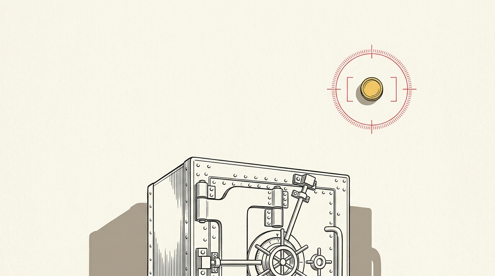
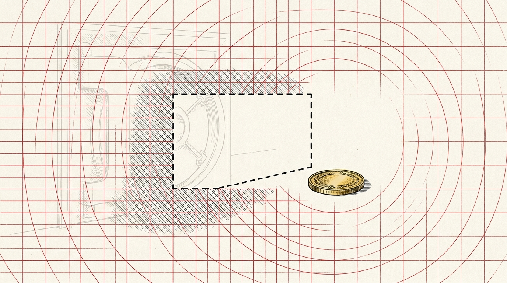

import CardPremium from '../../components/CardPremium.astro';
import NoticeTrap from '../../components/mdx/NoticeTrap.astro';

## "I didn't evade a rupee. Why am I being charged under the Black Money Act?"

You are a returning Non-Resident Indian (NRI) who moved back to Bangalore four years ago. Or perhaps you are a mid-level tech employee who was granted a few dozen Restricted Stock Units (RSUs) by your US-headquartered employer on E*Trade. 

You file your Income Tax Return diligently. You have a dormant Bank of America checking account with $50 sitting in it from your time abroad, or you hold those vested RSUs. Because they generate zero income—or because you already paid perquisite tax on the RSUs when they vested—you don't bother declaring them in "Schedule FA" (Foreign Assets) of your ITR. 

Two years later—or, increasingly, within just months of filing—you receive an absolutely terrifying notice from the Income Tax Department. You are being charged under the *Black Money (Undisclosed Foreign Income and Assets) and Imposition of Tax Act, 2015*. The demand? A flat, non-negotiable penalty of **₹10 Lakhs**.

For a $50 account (roughly ₹4,760 today), you are facing a **21,000% penalty** relative to the asset's value. 

The tragedy isn't just the sheer scale of the penalty for a clerical error. It's the fact that as of July 2026, the tax department actively handed you the answer key before you filed, and you ignored it.

{/* Placeholder: We will generate this using the bespoke modern art FinSight standard after drafting */}

"The grid doesn't scale with the crime."

<CardPremium title="TL;DR: The FAST-DS Amnesty & AIS Defense">
- **The Core Mechanic:** Section 43 of the BMA imposes a flat ₹10 Lakh penalty for failing to disclose a foreign asset in Schedule FA, regardless of your intent or whether tax was evaded. 
- **The Specific Trap:** Conflating tax payment with disclosure. Paying tax on RSUs does not exempt you from declaring the holding. Returning expats also routinely fall into the "RNOR-to-ROR Transition Trap" in their fourth year back.
- **Bottom-line Defense:** Do not wait for a notice. The new **FAST-DS 2026** amnesty window closes **December 31, 2026**. It grants automatic immunity from the BMA penalty for small taxpayers. If you missed Schedule FA, this is your emergency exit.
</CardPremium>

## When a Blunt Instrument Catches the Wrong Fish

To understand why a law named the "Black Money Act" is destroying mid-level IT employees, you have to look at the macroeconomic environment of 2015.

The BMA was engineered to hunt offshore tax evasion—Swiss bank accounts, shell companies in tax havens, and undeclared yachts. The state wanted absolute deterrence. Consequently, Section 43 was designed as a deliberately blunt instrument: a flat ₹10 Lakh penalty for non-disclosure. The penalty was not graduated based on the asset's value because a graduated penalty is easy to litigate around. The state wanted terror, not nuance.

But a blunt instrument calibrated for offshore criminals inevitably guts honest mistakes once the detection pipeline becomes automated. 

The Indian government receives automatic data feeds from foreign brokers and banks via FATCA (US) and CRS (100+ other jurisdictions). This Automatic Exchange of Information (AEOI) pipeline cross-references your PAN against your Schedule FA. The algorithm does not care if the mismatch is a ₹500 Crore offshore trust or a $50 checking account. It fires identically.

### The State's Self-Correction

By 2026, the state watched its own dragnet catch the wrong fish so repeatedly that it had to adjust the net rather than admit the net was wrong. They did this in three successive waves:
1. **Raising the Threshold:** In 2024, they raised the penalty-free threshold from ₹5 Lakhs (bank accounts only) to **₹20 Lakhs** (aggregate value of all foreign assets excluding real estate). 
2. **The Transparency Push (July 2026):** The CBDT quietly started pushing FATCA/CRS data directly into taxpayers' Annual Information Statements (AIS).
3. **The Emergency Exit (August 2026):** The launch of the FAST-DS amnesty window.

## The Information Pipeline and the Mismatch Traps

Even with these corrections, taxpayers are walking straight into the buzzsaw because of three psychological blindspots.

### Trap 1: The RNOR Transition
Non-Residents and Resident but Not Ordinarily Residents (RNORs) are explicitly exempt from filing Schedule FA. Returning expats enjoy this RNOR shield for 2 to 3 years post-return. 

The trap snaps shut the year your ROR (Resident and Ordinarily Resident) status begins. You file your ITR out of habit, skipping Schedule FA just like you did for the last three years, and instantly commit a BMA violation for assets you acquired *before* you even became a resident. 

### Trap 2: Tax Paid ≠ Disclosed
RSU and ESPP holders pay a perquisite tax on vesting, and capital gains tax upon sale. Because the asset has been "taxed," they assume it doesn't need to be declared. 

Schedule FA is a *disclosure* schedule, entirely independent of taxation schedules. Paying tax on an asset is not a legal defense for failing to disclose its existence.

<NoticeTrap title="Trap 3: The AIS False-Comfort">
As of July 8, 2026, CBDT pushes foreign asset data into your AIS. You can log into the e-Filing portal → AIS → Reports → "Foreign Assets Information". 

**The Trap:** Schedule FA reports on the *Calendar Year* (Jan 1 – Dec 31) of the foreign jurisdiction, not the Indian Financial Year. If you check your AIS in August 2026 before filing, you will see CY2022–2024 data. **CY2025 data will not populate until September/October 2026—after you have already filed your ITR.**

AIS silence in August proves absolutely nothing about your 2025 holdings. Do not use a clean AIS report today as an excuse to skip manual Schedule FA declarations for last year.
</NoticeTrap>

## The Three Tiers of Rescue

If you have undisclosed foreign assets, the old advice was to carefully track your RNOR expiry. Today, the advice is much sharper and highly time-sensitive.

"One exit, cut on purpose — open until December 31."

### Primary Defense: FAST-DS 2026 (The Headline Rescue)
Announced in the Union Budget 2026 and formally notified this month, the Foreign Assets of Small Taxpayers Disclosure Scheme (FAST-DS) is a one-time voluntary disclosure window that **closes on December 31, 2026**. 

If you hold undisclosed foreign assets up to ₹5 Crores, you can use this window to pay a reduced composite liability (roughly 60%). The critical benefit? Using FAST-DS grants you **automatic, non-discretionary immunity** from the ₹10 Lakh BMA penalty and prosecution. If you are sitting on an undisclosed E*Trade account, this is your first and only call. 

### Secondary Defense: Proactive AIS Verification
Use the new CBDT transparency tool. Reconcile the "Foreign Assets Information" tab in your AIS for the previous calendar years against your own statements. If the state already knows about a mismatch from CY2023, you need to file an updated return or use FAST-DS immediately before the algorithmic notice is generated.

### Tertiary Defense: The "May vs. Shall" Litigation
If you miss the December 31 deadline and receive a ₹10 Lakh notice, you are forced into the tribunals. 

Section 43 states the Assessing Officer *"may"* direct that the person *"shall"* pay the penalty. A 2025 Mumbai Special Bench ruling (*Vinil Venugopal & Ranjeeta Vinil*) confirmed that "may" governs *whether* to impose a penalty at all for bona fide mistakes, while "shall" only fixes the amount at ₹10 Lakhs if imposed.

If you have a documented, explainable reason for the gap (e.g., a deceased parent's account), tribunals have struck down the penalty. But this is a coin toss. In *Shobha Harish Thawani*, the tribunal upheld the full penalty for an "unintentional omission" because the taxpayer couldn't prove arbitrary discretion. 

After December 31, 2026, you will be back to arguing semantics in a tribunal that rules against taxpayers just as often as it rules for them. Check your AIS, consolidate your statements, and use the amnesty window while it's still open.

## The Dec 31 Deadline (Key Takeaways)

- **Check AIS Now:** Access your "Foreign Assets Information" to see what CBDT already knows about your 2022-2024 calendar year holdings. Do not let August silence lull you into ignoring CY2025.
- **Track the ROR Transition:** Returning expats must file Schedule FA the year their RNOR status expires, regardless of whether tax was previously paid on the asset.
- **Use FAST-DS 2026:** If you have an undisclosed foreign asset under ₹5 Crore, declaring it before December 31, 2026, guarantees immunity from the ₹10 Lakh BMA penalty. After that date, you are at the mercy of tribunal discretion.
