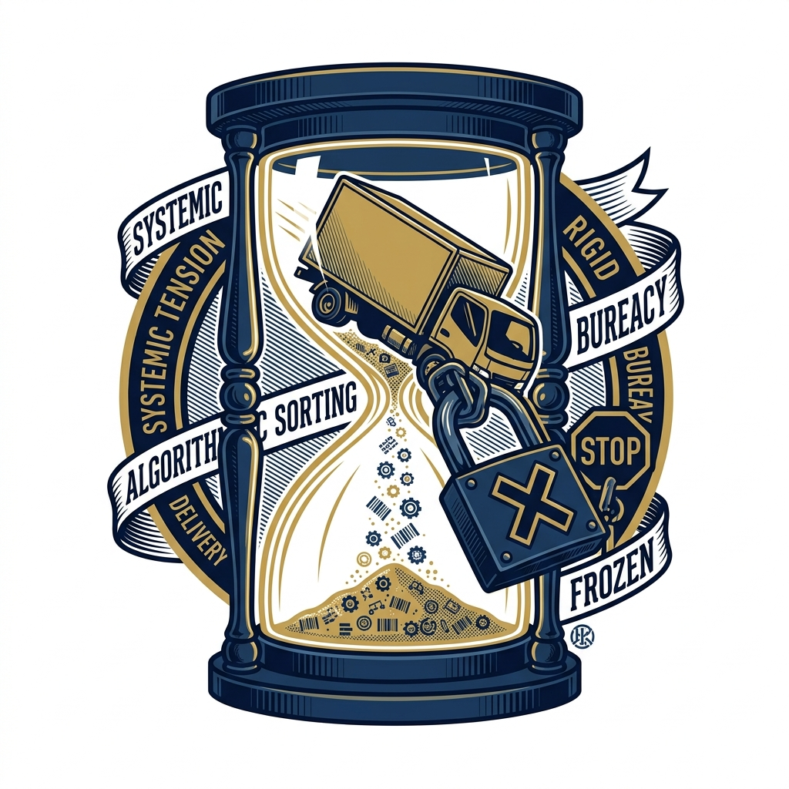

import CardPremium from '../../components/CardPremium.astro';
import HeroEwayExpiry from '../../components/illustrations/HeroEwayExpiry.astro';
import InsetDistanceClock from '../../components/illustrations/InsetDistanceClock.astro';
import InsetExtensionWindow from '../../components/illustrations/InsetExtensionWindow.astro';

Imagine the frustration of the logistics team calling you at 3:00 AM. The invoice is clean, the goods are fully accounted for, and the GST is declared in your standard return. But because a truck broke down or hit a massive traffic jam, the digital transit clock expired at midnight. The goods were intercepted just a few hours later. 

*"I am not a smuggler,"* you think. *"The goods are legitimate. The tax is paid. We were just two hours late."* 

Yet, the mobile squad officer has just hijacked your ₹50 Lakh shipment and is demanding an ₹18 Lakh ransom just to let the truck move. It feels like state-sponsored highway robbery. But under Section 129 of the CGST Act, this is perfectly legal. 

<HeroEwayExpiry />

<CardPremium title="TL;DR: Section 129 & The Expiry Trap">
- **The Rule:** An e-way bill isn't just a piece of paper; it's a strictly timed digital pass based on distance.
- **The Trap:** An expired bill is treated exactly the same as *no bill at all*. It is not a minor error.
- **The Golden Window:** You can only extend the bill on the GST portal starting **8 hours before** it expires and ending exactly **8 hours after**. Miss this, and you're locked out.
- **The Ransom:** If caught, you will likely have to pay a 200% penalty immediately to free your goods, even if you fight it in court later.
</CardPremium>

## Why the government cares about a ticking clock

To understand why the penalty is so brutal, you have to understand the history of Indian logistics. 

Before GST, state borders were notoriously porous. Transporters would often use a single paper invoice and transit pass to run multiple trips off the books—a practice known as "circular trading." They would move one truckload of untaxed goods, drop it off, and drive back to move a second load using the exact same paperwork.

To surgically close this loophole, the E-Way Bill was designed differently. It is a digital pass that only lasts for a specific time based on how far your goods are traveling. When that time runs out, the system treats the document as dead, assuming your legitimate trip is already over. 

If you are caught moving goods with a dead e-way bill, the GST algorithm assumes you are running a second, illegal trip. That is why the penalty is so severe.

## How long the pass lasts (and ODC)

The validity clock starts ticking the moment Part B (the vehicle details) is updated on the portal, not the moment your accounts team generates the invoice.

<InsetDistanceClock />

- **Standard Cargo:** You get one day for the first 200 km, and an additional day for every 200 km block after that.
- **Over Dimensional Cargo (ODC):** If you are moving massive freight (like a wind turbine), the clock is tighter: You get one day for the first 20 km, and an additional day for every 20 km block.

*The reality:* Long-haul trips require planned extensions. You cannot leave validity up to hope or "ideal" traffic conditions.

## The Extortion: What Section 129 can demand

Section 129 is the rule the government uses to seize goods traveling illegally—and that explicitly includes traveling with an expired e-way bill. 

Since Jan 2022, this penalty acts as an immediate freeze on your cash flow. It's not a normal tax assessment where you can debate the officer in a comfortable room. You have to pay up right away on the side of the highway to free your goods.

Let's look at the math for a standard domestic shipment where the **owner of the goods comes forward**:

| Item | Illustrative Amount |
|------|--------------------|
| Value of Goods | ₹50,00,000 |
| GST @ 18% | ₹9,00,000 |
| **Section 129 Demand (200% of tax)** | **₹18,00,000** |

This ₹18 Lakh penalty cash is demanded *in addition to* the normal ₹9 Lakh tax you will pay when you file your returns. 

*(Note: If the owner isn't present, the penalty can be a massive 50% of the goods' value or 200% of the tax (whichever is higher). Separate, lower formulas exist for exempt goods).*

## Why “only two hours late” is not a minor error

A common, devastating mistake made by smart CFOs is relying on the "minor error" circular (Circular No. 64/38/2018-GST). 

This circular protects against minor clerical mistakes—like a typo in the vehicle number or a misspelled street name—with a nominal ₹1000 penalty. Many taxpayers wrongly assume that a 2-hour delay is a "minor error." 

It is not. **Simply letting it expire is treated as total invalidation.** Officers on the road operate on a strict, black-and-white rule: an expired bill equals an invalid bill.

## The 8-hour extension window

The law acknowledges that trans-shipment delays, vehicle breakdowns, and bad weather happen. Your only way out is to extend the bill on the GST portal. 

However, this window is extraordinarily tight. 

<InsetExtensionWindow />

You are permitted to extend the validity on the portal, updating Part B and citing the reason (e.g., "Vehicle Breakdown"). Crucially, this extension is only allowed within a window of **8 hours before expiry to 8 hours after expiry**. 

Your team must watch this 16-hour window closely. If you miss it, the portal locks you out, and the goods are officially traveling without a pass. The biggest failure point here is transporter negligence: the logistics company sleeps, the driver doesn't communicate the breakdown to headquarters, and the business ends up paying the 200% penalty.

## If the truck is already stopped

If the squad intercepts the truck with an expired bill, standard operating procedure kicks in. 

- **The Evidence Pack:** You need to gather the invoice, the bill's history, the driver's ID, and hard proof of the delay. This includes mechanic bills, FASTag logs, toll receipts, and GPS tracking data.
- **How to Get Goods Released:** Check if you have to pay the penalty in cash right away, or if you can provide a bond or bank guarantee to free the truck.
- **Pay 'Under Protest':** If you decide to just pay the 200% penalty to get your goods moving again, make sure your lawyer helps you mark the payment *under protest*. This protects your right to fight it in court later.

## What courts have been asking (The Jurisprudential War)

Paying the penalty isn't necessarily the end. If you have clean records, you can fight back in court. There is currently a jurisprudential war happening in the High Courts.

High Courts (like Calcutta and Allahabad) have started taking a practical view on simple expired bills. If you can fully explain the delay using toll receipts and FASTag logs, the goods match the invoice, and you can prove the truck was moving continuously, judges are starting to ask the ultimate question: **Did you actually intend to dodge taxes?**

If the answer is no (meaning you lacked intent to evade), courts often rule that slapping a 200% penalty is unfair and will quash the demand. But remember, this means going to court—which takes time, money, and rock-solid proof. It won't save you on the side of the highway, so always monitor that portal clock.

## How to manage the system better (Best Practices)

To avoid getting caught in this mess, you need to proactively manage the system. Your survival depends on catching the breakdown within the 8-hour window.
1. **Centralize Tracking (The API Play):** Don't leave tracking to the driver. Smart businesses use API integrations between the transporter's GPS and the CFO's desk. Any truck stationary for 6+ hours must trigger an alert to check E-Way validity.
2. **Buffer Time:** Keep open communication with drivers so you know instantly if a truck breaks down. Don't wait until the last minute.
3. **The 'Golden Window' Rule:** Set internal alarms for 6 hours *before* expiry. If a truck isn't near its destination, start preparing the extension request immediately.
4. **Document Everything:** Treat every transit delay like a potential court case. Tell drivers to take photos of breakdowns, keep repair receipts, and save FASTag logs.

## Key takeaways

- **The Rule:** An e-way bill is a distance-limited transit pass, not an open-ended delivery challan.
- **The Trap:** Circular 64’s minor-error relief does not generally cover bare expiry. Field officers will invoke Section 129.
- **The Window:** Your primary operational defense is extending the bill within the strict **8-hour** window before or after expiry.
- **The Defense:** If detained, your path to penalty relief requires hard forensic evidence (FASTag, GPS, toll logs) proving a clean logistics failure with zero intent to evade tax.
