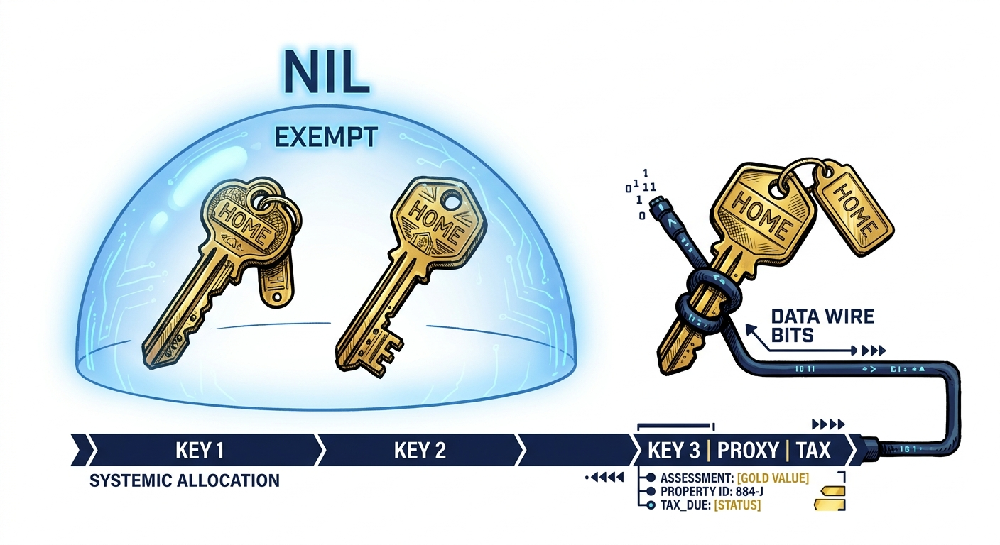
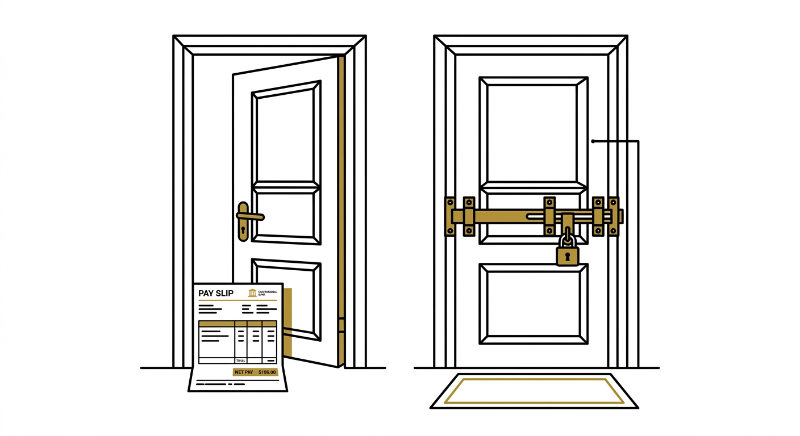

import NoticeTrap from '../../components/mdx/NoticeTrap.astro';
import CardPremium from '../../components/CardPremium.astro';

Three deeds on one PAN. You own a home in Mumbai, you inherited an ancestral house in your native village, and you bought an investment flat in Pune. The Pune flat is locked and empty. 

When you file your taxes, you see a line item for “Income from house property” that you never received in any bank account. You pay the EMI, you pay the maintenance, and there is no tenant. Why is the system demanding tax on a ghost?

<CardPremium title="TL;DR: The Phantom Rent Trap" variant="warning">
- **Only two houses** can sit at nil annual value. From the **third**, the law uses **expected rent**, even if the flat is locked.
- **Vacancy is not an exemption.** Electricity bills and “no tenant” do not zero the tax by themselves.
- **Don’t auto-pick the cheapest house.** Loan interest on a deemed let-out house can change which option costs less.
- **Old vs new regime:** old regime may let some house-property loss reduce other income (within limits); **new regime does not use that loss against salary.**
</CardPremium>

## Why empty houses still show up as income

Outrage is the natural response here. It feels like legalized theft. But to understand the algorithm, you have to understand the intent: housing is scarce.

If the law granted unlimited “self-occupied = nil” treatment, it would allow capital to warehouse empty flats purely for long-term appreciation, artificially driving up rents for everyone else. 

The statute is not inventing a fictional tenant; it is **refusing unlimited nil-value shelters** for stacked residential inventory. The law allows exactly **two** nil-value residential houses for an individual or HUF. From the **third** property onwards, the capacity to earn rent is brought to tax—even if the keys never turn. 

Vacancy is not a defense. However, your **choice of which two houses get the nil status** is your most powerful lever.

## How “expected rent” is calculated when no one pays you

When a property is legally classified as "Deemed Let-Out" (DLOP), the Gross Annual Value (GAV) is not based on what municipal staff feel like charging. It tracks **reasonable expected rent** through a strict formula:

1. The algorithm takes the higher of the **municipal value** and the **fair rent** of the locality.
2. If Rent Control or standard rent applies, the reasonable expected rent is capped at the **standard rent**.
3. **Actual rent is irrelevant** because there is none.

Once the algorithm produces the GAV, you subtract the **municipal taxes actually paid** by you that year to arrive at the Net Annual Value (NAV).

From the NAV, Section 24 allows two specific deductions:
- **Section 24(a):** A flat 30% standard deduction (regardless of your actual repair bills).
- **Section 24(b):** Interest on borrowed capital. Unlike a self-occupied property, there is **no ₹2 lakh cap** on interest for a deemed let-out property.

## The mistake of always taxing the cheapest house

If you own three houses, the most common (and dangerous) heuristic is to blindly declare the house with the lowest expected rent as your Deemed Let-Out Property. 

This fails because it ignores the hidden lever inside Section 24(b). Deemed let-out status unlocks **uncapped** interest; self-occupied status locks interest at **₹2 lakh**. 

The arbitrage is not just "minimise expected rent." It is:
> **Minimise tax on (expected-rent income − 30% − full interest on the house you mark as DLOP), after also applying the ₹2L SOP interest cap on the other two.**

A house with high EMI interest and moderate expected rent can be the **best** DLOP even if it is not the "cheapest" on rent. A house with high expected rent and no loan is often a toxic DLOP.

## Try all three choices — and your tax regime matters

To legally minimize your tax, you must run the permutations for all three houses. Let's assume you own three properties under the **Old Regime**:

- **House A (Mumbai):** Expected Rent ₹6L | Mun. Tax ₹40K | Interest ₹3.5L
- **House B (Pune):** Expected Rent ₹4.8L | Mun. Tax ₹30K | Interest ₹2.4L
- **House C (Native):** Expected Rent ₹1.2L | Mun. Tax ₹8K | Interest ₹0

If you simply pick the cheapest house (C) as your DLOP, your DLOP income is positive (+₹78,400) because you have no interest deduction. Your SOP interest for A+B is capped at ₹2,00,000. Your net house-property loss is **(₹1,21,600)**. 

But look what happens if you choose A or B as the DLOP instead.

| Election (SOP / DLOP) | DLOP notional after 30% & interest | SOP interest used | Net HP (pre set-off cap) | Likely same-year set-off |
|------------------------|------------------------------------|-------------------|---------------------------|---------------------------|
| SOP A+B, **DLOP C** | +78,400 | 2,00,000 | (1,21,600) | 1,21,600 |
| SOP A+C, **DLOP B** | (75,000) | 2,00,000 | (2,75,000) | 2,00,000 + CF |
| SOP B+C, **DLOP A** | (1,42,000) | 2,00,000 | (3,42,000) | 2,00,000 + CF |

By sacrificing House B or A to the algorithm, the uncapped interest wipes out the phantom rent, resulting in a **₹2,00,000** maximum salary set-off under the Old Regime, plus carry-forward (CF).

### When a loss helps later (Carry Forward)
Under the Old Regime, up to ₹2 Lakh of house property loss can be set off against your salary in the same year. Any excess loss doesn't die. Section 71B (now Section 110) turns unused house-property loss into an eight-year voucher. However, this voucher can **only** pay for future house-property income, not future salary. 

### If you choose the New Regime
The New Regime violently alters this math.

Under the New Regime (which is the default):
- SOP interest deduction (the ₹2L limit) is **blocked**.
- Inter-head set-off of HP loss against salary is **blocked**.
- You still get the full 24(b) interest deduction on your DLOP to wipe out the notional rent, but any leftover loss simply goes into the 8-year carry-forward bin. **It will not reduce this year's salary tax by a single rupee.**

Under the New Regime, your priority changes: you want to minimise positive notional HP income this year, because you have no SOP interest to console you.

## Edges to watch out for

- **Inheritance:** An ancestral house on your PAN counts toward the two-nil limit. 
- **If you live abroad (NRIs):** Indian house property income remains taxable in India. Multiple locked flats still trigger the DLOP logic, even if your Indian income is otherwise zero.
- **Co-ownership:** If you jointly own a property with a definite share, you are only taxed on your exact share of the deemed rent. The two-house limit is per assessee, not per physical brick.

## What to do before you file

The law allows only two houses at nil annual value. The third is valued on expected rent even when empty. Your job is not to argue with vacancy—it is to choose which house bears that label.

1. **List all residential properties** on your PAN, including inherited or joint properties.
2. **Determine Expected Rent and Loan Interest** for every single house.
3. **Run the 3-option calculation** (using the matrix above).
4. **Apply your Tax Regime:** Choose the option with the lowest tax after set-off limits, not the lowest expected rent. 

  <h4 className="text-purple-900 dark:text-purple-300 font-bold mb-4">Quick reference — dual citation (1961 → 2025)</h4>
  
Numbers below follow current practitioner mapping tables, not a final official source. The Income Tax Act, 2025 took effect 1 April 2026; several section labels below are still being finalised against the CBDT's official mapping utility — confirm before filing anything.

  

    <table className="w-full text-sm text-left">
      <thead className="bg-purple-100 dark:bg-purple-900/50 border-b border-purple-200 dark:border-purple-500/20">
        <tr>
          <th className="p-3 font-semibold text-purple-950 dark:text-purple-50">Concept</th>
          <th className="p-3 font-semibold text-purple-950 dark:text-purple-50">Income Tax Act, 1961</th>
          <th className="p-3 font-semibold text-purple-950 dark:text-purple-50">Income Tax Act, 2025 (working map)</th>
        </tr>
      </thead>
      <tbody className="divide-y divide-purple-100 dark:divide-purple-900/50 bg-white/50 dark:bg-transparent">
        <tr>
          <td className="p-3 text-purple-900 dark:text-purple-200">Charge — income from house property</td>
          <td className="p-3 font-mono text-purple-700 dark:text-purple-400">Section 22</td>
          <td className="p-3 text-purple-800 dark:text-purple-300">Section 20</td>
        </tr>
        <tr>
          <td className="p-3 text-purple-900 dark:text-purple-200">Annual value (incl. deemed let-out)</td>
          <td className="p-3 font-mono text-purple-700 dark:text-purple-400">Section 23(4)</td>
          <td className="p-3 text-purple-800 dark:text-purple-300">Section 21</td>
        </tr>
        <tr>
          <td className="p-3 text-purple-900 dark:text-purple-200">Deductions 30% + interest</td>
          <td className="p-3 font-mono text-purple-700 dark:text-purple-400">Section 24(a)/(b)</td>
          <td className="p-3 text-purple-800 dark:text-purple-300">Section 22</td>
        </tr>
        <tr>
          <td className="p-3 text-purple-900 dark:text-purple-200">Carry forward of HP loss</td>
          <td className="p-3 font-mono text-purple-700 dark:text-purple-400">Section 71B</td>
          <td className="p-3 text-purple-800 dark:text-purple-300">Section 110</td>
        </tr>
      </tbody>
    </table>
  

