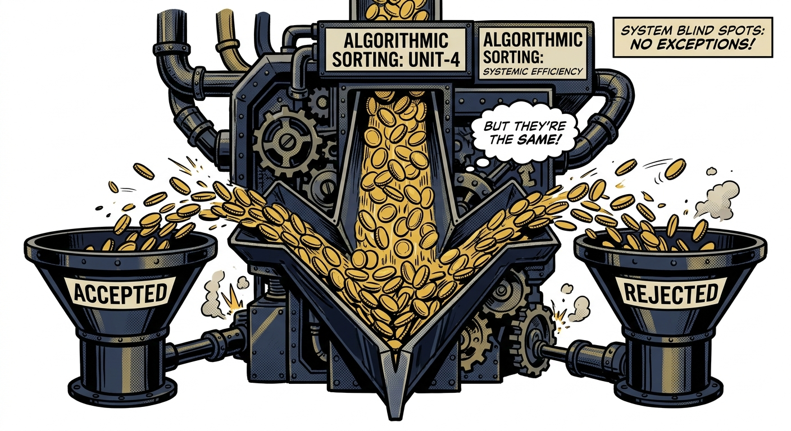

import NoticeTrap from '../../components/mdx/NoticeTrap.astro';
import CardPremium from '../../components/CardPremium.astro';

You purchased a home for your family. To ensure security, you registered the property jointly with your spouse—a clean 50-50 split on the title deed. But because you are the primary earner, the bank pulls 100% of the EMI directly from your salary account every month.

When tax season arrives, you logically claim the full ₹2,00,000 Section 24(b) deduction for the home loan interest. After all, you paid every single rupee of it. 

Months later, you log into the e-filing portal and find an intimation under Section 143(1). The Centralized Processing Centre (CPC) has unilaterally slashed your interest claim to ₹1,00,000. Not only are they demanding tax on the disallowed amount, but they have also flagged you for a **200% penalty** under Section 270A for "misreporting" your income.

You have the bank statements to prove you paid the money. So why is the system punishing you like a tax evader?

<CardPremium title="TL;DR: The Joint Ownership Algorithm" variant="warning">
- Tax algorithms respect the Sub-Registrar's property deed, not your bank statement. If the registry dictates a 50-50 ownership split, the system strictly caps your permissible interest deduction at 50%.
- To claim a tax benefit on property, the law (Section 26) forces a two-part bridge: **Legal Title** *and* **Financial Contribution**. You cannot substitute one for the other.
- Claiming 100% of the deduction when you only own 50% of the property triggers an automatic mismatch between your ITR and the Annual Information Statement (AIS), leading to disallowed claims and severe misreporting penalties under Section 270A.
</CardPremium>

## Why the Tax Algorithm Doesn't Care About "Family Money"

To understand this brutal mismatch, you have to look at the historical loophole the government was trying to close.

Decades ago, property ownership in India was a tax-evasion playground. High-net-worth families would purchase multiple properties in the names of non-earning spouses, children, or extended relatives to dilute rental income across multiple tax slabs. Conversely, they would pool family money to claim massive, overlapping interest deductions indiscriminately.

The government recognized that tracking "who actually paid for what" across tangled family bank accounts was an administrative nightmare. Their solution was to remove human discretion entirely and rely on a rigid, unarguable anchor: the property registry.

Under **Section 26** of the Income Tax Act, 1961 (provisionally mapped to **Section 22** of the 2025 Act), the state established a ruthless two-part test. To claim any tax benefit—whether it is rental income or home loan interest—you must possess both:
1. Legal ownership share in the property.
2. Actual financial contribution to the asset.

The system does not recognize the concept of "family money." It only sees the ink on the Sub-Registrar's deed. The government traded flexibility for absolute algorithmic certainty.

## The Sub-Registrar’s Ink vs. Your Bank Statement

The trap snaps shut at the Centralized Processing Centre (CPC). 

When you file your Income Tax Return (ITR), the algorithm mechanically cross-references your claim against your **Annual Information Statement (AIS)**. The AIS pulls data directly from the property registrar and your loan sanction letter. 

If the deed says you own 50% of the property, the algorithm establishes a hard ceiling. It assumes your maximum permissible financial burden is 50%.

When you claim ₹2,00,000 under Section 24(b) (the maximum allowable for a self-occupied property), the algorithm compares it to your 50% ceiling (₹1,00,000) and immediately flags a violation. 

<NoticeTrap title="The 200% Misreporting Escalation">
The CPC doesn't view this as a simple math error. Because you claimed a deduction higher than your legally documented ownership share permits, the system classifies this under Section 270A as "Misreporting of Income." The penalty for misreporting isn't just the tax owed—it is a mandatory 200% penalty on the tax sought to be evaded. A simple attempt to claim what you actually paid becomes a severe compliance nightmare.
</NoticeTrap>

## Salvaging the EMI Tax Break

If you are caught in this mechanical web, the solutions depend entirely on whether the ink on the registry has dried.

### Pre-Registry: Aligning Title with Cash Flow
The only flawless defense is proactive. If you know that one spouse will be paying 100% (or 90%) of the EMI, **draft the purchase deed to reflect that exact financial reality.** 

You are not legally required to register a property 50-50 just because you are married. You can register the property as 90% owned by the primary earner and 10% owned by the spouse. 

When the deed reflects a 90/10 split:
- The primary earner can legally claim 90% of the interest deduction (up to their ₹2 Lakh limit).
- The AIS perfectly matches the ITR claim.
- The algorithm passes the return without a second glance.

### Post-Registry: Absorbing the Deadweight Loss
If the property is already registered 50-50, the structural reality is locked in. 
- The primary earner **must** restrict their Section 24(b) claim to exactly 50% of the total interest paid (capped at ₹1 Lakh). 
- The remaining 50% is technically available to the co-borrowing spouse.
- **The Deadweight Loss:** If the spouse has no taxable income, that 50% deduction cannot be utilized. It is a deadweight loss. 

You cannot legally funnel the spouse's unused deduction back to the primary earner. Falsifying the claim to recover that loss will trigger the Section 143(1) intimation and the Section 270A penalty.

## 💡 The Co-Borrower's Defense Checklist

To navigate the algorithm without triggering an audit, ensure these three documents are perfectly aligned:

- **The Registry Deed:** The ownership percentages must dictate the maximum deduction ceilings.
- **The Loan Sanction:** Both names must appear as co-borrowers on the home loan certificate provided by the bank. Being a mere "guarantor" does not grant tax deduction rights.
- **The Bank Statement:** The EMI must be paid in the exact proportion of ownership. If the deed is 50-50, ideally, the EMI should be funded from a joint account where both spouses contribute equally, creating a pristine audit trail.

  <h4 className="text-purple-900 dark:text-purple-300 font-bold mb-4">Quick reference — dual citation (1961 → 2025)</h4>
  
Numbers below follow current practitioner mapping tables, not a final official source. The Income Tax Act, 2025 took effect 1 April 2026; several section labels below are still being finalised against the CBDT's official mapping utility — confirm before filing anything.

  

    <table className="w-full text-sm text-left">
      <thead className="bg-purple-100 dark:bg-purple-900/50 border-b border-purple-200 dark:border-purple-500/20">
        <tr>
          <th className="p-3 font-semibold text-purple-950 dark:text-purple-50">Concept</th>
          <th className="p-3 font-semibold text-purple-950 dark:text-purple-50">Income Tax Act, 1961</th>
          <th className="p-3 font-semibold text-purple-950 dark:text-purple-50">Income Tax Act, 2025 (working map)</th>
        </tr>
      </thead>
      <tbody className="divide-y divide-purple-100 dark:divide-purple-900/50 bg-white/50 dark:bg-transparent">
        <tr>
          <td className="p-3 text-purple-900 dark:text-purple-200">Property owned by co-owners</td>
          <td className="p-3 font-mono text-purple-700 dark:text-purple-400">Section 26</td>
          <td className="p-3 text-purple-800 dark:text-purple-300">Section 22</td>
        </tr>
        <tr>
          <td className="p-3 text-purple-900 dark:text-purple-200">Interest on borrowed capital (Home Loan)</td>
          <td className="p-3 font-mono text-purple-700 dark:text-purple-400">Section 24(b)</td>
          <td className="p-3 text-purple-800 dark:text-purple-300">Section 20(b)</td>
        </tr>
        <tr>
          <td className="p-3 text-purple-900 dark:text-purple-200">Penalty for misreporting of income</td>
          <td className="p-3 font-mono text-purple-700 dark:text-purple-400">Section 270A</td>
          <td className="p-3 text-purple-800 dark:text-purple-300">Section 416</td>
        </tr>
      </tbody>
    </table>
  

