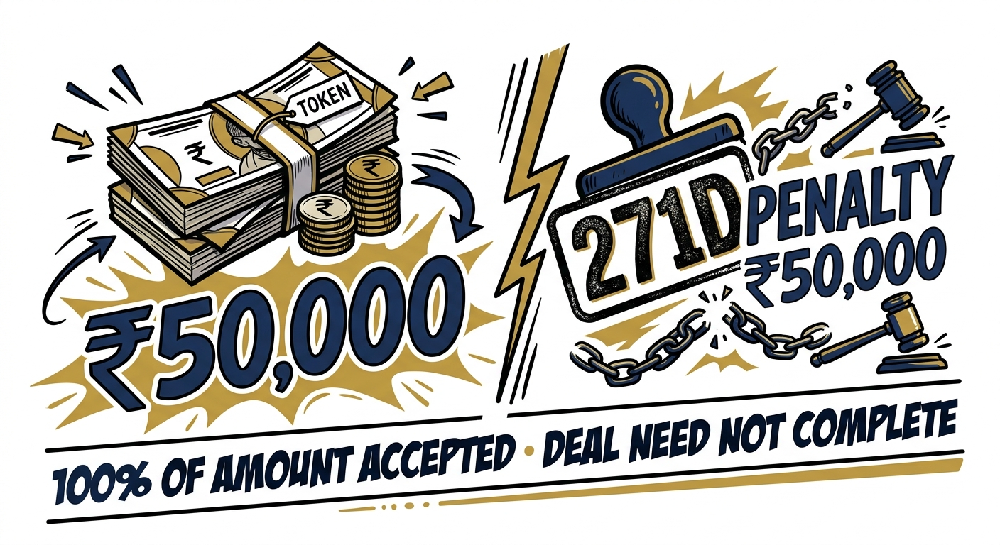
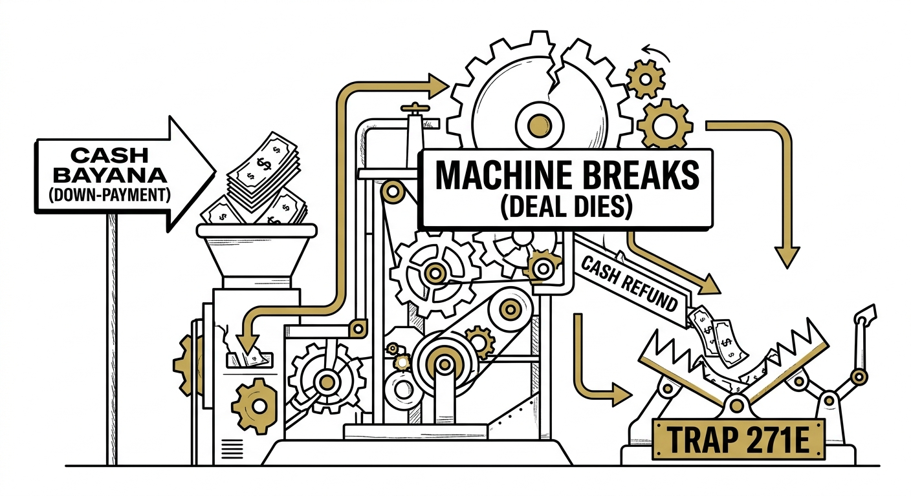

import NoticeTrap from '../../components/mdx/NoticeTrap.astro';
import CardPremium from '../../components/CardPremium.astro';

## It felt like a small token. The law treats it as a regulated advance.

You found the perfect flat. The seller wants a quick ₹50,000 cash "bayana" (earnest money) to lock the deal and stop showing the property to others. You shake hands. It feels normal. It feels pre-legal. You think, *“It’s just a token. The deal isn’t even registered.”*

The Income Tax Department disagrees. The law does not wait for the sale deed. The advance itself is a regulated event.

<CardPremium title="TL;DR: The Cash Token Double Trap" variant="warning">
- **Rule:** Accepting a property advance (**specified sum**) of **₹20,000 or more in cash** can breach **Section 269SS**—even if it is only “token / bayana,” and even if the sale never happens.  
- **Cost:** **Section 271D** penalty can equal **100% of the amount accepted** (₹50,000 cash → ₹50,000 penalty).  
- **Double trap:** Refunding that token **in cash** can breach **Section 269T** and draw a **second 100%** penalty under **Section 271E**.  
- **Who is hit:** **271D follows the person who accepts** the cash (typically seller/builder)—not a free-floating “buyer 271D” invented for drama.
</CardPremium>

## What Section 269SS actually blocks

Historically, property advances were a classic channel for parking unaccounted money. To stop this, Parliament amended Section 269SS effective **June 1, 2015**. 

The law states that no person shall **accept** from another person any loan, deposit, or **specified sum** of **₹20,000 or more** in cash. 

What is a "specified sum"? The 2015 amendment explicitly defined it: it is any sum of money receivable, whether as advance **or otherwise**, in relation to the transfer of an immovable property, **whether or not the transfer takes place**.

You cannot accept it in cash. You must use:
- Account payee cheque / account payee bank draft
- Electronic Clearing System (ECS)
- Prescribed electronic modes (UPI, NEFT, RTGS, IMPS)

### ₹15,000 + ₹10,000 can still cross the line

The ₹20,000 limit is not a "per transaction" or "per envelope" limit. The threshold applies to the **aggregate** amount outstanding from a person.

If a seller takes ₹15,000 in cash on Monday, and another ₹10,000 in cash on Tuesday from the same buyer, the aggregate crosses the ₹20,000 threshold. The violation logic attaches to the relationship, not the single slip.

## The 100% penalty under Section 271D

If a seller breaches Section 269SS, the Assessing Officer (or JCIT) will invoke **Section 271D**. 

The penalty is not a small percentage or a slap on the wrist. The penalty is equal to **100% of the amount accepted** in contravention of the law. 

If you accept a ₹50,000 cash token, the penalty is exactly ₹50,000. 

## If the deal dies and cash goes back

This is where the trap deepens. What happens if the deal cancels and the seller returns the ₹50,000 cash token to the buyer?

Enter **Section 269T**, the twin sibling of 269SS. Section 269T prohibits the **repayment** of a specified advance in cash if the amount is ₹20,000 or more. 

If the seller refunds the money in cash, they commit a second, separate offense. This triggers **Section 271E**, which imposes *another* **100% penalty** on the amount repaid. One cancelled deal, two cash handovers, two 100% penalties.

## “Everyone does this” is not a defence

Under **Section 273B**, a penalty under 271D or 271E may be dropped if the person proves a "reasonable cause" for the failure to comply with the banking mandates.

However, do not rely on this as a safety net. "Market practice," "convenience," or "my broker told me to" are almost universally rejected by tax tribunals as reasonable causes. A successful 273B defense requires a genuine, demonstrable emergency or the complete unavailability of banking channels on the specific dates in question—a heavy burden of proof.

## Not the same as the ₹2 lakh cash rule

Many people confuse the Section 269SS token rule with the broader **Section 269ST** rule. Section 269ST bans receiving ₹2 Lakhs or more in cash in a single day, or for a single transaction/event, from a person. 

These are different sections. For property advances specifically, the limit is governed by 269SS and the threshold is only ₹20,000.

## 1961 Act and 2025 Act labels

  <h3 className="text-xl font-bold mb-4 text-gold-500 mt-0">Dual-Cite Reference Map</h3>
  
If you are reading notices or filing appeals across the transition years, note the corresponding sections between the old and new codes:

  <ul className="list-disc pl-5 space-y-2">
    <li><strong>Accepting Cash Advances:</strong> Section 269SS (1961 Act) maps to Section 185 (2025 Code).</li>
    <li><strong>Repaying Cash Advances:</strong> Section 269T (1961 Act) maps to Section 188 (2025 Code).</li>
    <li><strong>The Penalty:</strong> Section 271D (1961 Act) maps to Section 450 (2025 Code).</li>
  </ul>

## What to do before the next bayana

A property token is not outside the tax system until registration. To protect your margins and avoid devastating penalties, treat every advance as a regulated transaction:

**Before accepting / paying any token ≥ ₹20,000:**
- Use account payee cheque, draft, UPI, NEFT, RTGS, or IMPS.
- **Narration:** Write “Advance towards proposed transfer of [property].”
- Keep bank proof + written acknowledgment of both the amount and the mode of transfer.
- In your formal agreement, ensure you record the *mode* of the advance, not just the rupee figure.

**If cash was already accepted:**
- Do not “fix” the mistake with another cash leg.
- If refunding a cancelled deal, **refund through the bank**, never in cash, to avoid stacking a 271E penalty on top of your 271D exposure.
- If you receive a notice, build a one-page chronology (dates, amounts, modes, whether transfer happened) for your CA. Do not try to claim "industry practice" as your defense.

## Key Takeaways

A property token is not outside the tax system until registration. From June 2015, advances linked to immovable property are “specified sums.” Accept ₹20,000 or more in cash and Section 269SS can trigger a Section 271D penalty equal to the sum accepted. If the deal fails and the same money is returned in cash, Section 269T and Section 271E can add a second 100% hit. The practical rule is simple: bayana through banking channels, and refunds the same way.
