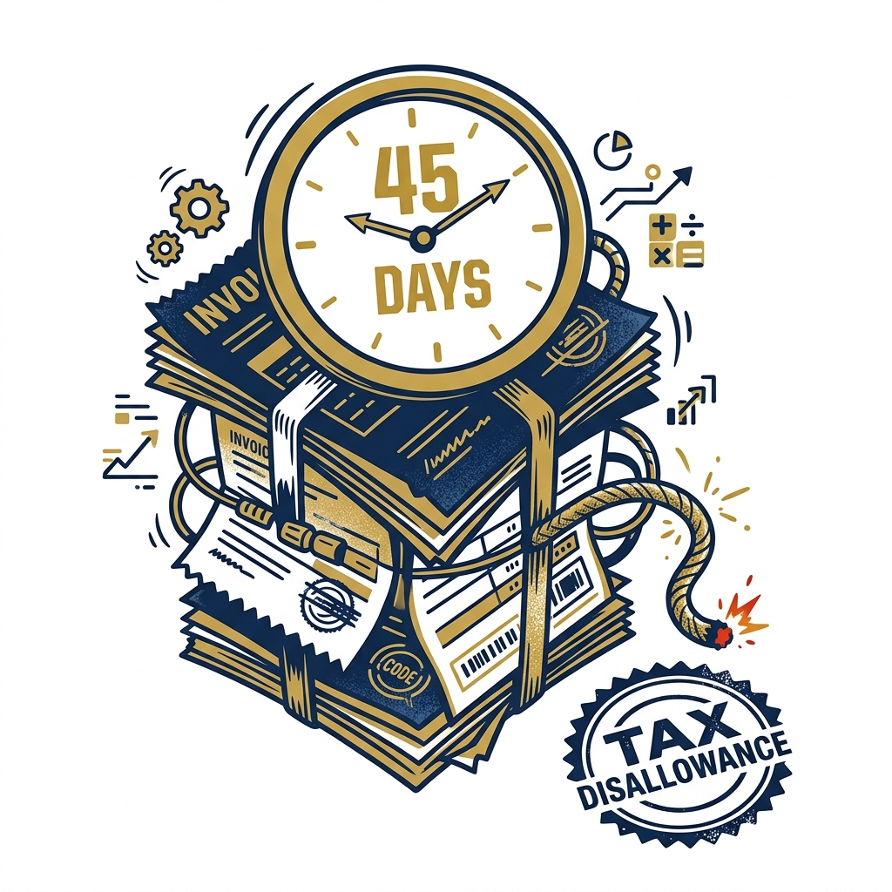

import CardPremium from '../../components/CardPremium.astro';
import HeroMSME45 from '../../components/illustrations/HeroMSME45.astro';
import InsetMSMEFilter from '../../components/illustrations/InsetMSMEFilter.astro';
import Inset43BDivergence from '../../components/illustrations/Inset43BDivergence.astro';
import InsetTwoYearSpine from '../../components/illustrations/InsetTwoYearSpine.astro';
import MSMEDInterestCalculator from '../../components/Calculators/MSMEDInterestCalculator.astro';

## The bill was real. The deduction may still move.

Imagine reviewing your draft tax computation. Your taxable profit is surprisingly high because unpaid Micro and Small enterprise dues were added back to your income—not because your sales improved. You genuinely incurred the expense, you have the invoices, and you fully intend to pay. But because cash flow was tight and the payment slipped past day 45 across the financial year-end, the tax code treats that unpaid expense as if it were pure profit.

<CardPremium title="TL;DR: The 43B(h) Rule">
- **Coverage:** Applies to dues payable to **Micro or Small** enterprises that are **manufacturers or service providers** (Udyam). **Medium** is out; **traders** are usually out.
- **Clock:** **15 days** if there is no written agreement; up to **45 days** if there is (the law does not honour longer credit as the MSMED outer limit).
- **Tax effect:** Paid after that limit → deduction in the **year of actual payment**, not the year you booked the cost. Crossing **31 March** creates a year-1 **add-back**.
- **Myth:** Paying before the **ITR due date** does **not** cure 43B(h) the way it can for many other 43B items.
</CardPremium>

## Why payment timing became a tax rule

For decades, the Indian working capital cycle ran on a structural power imbalance. Large corporations routinely used their small vendors as interest-free credit facilities. A micro manufacturer might deliver raw materials in April, but the large buyer would stretch the payment cycle to 90, 120, or even 180 days, hoarding the cash for their own operations.

To stop this, the government introduced the MSMED Act in 2006, which legally capped payment terms at 45 days and introduced a brutal penalty for delays: compound interest at three times the RBI bank rate (Section 16). 

But the 2006 law had a fatal flaw. Enforcement required the small vendor to actively sue their large buyer. In reality, micro-enterprises were terrified of losing their biggest clients, so they swallowed the delays and never triggered the interest penalty. The law existed on paper, but the culture of delayed payments continued.

By introducing **Section 43B(h)**, the state finally bypassed this fear. They shifted the enforcement mechanism from civil courts to the Income Tax algorithm. The government effectively said to large buyers: *"If you do not pay your small vendors on time, we will not allow you to deduct the purchase expense from your taxable profit."* This is not the tax department claiming a purchase is fake; this is the tax department using the tax code to forcibly break the delayed-payment culture.

## The Two Sides of the 45-Day Clock

The impact of this rule entirely depends on which side of the invoice you sit.

**For the CFO (The Buyer):** 
Section 43B(h) introduces massive cash flow friction. You can no longer artificially inflate your working capital by delaying vendor payouts. If you miss the March 31 cross-over, your year-one cash tax can spike dramatically, even if you pay the vendor in April. It forces a complete overhaul of vendor KYC and payable queues.

**For the Supplier (The MSME):**
This rule is a vital shield. For the first time, small manufacturers have institutional leverage that doesn't require them to hire a lawyer. Buyers are legally incentivized to prioritize their invoices before the financial year ends, injecting much-needed predictability into their survival cash flow.

## Who counts as a sensitive supplier

Your own MSME status does not exempt you. If you are an MSE buying from another MSE, you are still a buyer under 43B(h). However, not every Udyam-registered vendor triggers the rule.

<InsetMSMEFilter />

- **Micro and Small (Manufacturers/Service Providers):** Fully covered. Check their Udyam certificate for the specific activity line.
- **Medium Enterprises:** Not covered.
- **Traders (Wholesale/Retail):** Generally excluded. Even if a trader holds an Udyam registration for priority sector lending, they are not considered a "supplier" for the MSMED Section 15–24 payment regime in the usual reading. *(Note: The Ministry's OM restricts MSMED delay benefits for traders).*
- **Unregistered:** If they don't have an Udyam registration, they generally sit outside this specific mechanism (registration is the practical gateway).

## How the 15- and 45-day limits work

The MSMED Act (Section 15) defines a strict outer limit for credit.
- **No written agreement:** 15 days from the day of acceptance (or deemed acceptance).
- **Written agreement:** The agreed period, but **capped at 45 days**. Even if your contract explicitly says "90-day payment terms," the statutory 45-day ceiling still governs the MSMED clock for this tax purpose.

## What shows up in the tax computation

Let's look at a concrete example. You purchase goods from a covered Micro supplier for ₹50 lakh. The goods are accepted in mid-February. You have a written agreement for 45-day terms, making the payment due by the end of March.

You pay on April 15 (after the MSMED limit, and crucially, after March 31).

<InsetTwoYearSpine />

Net over two years, the expense is not destroyed. However, your **year-1 cash tax** can still spike dramatically if you have no other shield. That is the core working-capital trap of 43B(h).

## The ITR due-date mistake

Many businesses are used to Section 43B giving them a grace period. For items like PF, ESI, bonuses, or bank interest, you can delay payment across March 31, and as long as you clear the dues before filing your Income Tax Return (ITR), you keep the deduction for that year.

**This grace period does not apply to 43B(h).** 

<Inset43BDivergence />

The proviso that saves PF/ESI-style items specifically carves out clause (h). If you miss the 15/45-day limit across year-end, thinking "We'll pay in May, it's the same tax year of filing" is a mathematically fatal error. The previous year of accrual is already closed for that expense.

## Other mistakes worth avoiding

- **Capex confusion:** 43B(h) targets sums that are otherwise deductible in computing your P&L business income. Pure capitalized purchases (like buying machinery from an MSME) follow capital and depreciation logic, not a simple P&L expense claim.
- **Cheque folklore:** Do not rely on the myth that "handing over a cheque always equals payment date." Clearance, issue, and proof practices are fact-sensitive. Always prefer bank credit or clear, undeniable evidence of payment within the window.

## What to run in the business

Surviving Section 43B(h) requires operational discipline, not just tax-time scrambling.

- **Annual Vendor KYC:** Mandate that vendors provide a copy of their Udyam certificate. Verify their status (Micro/Small/Medium), activity (Manufacture/Service/Trade), and ensure their PAN matches.
- **Standardized Contracts:** Ensure your written credit terms explicitly stay within 45 days. If a dispute arises over the goods, document it in writing (deficiency notes, emails); genuine disputes need evidence to pause the clock, not just verbal claims.
- **The March Priority Queue:** Tag your 43B(h)-sensitive vendors in your payable system. February and March invoices from Micro/Small manufacturers must jump to the front of the queue. Build a dashboard that tracks days outstanding against the 15/45 clock, rather than generic "overdue 90 days" reports.
- **Form 3CD Alignment:** Ensure your tax audit Form 3CD reporting of 43B items is processed methodically during the year, so the add-back isn't a surprise at audit sign-off. If you are already late on a March invoice, model the cash tax impact immediately.

## The Dark Arts: Bypassing the 45-Day Rule

Whenever a strict regulatory wall is built, the market inevitably builds a ladder. While there are no *legal tax loopholes* to bypass Section 43B(h), large buyers sometimes use aggressive operational mechanics to sidestep the rule entirely. We document these not as advice, but as a reality check on how the market is adapting:

1. **The Udyam Surrender:** The rule only protects registered entities. Some powerful buyers issue ultimatums, coercing their small vendors to cancel their Udyam registrations. Once the vendor is officially unregistered, the buyer can legally stretch payments back to 120 days.
2. **The "Quality Control" Trap:** The 45-day statutory clock begins on the "day of acceptance." Buyers may intentionally drag out the QC inspection process or raise frivolous disputes on the packaging to keep the goods in an unaccepted limbo, pausing the clock until the March 31 deadline passes safely.
3. **The Intermediary Reroute:** Because the law generally excludes retail and wholesale traders, large buyers may force a Micro-manufacturer to route their invoice through a larger, intermediary trading firm. The corporate pays the trader (bypassing the rule), and the trader pays the manufacturer.
4. **Drawer Accounting:** Outright non-compliance. A buyer simply refuses to log a March invoice into their ERP system, leaving it in a literal drawer until April. By hiding the liability, they push the entire transaction into the next financial year, avoiding the year-one tax disallowance entirely.

## The Supplier's Recourse: Legal & Structural Defenses

While buyers have operational workarounds, the MSMED Act provides suppliers with rigid legal counter-measures to defend their working capital. 

- **The "Deemed Acceptance" Shield:** To counter the Quality Control trap, Section 15 of the MSMED Act is explicit: if a buyer does not make a *written* objection within 15 days of delivery, the goods are "deemed accepted," and the 45-day clock begins. Suppliers routinely stamp this statutory clause on delivery challans, shifting the burden of proof to the buyer.
- **The MSME Samadhaan Portal & The 75% Rule:** If payments stall, the supplier can file a grievance on the government's Samadhaan portal, initiating proceedings with the Micro and Small Enterprise Facilitation Council (MSEFC). The MSEFC has the power of an arbitral tribunal, and its awards are legally binding. The true "teeth" of this mechanism lies in Section 19 of the Act: if the buyer wishes to challenge the award in an appellate court, **they cannot file the appeal without depositing 75% of the decreed amount upfront.** This structural requirement prevents the arbitration process from being stalled by prolonged appellate litigation, heavily incentivizing both parties to reach a final settlement quickly.

## Strategic Negotiation: The Supplier's Leverage

Beyond the courtroom, suppliers are increasingly using structural commercial tactics to ensure their invoices are prioritized in the buyer's payable queue. These tactics work by weaponizing the corporate's own compliance and credit frameworks.

- **The TReDS Ambush:** Suppliers can route invoices through the Trade Receivables Discounting System (TReDS), an RBI-regulated platform. How does this help? Once the buyer accepts the invoice on TReDS, a bank pays the supplier immediately, and the buyer's liability shifts to the bank. Corporates rely heavily on their credit ratings; defaulting on a bank triggers immediate SMA (Special Mention Account) tagging and rating downgrades, whereas defaulting on a micro-vendor historically carried no such systemic risk. TReDS essentially uses the corporate's own credit score to guarantee your payment.
- **The Inextricable Udyam Print:** To counter the "we didn't know you were registered" defense, savvy suppliers embed their Udyam Registration Number (URN) permanently across all tax invoices, letterheads, and digital signatures. Why does this work? Once it is printed on the invoice, the buyer's statutory auditor is legally bound to flag it during the Form 3CD tax audit. This creates a permanent, public audit trail of non-compliance, forcing the CFO to clear the invoice simply to keep their audit report clean.
- **Commercial Lock-ins:** Suppliers providing critical machinery or software often tie warranty validation, after-sales support, or license key renewals explicitly to the clearance of the primary invoice within the 45-day window, cutting off operational support until cash flow is settled.

## Interest under the MSMED Act

Even if you manage the tax timing perfectly (e.g., you delay a June invoice to August, suffering no March 31 cross-over, thus saving your Section 43B(h) deduction), you still face the original civil penalty of the MSMED Act. 

Section 16 imposes a commercial cost of compound interest on delayed dues at three times the RBI bank rate, compounded with monthly rests. The tax disallowance and the interest penalty are two different pains.

<MSMEDInterestCalculator />

## 1961 and 2025 section labels

> **Dual-Act Mapping:** Currently governed by **Section 43B(h)** of the Income Tax Act, 1961 (applicable from AY 2024-25 / FY 2023-24). Under the working map for the **Direct Tax Code (DTC) 2025**, business expense payment rules are commonly discussed under the consolidated **Section 37** family. The underlying MSMED Act linkage remains substantively similar. *(Verify official schedules upon DTC enactment).*

## Key takeaways

- **The Rule:** Section 43B(h) links the **year of deduction** to the **MSMED 15/45-day** payment limit.
- **The Trigger:** Miss the limit, and the expense is allowed only in the year you actually pay. If this delay crosses **31 March**, your year-one taxable income artificially spikes.
- **The Scope:** Applies strictly to **Micro and Small** manufacturing and service suppliers (Udyam). Medium enterprises and typical traders sit outside this trigger.
- **No ITR Grace:** Unlike other 43B items, paying before your ITR due date does **not** reopen or cure the missed deduction in the previous year.
- **The Buyer's Defense:** Classify your vendors, strictly keep written terms within 45 days, and ruthlessly clear sensitive February/March dues on time.
- **The Supplier's Leverage:** If buyers use operational loopholes, suppliers have structural tools—like enforcing "deemed acceptance," weaponizing Form 3CD via printed Udyam numbers, and using the 75% appeal deposit rule on the MSME Samadhaan portal—to force timely payments.
