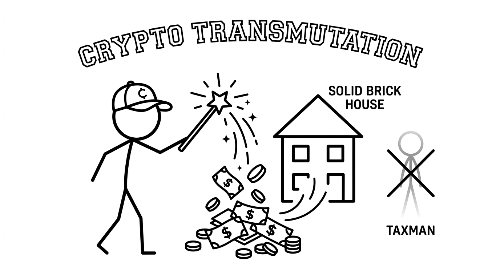

import NoticeTrap from '../../components/mdx/NoticeTrap.astro';
import CardPremium from '../../components/CardPremium.astro';

If you sell unlisted startup equity, cash out a massive mutual fund portfolio, or liquidate commercial land, the government expects a 12.5% to 20% cut of your profit. On a ₹5 Crore windfall, you could owe ₹1 Crore in tax. Section 54F is the ultimate wealth hack that lets you legally erase that entire tax liability to zero by locking the capital into residential real estate.

<CardPremium>
### TL;DR
- **The Core Hack:** Reinvest the *entire sale proceeds* (not just the profit) of any capital asset into a residential house in India to get a 100% tax exemption.
- **The CGAS Lock:** If you don't buy the house before the ITR deadline (July 31), you must lock the funds in a designated Capital Gains Account Scheme (CGAS).
- **The Limits:** The maximum exemption is capped at a ₹10 Crore reinvestment, and you cannot own more than *one* other residential house on the date of sale.
</CardPremium>

## 1. The Genesis of the Alchemist's Exemption

Why would the government willingly let you walk away from a ₹1 Crore tax bill? Why does Section 54F exist?

Rewind to the 1980s. The Indian economy was struggling. People were hoarding vast amounts of "unproductive capital"—massive quantities of physical gold, locked-in private equity, and empty plots of land. Meanwhile, the country was facing a devastating housing shortage, and the real estate construction sector was starved of capital.

The government needed to move money from dead assets into the economy's bloodstream (construction creates jobs, cement demand, and infrastructure). So, they offered a grand bargain: *If you liquidate your unproductive capital and pour it entirely into building or buying a residential house, we will completely forgive your capital gains tax.* 

It was a brilliant economic bribe to stimulate housing.

## 2. The Billionaire Loophole (The Cat and Mouse Game)

For decades, Section 54F worked exactly as intended for the middle class. But then came the Indian startup boom.

### The 2020 Heist: 
Imagine a unicorn founder in 2020 who sells ₹50 Crores worth of unlisted equity during a secondary buyout. Under normal laws, he would owe the government nearly ₹10 Crores in tax. Instead, he hires a brilliant CA. He uses the entire ₹50 Crores to buy a sprawling, ultra-luxury penthouse in Worli, Mumbai. 
Because there was no upper limit on Section 54F, his tax liability dropped to absolute zero. He effectively bought a ₹50 Crore asset for ₹40 Crores, subsidized by the government. 

### The 2023 Panic & The ₹10 Crore Cap:
The government realized they had accidentally built a tax-free haven for the ultra-rich. The exemption was supposed to help the middle class build homes, not subsidize billionaire penthouses. 

So, in the 2023 Budget, the government slammed the door shut. They introduced a hard **₹10 Crore Cap**. 
Today, if you buy a ₹50 Crore mansion with your startup exit money, the taxman will only count ₹10 Crores toward the exemption calculation. The remaining ₹40 Crores of your windfall will be brutally taxed. 

## 3. The Mechanism of Section 54F (The Core Math)

Unlike Section 54 (which requires you to reinvest only the *profit* from selling a house), Section 54F is much more demanding. To get a 100% tax exemption, you must reinvest the **Net Consideration** (the total sale value, minus expenses), not just the profit.

### The Scenario Matrix: Calculating the 54F Exemption

Let's assume you sold unlisted shares for a Total Sale Value of ₹5 Crores, and your Profit (Capital Gain) was ₹4 Crores.

| Reinvestment Amount | Percentage of Sale Value | Exemption Claimed | Taxable Capital Gain |
| :--- | :--- | :--- | :--- |
| **₹5 Crores** | 100% | 100% (₹4 Crores) | ₹0 (Absolute Victory) |
| **₹2.5 Crores** | 50% | 50% (₹2 Crores) | ₹2 Crores |
| **₹1 Crore** | 20% | 20% (₹80 Lakhs) | ₹3.2 Crores |

## 4. The Rules of the Ritual (Notice Traps)

This magic requires strict adherence to the timeline. One misstep, and the tax liability materializes immediately.

1. **The Timeline:** You must purchase a readymade house either 1 year *before* the sale or 2 years *after* the sale. If you are constructing a house, you get 3 years.
2. **The CGAS Vault:** If you haven't bought the house before July 31st (the ITR filing deadline), you cannot keep the cash in a savings account.

You must lock it in a Capital Gains Account Scheme (CGAS) with a designated bank to prove to the government that the money is earmarked for real estate.
3. **The 'One House' Rule:** At the time of selling your shares, you must not own more than *one* residential house (other than the new one you are buying). If you already own two houses, you are disqualified from the 54F exemption entirely.

<NoticeTrap title="Trap 2: The Spouse Registry Audit">

**Scrutiny Trigger:** Founders often buy the new 54F property in the name of their spouse to protect assets from business liabilities.

**Resolution Strategy:** The tax department will instantly reject the 54F exemption if the new house is not registered in the exact name of the taxpayer who incurred the capital gains. Do not mix asset protection with tax exemption.

</NoticeTrap>

## 5. Unlocking the Vault (Section 54F Edge Cases)

**"Can I buy a house abroad to claim this exemption?"**
No. The alchemy only works on Indian soil. The new residential property must be purchased or constructed within the borders of India. The government wants the capital to stay domestic.

**"What happens if I sell the new house?"**
You must hold the newly purchased residential house for a minimum of 3 years. If you flip it before 3 years, the magical exemption shatters. The original capital gains you hid will suddenly become fully taxable in the year you sell the new house, along with the tax on the new sale.
