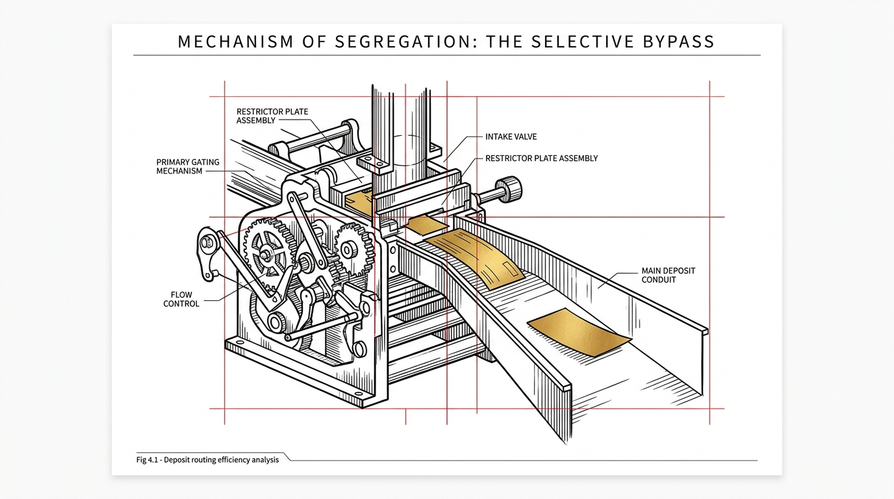

import NoticeTrap from '../../components/mdx/NoticeTrap.astro';
import CardPremium from '../../components/CardPremium.astro';

There exists a category of tax error that is completely devoid of malice, evasion, or complex miscalculation. It is a subtle classification error rooted in a simple dropdown selection on a tax return screen: claiming Section 80TTA instead of Section 80TTB. For a senior citizen earning qualifying fixed deposit interest, this tiny error transforms a potential ₹50,000 deduction into a ₹10,000 deduction, generating an invisible ₹40,000 gap. The actual chain of tax operations is facts, classification, applicable provision, computation, and finally tax. The most expensive mistakes occur upstream before the math even begins, when the visible item is mapped to the wrong legal identity.

{/* ILLUSTRATION PLACEHOLDER: A pure, solid white background. A minimalist editorial illustration, technical blueprint aesthetic. Confident black ink for an imposing sorting mechanism or intake valve. Red strict targeting gridlines segmenting the process. Warm metallic gold for a single, significant deposit slip successfully bypassing the restrictor plate and proceeding to a wider chute. Flat inks and fine hatching only — no gradients or soft shading. Elegant, restrained, magazine-spread aspect ratio. */}

"Arithmetic is downstream; classification is upstream."

<CardPremium title="TL;DR: The ₹40,000 Deduction Gap" variant="warning">
- **The Core Issue:** Tax preparers see interest income and instinctively select Section 80TTA. For senior citizens earning FD interest, this cuts a legal ₹50,000 deduction down to ₹10,000.
- **The Mechanics:** Section 80TTA applies to individuals under 60 and covers only savings accounts. Section 80TTB applies exclusively to resident senior citizens (60+) and expands coverage to all deposits, including Fixed Deposits (FDs) and Recurring Deposits (RDs).
- **The Defense:** Tax law operates through a dependency chain. Prove residency, verify the 60+ age criterion, explicitly opt out of the New Tax Regime, and manually select 80TTB to secure the full benefit.
</CardPremium>

## The Economic Sequence: Human Capital vs. Financial Capital

To understand the structure of the trap, one must trace the economic sequence of retirement. Section 80TTB was introduced by Parliament in 2018 (effective AY 2019-20) to address a specific economic vulnerability based on how income generation shifts across a human lifespan. 

During an individual's working years, human capital produces income, which in turn produces savings that accumulate into financial capital. For this demographic, bank interest is peripheral. In retirement, this sequence fundamentally reverses. The individual is no longer producing significant labor income; instead, accumulated financial capital takes over the burden of producing reliable cash flow for household survival. 

The sequence changes to: **Savings → Deposits → Interest → Consumption**. The fixed deposit sheds its identity as a mere investment and morphs into a vital retirement-income machine. The law provides a more generous ₹50,000 deduction under 80TTB in recognition of this metamorphosis. The dropdown error violates this sequence by economically treating the retired individual's lifeblood capital as if it were the incidental savings of a young salaried employee.

## Legal Identity vs. Visible Income: The Suitcase Analogy

Imagine two travelers arriving at a customs checkpoint with identical suitcases. The officer does not immediately weigh the suitcase or count its contents; the first question is, "Who are you?" The traveler's identity dictates which legal framework applies to the suitcase. 

Taxation operates identically. The taxpayer declares, "I have ₹50,000 of interest." The tax system responds, "Who earned it?" The exact same ₹50,000 has radically different tax consequences depending on the legal identity of the earner. The dropdown error happens because the preparer focuses exclusively on the "suitcase" (the visible income) and ignores the "passenger" (the taxpayer’s legal identity as a resident senior citizen).

## The Statutory Framework of Sections 80TTA and 80TTB

The mechanical mismatch stems from the nuanced boundaries separating the two provisions housed in Chapter VI-A, Part B of the Income-tax Act, 1961:

- **Section 80TTA (Inserted by Finance Act 2012):** Allows a deduction up to ₹10,000 on interest earned specifically from savings accounts (banks, cooperative banks, post offices). It explicitly excludes interest from time deposits like FDs and RDs. It applies to individuals and HUFs, but explicitly excludes senior citizens.
- **Section 80TTB (Inserted by Finance Act 2018):** Allows a deduction up to ₹50,000 on interest earned from *any* deposits (savings, fixed deposits, recurring deposits, post office schemes). It is exclusively available to resident senior citizens. 
- **The Explanation to Section 80TTB:** Defines "senior citizen" strictly as an individual resident in India who is of the age of sixty years or more at any time during the relevant previous year. Non-resident Indians (NRIs) aged 60+ cannot claim 80TTB; they default back to 80TTA.

<NoticeTrap title="Trap Matrix I: The Anatomy of Classification Failures">

**Scrutiny Trigger:** You accidentally select 80TTA instead of 80TTB for a senior citizen's FD interest. The return is processed successfully, leading you to believe there is no problem.

**Resolution Strategy:** Classification failures are incredibly dangerous because they produce answers that look entirely reasonable. The income is reported correctly. The TDS matches Form 26AS/AIS. Nothing appears broken, yet you suffer an invisible financial bleed. At a 30% marginal rate, a ₹40,000 missed deduction results in an extra tax burden of ₹12,480 (including cess). Always verify the statutory mapping before running the computation.

</NoticeTrap>

<NoticeTrap title="Trap Matrix II: Regime Dependency (Old vs. New)">

**Scrutiny Trigger:** You verify the taxpayer is a 67-year-old resident with FD interest and select 80TTB, but the software zeroes out the deduction.

**Resolution Strategy:** The complexity of classification extends to the overarching tax regime. Under the New Tax Regime (Section 115BAC), which is the default for AY 2025-26, Chapter VI-A deductions including Section 80TTB are expressly disallowed. If the taxpayer defaults to the New Regime without calculating the comparative benefit of opting out, the ₹50,000 deduction evaporates entirely. The rule is not a static number; it is a conditional system that must evaluate the regime layer.

</NoticeTrap>

## Validating the Dependency Chain

To defend against the dropdown error, tax preparers must stop asking, "What deduction exists?" and start asking, "What facts have to be true for this deduction to exist for this taxpayer?" 

The rescue protocol requires validating a five-step dependency chain:
1. Is the taxpayer an individual? *(Yes)*
2. Are they a Resident of India? *(Yes - NRIs fail here)*
3. Did they turn 60 at any point during the financial year? *(Yes)*
4. Is the income from a qualifying deposit (Bank, Cooperative Bank, Post Office)? *(Yes)*
5. Has the taxpayer formally opted out of the New Tax Regime via Section 115BAC(6)? *(Yes)*

Only when all five legal gates are passed does the maximum ₹50,000 output materialize.

## Rectification Procedures

If the 80TTA dropdown error has already occurred and the return has been processed, the taxpayer is not entirely without recourse, provided they act within statutory timelines.

- **Section 139(5) (Revised Return):** If the error is discovered before December 31st of the relevant Assessment Year (or before completion of assessment), a revised return can be filed substituting 80TTA with 80TTB.
- **Section 154 (Rectification of Mistake):** If the time for revision has lapsed but the error is apparent from the record (e.g., the date of birth clearly shows age >60 and the income schedule shows FD interest), an application for rectification can be filed. Changing Chapter VI-A claims via 154 is often contested by centralized processing algorithms, reinforcing that proactive classification is always superior to retroactive rectification.

The ₹40,000 dropdown error demonstrates that memorizing tax sections (e.g., "80TTB = ₹50,000") is fundamentally flawed. It is memorizing the outputs of the tax machine without understanding its inputs. Success in tax planning requires recognizing that taxation is an architecture of conditional rules. Mastering these rules transforms the tax return from a mere compliance form into an optimized legal outcome.
