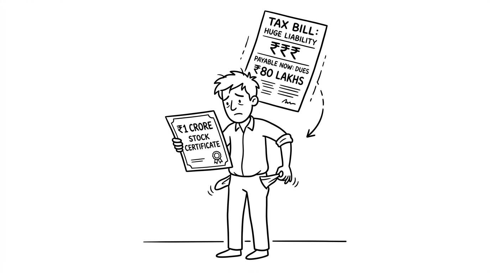

import NoticeTrap from '../../components/mdx/NoticeTrap.astro';

## 1. The Catastrophe (Meet Rahul)

Rahul was the 10th employee at a fast-growing Indian SaaS startup. Four years ago, instead of a high salary, he was granted 10,000 ESOPs. The "Strike Price" (what he has to pay to buy them) was just ₹10 per share.

Today, the startup just raised a Series C round. A merchant banker valued the company, and suddenly, the Fair Market Value (FMV) of Rahul's shares is ₹1,010 each.

Rahul is thrilled. He is a "Paper Crorepati." He decides to officially "Exercise" his options, paying the company ₹1,00,000 (10,000 shares x ₹10) to convert his options into actual shares. He plans to hold them until the company IPOs in 3 years.

**Then, the next month's salary slip arrives. His take-home pay is ZERO. Furthermore, HR tells him he owes the company ₹30 Lakhs in tax immediately.**

Rahul doesn't have ₹30 Lakhs. He is completely bankrupt. How did this happen?

## 2. The Origin of the Double Tax Trap

To understand why Rahul's life was ruined by a massive tax bill on money he hasn't even seen yet, we must rewind the clock to the 1990s. 

### The 1990s Corporate Loophole
In the late 90s, corporate CEOs and top executives realized that if they took a ₹5 Crore cash bonus, the government would take 30% of it in income tax. To evade this, they devised a loophole: they told their boards to pay their bonuses in company stock at massive discounts. They argued to the tax department, *"This isn't salary; it's just a piece of paper. You can't tax it until I sell it."*

### The Government Retaliation (Section 17)
The government was losing thousands of crores to this loophole. To stop the corporate elite, they aggressively amended Section 17 of the Income Tax Act. They decreed that ANY stock granted by an employer below the Fair Market Value (FMV) is a **"Perquisite"**—a non-cash salary bonus. 
The rule became ruthless: The moment you exercise the shares, the difference between what you paid and what it's worth is instantly added to your salary, and taxed at your highest slab rate.

### The Unintended Casualty (The Modern Startup)
Fast forward to 2015. The Indian startup ecosystem exploded. Young engineers were taking pay cuts to work for equity. 
The tragic irony? A 24-year-old software engineer exercising illiquid startup shares was being taxed under the exact same ruthless law designed to catch billionaire CEOs in the 1990s. They were forced to pay 30% tax on "paper wealth" they couldn't even sell on the open market.

## 3. The Brain Drain and the Flawed 80-IAC Band-Aid

Because this double-taxation was bankrupting employees, the best Indian startups started fleeing the country. They incorporated in Delaware (USA) and Singapore, where ESOPs are not taxed until they are actually sold. 

Fearing a massive brain drain of tech talent and capital, the Indian government panicked. In 2020, instead of fixing the root cause (Section 17), they slapped a bureaucratic band-aid on it: **Section 80-IAC**.
They announced that employees of "Eligible Startups" recognized by the DPIIT could legally **defer** paying this brutal perquisite tax. 

But it was only a band-aid. If your startup isn't officially recognized under this very narrow scheme, you are still trapped in the 1990s nightmare.

## 4. What is the exact regulation? (The Double Taxation Trap)

As it stands today, ESOPs in India suffer from a brutal flaw: **They are taxed twice, and the first tax hits you before you even sell the shares.**

### The First Tax: The "Perquisite" Tax (Section 17)
When Rahul exercised his options, the Income Tax Act viewed it as his employer giving him a massive, non-cash bonus (a "perquisite"). 
- **The Calculation:** The government takes the current Fair Market Value (₹1,010) and subtracts what Rahul actually paid (₹10). The difference is ₹1,000 per share. 
- **The Trap:** Across 10,000 shares, that is a ₹10,000,000 (₹1 Crore) "bonus" added directly to Rahul's salary for that year.
- **The Execution:** Rahul is thrust into the 30% tax bracket. The company is legally required to deduct ₹30 Lakhs in TDS immediately. Because the shares are private, Rahul cannot sell a few shares to pay the tax. He has to pay the ₹30 Lakhs out of his own pocket.

### The Second Tax: The Capital Gains Tax
Let's say Rahul somehow borrows ₹30 Lakhs to pay the tax. Three years later, the company IPOs, and he sells the shares for ₹2,000 each. 
He now owes Capital Gains tax on the difference between his sale price (₹2,000) and the FMV on the day he exercised (₹1,010). 

## 5. How can I minimize my risk? (Notice Traps)

Before we save Rahul, you must understand how the government monitors ESOPs.

<NoticeTrap title="Trap 1: The Form 12BA Ignorance">

**Scrutiny Trigger:** You leave your startup and they let you keep your vested ESOPs. A year later, you exercise them. You assume because you no longer work there, it isn't "salary."

**Resolution Strategy:** Even as an ex-employee, the startup will issue a Form 12BA and deduct TDS under Section 192, reporting it to the government as a perquisite. If you file your ITR-1 without declaring this specific Form 12BA data, the CPC algorithm will flag a massive mismatch and issue a demand notice with a 200% under-reporting penalty.

</NoticeTrap>

<NoticeTrap title="Trap 2: Fake FMV Certificates">

**Scrutiny Trigger:** To lower your perquisite tax, the founders get a friendly CA to issue a Category-2 Merchant Banker certificate artificially suppressing the Fair Market Value (FMV) of the shares.

**Resolution Strategy:** The Income Tax Department routinely cross-references ESOP FMV certificates against the valuation certificates the startup submitted to the MCA (Ministry of Corporate Affairs) during their latest funding round. If the VC paid ₹1,000 per share but your ESOP certificate says ₹100, the department will reject the valuation and retroactively apply the ₹1,000 rate, hitting you with the tax difference plus interest.

</NoticeTrap>

## 6. Let's Rewind Time (The Survival Strategy)

Let's rewind to the day Rahul decided to exercise his options. How could he have avoided bankruptcy?

### The "Eligible Startup" Deferral (Section 80-IAC)
If Rahul's startup was officially registered as an "Eligible Startup" with the DPIIT under Section 80-IAC, a massive loophole opens up. The government allows employees of these specific startups to **defer** the payment of the Perquisite Tax. 

If this applied, Rahul could exercise his shares, become a shareholder, and the ₹30 Lakh tax bill would be paused until one of three things happens:
1. He leaves the company.
2. He sells the shares.
3. 48 months (4 years) pass from the end of the assessment year.

### The "Cashless Exercise" (Liquidity Event)
If the startup is not registered under 80-IAC, Rahul's only survival strategy is to **never exercise his options until a liquidity event occurs.** 
He should wait until the IPO, or until a larger VC buys out early employees (a Secondary Sale). On that exact day, he exercises the options and immediately sells them. The cash from the sale pays the ₹30 Lakh perquisite tax instantly, leaving him with pure, liquid profit.

## 7. The Founder's Trap (ESOP Edge Cases)

### Edge Case 1: Foreign ESOPs (RSUs)
If you work for Amazon India or Google India, you aren't getting ESOPs; you are getting RSUs (Restricted Stock Units) of the US parent company. RSUs don't have a "Strike Price." The moment they vest, the entire value is taxed as a perquisite. 
Furthermore, you MUST declare these shares in **Schedule FA (Foreign Assets)** of your ITR-2. Even a single un-declared Google share triggers a flat ₹10 Lakh penalty under the Black Money Act.

## 8. 💡 Key Takeaway Summary & Actionable Checklist

*   **Never Exercise Blindly:** Unless you have the cash on hand to pay 30% of the FMV difference, do not exercise your options. Wait for a liquidity event.
*   **Check the Startup's Status:** Ask your founders if the company is registered under Section 80-IAC with the DPIIT. If yes, you can safely exercise and defer the tax.
*   **File ITR-2:** ESOPs usually require moving away from the simple ITR-1 form.
*   **Declare Foreign RSUs:** If your company is headquartered abroad, you must fill out Schedule FA to avoid draconian Black Money Act penalties.
