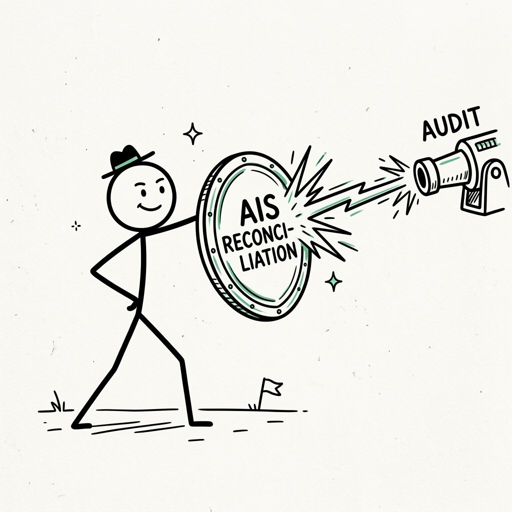

import NoticeTrap from "../../components/mdx/NoticeTrap.astro";
import CardPremium from "../../components/CardPremium.astro";

For decades, the standard playbook for a high-net-worth individual was simple: compartmentalization. You believed your bank account was a private vault, your credit card bills were your own business, and your real estate purchases were known only to the local sub-registrar. 

As long as the Income Tax Return (ITR) you filed looked mathematically clean, you assumed the Income Tax Department would leave you alone.

That era is over. The government fundamentally changed the rules of the board. They realized that tracking *income* is difficult because people hide it. But tracking *consumption* is easy, because people cannot resist spending it.

Enter the **Statement of Financial Transactions (SFT)** under Section 285BA, enforced by the algorithmic hammer of **Section 142(1)**. 

Today, if you pay a ₹10 Lakh credit card bill or buy ₹10 Lakhs in mutual funds, the machine doesn't just record it—it compares it against the tax slab you declared. If your spending mathematically eclipses your declared earning, the algorithm traps you. 

Here is the exact mechanical breakdown of how the SFT dragnet works, why you are currently in it, and the precise chess moves required to dismantle a Section 142(1) inquiry before it destroys your wealth.

---

## The Philosophy: The 5 Whys of the SFT Dragnet

To defeat the algorithm, you must first understand why it was built. Let’s dissect the historical intent through the 5 Whys.

1. **Why does the SFT (Section 285BA) exist?**
   Because tax evasion relies on asymmetric information. If you earn ₹50 Lakhs in cash and buy a house, the government previously had no way of linking that house to your PAN unless they physically raided you. 
2. **What existed before the SFT?**
   The government relied entirely on the *taxpayer* to voluntarily declare their income. It was a one-way street. The Income Tax Department had to prove you hid money, which was administratively impossible at scale.
3. **Why did the government change the law?**
   They shifted the burden of reporting away from the taxpayer and placed it squarely onto the *facilitators* of wealth. Banks, mutual fund houses, foreign exchange dealers, and sub-registrars are now legally mandated to act as informants. If a transaction crosses a specific threshold, they must file Form 61A (the SFT), directly mapping your PAN to the expenditure.
4. **What is the Delta that changes the outcome?**
   The delta is the shift from "Income Tracking" to **"Consumption Tracking."** The CPC algorithm no longer cares what you claim you earn. It cares what you spend. It takes your Annual Information Statement (AIS)—which is essentially a receipt of your lifestyle—and subtracts your declared ITR income. 
5. **Why are honest people trapped now?**
   Because time exists. You might have legitimately paid ₹15 Lakhs in taxes five years ago and saved the remaining ₹30 Lakhs in a bank account. Today, you take a sabbatical, earn ₹0, and use those savings to buy a ₹30 Lakh car. To the algorithm, your current year income is ₹0, but your expenditure is ₹30 Lakhs. The machine flags a mathematically impossible anomaly. 

---

## The Mechanical Pipeline: The Section 142(1) Inquiry

When the SFT anomaly is triggered, the CPC does not immediately issue a penalty. Instead, they initiate an "e-Campaign" and issue a notice under **Section 142(1) - Inquiry before Assessment**.

Section 142(1) is the government's way of saying: *"We see your move. Now explain how you afforded it."*

### Step 1: The Trigger Thresholds
The algorithm does not flag everything. It is triggered by highly specific statutory thresholds codified under Rule 114E. The moment you cross these, your PAN is flagged:

*   **Credit Cards:** Paying bills aggregating to ₹1 Lakh or more in *cash*, or ₹10 Lakhs or more via any mode (NEFT/Cheque) in a financial year.
*   **Mutual Funds / Stocks / Bonds:** Investing ₹10 Lakhs or more in a single financial year.
*   **Real Estate:** Buying or selling immovable property valued at ₹30 Lakhs or more (or where the stamp duty value exceeds ₹30 Lakhs).
*   **Cash Deposits:** Depositing ₹10 Lakhs or more in savings accounts, or ₹50 Lakhs or more in current accounts.
*   **Foreign Exchange:** Purchasing forex (for travel or LRS) aggregating to ₹10 Lakhs or more.

### Step 2: The AIS Mismatch
The CPC’s backend (Project Insight) takes the sum of your SFT triggers and juxtaposes it against your filed ITR. If you declared a Gross Total Income of ₹8 Lakhs, but your SFT shows a ₹15 Lakh mutual fund investment, the system generates a "High-Value Transaction Mismatch."

### Step 3: The Notice (Section 142(1))
You receive a notice on the e-Filing Compliance Portal. This is not an assessment order; it is an inquiry. It requires you to submit a response explaining the **Source of Funds**.

### Step 4: The Hinge (Your Response)
This is the critical chess move. You must log into the portal and select from a pre-defined dropdown menu to explain the anomaly. 
If you choose the correct logical defense (and have the paper trail), the algorithm closes the case. If you ignore it or lie, the algorithm escalates the inquiry into a full-blown **Section 148 Reassessment** or a **Section 144 Best Judgment Assessment**, where they unilaterally assume the entire amount is illegal black money and tax it at 83.9% (under Section 115BBE).

---

## The Notice Traps: Where Taxpayers Lose the Game

<NoticeTrap 
  title="The Accumulated Savings Trap" 
  severity="high" 
  trigger="You pay a ₹12 Lakh credit card bill using tax-paid savings from previous years, but your current year ITR shows only ₹5 Lakhs income." 
  solution="Do not panic and do not revise your ITR to artificially inflate your income. In the Compliance Portal, select 'Out of Earlier Income/Savings' and upload your past 3 years' ITRs and the bank account ledger proving the money was sitting in your account prior to the current financial year." 
/>

<NoticeTrap 
  title="The Family Gift Trap" 
  severity="high" 
  trigger="Your father transfers ₹20 Lakhs to your bank account to help you buy a house. The SFT flags a ₹20 Lakh mutual fund/property purchase against your meager ₹4 Lakh salary." 
  solution="Gifts from relative (lineal ascendants) are 100% tax-free under Section 56(2)(x). In the portal, select 'Received as Gift'. You must immediately draft and execute a 'Gift Deed' on stamp paper and upload it alongside your father's bank statement showing the transfer." 
/>

<NoticeTrap 
  title="The Joint Property Trap" 
  severity="medium" 
  trigger="You and your spouse buy a ₹50 Lakh property jointly (50-50). The sub-registrar files an SFT mapping the entire ₹50 Lakhs to YOUR PAN because you were listed as the primary buyer on the registry." 
  solution="The SFT is blind to joint ownership ratios. In the portal, you must select 'Information is Partially Correct'. You then explicitly state that your share is only 50% (₹25 Lakhs) and provide your spouse's PAN and bank statements proving they paid the other half." 
/>

---

## The Mechanics of Proof: How to Win the Inquiry

When you respond to a Section 142(1) inquiry regarding an SFT mismatch, the burden of proof is entirely on you. The tax department does not have to prove you evaded tax; you have to prove you didn't. 

Under the law (specifically referencing Section 68 for unexplained cash credits), you must satisfy three distinct legal tests to prove the source of any funds:
1.  **Identity:** Who gave you the money? (You must provide their PAN).
2.  **Genuineness:** Did the transaction actually happen? (You must provide banking channels/NEFT trails, never cash receipts).
3.  **Creditworthiness:** Did the person who gave you the money actually have the capacity to give it? (You must provide *their* ITR to prove they could afford to loan/gift you the money).

If you fail even one of these three tests, the Assessing Officer will reject your explanation and tax the entire transaction.

---

## 💡 Key Takeaway Summary & Actionable Checklist

The SFT is an automated consumption dragnet, but it is deeply flawed. It lacks human context. It cannot tell the difference between illegal black money and a legitimate gift from your mother. 

If you receive a Section 142(1) e-Campaign notice, your job is simply to provide the missing context.

<CardPremium>
### The SFT Inquiry Defense Checklist

- [ ] **Never Ignore the Notice:** The e-Campaign has a strict deadline (usually 15 to 30 days). Ignoring it triggers an automated escalation to a severe Section 144 ex-parte assessment.
- [ ] **Download the AIS First:** Before responding, download your Annual Information Statement (AIS) and TIS (Taxpayer Information Summary) from the portal. Verify exactly which entity (e.g., HDFC Bank, CAMS) reported the transaction.
- [ ] **Categorize the Source:** Trace every rupee of the flagged transaction back to its origin. Was it a Loan? A Gift? Past Savings? Sale of an Asset? Agricultural Income?
- [ ] **Gather the Holy Trinity of Proof:** For external sources (loans/gifts), collect the sender's PAN, the bank statement highlighting the exact NEFT transfer, and a signed confirmation letter (or Gift Deed/Loan Agreement).
- [ ] **Submit via the Compliance Portal:** Do not email the Assessing Officer. You must submit the response strictly through the dropdown menus in the *Compliance Portal ➔ e-Campaign* tab, attaching your PDF evidence. 
</CardPremium>

By understanding that the SFT is merely an algorithmic query for context, you transform a terrifying tax notice into a routine administrative response. You satisfy the machine's parameters, prove your source of funds, and achieve outcome certainty.
