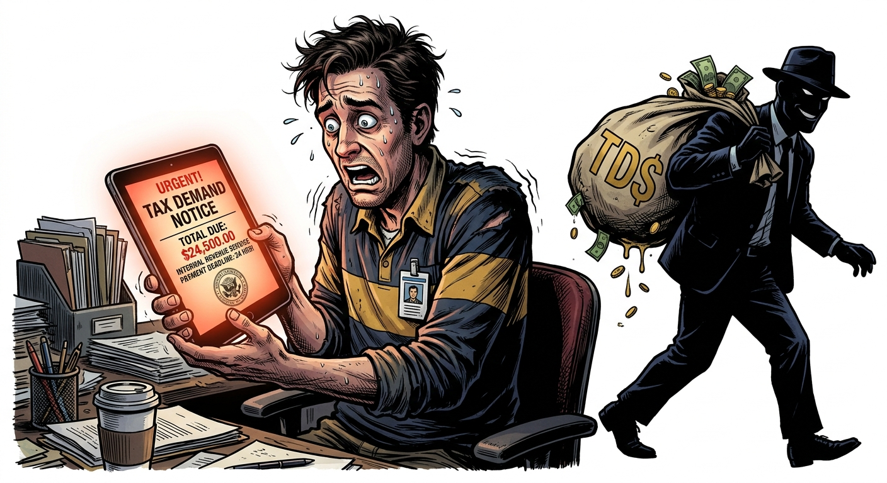
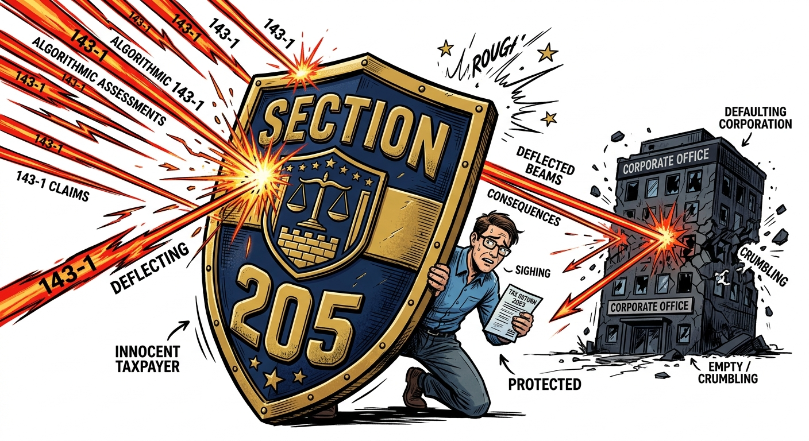

import NoticeTrap from "../../components/mdx/NoticeTrap.astro";
import CardPremium from "../../components/CardPremium.astro";

## The Prelude: The Phantom Tax Demand

You open an email from the Centralized Processing Centre (CPC) containing your Section 143(1) Intimation. You filed your returns on time. You expect a refund. 

Instead, the PDF mathematically recalculates your return and slaps you with a tax demand for ₹1,20,000, plus interest. 

You check your payslips. Your employer clearly deducted the ₹1,20,000 as Tax Deducted at Source (TDS). But when you check your Form 26AS and Annual Information Statement (AIS), the TDS credit is completely missing. 

Your employer—whether they are a struggling ed-tech startup or a bankrupt contractor—deducted your money but used it for working capital instead of depositing it with the government. 

The machine does not care about your employer's bankruptcy. The CPC algorithm only reads the data feed from Form 26AS. If the deposit isn't there, the algorithm automatically issues a demand against you. It expects you to pay the tax twice.

<CardPremium title="TL;DR: The TDS Arrears Trap" variant="warning">
- **The Core Issue:** Your employer deducted TDS from your salary but went bankrupt and never deposited it. The automated tax portal demands that you pay the tax again.
- **The Mechanics:** The CPC algorithm blindly relies on Form 26AS. If the employer's deposit isn't there, the credit doesn't exist, triggering a Section 143(1) demand against the employee.
- **The Defense:** You are legally shielded by Section 205. File a grievance disagreeing with the demand, quoting Section 205, which explicitly bars the government from demanding tax from an employee that was already deducted by the employer.
</CardPremium>

## The Core Mechanics: Algorithmic Blindness

The Indian tax collection infrastructure operates on a necessary but fragile trust mechanism. 

Decades ago, TDS credit was granted based on physical TDS certificates (Form 16/16A). However, this led to massive revenue leakage as companies issued fake certificates without actually depositing the cash into the treasury. To plug the leakage, the CBDT introduced a strict algorithmic barrier. 

The CPC in Bengaluru was programmed to blindly trust a single source of truth: **Form 26AS**. If the PAN of the deductor hasn't transferred the cash to the treasury linked to your PAN, the credit mathematically does not exist.

This mechanical shift perfectly solved the government's revenue problem, but it created a severe collateral victim: the honest employee. The algorithm cannot distinguish between an employee who is faking a TDS claim and a victim who was robbed by their own employer. 

## 360° Coverage: The Nature of the Liability

If we deconstruct this from first principles, this situation shifts from a pure tax dispute to an issue of misappropriated funds. 

There are two conflicting viewpoints that cause this structural standoff:
1. **The Revenue Viewpoint:** The government hasn't received the money, so the tax remains unpaid. It is computationally cheaper and easier to send an automated 143(1) demand to the individual whose PAN is linked to the shortfall than to send a recovery officer after a bankrupt corporation.
2. **The Taxpayer Viewpoint:** The tax was physically withheld from their salary. From the employee's perspective, the legal obligation was met the precise moment their in-hand salary was reduced by the HR department. 

The psychological trap here is the **Assumption of Guilt**. The standard advice on generic tax blogs is simply "reply to the notice." But employees facing this are often terrified. They feel like tax evaders. They assume the system is infallible and that fighting the Income Tax Department is impossible.

---

## The Ultimate Defensive Posture: Educational Empowerment

We do not encourage adversarial conflict with the tax authorities. However, it is vital to be explicitly aware of the specific remedies that exist within the law to protect your fundamental rights in this exact scenario.

### The Section 205 Shield
**Section 205 of the Income Tax Act** provides a specific structural remedy for this anomaly. It states: 
> *"Where tax is deductible at the source under the foregoing provisions of this Chapter, the assessee shall not be called upon to pay the tax himself to the extent to which tax has been deducted from that income."*

This is your absolute legal shield. The moment the employer deducts the tax, it becomes a debt owed by the employer to the Central Government. The IT Department cannot recover a debt from you that you have already paid to their designated collection agent.

### The Procedural Shift
If you ignore the 143(1) demand, the automated system will eventually freeze your bank accounts or illegally adjust the demand against your future tax refunds under Section 245. You must formally shift the jurisdiction of the recovery.

1. **Do Not File a Revised Return:** If you revise your return to remove the disputed income, you are effectively accepting that the employer never paid you. Maintain your original filing claiming the TDS.
2. **Gather the Evidentiary Chain:** You must prove to the Assessing Officer that the deduction actually occurred. Gather your employment contract, payslips showing the gross amount and exact TDS deducted, and bank statements proving you only received the *net* amount.
3. **The Grievance Redressal:** Log into the e-Filing portal. Go to `Pending Actions > Response to Outstanding Demand`. Select "Disagree with demand." State the reason as: *"Demand is due to TDS deducted but not deposited by the employer."*
4. **Invoke CBDT Instruction No. 275/29/2014-IT(B):** File a written grievance to your Jurisdictional Assessing Officer (JAO). Quote Section 205 and the CBDT instruction which bars the AO from enforcing the demand against the employee and mandates transferring the case to the TDS Wing to prosecute the employer.
5. **The Precedent:** High Courts (such as the Bombay High Court in *Yashpal Sahni vs ACIT*) have consistently ruled that the Revenue Department must recover the stolen TDS from the employer, not the employee. 

In severe cases of corporate fraud, some taxpayers even file police complaints regarding criminal breach of trust (Section 405 IPC) for the un-deposited TDS, attaching this FIR to their IT grievance to substantiate their claim that the funds were misappropriated by a third party.

You are not fighting the Income Tax Department; you are simply pointing them toward their actual target.
