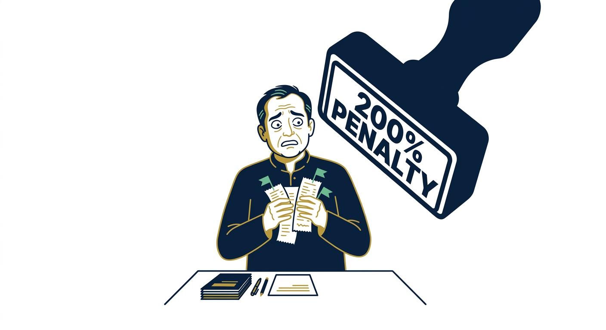

import NoticeTrap from "../../components/mdx/NoticeTrap.astro";
import CardPremium from "../../components/CardPremium.astro";

# The Section 270A 200% Penalty Trap: How the Tax Algorithm Upgrades a 50% Disallowance into Financial Ruin

---

Prior to Assessment Year (AY) 2017–18, penalty proceedings under the Indian Income Tax Act, 1961 were governed by **Section 271(1)(c)**. Under that regime, Assessing Officers (AOs) held broad, subjective discretion to penalize taxpayers for "concealment of income" or "furnishing inaccurate particulars of income." This subjectivity led to decades of litigation, with higher courts routinely quashing penalties where taxpayers demonstrated a plausible legal position or an absence of *mens rea* (guilty mind)—a doctrine cemented by the Supreme Court in *CIT v. Reliance Petroproducts Pvt. Ltd.* (2010).

To eliminate subjective discretion and replace it with an objective, algorithmic framework, Parliament enacted **Section 270A** via the Finance Act 2016. Section 270A creates a statutory binary that categorizes additions to income into two distinct legal classes:

1. **Under-reporting of income**, which attracts a mandatory penalty equal to **50%** of the tax payable on the under-reported amount.
2. **Misreporting of income**, which attracts a mandatory penalty equal to **200%** of the tax payable on the under-reported amount.

```
                         [ TAXABLE INCOME DISCREPANCY DETECTED ]
                                            |
                                            v
                         +----------------------------------+
                         |  Statutory Safe Harbor Check     |
                         |        [Section 270A(6)]         |
                         +----------------------------------+
                                  /                \
                     EXEMPT      /                  \  NOT EXEMPT
                                /                    \
                               v                      v
                      [ 0% PENALTY ]       +----------------------+
                      No Under-reporting   | Under-Reporting Core |
                      (Bona fide position, |  [Section 270A(2)]   |
                       TP docs, estimates) +----------------------+
                                                      |
                                     +----------------+----------------+
                                     |                                 |
                          FALLS WITHIN 270A(9)?             DOES NOT FALL WITHIN 270A(9)
                         (Exhaustive 6 Clauses)             (General Discrepancy)
                                     |                                 |
                                     v                                 v
                             [ MISREPORTING ]                  [ UNDER-REPORTING ]
                               200% Penalty                       50% Penalty
                             (Sec 270AA Immunity               (Sec 270AA Immunity
                              Statutorily BARRED)              AVAILABLE in 30 Days)
```

For taxpayers—ranging from independent professionals to multinational enterprise entities—the mathematical and procedural difference between these two tiers is categorical. A 50% penalty represents a manageable financial correction; a 200% penalty, combined with mandatory interest under Sections 234B and 234C, routinely exceeds 100% of the underlying disallowance itself.

Worse, an allegation of misreporting under Section 270A(9) statutorily blocks the taxpayer from seeking penalty immunity under **Section 270AA**, locking them into years of complex litigation.

To navigate or defend against this statutory framework, one must understand the computational mechanics, algorithmic triggers, procedural traps, and jurisdictional defenses that govern Section 270A.

---

## 1. The Paradigm Shift: From Section 271(1)(c) Subjectivity to Section 270A Mechanics

To understand the operational mechanics of Section 270A, one must first analyze the statutory breakdown of its predecessor, Section 271(1)(c), and why Parliament replaced it.

```
+----------------------------------------------------------------------------------------------------+
|                                PARADIGM SHIFT COMPARISON MATRIX                                    |
+------------------------+------------------------------------+--------------------------------------+
| Feature                | Legacy Section 271(1)(c)           | Current Section 270A                 |
+------------------------+------------------------------------+--------------------------------------+
| Core Benchmark         | Concealment of income OR           | Under-reporting OR                   |
|                        | Furnishing inaccurate particulars  | Misreporting of income               |
+------------------------+------------------------------------+--------------------------------------+
| Nature of Power        | Subjective AO satisfaction         | Objective, formulaic mathematical    |
|                        | ("If the AO is satisfied...")      | trigger based on variance            |
+------------------------+------------------------------------+--------------------------------------+
| Role of Mens Rea       | Pervasive litigation over intent;  | Completely eliminated; replaced by   |
|                        | Reliance Petrochem protection      | strict statutory safe harbors u/s    |
|                        | against bona fide claims           | 270A(6)                              |
+------------------------+------------------------------------+--------------------------------------+
| Penalty Quantum        | 100% to 300% of tax sought to      | Strict bifurcated fixed rate:        |
|                        | be evaded (AO Discretion)          | 50% (Under-reporting) / 200% (Mis-   |
|                        |                                    | reporting)                           |
+------------------------+------------------------------------+--------------------------------------+
| Statutory Immunity     | Discretionary via Sec 273AA /      | Mandatory statutory entitlement      |
|                        | Settlement Commission (Sec 245D)   | u/s 270AA (Only for Under-reporting) |
+------------------------+------------------------------------+--------------------------------------+
```

Under Section 271(1)(c), the term "inaccurate particulars" was not exhaustively defined by statute. This ambiguity allowed courts to carve out broad protections for taxpayers: as long as a taxpayer fully disclosed primary facts in their tax return and audit reports, making an untenable or rejected legal claim did not automatically trigger penalties (*CIT v. Reliance Petroproducts Pvt. Ltd.*).

Section 270A intentionally upended this judicial doctrine by removing "concealment" and "inaccurate particulars" from the statute entirely. Instead, Section 270A establishes a computational definition of **Under-reporting** [Section 270A(2)], and then carves out explicit, exhaustive instances of **Misreporting** [Section 270A(9)]. 

If an addition to income occurs, it automatically constitutes "under-reporting" unless it qualifies for a statutory **Safe Harbor** under **Section 270A(6)**. The burden of proof has shifted: under the current law, the taxpayer must affirmatively prove that their case fits into a specific statutory safe harbor to avoid a baseline 50% penalty.

---

## 2. The Algorithmic Net: How CPC, AIS, and CASS Flag Discrepancies



Modern tax assessments in India are initiated through automated data-matching algorithms operated by the **Centralized Processing Center (CPC)** and the **Computer-Assisted Scrutiny Selection (CASS)** system. Understanding how these algorithms operate exposes the precise transition point where a routine return morphs into a Section 270A penalty proceeding.

```
+-----------------------------------------------------------------------------------+
|                            THE ALGORITHMIC DETECTION PIPELINE                     |
+-----------------------------------------------------------------------------------+
|  STEP 1: DATA INGESTION                                                           |
|  SFT (Banks/Registrars) + TDS/TCS (26AS) + GSTN (GSTR-1/3B) + AIS/TIS             |
+-----------------------------------------------------------------------------------+
                                         |
                                         v
+-----------------------------------------------------------------------------------+
|  STEP 2: AUTOMATED CROSS-MATCHING ENGINE                                          |
|  * Discrepancy Check: Form 26AS vs. Schedule BP (Turnover Mismatch)              |
|  * Expense Ratio Engine: Expense Claims vs. Peer Industry Averages                |
|  * Tax-Exempt Inconsistency: Sec 44ADA Gross Receipts vs. Sec 194J Data           |
+-----------------------------------------------------------------------------------+
                                         |
                                         v
+-----------------------------------------------------------------------------------+
|  STEP 3: AUTOMATED CLAUSE DISCOVERY & NOTICE GENERATION                           |
|  * Mismatch detected -> Issue Prima Facie Adjustment Notice u/s 143(1)(a)          |
|  * Unresolved/High-Value Discrepancy -> CASS Flags for Faceless Assessment u/s 143(3)|
+-----------------------------------------------------------------------------------+
                                         |
                                         v
+-----------------------------------------------------------------------------------+
|  STEP 4: PENALTY INITIATION ENGINE                                                |
|  * AO adds back expense/income -> Invokes Section 270A                            |
|  * Algorithmic Suggestion: Tag as 270A(9)(c) "Unsubstantiated Expenditure"         |
+-----------------------------------------------------------------------------------+
```

### Step 1: Ingestion and Aggregation via the Annual Information Statement (AIS)
The Income Tax Department ingests real-time financial data via Statement of Financial Transactions (SFT), TDS/TCS returns, GSTN filings (GSTR-1 and GSTR-3B), and reporting entities. This data aggregates inside the taxpayer’s **Annual Information Statement (AIS)** and **Taxpayer Information Summary (TIS)**.

### Step 2: Automated Cross-Matching
When a taxpayer files their Income Tax Return (ITR), the CPC algorithm executes automated cross-verification routines:
* **Turnover / Receipt Matching:** Cross-references gross receipts reported in Schedule BP or Schedule CG against TDS credits claimed under Section 194C, 194J, 194H, or 194O.
* **Expense-to-Gross-Receipt Ratios:** For individual professionals filing under Section 44ADA or carrying on business under Section 44AB, the CASS engine scans expense ratios against industry thresholds. If a freelancer operating under Section 44AB claims business expenses amounting to 85% of gross receipts—where the peer baseline is 30–40%—the system issues a CASS risk flag.
* **GSTN vs. ITR Reconciliation:** Automatically compares gross revenue declared in GSTR-3B filings against turnover reported in the income tax return. Any negative variance in the ITR triggers an automated query.

### Step 3: Referral to CASS and Faceless Assessment
If automated queries under Section 143(1)(a) remain unaddressed or involve high-value variance, CASS assigns the case for **Faceless Assessment** under Section 143(3). 

During Faceless Assessment, the Assessing Officer (AO) issues notices under Section 142(1) requesting documentary proof—such as bank statements, vendor invoices, payment vouchers, and ledger confirmations.

### Step 4: Disallowance and Penalty Initiation
If the taxpayer fails to produce contemporaneous primary evidence (e.g., proof of actual performance of service, bank payment trails, valid tax invoices with GSTINs), the AO disallows the claimed expenditure under Section 37(1) or treats unverified credits as unexplained under Section 68. 

At the moment of making this assessment addition, the AO initiates penalty proceedings under **Section 270A**. The critical legal fork in the road is whether the AO initiates this penalty for simple **under-reporting** (50%) or tags it as **misreporting** (200%).

---

## 3. Under-Reporting (50%) vs. Misreporting (200%): Statutory Micro-Mechanics

Section 270A does not give the Assessing Officer unfettered freedom to choose between a 50% and 200% penalty. The statute constructs a baseline definition for under-reporting and restricts misreporting to six statutory scenarios.

```
+-----------------------------------------------------------------------------------+
|                        SECTION 270A STATUTORY BIFURCATION                         |
+-----------------------------------------------------------------------------------+
|                                UNDER-REPORTING                                    |
|                              [Section 270A(2) & (3)]                              |
|                                         |                                         |
|  * Base Trigger: Assessed Income > Returned Income                                |
|  * Penalty Base Rate: 50% of Tax Payable on Under-Reported Income                 |
|  * Default Status: Applies to all additions UNLESS falling under 270A(6) or 270A(9)|
|  * Immunity: FULLY ELIGIBLE for Section 270AA Immunity                            |
+-----------------------------------------------------------------------------------+
                                          |
                                          | UPGRADED ONLY IF FULLY
                                          | SATISFYING SEC 270A(9)
                                          v
+-----------------------------------------------------------------------------------+
|                                  MISREPORTING                                     |
|                                [Section 270A(9)]                                  |
|                                         |                                         |
|  * Exhaustive Statutory Categories:                                               |
|    (a) Misrepresentation or suppression of facts                                  |
|    (b) Failure to record investments in books of account                          |
|    (c) Claim of expenditure not substantiated by evidence                         |
|    (d) Recording of false entry in books of account                               |
|    (e) Failure to record any receipt in books of account having a bearing on income|
|    (f) Failure to report international/specified domestic transactions (Chapter X) |
|                                         |                                         |
|  * Penalty Base Rate: 200% of Tax Payable on Under-Reported Income                |
|  * Immunity: STATUTORILY BARRED from Section 270AA Immunity                       |
+-----------------------------------------------------------------------------------+
```

### A. The Baseline: Under-Reporting of Income [Section 270A(2) & (3)]
Under Section 270A(2), a person is deemed to have under-reported income if:
1. **Regular Assessment / Reassessment:** The income assessed exceeds the income declared in the return of income.
2. **First Assessment where no return was filed:** Income assessed exceeds the basic exemption limit.
3. **Loss Cases:** An assessment or reassessment reduces the quantum of reported loss or converts a reported loss into positive income.
4. **Deemed Total Income (MAT/AMT):** Total income assessed under Section 115JB (MAT) or Section 115JC (AMT) exceeds the returned MAT/AMT total income.

Under Section 270A(7), the default penalty for under-reporting is **50% of the tax payable** on the under-reported income.

### B. The Upgrade: Misreporting of Income [Section 270A(9)]
To impose a **200% penalty**, the Assessing Officer cannot rely on a generic claim of under-reporting. Section 270A(9) dictates that under-reported income shall be considered **misreported income** if and *only* if it falls strictly into one of the following six exhaustive sub-clauses:

```
Misreporting Clause ∈ {270A(9)(a), 270A(9)(b), 270A(9)(c), 270A(9)(d), 270A(9)(e), 270A(9)(f)}
```

#### Clause (a): Misrepresentation or suppression of facts
Occurs when a taxpayer actively conceals material facts or submits distorted information to lower their tax liability (e.g., claiming a personal expense as a corporate expenditure while changing the vendor description).

#### Clause (b): Failure to record investments in books of account
Occurs when an asset, real estate transaction, or financial investment made during the financial year is omitted from the balance sheet or accounting records.

#### Clause (c): Claim of expenditure not substantiated by evidence
This is the primary clause invoked against freelancers and businesses. If a taxpayer claims an expense deduction (e.g., ₹10 Lakhs under "Professional Fees") but cannot produce invoices, proof of delivery, bank payment trails, or contract terms, the AO treats the claim as unsubstantiated.

#### Clause (d): Recording of false entry in books of account
Occurs when the taxpayer inputs fictitious invoices, accommodation bills from shell entities, or forged expense entries into their books.

#### Clause (e): Failure to record any receipt in books of account having a bearing on total income
Occurs when gross receipts, interest income, or professional fees received in a bank account or cash are completely omitted from the financial statements.

#### Clause (f): Failure to report any international transaction or specified domestic transaction under Chapter X
Occurs when an enterprise omits cross-border transactions with associated enterprises from Form 3CEB and the return of income.

---

## 4. The Safe Harbor Shield: Section 270A(6) Legal Primacy


A foundational principle of direct tax law—frequently missed by Assessing Officers and generic legal commentaries—is that **Section 270A(6) takes statutory precedence over Section 270A(9)**.

```
                   +---------------------------------------+
                   |  AO Proposes Addition / Disallowance  |
                   +---------------------------------------+
                                       |
                                       v
                   +---------------------------------------+
                   | DOES IT FIT A SEC 270A(6) SAFE HARBOR?|
                   +---------------------------------------+
                                  /         \
                             YES /           \ NO
                                /             \
                               v               v
               +-----------------------+     +-----------------------+
               | EXCLUDED FROM         |     | PROCEED TO EVALUATE   |
               | "UNDER-REPORTING"     |     | SEC 270A(9)           |
               |                       |     | MISREPORTING CLAUSES  |
               | Penalty = 0%          |     +-----------------------+
               +-----------------------+
```

Section 270A(6) provides five statutory safe harbors. If an addition to income falls under any of these five clauses, it **cannot be treated as under-reported income at all**. If it is excluded from under-reporting, its Under-Reported Income (URI) is zero—making it legally impossible to upgrade to misreporting under Section 270A(9).

### The Five Statutory Safe Harbors [Section 270A(6)]

```
+--------------------------------------------------------------------------------------------------+
|                                SECTION 270A(6) SAFE HARBOR MATRIX                                |
+------------------+------------------------------------------+------------------------------------+
| Statutory Sub-cl | Safe Harbor Description                  | Legal Trigger Requirement          |
+------------------+------------------------------------------+------------------------------------+
| 270A(6)(a)       | Bona Fide Explanation & Material Facts   | Taxpayer offers a bona fide legal  |
|                  | Disclosed                                | view and reveals all primary facts.|
+------------------+------------------------------------------+------------------------------------+
| 270A(6)(b)       | Estimated Additions (Incomplete Books)   | Books rejected, but accounting     |
|                  |                                          | method applied consistently.       |
+------------------+------------------------------------------+------------------------------------+
| 270A(6)(c)       | Estimated Additions on Own Variance      | Taxpayer estimated a lower         |
|                  |                                          | addition/disallowance in return.   |
+------------------+------------------------------------------+------------------------------------+
| 270A(6)(d)       | Transfer Pricing Compliance              | Maintained Sec 92D docs AND        |
|                  |                                          | disclosed in Form 3CEB.            |
+------------------+------------------------------------------+------------------------------------+
| 270A(6)(e)       | Discrepancy in TDS/TCS Data              | Income omitted due to matching     |
|                  |                                          | TDS/TCS with no prior control.     |
+------------------+------------------------------------------+------------------------------------+
```

### Deep Legal Mechanics: Section 270A(6)(a) vs. Section 270A(9)(c)
The primary battleground in Section 270A litigation is the conflict between **Section 270A(6)(a)** (Bona fide explanation with full disclosure) and **Section 270A(9)(c)** (Unsubstantiated expenditure).

Assessing Officers frequently argue: *"The taxpayer failed to produce sufficient third-party proof for an expense; therefore, it is an unsubstantiated claim under Section 270A(9)(c), triggering a 200% penalty."*

This reasoning is legally flawed. To satisfy **Section 270A(6)(a)** and secure complete immunity from penalties (0%), the taxpayer must satisfy a two-pronged statutory test:
1. **Offer an explanation:** The taxpayer offers a rational, legal, or commercial explanation for the position taken in their tax return.
2. **Bona Fides & Full Primary Disclosure:** The taxpayer demonstrates that all material facts relating to the item were fully disclosed in the financial statements, audit reports, or return disclosures.

#### Disallowance vs. Unsubstantiated Claim
A disallowance of an expense does not automatically equal an unsubstantiated claim under Section 270A(9)(c).

* **Legal Disallowance [Protected by 270A(6)(a)]:** A taxpayer claims ₹10 Lakhs in business travel expenses. They provide bank payment receipts, air tickets, and hotel folios. The AO disallows 20% (₹2 Lakhs) on the grounds that personal elements cannot be ruled out. Because primary facts were disclosed and an explanation was offered, this is an estimate/disallowance covered by **Section 270A(6)(a)**. The penalty is **0%**.
* **Unsubstantiated Claim [Captured by 270A(9)(c)]:** A taxpayer claims ₹10 Lakhs in sub-contracting expenses. The AO requests bank statements, invoices, and service deliverables. The taxpayer provides no bank trail, no invoices, and no proof that the sub-contractor exists. This claim falls under **Section 270A(9)(c)**.

---

## 5. Mathematical Mechanics & Loss Returns [Section 270A(10)]

Section 270A penalties do not apply directly to the under-reported income itself. Instead, the penalty applies to the **tax payable on the under-reported income** as computed under Section 270A(10). 

Understanding these mathematical formulas shows why even taxpayers operating at a loss or paying Minimum Alternate Tax (MAT) can face significant penalty liabilities.

```
+-----------------------------------------------------------------------------------+
|                        SECTION 270A COMPUTATIONAL WORKFLOW                        |
+-----------------------------------------------------------------------------------+
|  STEP 1: DETERMINATION OF UNDER-REPORTED INCOME (URI)                             |
|  * First Assessment: URI = Assessed Income - Returned Income                      |
|  * Loss Conversion: URI = | Claimed Loss | + Assessed Positive Income              |
+-----------------------------------------------------------------------------------+
                                         |
                                         v
+-----------------------------------------------------------------------------------+
|  STEP 2: COMPUTATION OF TAX ON UNDER-REPORTED INCOME [Sec 270A(10)]               |
|  Tax on URI = Tax(Assessed Income) - Tax(Returned Income / Basic Exemption)       |
|  (Calculated using applicable slab/corporate rates plus Surcharge & Cess)         |
+-----------------------------------------------------------------------------------+
                                         |
                                         v
+-----------------------------------------------------------------------------------+
|  STEP 3: MULTIPLICATION BY PENALTY RATE                                           |
|  * Under-Reporting Penalty = 50%  x Tax on URI                                   |
|  * Misreporting Penalty   = 200% x Tax on URI                                   |
+-----------------------------------------------------------------------------------+
```

### Formula 1: Regular Assessment (First Assessment - Positive Income)
Where total income is assessed for the first time under Section 143(3) or Section 144:

```
Tax on URI = T(I_A) - T(I_R)
```

Where:
* `I_A` = Assessed Total Income
* `I_R` = Returned Total Income (or Basic Exemption Limit if no return was filed)
* `T(X)` = Tax payable on income `X`, calculated at applicable corporate/individual slab rates inclusive of Surcharge and Health & Education Cess.

### Formula 2: Reassessment Proceedings [Section 270A(3)]
Where total income is reassessed under Section 147:

```
Tax on URI = T(I_RE) - T(I_P)
```

Where:
* `I_RE` = Reassessed Total Income
* `I_P` = Total Income assessed or reassessed immediately prior to the current reassessment

### Formula 3: Deemed Total Income (MAT u/s 115JB / AMT u/s 115JC)
Where adjustments are made to book profits under MAT/AMT provisions:

```
Tax on URI (MAT) = (T_MAT(M_A) - T_MAT(M_R)) + (T_REG(I_A) - T_REG(I_R))
```

If additions are made simultaneously to normal income and MAT book profit, tax on URI is computed across both streams to ensure no under-reporting escapes penalty.

<NoticeTrap>
### Formula 4: The Loss Return Trap
The most severe mathematical impact occurs when an assessment turns a reported business loss into taxable income or reduces a reported loss.

#### Case A: Reported Loss Reduced
* Taxpayer reports a business loss of `-₹50,00,000`.
* AO disallows fictitious expenses of `₹30,00,000`.
* Assessed Loss = `-₹20,00,000`.

```
Under-Reported Income (URI) = |-₹50,00,000| - |-₹20,00,000| = ₹30,00,000
```

#### Case B: Reported Loss Converted to Positive Income
* Taxpayer reports a business loss of `-₹20,00,000`.
* AO disallows unsupported expenses of `₹50,00,000`.
* Assessed Income = `+₹30,00,000`.

```
Under-Reported Income (URI) = Claimed Loss + Assessed Income = ₹20,00,000 + ₹30,00,000 = ₹50,00,000
```

#### The Loss Calculation Rule [Section 270A(10)]
Under Section 270A(10), tax on under-reported income in loss cases is calculated **as if the URI were the total income of the taxpayer**.

```
[ Claimed Loss: -₹20,00,000 ]  ----(AO Disallowance: ₹50,00,000)---->  [ Assessed Income: +₹30,00,000 ]
                                                                                   |
                                                                                   v
                                                                   Under-Reported Income = ₹50,00,000
                                                                                   |
                                                                                   v
                                                                  Calculate Tax on ₹50,00,000 as if Total Income
                                                                  Apply 50% (Under-Reporting) or 200% (Misreporting)
```

#### Numerical Calculation Example:
Assume a corporate taxpayer with a 30% tax rate (+ 4% Cess = 31.2% effective tax):
* **URI:** ₹50,00,000
* **Tax on URI:** `50,00,000 × 31.2% = ₹15,60,000`
* **Under-Reporting Penalty (50%):** `15,60,000 × 50% = ₹7,80,000`
* **Misreporting Penalty (200%):** `15,60,000 × 200% = ₹31,20,000`

Even if a business has zero net cash profit and zero regular tax liability under its original return, an assessment disallowance triggers immediate, out-of-pocket penalty liabilities.
</NoticeTrap>

---

## 6. The Section 270AA Immunity Ambush & The "Misreporting Label" Catch-22

To reduce litigation, Parliament introduced **Section 270AA**, allowing taxpayers to apply for complete immunity from Section 270A penalties and criminal prosecution under Sections 276C and 276CC.

```
+-----------------------------------------------------------------------------------+
|                        SECTION 270AA IMMUNITY ELIGIBILITY MATRIX                  |
+-----------------------------------------------------------------------------------+
|  CONDITION 1: Pay Demand Notice u/s 156 within 30 days of receipt.                |
|  CONDITION 2: Expressly WAIVE the right to file an Appeal u/s 246A.               |
|  CONDITION 3: File FORM 68 within 30 days from end of month order received.       |
|  CONDITION 4: Proceedings MUST NOT have been initiated for MISREPORTING u/s 270A(9)|
+-----------------------------------------------------------------------------------+
```

While this mechanism offers a clear path to resolve disputes, it can also create a procedural catch-22 when misused by Assessing Officers.

<NoticeTrap>
### The Section 270AA Procedural Trap

```
+-----------------------------------------------------------------------------------+
|                            THE 270AA PROCEDURAL TRAP                              |
+-----------------------------------------------------------------------------------+
| STEP 1: Assessment Order passed. AO adds legal disallowance but tags it as        |
|         "Misreporting u/s 270A(9)(c)" in the body of the order.                   |
+-----------------------------------------------------------------------------------+
                                         |
                                         v
+-----------------------------------------------------------------------------------+
| STEP 2: Taxpayer pays tax demand and waives appeal rights to apply for immunity   |
|         via Form 68 under Section 270AA.                                          |
+-----------------------------------------------------------------------------------+
                                         |
                                         v
+-----------------------------------------------------------------------------------+
| STEP 3: AO rejects Form 68, citing statutory bar: "Section 270AA immunity is      |
|         unavailable because penalty was initiated under Misreporting 270A(9)."    |
+-----------------------------------------------------------------------------------+
                                         |
                                         v
+-----------------------------------------------------------------------------------+
| THE CATCH-22 RESULT:                                                              |
| * Taxpayer paid tax and waived their appeal rights.                               |
| * The 30-day statutory window to appeal the assessment order u/s 246A HAS EXPIRED.|
| * The taxpayer is left with NO appeal, NO immunity, and an automatic 200% penalty. |
+-----------------------------------------------------------------------------------+
```

### Detailed Mechanics of the Catch-22
1. **The Improper Tag:** The AO makes an assessment addition based on a legal disagreement (e.g., disallowing a depreciation claim or an estimated expense). Instead of initiating penalty for general under-reporting under Section 270A(2), the AO tags it as misreporting under Section 270A(9)(c) in the notice.
2. **The Trap:** The taxpayer pays the tax demand and refrains from filing an appeal under Section 246A, seeking to settle the matter via Section 270AA. They file **Form 68** within the mandatory 30-day window.
3. **The Rejection:** The AO rejects Form 68, pointing to Condition 4: *"Immunity cannot be granted because penalty was initiated for misreporting under Section 270A(9)."*
4. **The Trap Closes:** Because the taxpayer waived their right to appeal and the statutory 30-day limitation window for filing Form 35 before the CIT(A) has passed, the assessment order becomes final. The AO then passes a final penalty order imposing a **200% penalty**.
</NoticeTrap>

### Tactical Legal Counter-Measures
If an AO improperly labels a routine legal variance as misreporting under Section 270A(9) to prevent immunity under Section 270AA, the taxpayer has three primary remedies:

1. **Pre-emptive Objection During Assessment:** Challenge the classification in writing before the assessment order is finalized. Demonstrate why the item falls under Section 270A(6) safe harbors or constitutes general under-reporting rather than misreporting.
2. **Writ Petition under Article 226:** If Form 68 is arbitrarily rejected, file a Writ Petition before the High Court challenging the rejection. High Courts have established that an AO's arbitrary classification of under-reporting as misreporting cannot deprive a taxpayer of their statutory right to immunity (*Schneider Electric South Asia Ltd. v. ACIT*).
3. **Revision Application under Section 264:** File a Revision Application with the Principal Commissioner of Income Tax (PCIT) to set aside the arbitrary rejection of Form 68.

---

## 7. The Jurisdictional Silver Bullet: SCN Defect Trap & Judicial Precedents

When defending against a Section 270A penalty, the most decisive defense often lies in procedural and jurisdictional errors within the **Show Cause Notice (SCN)** issued under Section 274.

<NoticeTrap>
```
+-----------------------------------------------------------------------------------+
|                       SCN JURISDICTIONAL DEFECT CHECKLIST                         |
+-----------------------------------------------------------------------------------+
| [ ] Does the Notice state whether penalty is for UNDER-REPORTING or MISREPORTING? |
| [ ] If Misreporting, does the Notice specify the precise sub-clause of 270A(9)?   |
| [ ] Is the relevant limb clearly marked (or were pre-printed templates used)?      |
+-----------------------------------------------------------------------------------+
                                   |
                IF ANY CHECK BOX IS "NO" -> SCN IS DEFECTIVE
                                   |
                                   v
                   [ PENALTY ORDER IS VOID AB INITIO ]
        (Supported by Schneider Electric, Prem Brothers, & ITAT Precedents)
```
</NoticeTrap>

### Statutory Jurisdictional Requirements
For a penalty order under Section 270A to be legally valid, the Show Cause Notice issued under Section 274 read with Section 270A must explicitly state:
1. **The specific category:** Whether the taxpayer is charged with *under-reporting* (50%) or *misreporting* (200%).
2. **The exact statutory clause:** If misreporting is alleged, the SCN must specify the precise sub-clause under Section 270A(9)—from clause (a) through clause (f).

An SCN that states both options simultaneously (e.g., *"for under-reporting / misreporting of income"*) or fails to identify the applicable clause under Section 270A(9) violates the **Principles of Natural Justice**. Without a specific charge, the taxpayer cannot prepare an effective defense.

```
                  +----------------------------------------------+
                  |  SHOW CAUSE NOTICE ISSUED u/s 274 r.w. 270A  |
                  +----------------------------------------------+
                                         |
               +-------------------------+-------------------------+
               |                                                   |
      SPECIFIC CHARGE GIVEN:                              VAGUE / AMBIGUOUS CHARGE:
  "Misreporting under Sec 270A(9)(c):                  "For Under-reporting / Misreporting
  Unsubstantiated expenditure of ₹15,00,000"           of income under Section 270A"
               |                                                   |
               v                                                   v
      [ VALID NOTICE ]                                   [ JURISDICTIONAL DEFECT ]
  Taxpayer can respond to specific                      Violates Principles of Natural
  allegation on merits.                                 Justice; notice is VOID AB INITIO.
```

### Precedents Established by High Courts

#### *Schneider Electric South Asia Ltd. v. ACIT* (Delhi High Court)
The Delhi High Court established that specifying the precise statutory limb is a mandatory requirement for penalty notices under Section 270A:

> *"An order imposing penalty under Section 270A of the Act read with Section 274 must be preceded by a clear, unambiguous Show Cause Notice detailing whether the proceedings are initiated for under-reporting or misreporting. Failure to specify the specific limb of Section 270A(9) deprives the assessee of a reasonable opportunity to meet the case, rendering the penalty order void ab initio."*

#### *Prem Brothers Infrastructure Projects Pvt. Ltd. v. NFAC* (Delhi High Court)
The Court reiterated that the AO cannot use ambiguous language in notice templates:

> *"The Assessing Officer must apply his mind at the stage of issuing the show cause notice and explicitly select the precise charge. A vague, template-based notice issued without deleting inapplicable limbs invalidates the foundational jurisdictional basis of the penalty proceedings."*

### Tactical Defense Execution
When an Assessing Officer issues a defective SCN, the taxpayer can challenge the notice on jurisdictional grounds before appealing on the merits:

```
                          [ DEFECTIVE SCN RECEIVED ]
                                      |
                                      v
               +----------------------------------------------+
               | STEP 1: File Preliminary Jurisdictional      |
               | Objection highlighting vagueness/omission.   |
               +----------------------------------------------+
                                      |
                                      v
               +----------------------------------------------+
               | STEP 2: Respond on Merits without Prejudice  |
               | to Jurisdictional Objections.                |
               +----------------------------------------------+
                                      |
                                      v
               +----------------------------------------------+
               | STEP 3: If Penalty Order is passed, challenge|
               | validity before CIT(A) / ITAT / High Court   |
               | under Schneider Electric line of cases.      |
               +----------------------------------------------+
```

---

## 8. Step-by-Step Case Study Walkthrough

To examine how these statutory rules operate in practice, consider the following case study involving an independent software consultant.

```
+-----------------------------------------------------------------------------------+
|                              CASE STUDY BACKGROUND                                |
+-----------------------------------------------------------------------------------+
|  Taxpayer: Rahul Verma (Independent Software Architect)                            |
|  Assessment Year: 2023–24                                                         |
|  Gross Professional Receipts: ₹85,00,000                                          |
|  Returned Taxable Income: ₹18,00,000 (Filed under Sec 44AB with Audit Report)      |
|                                                                                   |
|  Key Expense Claims:                                                              |
|  1. Sub-contracting/Software Development Charges: ₹25,00,000                       |
|  2. Domestic Travel & Client Entertainment: ₹8,00,000                             |
+-----------------------------------------------------------------------------------+
```

### Audit Phase: Faceless Assessment u/s 143(3)
The case is selected by CASS due to high expense-to-gross-receipt ratios. The Faceless Assessment Officer issues a notice under Section 142(1) requesting primary evidence for the claimed expenses.

```
+-----------------------------------------------------------------------------------+
|                            ASSESSMENT EVIDENTIARY AUDIT                           |
+-----------------------------------------------------------------------------------+
|  DISALLOWANCE 1: Sub-contracting Charges (₹15,00,000)                             |
|  * Findings: Paid to family members. No work outputs, GitHub commits, or emails  |
|    could be produced. Invoices lacked GSTINs and description of services.         |
|  * Assessment Action: Disallowed u/s 37(1) as unsubstantiated/non-genuine.        |
|                                                                                   |
|  DISALLOWANCE 2: Travel Expenses (₹3,00,000)                                      |
|  * Findings: Disallowed due to missing logbooks and personal credit card receipts. |
|  * Assessment Action: Disallowed u/s 37(1) due to inadequate documentation.        |
+-----------------------------------------------------------------------------------+
```

Total Assessment Addition: **₹18,00,000**.  
Revised Assessed Income: **₹36,00,000**.

### The Penalty Stage: Formulating the Response Strategy

```
                          [ ₹18,00,000 ADDITION MADE ]
                                       |
                                       v
                     +-----------------------------------+
                     |  AO Issues Penalty SCN u/s 274    |
                     +-----------------------------------+
                                       |
                   +-------------------+-------------------+
                   |                                       |
        SCN A (DEFECTIVE TEMPLATE):               SCN B (SPECIFIC CHARGE):
     "For under-reporting / misreporting        "For misreporting under Sec 270A(9)(c)
      of income under Section 270A"              for unsubstantiated expenditures"
                   |                                       |
                   v                                       v
         [ JURISDICTIONAL DEFENSE ]               [ STRATEGIC RESPONSE ON MERITS ]
      Move to quash penalty order based        Separate additions into 270A(6)(a)
      on Schneider Electric precedent.          vs. 270A(2) under-reporting.
```

#### Strategy for SCN A (Defective Notice)
File a jurisdictional objection relying on *Schneider Electric* and *Prem Brothers*. Highlight that the notice fails to select between under-reporting and misreporting, and omits the specific sub-clause of Section 270A(9). Request that penalty proceedings be dropped as *void ab initio*.

#### Strategy for SCN B (Specific Notice under Section 270A(9)(c))
Apply a bifurcated defense across the two disallowances:

1. **Travel Expenses (₹3,00,000):**
   * **Defense:** Argue that business travel occurred and primary bank statements were provided. The disallowance stems from an estimation discrepancy, not an unrecorded or false entry. 
   * **Statutory Claim:** This item falls under **Section 270A(6)(a)** (bona fide explanation with full disclosure of primary payments), excluding it from under-reporting entirely.

2. **Sub-contracting Charges (₹15,00,000):**
   * **Defense:** If payments were made via banking channels with TDS deducted under Section 194C, argue that the disallowance represents a disagreement over proof of service rather than a false entry under Section 270A(9)(d).
   * **Reclassification:** Request that the charge be downgraded from misreporting (200%) to under-reporting (50%) under **Section 270A(2)**.
   * **Immunity Route:** Once downgraded to under-reporting under Section 270A(2), pay the assessed tax and apply for **100% penalty immunity under Section 270AA** by submitting Form 68 within 30 days.

---

## 9. Strategic Action Plan, Defense Matrix & Limitation Timelines

This systematic decision framework helps taxpayers and tax practitioners evaluate notices and determine appropriate responses under Section 270A.

```
+-----------------------------------------------------------------------------------+
|                        SECTION 270A AUDIT DEFENSE MATRIX                          |
+-----------------------------------------------------------------------------------+
|  STEP 1: INSPECT NOTICE JURISDICTION                                              |
|  * Check Section 274 Show Cause Notice for vague or ambiguous phrasing.           |
|  * Action: If notice lacks a specific charge, prepare a jurisdictional challenge  |
|    under the Schneider Electric precedent.                                         |
+-----------------------------------------------------------------------------------+
                                         |
                                         v
+-----------------------------------------------------------------------------------+
|  STEP 2: TEST FOR SECTION 270A(6) SAFE HARBOR                                     |
|  * Check if disclosure was made in return or notes to accounts.                   |
|  * Action: Invoke Sec 270A(6)(a) bona fide explanation or Sec 270A(6)(b)          |
|    estimation provisions to remove item from "under-reporting" entirely.         |
+-----------------------------------------------------------------------------------+
                                         |
                                         v
+-----------------------------------------------------------------------------------+
|  STEP 3: EVALUATE MISREPORTING CATEGORIZATION                                     |
|  * Verify whether addition fits one of the six clauses under Sec 270A(9).         |
|  * Action: Challenge improper 270A(9) tagging. Burden of proof rests on the       |
|    Revenue to demonstrate active suppression, misrepresentation, or false entries. |
+-----------------------------------------------------------------------------------+
                                         |
                                         v
+-----------------------------------------------------------------------------------+
|  STEP 4: EXECUTE SEC 270AA IMMUNITY ROUTE (IF UNDER-REPORTING)                    |
|  * Calculate tax plus interest demand under Section 156.                          |
|  * Action: Pay demand within 30 days, refrain from filing an appeal, and submit   |
|    Form 68 within statutory timeline to secure complete penalty immunity.          |
+-----------------------------------------------------------------------------------+
                                         |
                                         v
+-----------------------------------------------------------------------------------+
|  STEP 5: APPELLATE LITIGATION (IF MISREPORTING UPHELD)                            |
|  * File Appeal before CIT(A) / ITAT challenging both assessment disallowance     |
|    and Section 270A(9) categorization.                                            |
|  * Action: Apply for stay of penalty demand under Section 220(6).                 |
+-----------------------------------------------------------------------------------+
```

### Statutory Timelines Reference Engine [Section 275]
All defense actions must conform strictly to the statutory limitation timelines prescribed under Section 275(1):

```
+--------------------------------------------------------------------------------------------------+
|                               STATUTORY PENALTY LIMITATION TIMELINES                             |
+------------------------------------+-------------------------------------------------------------+
| Assessment Scenario                | Statutory Expiration Date for Passing Order u/s 270A        |
+------------------------------------+-------------------------------------------------------------+
| Assessment without Appeal          | 6 months from the end of the month in which the Assessment  |
|                                    | Order is passed.                                            |
+------------------------------------+-------------------------------------------------------------+
| Assessment Appealed to CIT(A)      | 6 months from the end of the month in which the Order of    |
|                                    | CIT(A) is received by Principal Commissioner / PCIT.        |
+------------------------------------+-------------------------------------------------------------+
| Reassessment u/s 147               | 6 months from the end of the month in which the Reassessment|
|                                    | Order is passed.                                            |
+------------------------------------+-------------------------------------------------------------+
```

---

## 10. Frequently Asked Questions

### What is the key statutory difference between under-reporting (50%) and misreporting (200%) under Section 270A?
Under-reporting (50% penalty on tax payable) applies to general discrepancies where assessed income exceeds reported income. Misreporting (200% penalty) is triggered strictly if the under-reporting falls within one of six exhaustive clauses under Section 270A(9), such as suppression of facts, unsubstantiated expense claims, or unrecorded entries. Misreporting carries four times the financial penalty and statutorily blocks immunity under Section 270AA.

### Can I get immunity under Section 270AA if the Assessing Officer alleges misreporting under Section 270A(9)?
No. Section 270AA explicitly bars immunity if penalty proceedings are initiated for misreporting under Section 270A(9). A common procedural trap occurs when AOs label routine legal additions as misreporting to force taxpayers to pay tax, waive appeal rights, and then reject Form 68—leaving the taxpayer with no appeal and an automatic 200% penalty. Rejections in such cases can be challenged via High Court Writs (Article 226) or Revision Petitions under Section 264.

### What happens if the Show Cause Notice (SCN) for Section 270A does not specify the exact limb of misreporting?
If an SCN fails to specify whether the penalty is for under-reporting or misreporting, or omits the specific sub-clause of Section 270A(9) [clauses (a) through (f)], the notice is jurisdictionally defective. Judicial precedents from the Delhi High Court (e.g., *Schneider Electric*, *Prem Brothers*) establish that vague notices violate principles of natural justice, rendering the entire penalty proceeding void ab initio.

### How is a Section 270A penalty calculated if my company filed a loss return?
Under Section 270A(10), if an assessment reduces a reported loss or converts a loss into positive income, penalty tax is computed on the differential loss amount "as if it were total income." The 50% or 200% penalty rate is then applied to this calculated tax, creating penalty liabilities even when the taxpayer made zero actual net income and owes zero regular tax.

### Does a Section 270A(6) Safe Harbor override a Section 270A(9) Misreporting charge?
Yes. Statutory safe harbors under Section 270A(6)—such as offering a bona fide explanation with full material facts disclosed or maintaining Transfer Pricing documentation under Section 92D—take priority. The Assessing Officer cannot legally invoke Section 270A(9) misreporting without first establishing why the taxpayer's case fails to qualify for protection under Section 270A(6).